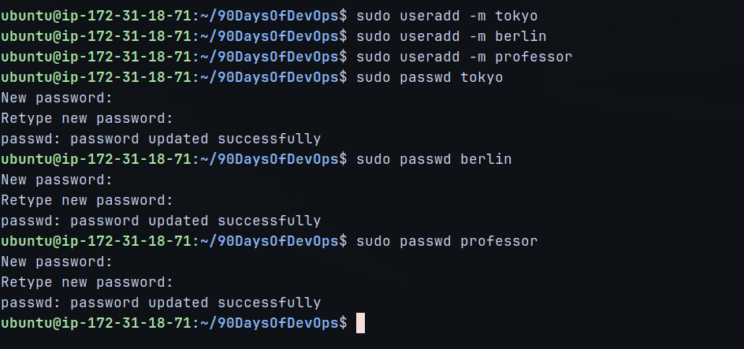
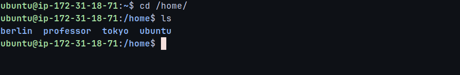
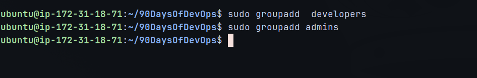
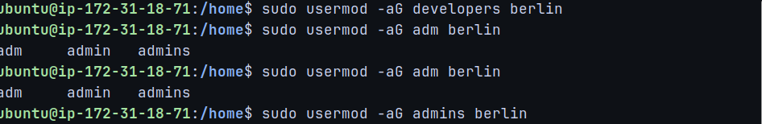
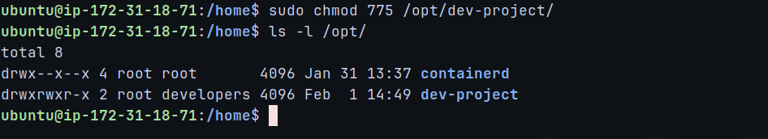
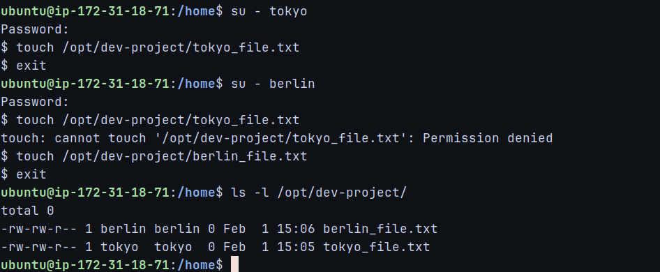
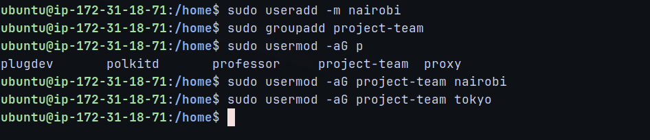
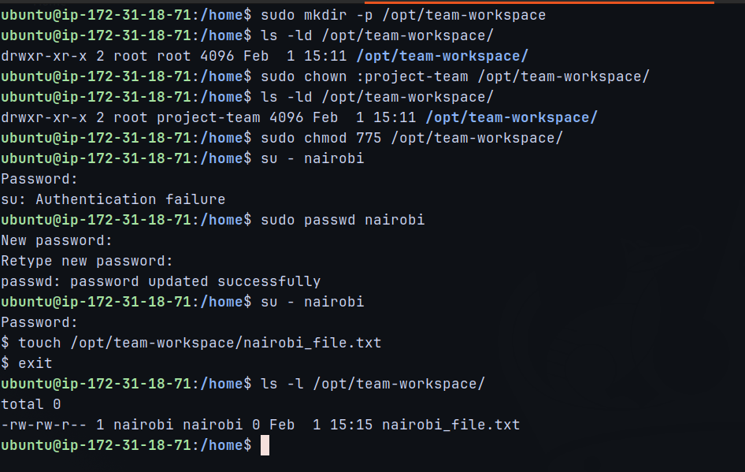

# Day 09 – Linux User & Group Management

## Objective
The objective of Day 09 was to gain hands-on experience with **Linux user and group management**.  
This included creating users and groups, assigning users to multiple groups, and configuring shared directories with proper permissions for collaboration.

## Users & Groups
- Users created:
    - tokyo
    - berlin
    - professor
    - nairobi

- Groups created:
    - developers
    - admins
    - project-team

---

## Group Assignments
| User      | Groups Assigned           |
|-----------|---------------------------|
| tokyo     | developers, project-team  |
| berlin    | developers, admins        |
| professor | admins                    |
| nairobi   | project-team              |

---

## Task 1: User Creation

- Created users with home directories
- Set passwords for each user
- Verified users in `/etc/passwd`
- Verified home directories under `/home`

### Evidence
  


---

## Task 2: Group Creation

- Created `developers` and `admins` groups
- Verified group entries in `/etc/group`

### Evidence


---

## Task 3: Assign Users to Groups

- Added users to supplementary groups using safe append method
- Ensured no existing group memberships were removed
- Verified group membership for each user

### Evidence



---

## Task 4: Shared Directory – `/opt/dev-project`

- Created shared directory under `/opt`
- Set group ownership to `developers`
- Applied permissions `775 (rwxrwxr-x)`
- Tested file creation as `tokyo` and `berlin`

### Evidence
  


---

## Task 5: Team Workspace – `/opt/team-workspace`

- Created `nairobi` user and `project-team` group
- Added `tokyo` and `nairobi` to `project-team`
- Created shared directory with group permissions
- Verified file creation as `nairobi`

### Evidence
  


---

## Commands Used

### User Management
```bash
sudo useradd -m tokyo
sudo useradd -m berlin
sudo useradd -m professor
sudo useradd -m nairobi
sudo passwd <username>
```
---

### Group Management
```bash
sudo groupadd developers
sudo groupadd admins
sudo groupadd project-team
```

---

### Assign Users to Groups
```bash
sudo usermod -aG developers tokyo
sudo usermod -aG developers,admins berlin
sudo usermod -aG admins professor
sudo usermod -aG project-team tokyo
sudo usermod -aG project-team nairobi
```

---

### Directory & Permissions
```bash
sudo mkdir /opt/dev-project
sudo chown :developers /opt/dev-project
sudo chmod 775 /opt/dev-project

sudo mkdir /opt/team-workspace
sudo chown :project-team /opt/team-workspace
sudo chmod 775 /opt/team-workspace
```

---

### Testing
```bash
sudo -u tokyo touch /opt/dev-project/tokyo-test
sudo -u berlin touch /opt/dev-project/berlin-test
sudo -u nairobi touch /opt/team-workspace/nairobi-test
```
---

## What I Learned
1. Users do not get permissions directly, groups control access
2. The `-aG` flag is critical to avoid removing existing group memberships
3. Correct group ownership and permissions enable secure collaboration
4. `sudo -u` is a safe way to test user access without switching sessions

## Conclusion
This challenge strengthened my understanding of Linux access control and showed how user and group management is applied in real DevOps and production environments.
