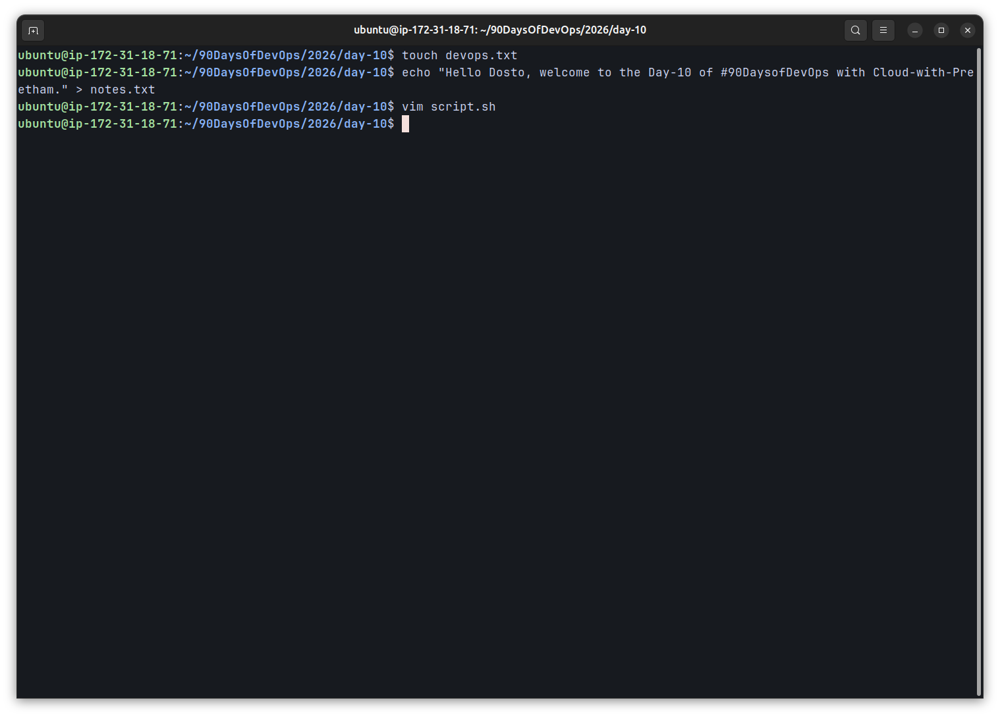
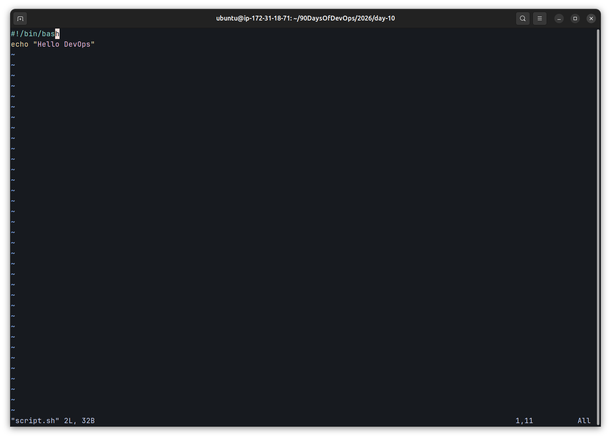
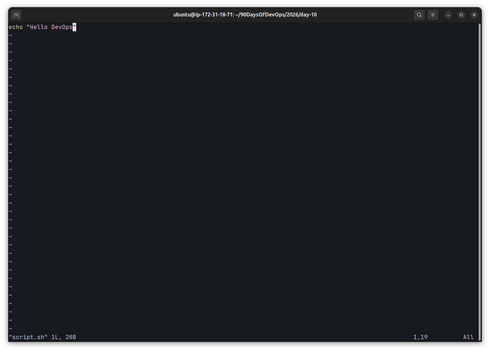
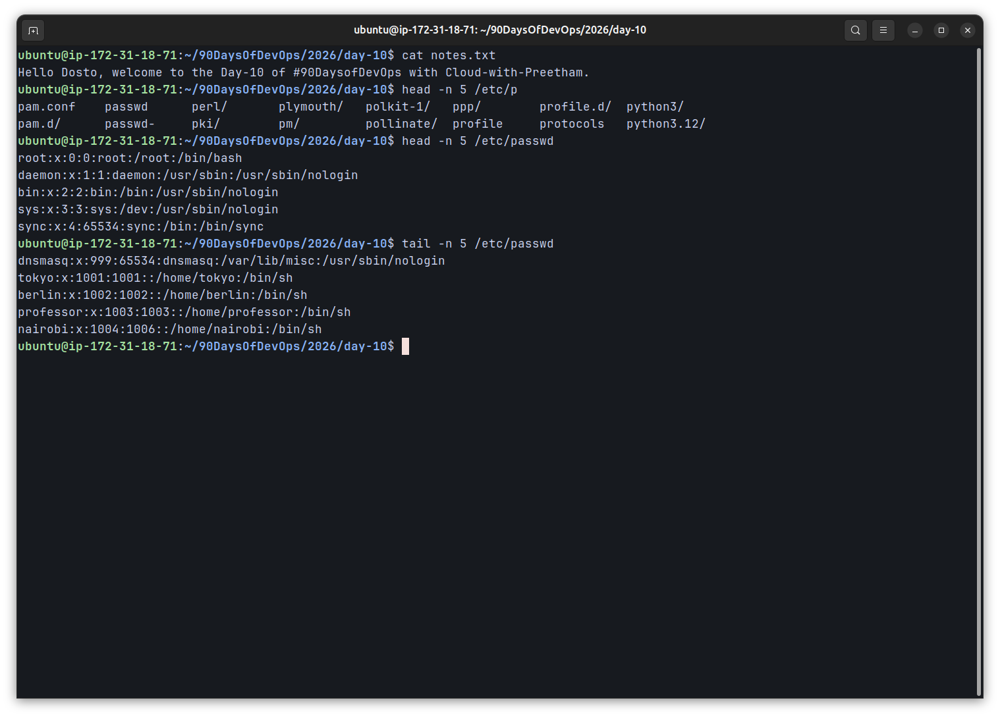
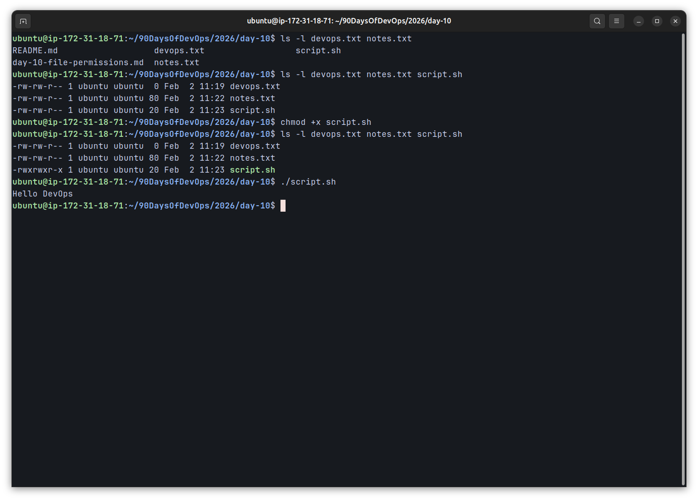
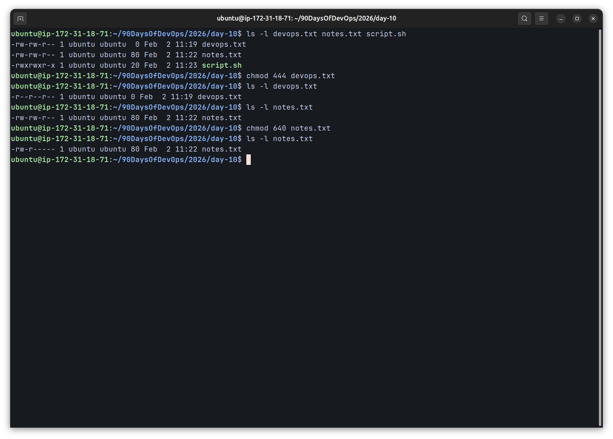
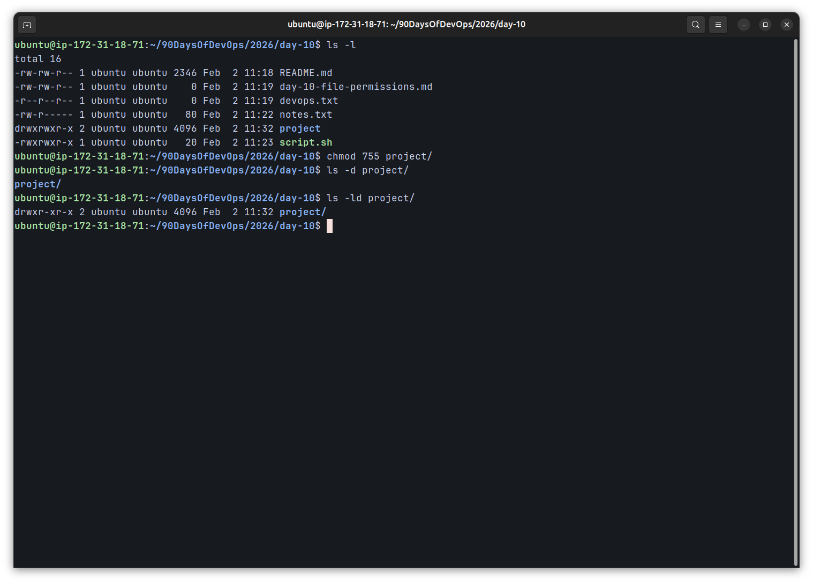
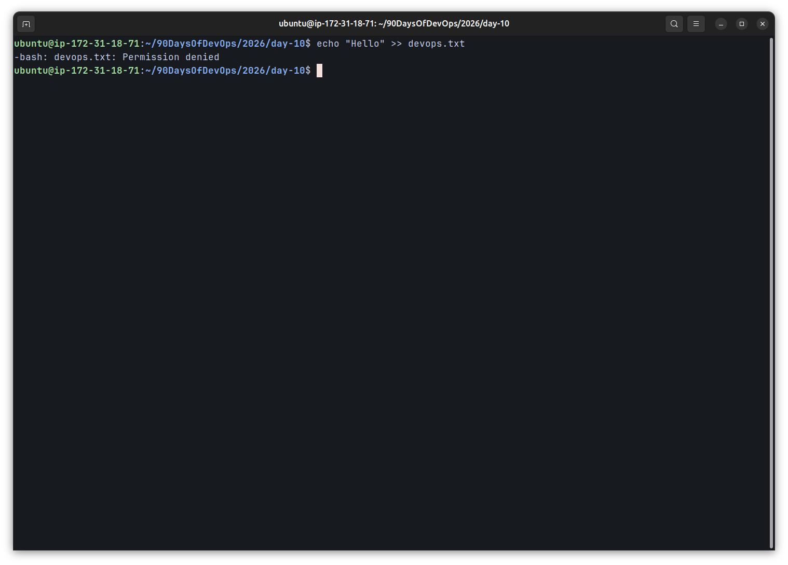
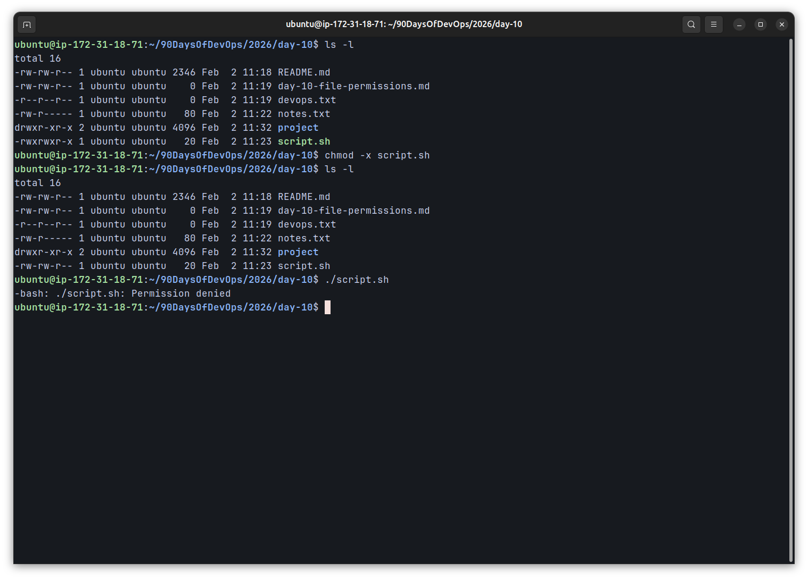

# Day 10 – File Permissions & File Operations

The task focuses on understanding and applying **Linux file permissions** along with performing essential **file operations** using standard Linux command-line utilities.  
The objective is to gain practical experience with permission management, script execution, and permission-related errors.

---

## Objective

- Create files using Linux CLI tools
- Read and inspect file contents
- Understand Linux permission notation (`rwx`)
- Modify permissions using `chmod`
- Execute shell scripts securely
- Test and document permission errors

---

## Environment
- Server: AWS EC2 Instance (region: us-west-2)
- Operating System: Ubuntu Linux
- Shell: Bash
- User: Non-root user

---

## Files and Directories Created

| Name        | Type      | Description                                 |
|-------------|-----------|---------------------------------------------|
| devops.txt  | File      | Empty file created for permission testing   |
| notes.txt   | File      | Text file containing sample content         |
| script.sh   | File      | Bash script to test execute permissions     |
| project/    | Directory | Directory created with specific permissions |

---

## Commands Used

```bash
touch devops.txt
echo "Hello Dosto, welcome to the Day-10 of #90DaysofDevOps with Cloud-with-Preetham." > notes.txt
vim script.sh
cat notes.txt
head -n 5 /etc/passwd
tail -n 5 /etc/passwd
ls -l
chmod +x script.sh
chmod 444 devops.txt
chmod 640 notes.txt
mkdir project
chmod 755 project
```
## Bash Script Content
```bash
#!/bin/bash
echo "Hello DevOps"
```
---

## Permission Overview
**Initial Permissions**
```bash
-rw-rw-r--
```
- Owner: Read, Write
- Group: Read, Write
- Others: Read

---

## Updated Permissions
| File/Directory| Permission    | Description                   |
|-------------  |-----------    |-------------------------------|
| script.sh     | `-rwxrwxr-x`  | Script made executeable       |
| devops.txt    | `-r--r--r--`  | Read-only for all users       |
| notes.txt     | `-rw-r-----`  | Owner `rw`, Group `r`         |
| project/      | `drwxr-xr-x`  | Standard directory permissions|

---

## Screenshots

### File Creation and Initial Permissions




---

### Reading Files


---

### Current Permission


---

### Script Execution


---

### Read-Only File Test


---

### Directory Permissions


---

### Permission Testing
**Writing to a Read-only File
```bash
echo "hello" >> devops.txt
```
**Result**
```text
Permission denied
```


---

### Executing Without Execute Permission
```bash
chmod -x script.sh
./script.sh
```
**Result:**
```text
Permission denied
```


---

## Key Learnings
- Linux file permissions are critical for access control and system security.
- Execute permission and the shebang line are both required to run shell scripts.
- Numeric permission notation (`755`, `640`) is concise and widely used in production systems.
- Permission-related errors help reinforce understanding of Linux security behavior.
