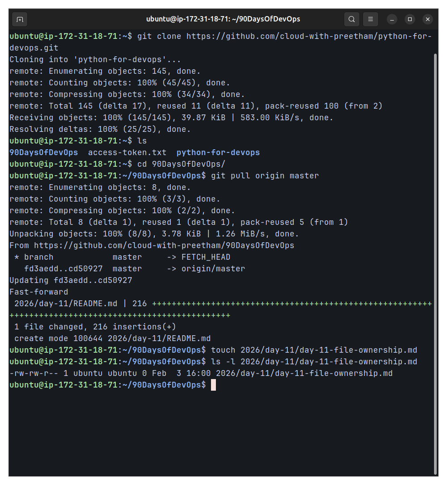
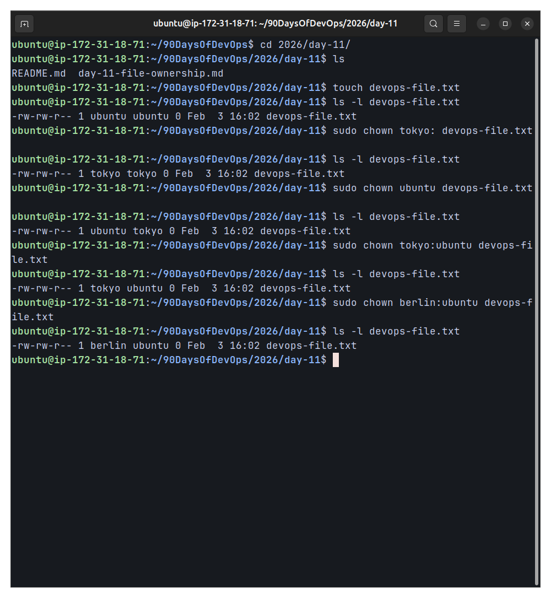
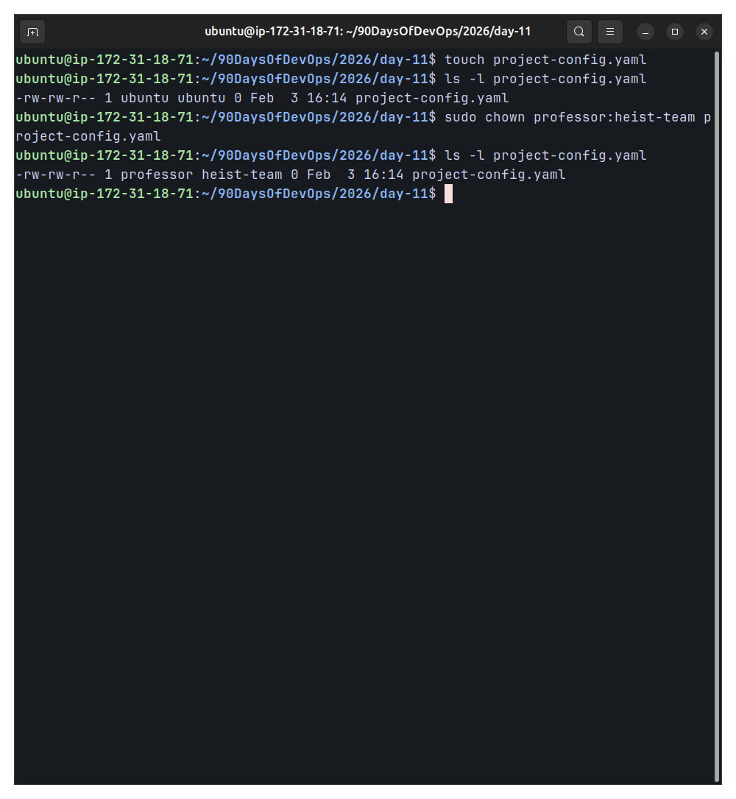
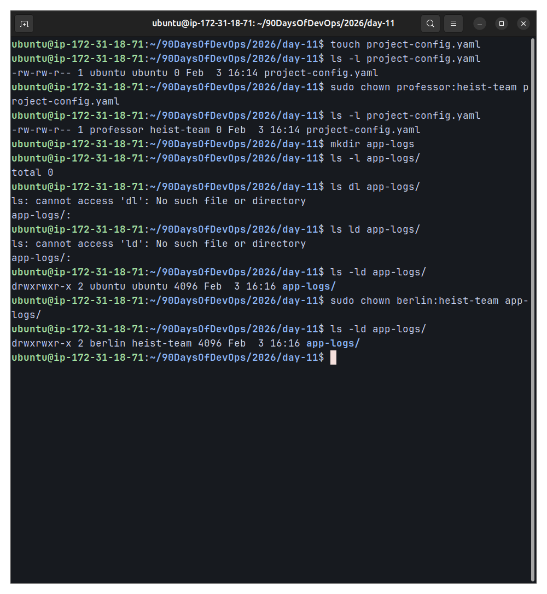
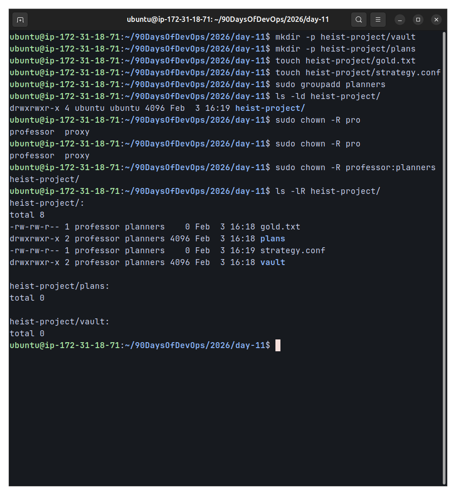
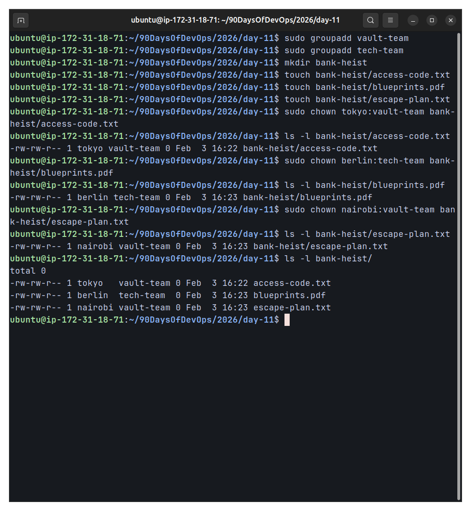

# Day 11 – File Ownership Challenge (chown & chgrp)

## 🎯 Objective
This challenge focuses on mastering **Linux file and directory ownership** using `chown`.  
Understanding ownership is a critical DevOps skill for managing permissions in shared systems, production servers, CI/CD pipelines, and containerized environments.

---

## 📂 Files & Directories Created

### Files
- `day-11-file-ownership.md`
- `devops-file.txt`
- `team-notes.txt`
- `project-config.yaml`
- `heist-project/gold.txt`
- `heist-project/strategy.conf`
- `bank-heist/access-code.txt`
- `bank-heist/blueprints.pdf`
- `bank-heist/escape-plan.txt`

### Directories
- `app-logs/`
- `heist-project/`
  - `vault/`
  - `plans/`
- `bank-heist/`

---

## 👥 Users & Groups Used

### Users
- `ubuntu`
- `tokyo`
- `berlin`
- `nairobi`
- `professor`

### Groups
- `heist-team`
- `planners`
- `vault-team`
- `tech-team`

---

## Ownership Changes Performed

### devops-file.txt
- **Before:** `ubuntu:ubuntu`
- **After:** `berlin:ubuntu`

```bash
sudo chown tokyo: devops-file.txt
sudo chown ubuntu devops-file.txt
sudo chown tokyo:ubuntu devops-file.txt
sudo chown berlin:ubuntu devops-file.txt
```

---

### team-notes.txt
- **Before:** ubuntu:ubuntu
- **After:** ubuntu:heist-team
```bash
sudo groupadd heist-team
sudo chown ubuntu:heist-team team-notes.txt
```

---

### project-config.yaml
- **Before:** ubuntu:ubuntu
- **After:** professor:heist-team
```bash
sudo chown professor:heist-team project-config.yaml
```

---

### app-logs/ (Directory Ownership)
- **Before:** ubuntu:ubuntu
- **After:** berlin:heist-team
```bash
mkdir app-logs
sudo chown berlin:heist-team app-logs/
```

---

### Recursive Ownership – heist-project/
**Structure:**
```
heist-project/
├── gold.txt
├── strategy.conf
├── vault/
└── plans/
```
- **Owner:** professor
- **Group:** planners
```bash
sudo groupadd planners
sudo chown -R professor:planners heist-project/
```
Verification:
```bash
ls -lR heist-project/
```

---

### Practice Challenge – bank-heist/
| File	                    | Owner	    |Group      |
|---------------------------|-----------|-----------|
| access-code.txt	        | tokyo	    |vault-team |
| blueprints.pdf	        | berlin	|tech-team  |
| escape-plan.txt	        | nairobi	|vault-team |
```bash
sudo groupadd vault-team
sudo groupadd tech-team

sudo chown tokyo:vault-team bank-heist/access-code.txt
sudo chown berlin:tech-team bank-heist/blueprints.pdf
sudo chown nairobi:vault-team bank-heist/escape-plan.txt
```

---

## Screenshots

### Repository Setup & Navigation


---

### Changing File Owner using `chown`


---

### Changing Group Ownership using `chgrp`


---

### Combined Owner & Group Change


---

### Directory Ownership Change


---

### Recursive Ownership Change (`-R`)


---

### Practice Challenge – Multiple Users & Groups


---

### What I Learned
1. Every Linux file has an owner and a group
2. `chown` can update owner and group in a single command
3. Recursive ownership (`-R`) is essential for real-world applications
4. Incorrect ownership is a common cause of production permission issues
