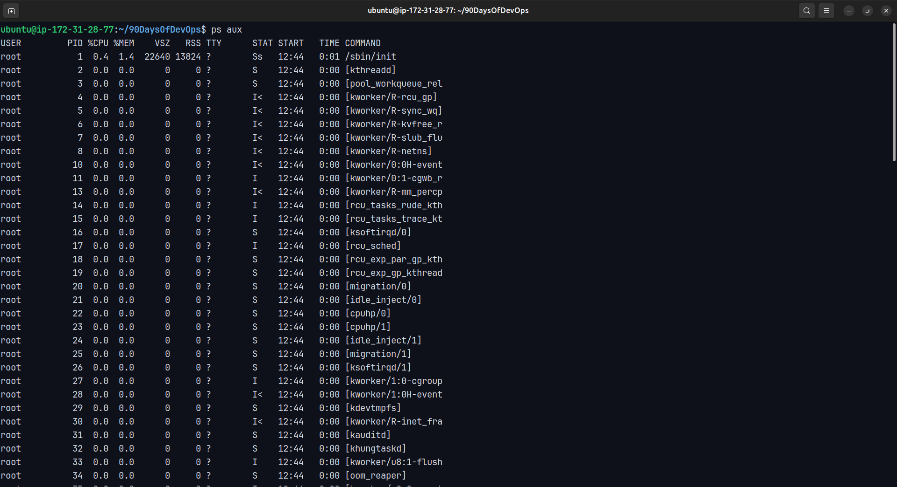
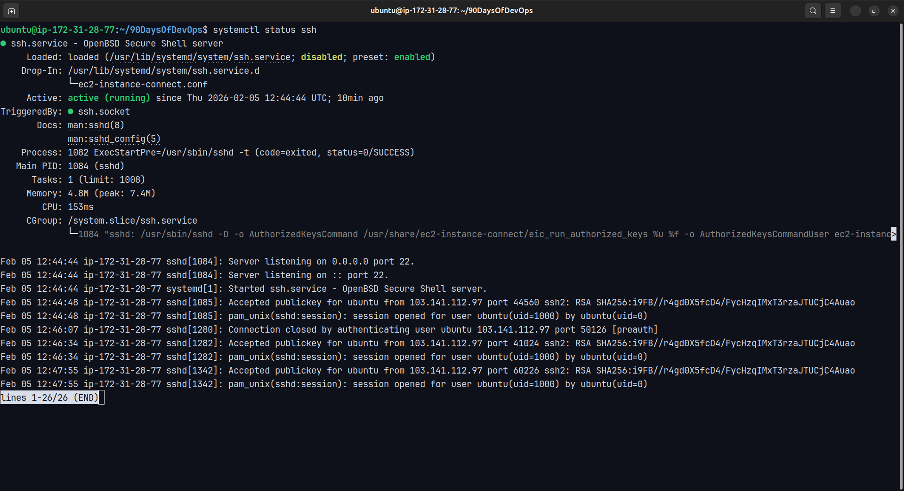
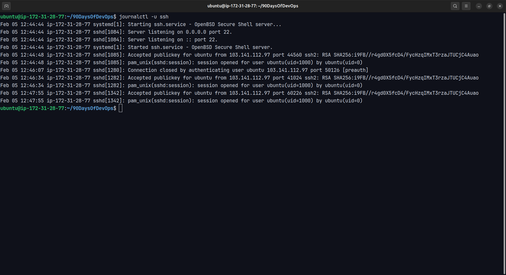
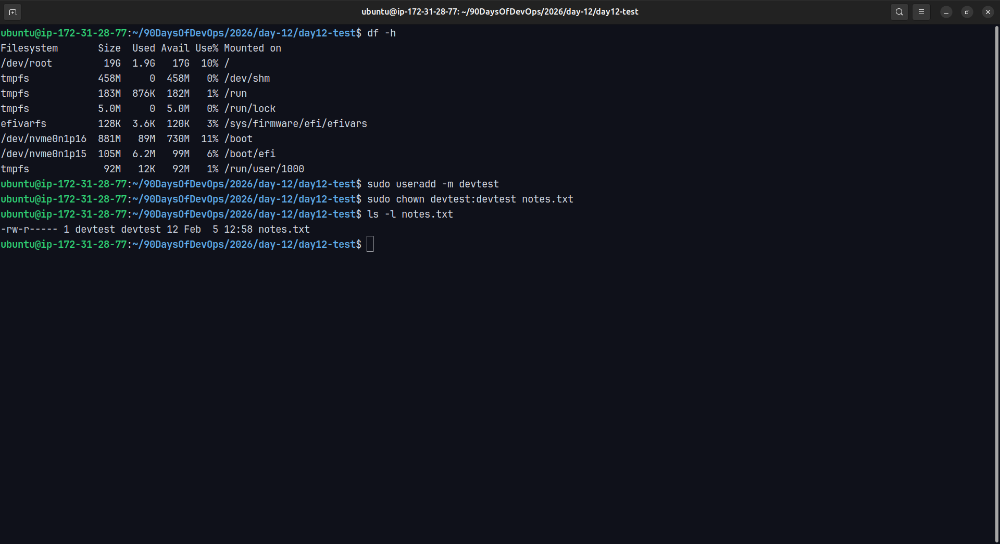
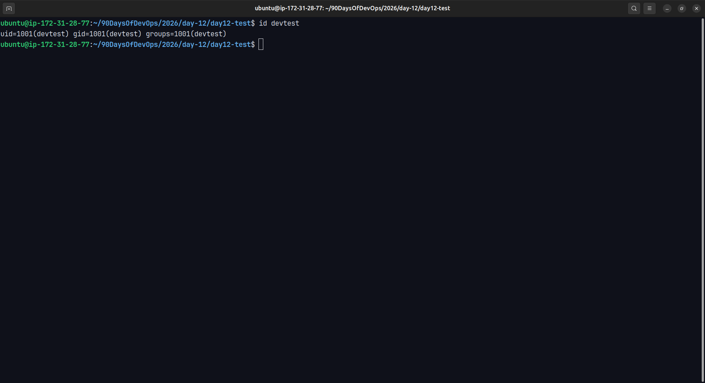
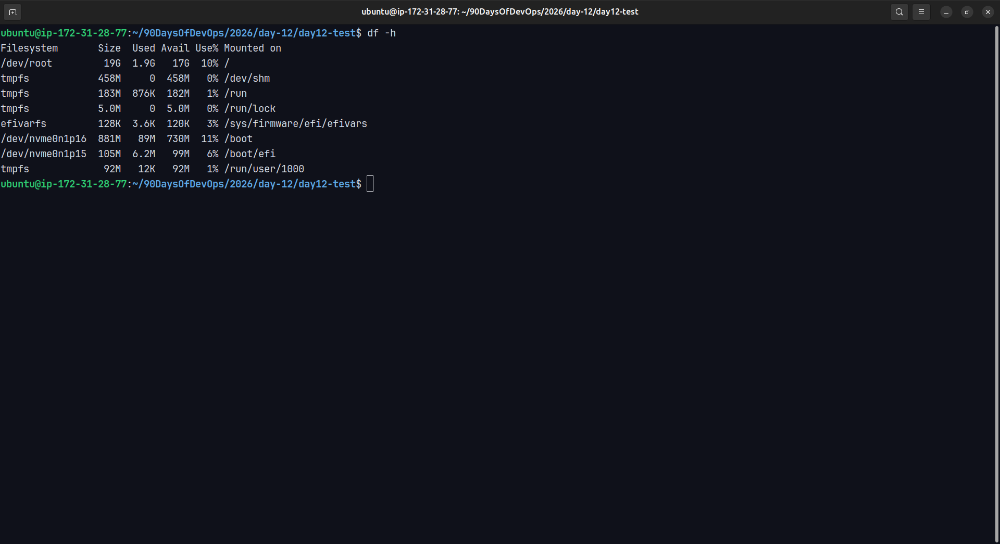

# Day 12 – Breather & Revision (Days 01–11)

## 📌 Goal
Take a short pause to revise and reinforce Linux fundamentals learned in Days 01–11 by re-running key commands and validating understanding through hands-on practice.

---

## 🧠 What I Reviewed

### 1. Mindset & Progress
- I feel significantly faster and more confident compared to Day 01
- I now understand *where to look first* instead of memorizing commands
- Using tools (like ChatGPT) for README writing helps save time and focus on learning

---

### 2. Processes & Services
Commands practiced:
```bash
ps aux
systemctl status ssh
journalctl -u ssh
```
Observations:
- ssh service is active (running)
- No warnings or errors found in logs
- Logs show normal SSH activity such as successful public key authentication

---

3. File & Permission Practice
Commands used:
```bash
mkdir day12-test
echo "Hello Dosto" > notes.txt
chmod 640 notes.txt
ls -l notes.txt
```
Permission result:
```text
-rw-r----- 1 ubuntu ubuntu notes.txt
```
Interpretation:
- Owner: read + write
- Group: read only
- Others: no access

---

4. Disk Usage Check
Command used:
```bash
df -h
```
Observations:
- `/dev/root` mounted on `/` is the main filesystem
- Usage is only 10%
- Root filesystem is safe and healthy

---

5. User & Ownership Practice
Commands used:
```bash
sudo useradd -m devtest
sudo chown devtest:devtest notes.txt
ls -l notes.txt
id devtest
```
Results:
- File owner changed from `ubuntu` to `devtest`
- Group also changed to `devtest`
- File permissions remained unchanged

---

✅ Mini Self-Check Answers
1️⃣ Top 3 commands that save me time
- ls -l → instantly understand permissions & ownership
- systemctl status → quick service health check
- journalctl -u → direct insight into service issues

2️⃣ How do I check if a service is healthy?
```bash
systemctl status <service>
journalctl -u <service>
```

3️⃣ Safe ownership & permission change example
```bash
sudo chown devtest:devtest notes.txt
chmod 640 notes.txt
```

---

🧾 Key Takeaways
- Always check `systemctl status` before jumping to logs
- Permissions and ownership solve most “permission denied” issues
- Disk usage should be monitored before it becomes a problem
- Logs often look scary but are usually informational

## 📸 Screenshots

### Process & Service Checks




---

### File Permissions & Ownership



---

### Disk Usage


