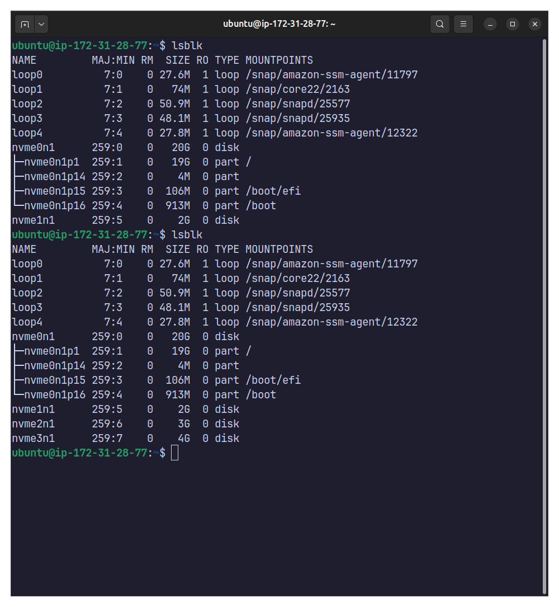
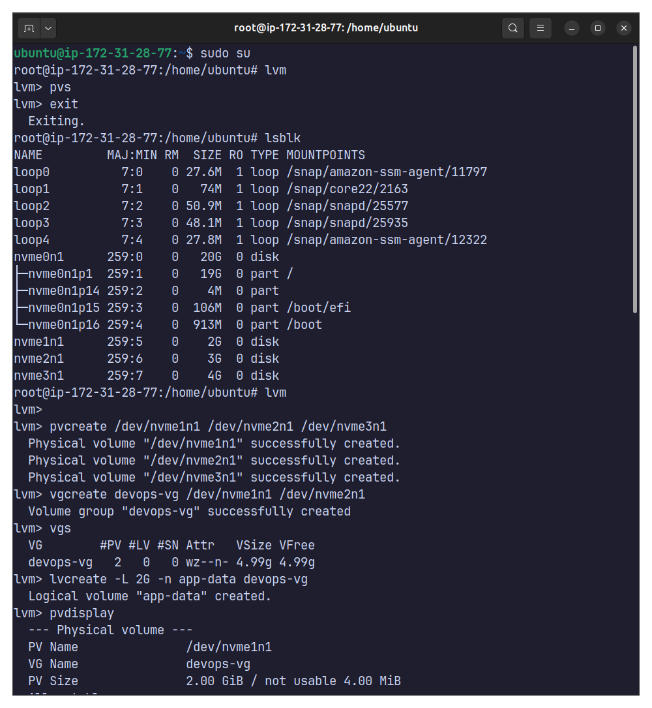
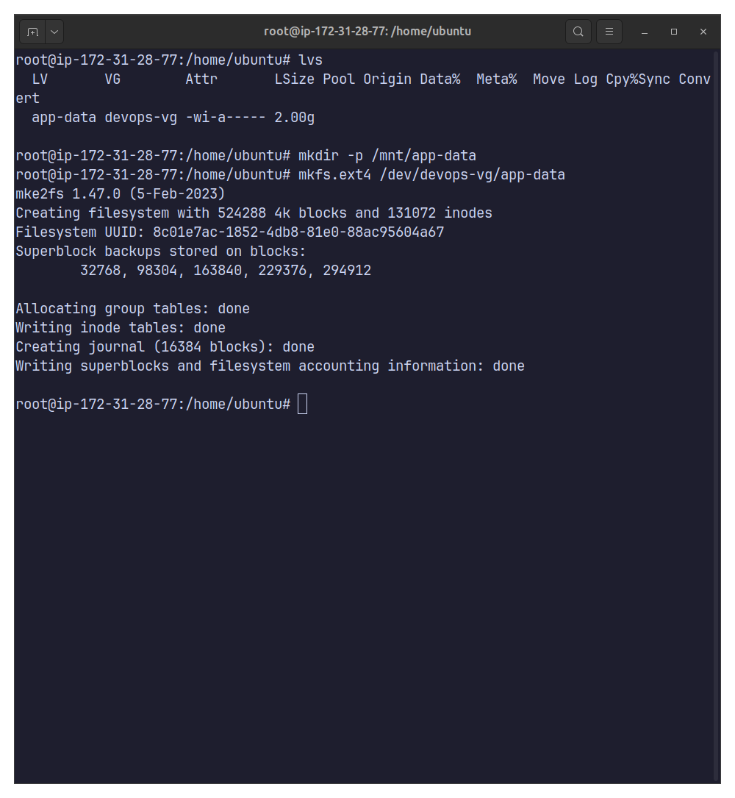
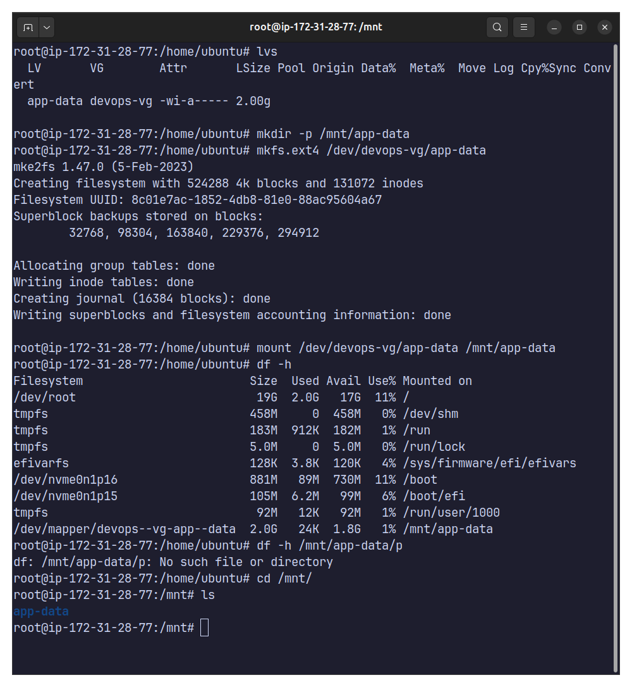
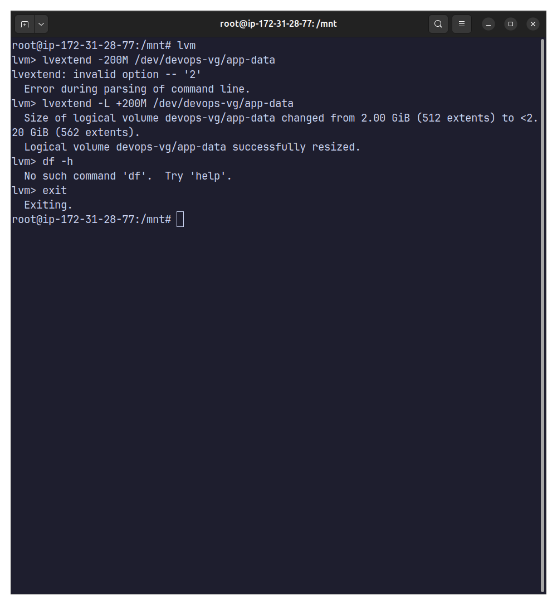
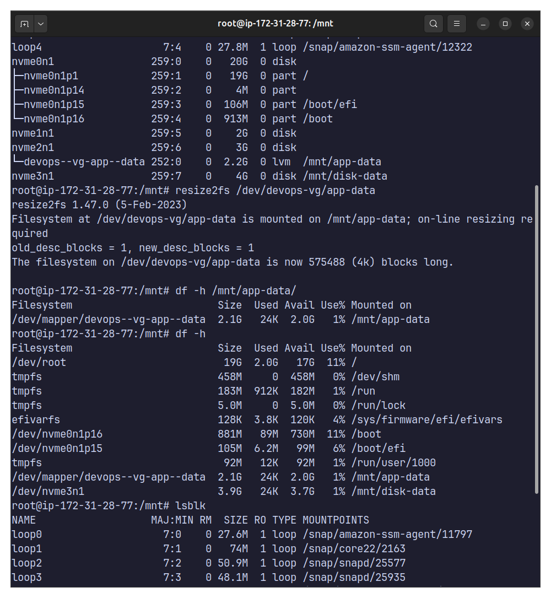

# Day 13 – Linux Volume Management (LVM)

## Objective
Learn how to manage storage dynamically using LVM by creating, extending, and mounting logical volumes.

---

## Environment
- OS: Ubuntu Linux
- Storage Devices:
  - /dev/nvme1n1 (2G)
  - /dev/nvme2n1 (3G)
  - /dev/nvme3n1 (4G)

---

## Step 1: Check Current Storage
```bash
lsblk
pvs
vgs
lvs
df -h
```


---

## Step 2: Create Physical Volumes
```bash
pvcreate /dev/nvme1n1 /dev/nvme2n1 /dev/nvme3n1
pvs
```


----

## Step 3: Create Volume Group
```bash
vgcreate devops-vg /dev/nvme1n1 /dev/nvme2n1
vgs
```


---

## Step 4: Create Logical Volume
```bash
lvcreate -L 2G -n app-data devops-vg
lvs
```


---

## Step 5: Format and Mount
```bash
mkfs.ext4 /dev/devops-vg/app-data
mkdir -p /mnt/app-data
mount /dev/devops-vg/app-data /mnt/app-data
df -h /mnt/app-data
```



---

## Step 6: Extend Logical Volume
```bash
lvextend -L +200M /dev/devops-vg/app-data
resize2fs /dev/devops-vg/app-data
df -h /mnt/app-data
```



---

**Learnings**
1. LVM enables flexible disk management.
2. Logical volumes can be resized online.
3. Volume groups allow combining multiple disks.
