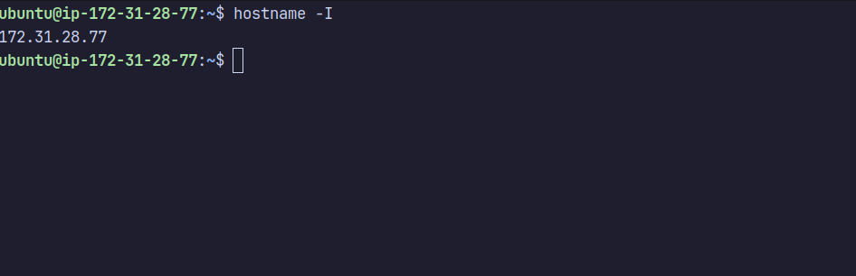
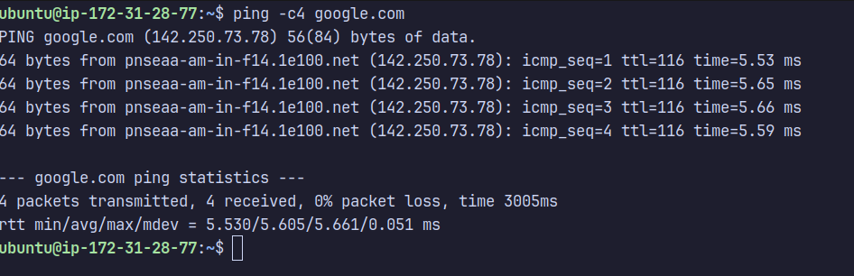
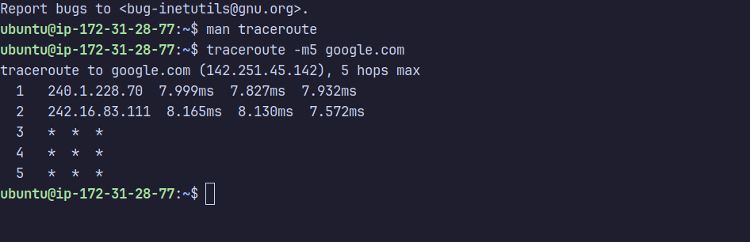
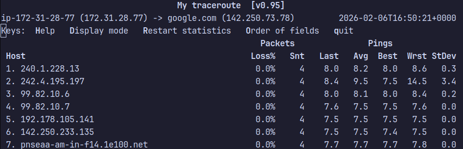
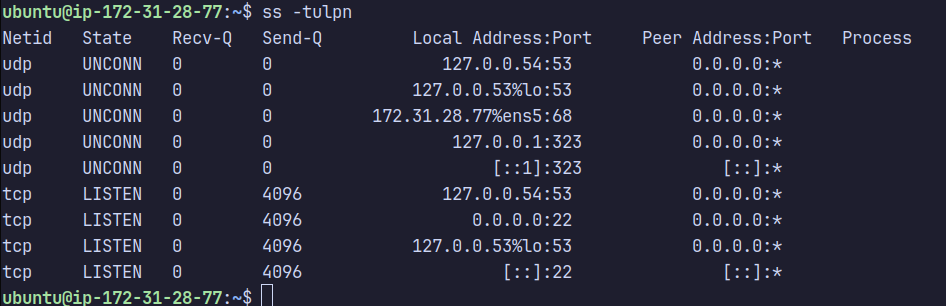
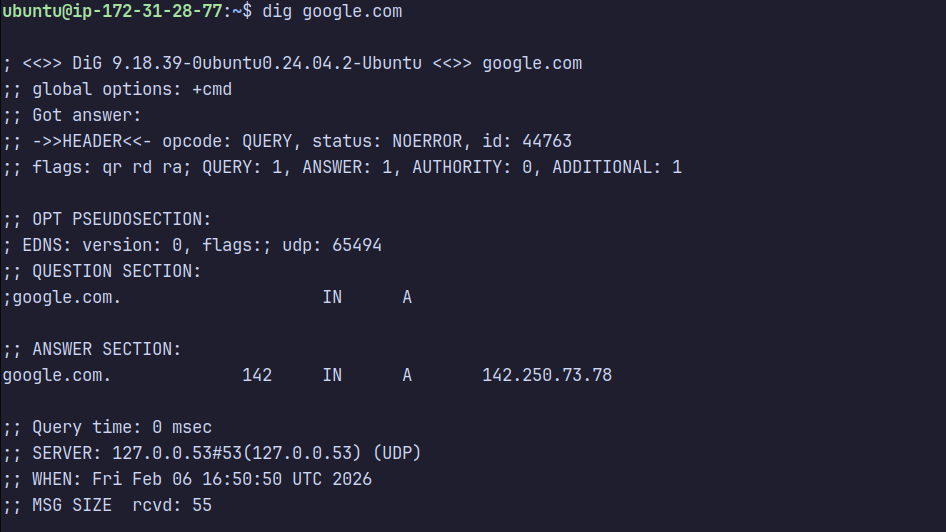
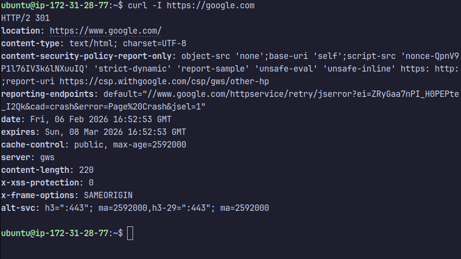
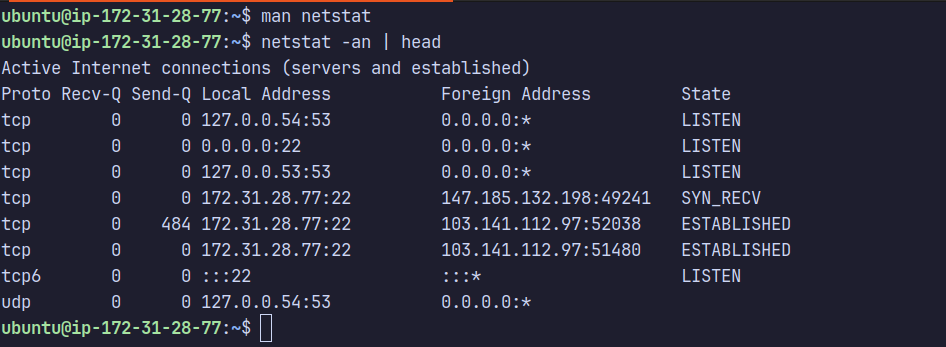
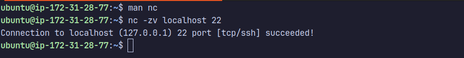

# Day 14 – Networking Fundamentals & Hands-on Checks

## Quick Concepts

### OSI vs TCP/IP Models
- **OSI (L1–L7):** Conceptual model used for learning and troubleshooting, very granular.
- **TCP/IP:** Practical model used on real networks; OSI layers are grouped together.

| OSI Layer                                 | TCP/IP Layer | Example            |
|-------------------------------------------|--------------|--------------------|
| L1–L2 (Physical, Data Link)               | Link         | Ethernet, Wi-Fi    |
| L3 (Network)                              | Internet     | IP                 |
| L4 (Transport)                            | Transport    | TCP, UDP           |
| L5–L7 (Session, Presentation, Application)| Application  | HTTP, HTTPS, DNS   |

### Protocol Placement
- **IP:** Internet / OSI Layer 3
- **TCP / UDP:** Transport / OSI Layer 4
- **HTTP / HTTPS:** Application / OSI Layer 7
- **DNS:** Application / OSI Layer 7

### Real Example
- `curl https://google.com`
**Output:**
```text
<HTML><HEAD><meta http-equiv="content-type" content="text/html;charset=utf-8">
<TITLE>301 Moved</TITLE></HEAD><BODY>
<H1>301 Moved</H1>
The document has moved
<A HREF="http://www.google.com/">here</A>.
</BODY></HTML>
```  
  → HTTP (Application) over TCP (Transport) over IP (Internet)

---

## Hands-on Networking Checks

### Identity
```bash
hostname -I
```
**Observation**: Local private IP address is `172.31.28.77`


### Reachability
```bash
ping -c4 google.com
```
**Observation**: 0% packet loss with ~5.5 ms average latency confirms good network connectivity.


### Path
```bash
traceroute -m5 google.com
```
**Observation**: Traffic passes through multiple hops with low latency. Some hops do not respond, likely due to ICMP filtering.



### Ports
```bash
ss -tulpn
```
**Observation**: SSH is listening on port 22. DNS resolver is listening on port 53.


### Name Resolution
```bash
dig google.com
```
**Observation**: Domain resolves successfully to `142.250.73.78` with NOERROR status.


### HTTP Check
```bash
curl -I https://google.com
```
**Observation**: Received HTTP/2 301 response, redirecting to https://www.google.com/.


### Connections Snapshot
```bash
netstat -an | head
```
**Observation**: Multiple LISTEN sockets on ports `22` and `53`, with active ESTABLISHED SSH connections.


---

## Mini Task: Port Probe & Interpret
- **Service:** SSH
- **Port:** 22
```bash
nc -zv localhost 22
```
**Result**: Connection succeded, SSH is reachable locally.


**If not reachable**: Next steps would be checking service status (`systemctl status ssh`) or firewall rules.

## Reflection
- Fastest signal when something is broken: ping
- If DNS fails: Inspect Application layer (DNS resolution).
- If HTTP 500 occurs: Inspect Application layer first, then server logs.
 
### Follow-up Checks in a Real Incident
1. Check firewall rules (ufw / iptables)
2. Inspect service logs and restart services if needed
