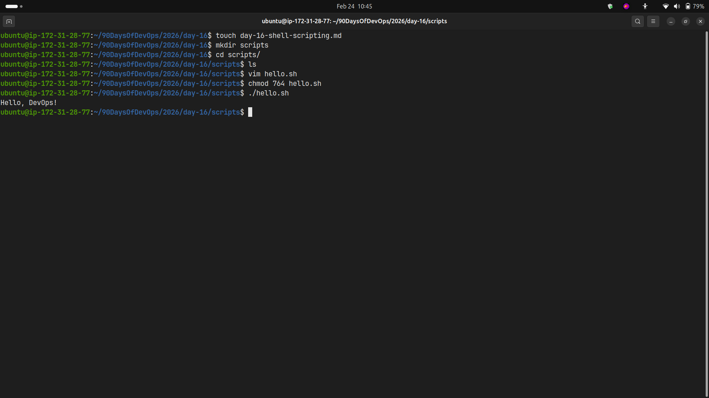
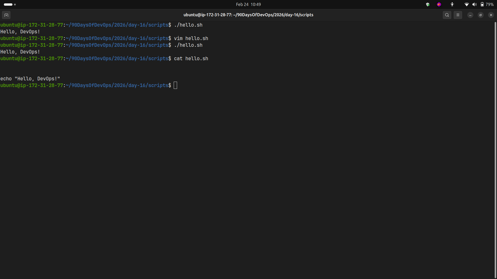
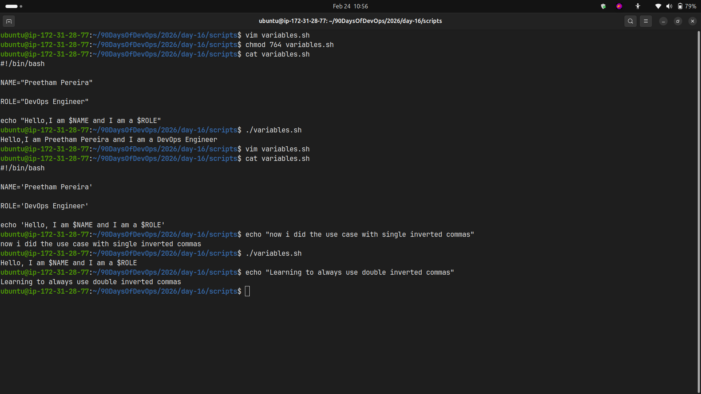
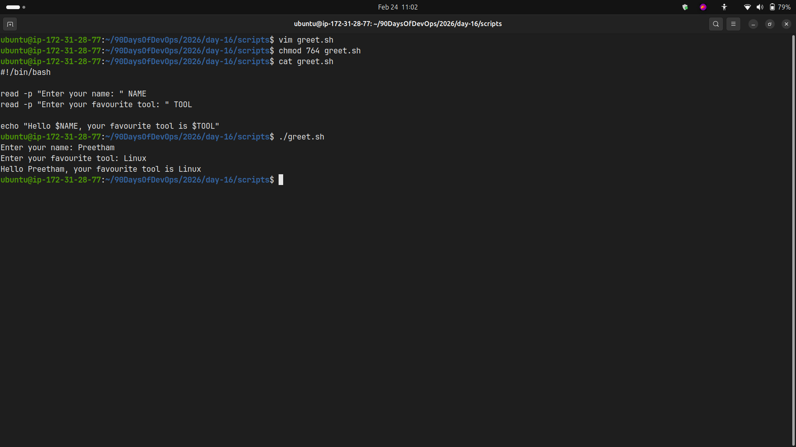
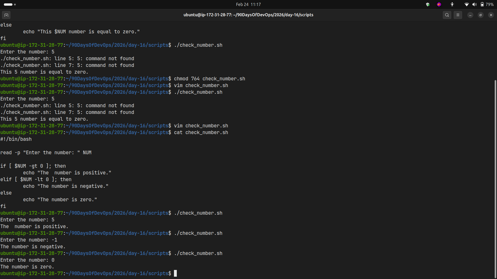
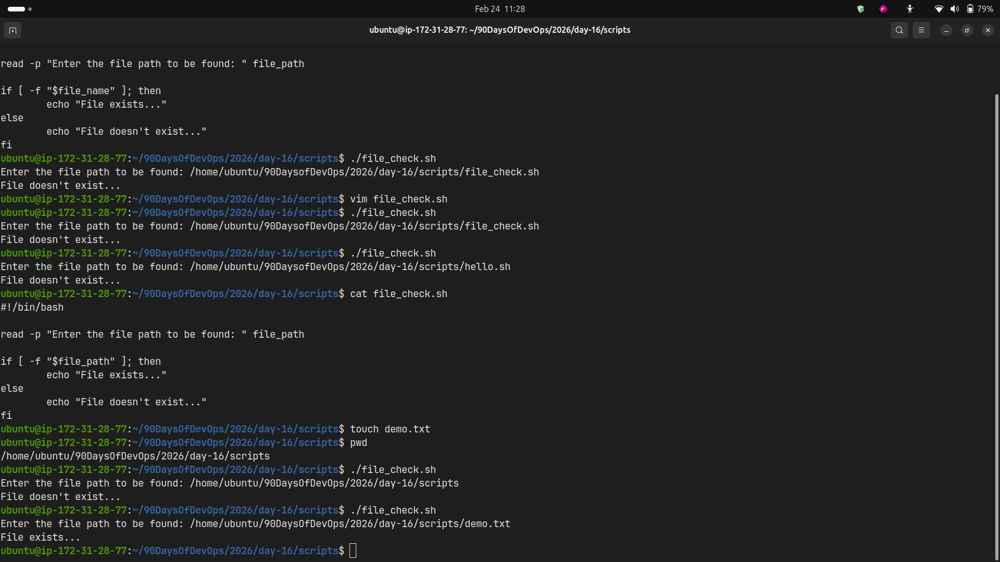
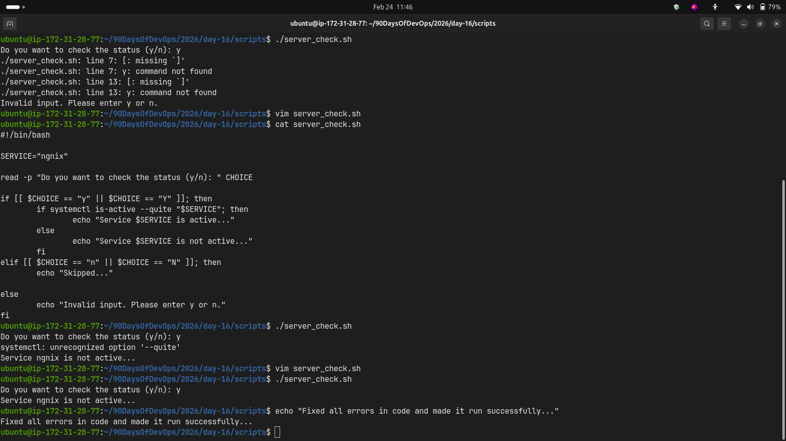

# Day 16 - Shell Scripting Basics

## Task 1: First Script - hello.sh

**Code:**

```bash
#!/bin/bash

echo "Hello, DevOps!"
```

**Output:**


**What happens if you remove the shebang line?**


---

## Task 2: Variables - variables.sh

**Code:**

```bash
#!/bin/bash

NAME='Preetham Pereira'

ROLE='DevOps Engineer'

echo 'Hello, I am $NAME and I am a $ROLE'
```

**Output:**


**Difference between single and double quotes:**

- Single quotes (`'`) treat everything literally - variables are not expanded
- Double quotes (`"`) allow variable expansion - `$NAME` would be replaced with actual value

---

## Task 3: User Input with read - greet.sh

**Code:**

```bash
#!/bin/bash

read -p "Enter your name: " NAME
read -p "Enter your favourite tool: " TOOL

echo "Hello $NAME, your favourite tool is $TOOL"
```

**Output:**


---

## Task 4: If-Else Conditions

### check_number.sh

**Code:**

```bash
#!/bin/bash

read -p "Enter the number: " NUM

if [ $NUM -gt 0 ]; then
	echo "The  number is positive."
elif [ $NUM -lt 0 ]; then
	echo "The number is negative."
else
	echo "The number is zero."
fi
```

**Output:**


### file_check.sh

**Code:**

```bash
#!/bin/bash

read -p "Enter the file path to be found: " file_path

if [ -f "$file_path" ]; then
	echo "File exists..."
else
	echo "File doesn't exist..."
fi
```

**Output:**


---

## Task 5: server_check.sh

**Code:**

```bash
#!/bin/bash

SERVICE="ngnix"

read -p "Do you want to check the status (y/n): " CHOICE

if [[ $CHOICE == "y" || $CHOICE == "Y" ]]; then
	if systemctl is-active --quiet "$SERVICE"; then
		echo "Service $SERVICE is active..."
	else
		echo "Service $SERVICE is not active..."
	fi
elif [[ $CHOICE == "n" || $CHOICE == "N" ]]; then
	echo "Skipped..."

else
	echo "Invalid input. Please enter y or n."
fi
```

**Output:**


---

## What I Learned

1. **Shebang (`#!/bin/bash`) is essential** - It tells the system which interpreter to use for executing the script. Without it, the script may not run correctly or use the wrong shell.

2. **Variable expansion differs with quotes** - Single quotes preserve literal values while double quotes allow variable substitution. This is crucial for dynamic content in scripts.

3. **Conditional statements enable decision-making** - Using `if-else` with test operators (`-gt`, `-lt`, `-f`) allows scripts to handle different scenarios and make them interactive and intelligent.
