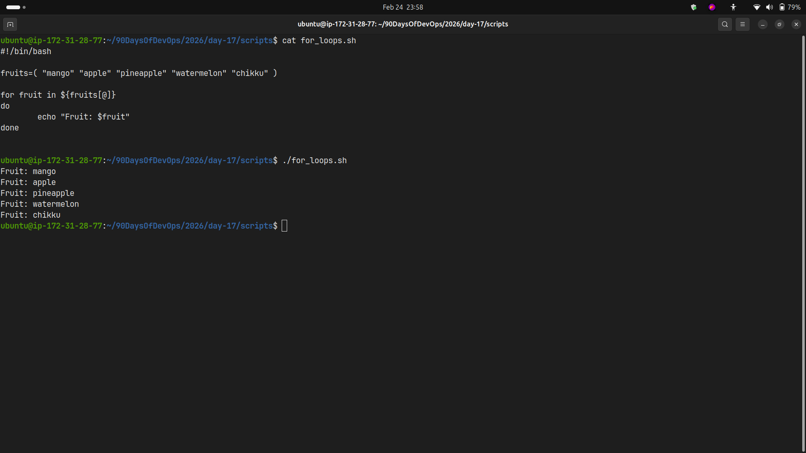
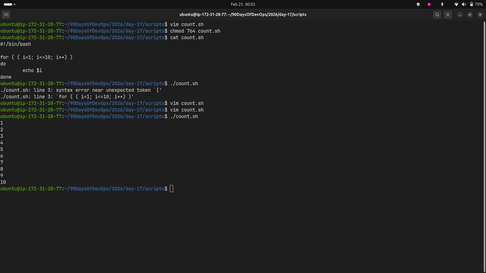
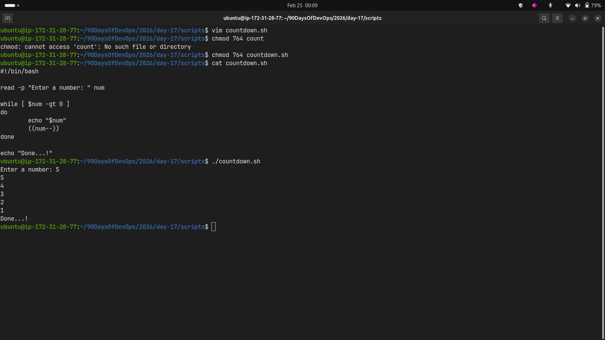
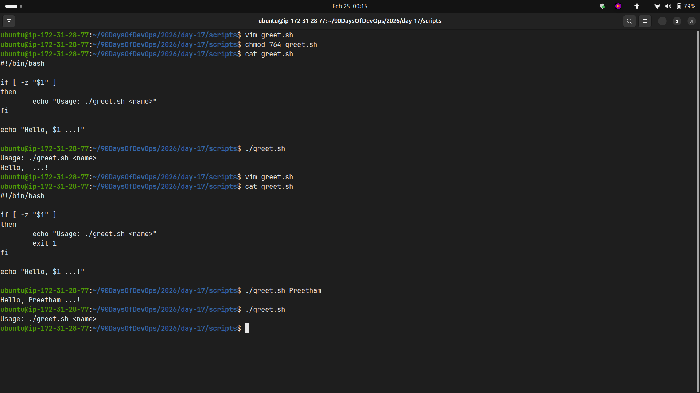
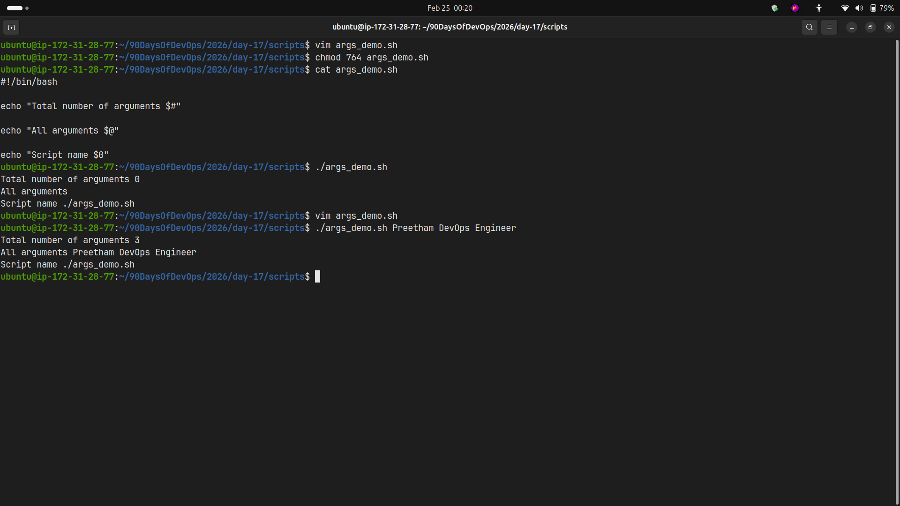
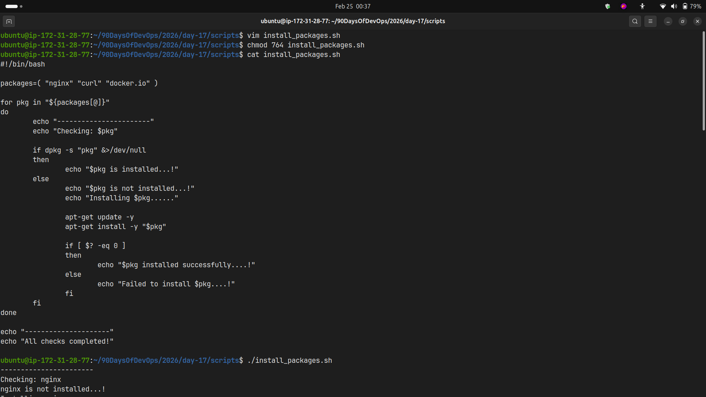
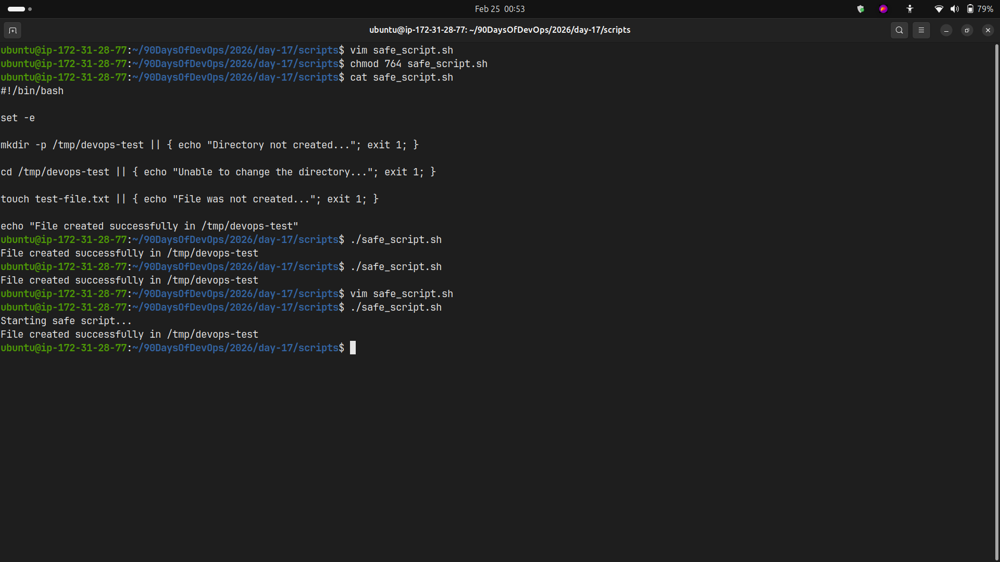

# Day 17 – Shell Scripting: Loops, Arguments & Error Handling

## Overview

This document contains all the scripts created for Day 17 of the 90DaysOfDevOps challenge, focusing on loops, command-line arguments, and error handling in shell scripting.

---

## Task 1: For Loop

### Script 1: `for_loops.sh`

**Purpose:** Loop through a list of 5 fruits and print each one

```bash
#!/bin/bash

fruits=( "mango" "apple" "pineapple" "watermelon" "chikku" )

for fruit in ${fruits[@]}
do
	echo "Fruit: $fruit"
done
```

**Output:**

```
Fruit: mango
Fruit: apple
Fruit: pineapple
Fruit: watermelon
Fruit: chikku
```



---

### Script 2: `count.sh`

**Purpose:** Print numbers 1 to 10 using a for loop

```bash
#!/bin/bash

for (( i=1; i<=10; i++ ))
do
	echo $i
done
```

**Output:**

```
1
2
3
4
5
6
7
8
9
10
```



---

## Task 2: While Loop

### Script: `countdown.sh`

**Purpose:** Take a number from user and count down to 0

```bash
#!/bin/bash

read -p "Enter a number: " num

while [ $num -gt 0 ]
do
	echo "$num"
	((num--))
done

echo "Done...!"
```

**Output:**

```
Enter a number: 5
5
4
3
2
1
Done...!
```



---

## Task 3: Command-Line Arguments

### Script 1: `greet.sh`

**Purpose:** Accept a name as argument and greet the user

```bash
#!/bin/bash

if [ -z "$1" ]
then
	echo "Usage: ./greet.sh <name>"
	exit 1
fi

echo "Hello, $1 ...!"
```

**Output:**

```bash
# Without argument
$ ./greet.sh
Usage: ./greet.sh <name>

# With argument
$ ./greet.sh Shubham
Hello, Shubham ...!
```



---

### Script 2: `args_demo.sh`

**Purpose:** Demonstrate command-line argument handling

```bash
#!/bin/bash

echo "Total number of arguments $#"

echo "All arguments $@"

echo "Script name $0"
```

**Output:**

```bash
$ ./args_demo.sh Preetham DevOps Engineer
Total number of arguments 3
All arguments Preetham DevOps Engineer
Script name ./args_demo.sh
```



---

## Task 4: Install Packages via Script

### Script: `install_packages.sh`

**Purpose:** Check and install packages automatically

```bash
#!/bin/bash

if [ "$EUID" -ne 0 ]; then
	echo "Run the script with root privilages..."
	echo "Usage: sudo ./install_packages.sh"
	exit 1
fi

packages=( "nginx" "curl" "docker.io" )

apt-get update -y

for pkg in "${packages[@]}"
do
	echo "-----------------------"
	echo "Checking: $pkg"

	if dpkg -s "pkg" &>/dev/null
	then
		echo "$pkg is installed...!"
		exit 1
	else
		echo "$pkg is not installed...!"
		echo "Installing $pkg......"

		apt-get install -y "$pkg"

		if [ $? -eq 0 ]
		then
			echo "$pkg installed successfully....!"
		else
			echo "Failed to install $pkg....!"
		fi
	fi
done

echo "---------------------"
echo "All checks completed!"
```

**Output:**

```
Checking: nginx
nginx is not installed...!
Installing nginx......
nginx installed successfully....!
-----------------------
Checking: curl
curl is installed...!
-----------------------
Checking: docker.io
docker.io is not installed...!
Installing docker.io......
docker.io installed successfully....!
---------------------
All checks completed!
```



---

## Task 5: Error Handling

### Script: `safe_script.sh`

**Purpose:** Demonstrate error handling with `set -e` and `||` operator

```bash
#!/bin/bash

set -e

echo "Starting safe script..."

mkdir -p /tmp/devops-test || { echo "Directory not created..."; exit 1; }

cd /tmp/devops-test || { echo "Unable to change the directory..."; exit 1; }

touch test-file.txt || { echo "File was not created..."; exit 1; }

echo "File created successfully in /tmp/devops-test"
```

**Output:**

```
Starting safe script...
File created successfully in /tmp/devops-test
```



---

## Key Learnings

### 1. **Loop Mastery**

- **For loops** are perfect for iterating over lists and ranges
- **While loops** are ideal for condition-based iterations
- C-style for loops `for (( i=1; i<=10; i++ ))` provide more control over iteration

### 2. **Command-Line Arguments**

- `$1, $2, $3...` access individual arguments
- `$#` gives the total count of arguments
- `$@` represents all arguments as separate strings
- `$0` contains the script name itself
- Always validate arguments before using them to prevent errors

### 3. **Error Handling Best Practices**

- `set -e` makes the script exit immediately on any error
- `||` operator allows fallback actions when commands fail
- `$?` captures the exit status of the last command (0 = success)
- Root privilege checks (`$EUID -ne 0`) prevent permission issues
- Using `{ }` blocks with `||` enables complex error handling

---

## Conclusion

Day 17 enhanced my shell scripting skills significantly. I learned how to:

- Write efficient loops for automation
- Handle user inputs and command-line arguments properly
- Implement robust error handling to make scripts production-ready
- Check system states (like package installation) before taking actions
- Write defensive code that fails gracefully
