# Day 24 – Advanced Git: Merge, Rebase, Stash & Cherry Pick

---

## Task 1: Git Merge — Hands-On

### Steps Performed:

1. Created `feature-login` branch from `main` and added commits
2. Merged `feature-login` into `main` → **Fast-forward merge** occurred
3. Created `feature-signup` branch with commits, also added commit to `main`
4. Merged `feature-signup` into `main` → **Merge commit** created

### Screenshots:

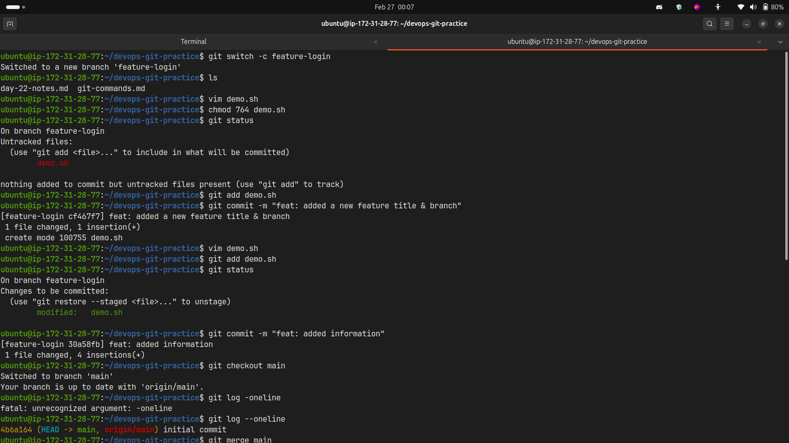
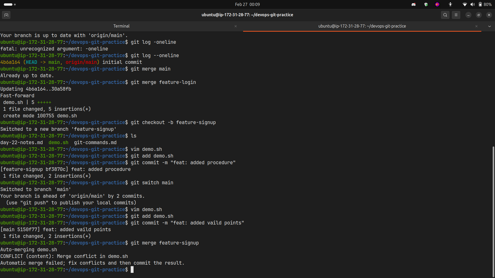

### Observations:

**What is a fast-forward merge?**

- A fast-forward merge happens when there's a direct linear path from the current branch to the target branch
- Git simply moves the pointer forward without creating a new commit
- No divergent history exists between branches

**When does Git create a merge commit instead?**

- When both branches have diverged (both have new commits since branching)
- When using `--no-ff` flag to force a merge commit
- When there are conflicts that need resolution

**What is a merge conflict?**

- Occurs when the same line(s) in the same file are modified differently in both branches
- Git cannot automatically determine which change to keep
- Requires manual resolution by the developer

### Merge Conflict Example:

```
<<<<<<< HEAD
Current branch changes
=======
Incoming branch changes
>>>>>>> feature-branch
```

---

## Task 2: Git Rebase — Hands-On

### Steps Performed:

1. Created `feature-dashboard` branch with 2-3 commits
2. Added new commit to `main` (main moved ahead)
3. Rebased `feature-dashboard` onto `main`
4. Checked history with `git log --oneline --graph --all`

### Screenshots:

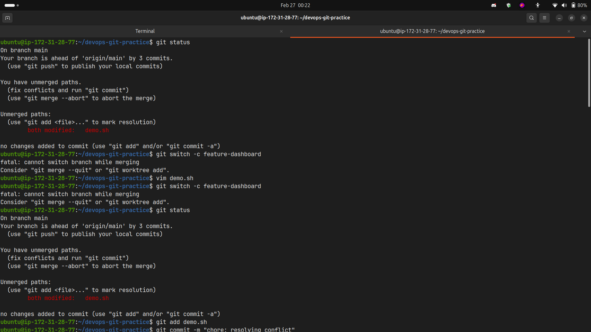
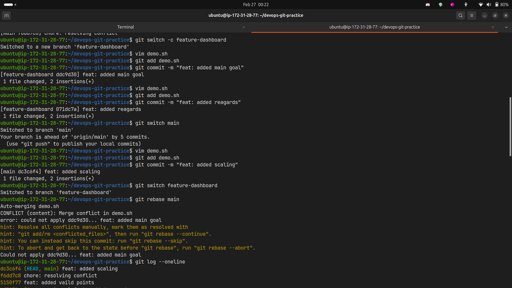
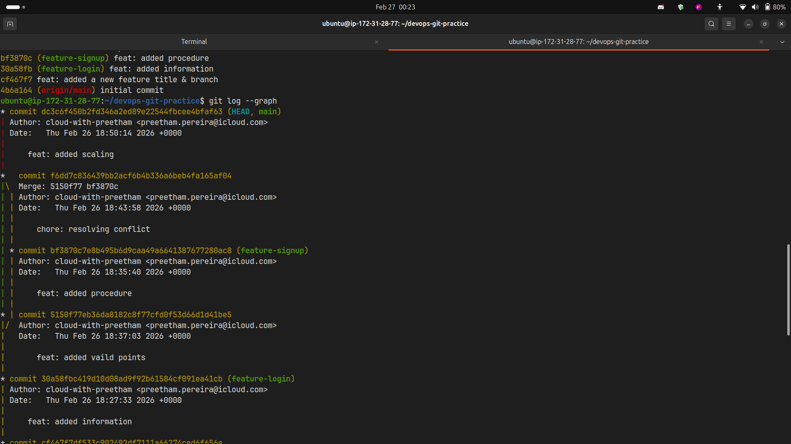
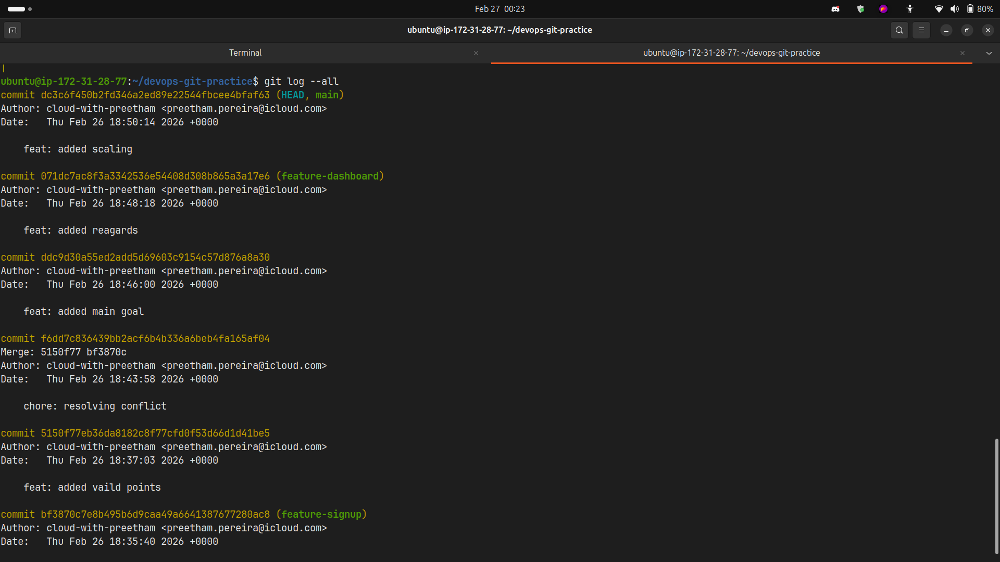

### Observations:

**What does rebase actually do to your commits?**

- Rebase replays your commits on top of another branch
- It rewrites commit history by creating new commits with different SHAs
- Moves the entire branch to begin from the tip of the target branch

**How is the history different from a merge?**

- Rebase: Creates a linear, clean history (no merge commits)
- Merge: Preserves the actual history with merge commits showing branch points

**Why should you never rebase commits that have been pushed and shared?**

- Rebase rewrites commit history (changes commit SHAs)
- Others working on the same commits will have conflicts
- Can cause confusion and duplicate commits in shared repositories
- Breaks the golden rule: "Don't rewrite public history"

**When would you use rebase vs merge?**

- **Use Rebase:**
  - Local feature branches before pushing
  - To maintain clean, linear history
  - When working alone on a branch
- **Use Merge:**
  - Integrating shared/public branches
  - When you want to preserve complete history
  - For main/production branches

---

## Task 3: Squash Commit vs Merge Commit

### Steps Performed:

1. Created `feature-profile` with 4-5 small commits
2. Merged using `git merge --squash feature-profile`
3. Created `feature-settings` with commits
4. Merged without squash (regular merge)

### Screenshots:

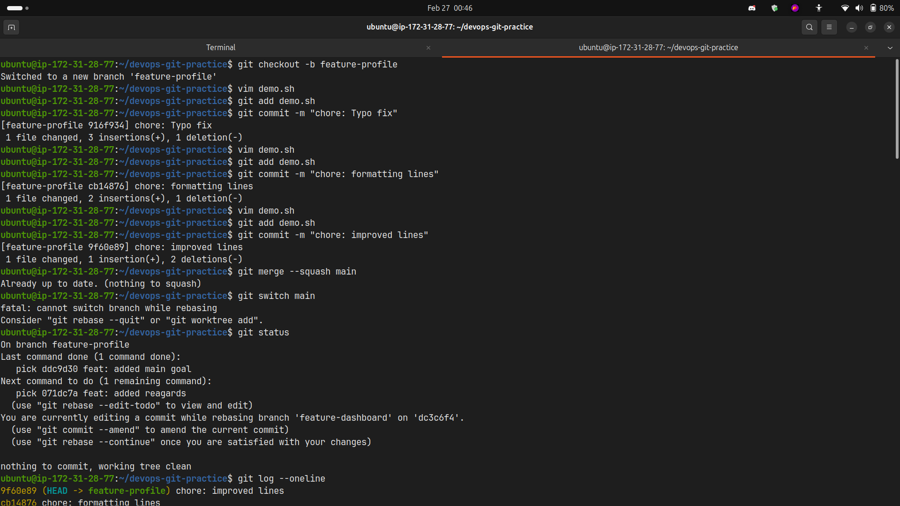
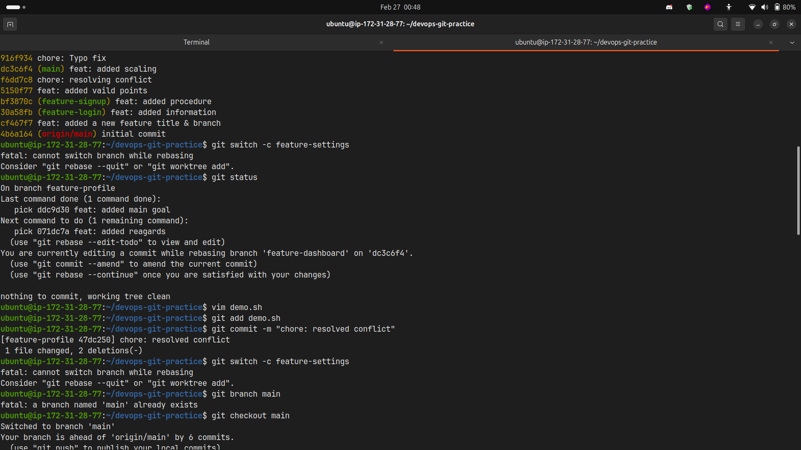
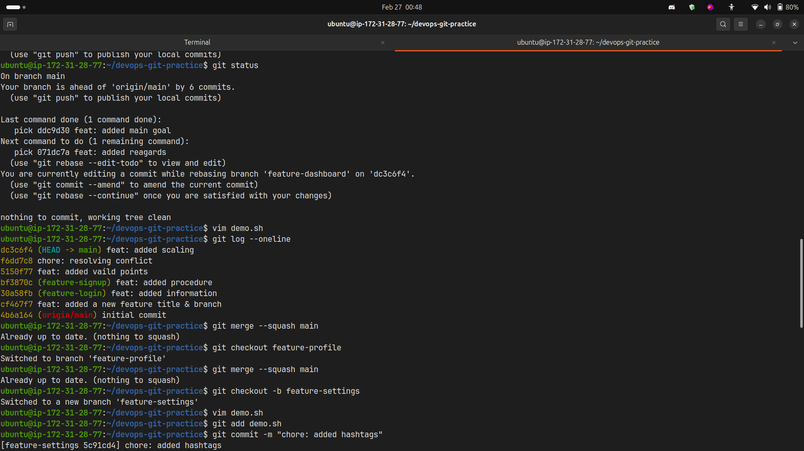

### Observations:

**What does squash merging do?**

- Combines all commits from the feature branch into a single commit
- Creates one clean commit on the target branch
- Loses individual commit history from the feature branch

**When would you use squash merge vs regular merge?**

- **Squash Merge:**
  - Many small/messy commits (WIP, typo fixes, etc.)
  - Want clean main branch history
  - Feature branch commits aren't important individually
- **Regular Merge:**
  - Want to preserve detailed commit history
  - Each commit is meaningful and well-crafted
  - Need to track who made specific changes

**What is the trade-off of squashing?**

- **Pros:** Clean, readable history on main branch
- **Cons:** Lose granular commit details, harder to debug specific changes, lose individual author attribution for commits

---

## Task 4: Git Stash — Hands-On

### Steps Performed:

1. Made uncommitted changes to a file
2. Attempted to switch branches (Git warned about uncommitted changes)
3. Used `git stash` to save work-in-progress
4. Switched branches, did work, switched back
5. Applied stashed changes with `git stash pop`
6. Created multiple stashes and listed them
7. Applied specific stash from the list

### Screenshots:

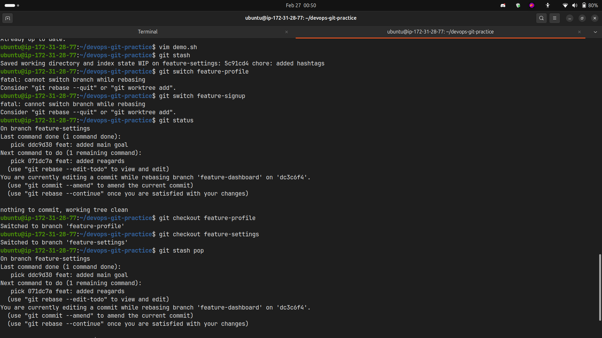
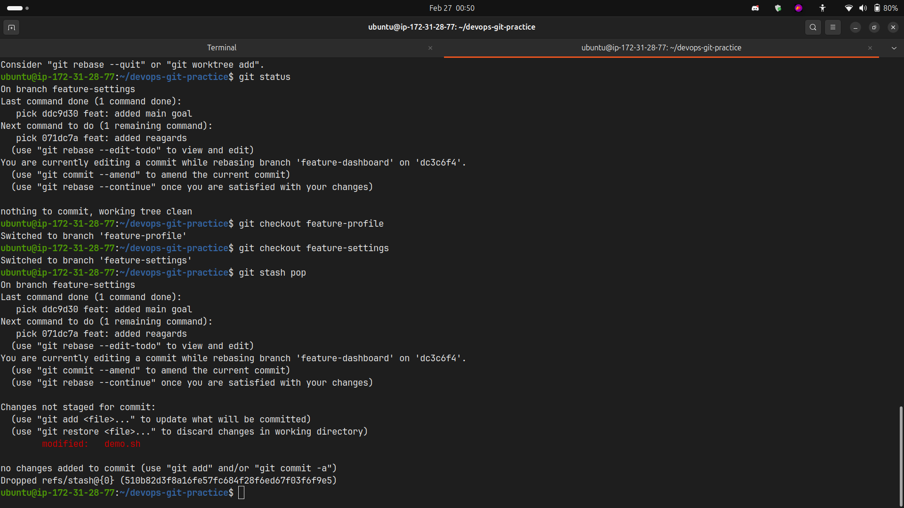

### Observations:

**What is the difference between `git stash pop` and `git stash apply`?**

- **`git stash pop`:** Applies the stash AND removes it from the stash list
- **`git stash apply`:** Applies the stash but KEEPS it in the stash list (can reuse)

**When would you use stash in a real-world workflow?**

- Need to switch branches urgently but work is incomplete
- Want to pull latest changes but have uncommitted work
- Experimenting with code but want to save current state
- Context switching between tasks/bugs
- Cleaning working directory temporarily without committing

### Useful Stash Commands:

```bash
git stash                          # Stash changes
git stash push -m "description"    # Stash with message
git stash list                     # List all stashes
git stash pop                      # Apply and remove latest stash
git stash apply stash@{n}          # Apply specific stash
git stash drop stash@{n}           # Delete specific stash
git stash clear                    # Remove all stashes
```

---

## Task 5: Cherry Picking

### Steps Performed:

1. Created `feature-hotfix` branch with 3 commits
2. Switched to `main`
3. Cherry-picked only the second commit using its hash
4. Verified with `git log` that only that commit was applied

### Screenshots:

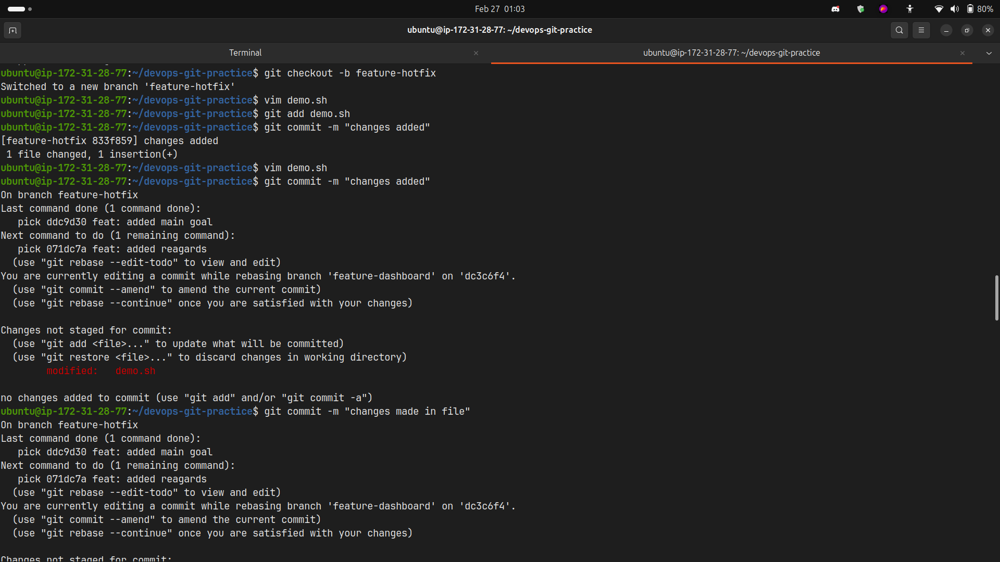
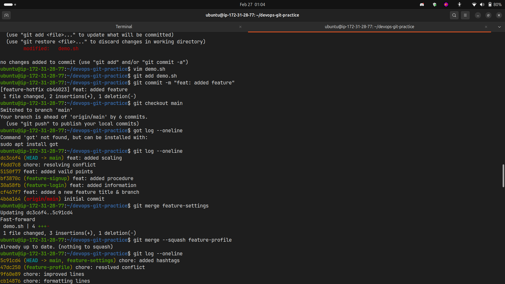
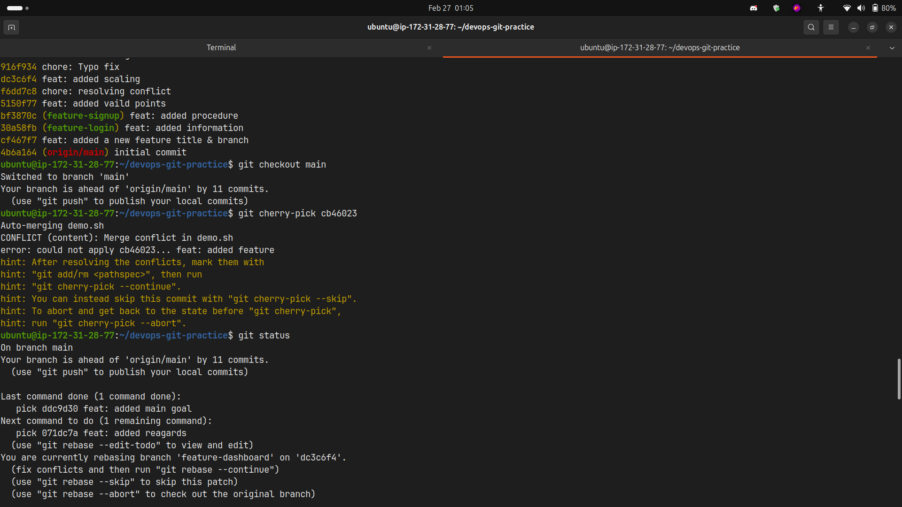
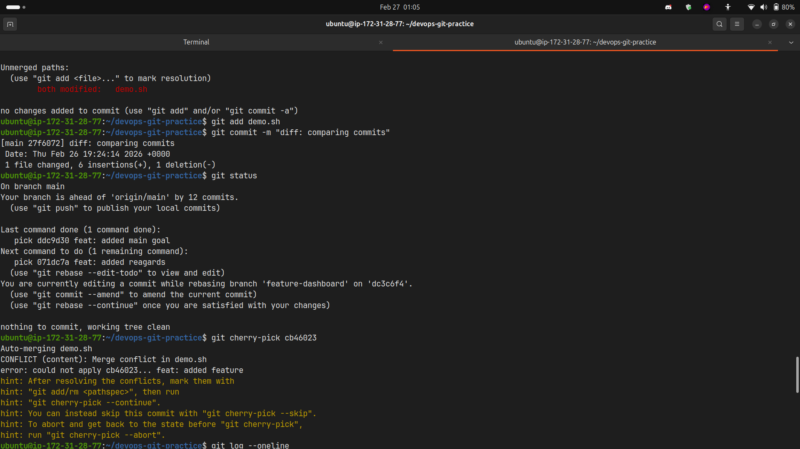
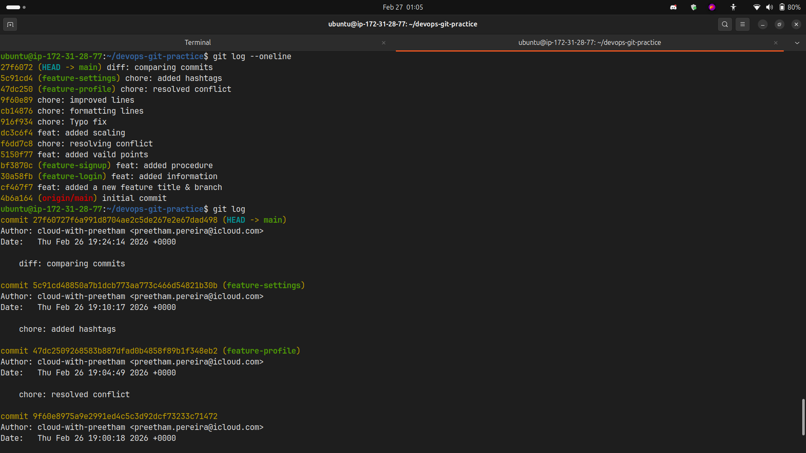

### Observations:

**What does cherry-pick do?**

- Applies a specific commit from one branch to another
- Creates a new commit with the same changes but different SHA
- Allows selective commit integration without merging entire branch

**When would you use cherry-pick in a real project?**

- Applying a critical hotfix from one branch to another
- Pulling a specific feature commit without merging everything
- Backporting fixes to older release branches
- Recovering specific commits from abandoned branches
- Applying bug fixes to multiple release versions

**What can go wrong with cherry-picking?**

- Can create duplicate commits (same changes, different SHAs)
- May cause conflicts if the code context is different
- Can make history confusing if overused
- Loses the connection to the original commit
- May miss dependent changes from other commits

### Cherry-Pick Command:

```bash
git cherry-pick <commit-hash>      # Pick specific commit
git cherry-pick <hash1> <hash2>    # Pick multiple commits
git cherry-pick --abort            # Cancel cherry-pick
git cherry-pick --continue         # Continue after resolving conflicts
```

---

## Key Takeaways

1. **Merge** preserves history, **Rebase** rewrites it for cleaner timeline
2. **Squash** is great for cleaning up messy feature branch commits
3. **Stash** is your friend for context switching without committing
4. **Cherry-pick** is powerful but use sparingly to avoid confusion
5. Never rebase public/shared commits
6. Choose merge strategy based on team workflow and history preferences

---

## Visualization Commands Used

```bash
git log --oneline --graph --all
git log --oneline --graph --decorate
git reflog
git status
```

---

## Next Steps

- Practice these workflows in real projects
- Establish team conventions for merge vs rebase
- Learn interactive rebase for commit cleanup
- Explore git reflog for recovery scenarios
