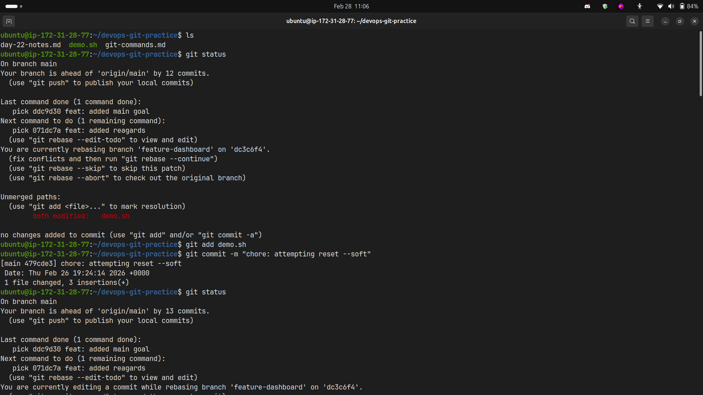
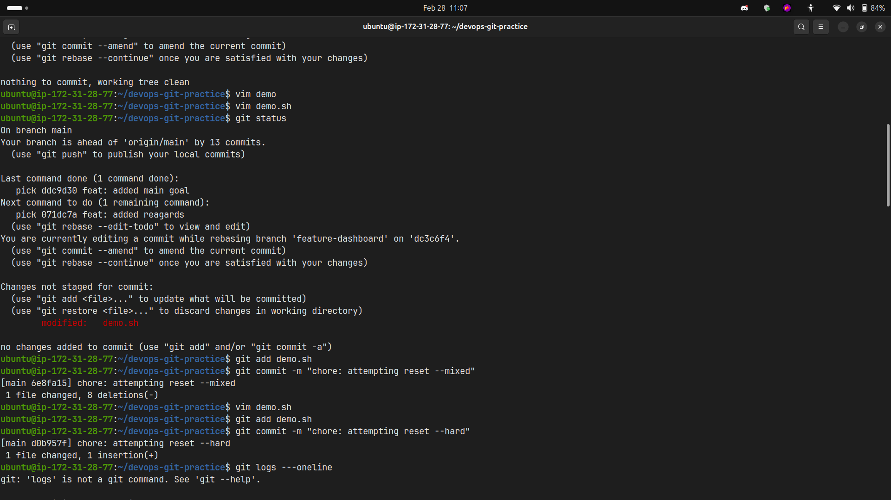
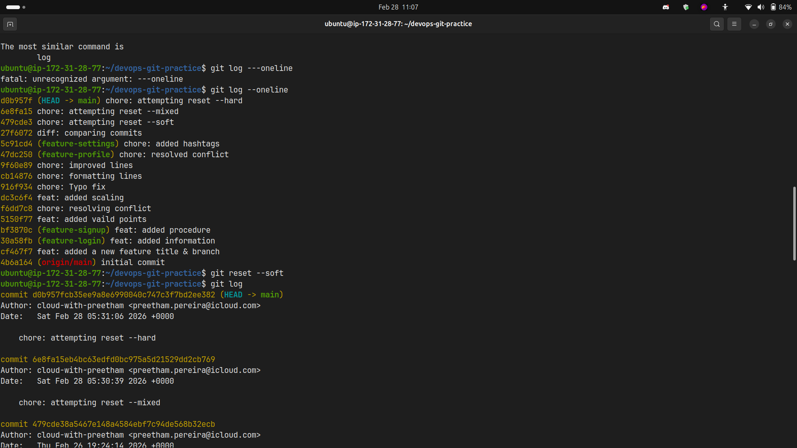
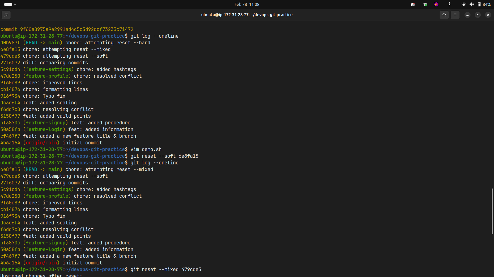
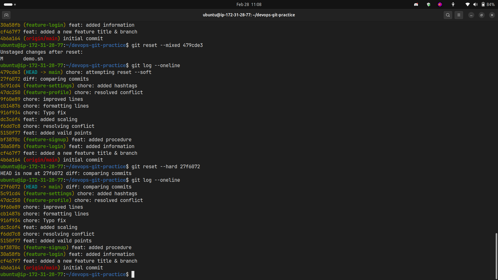
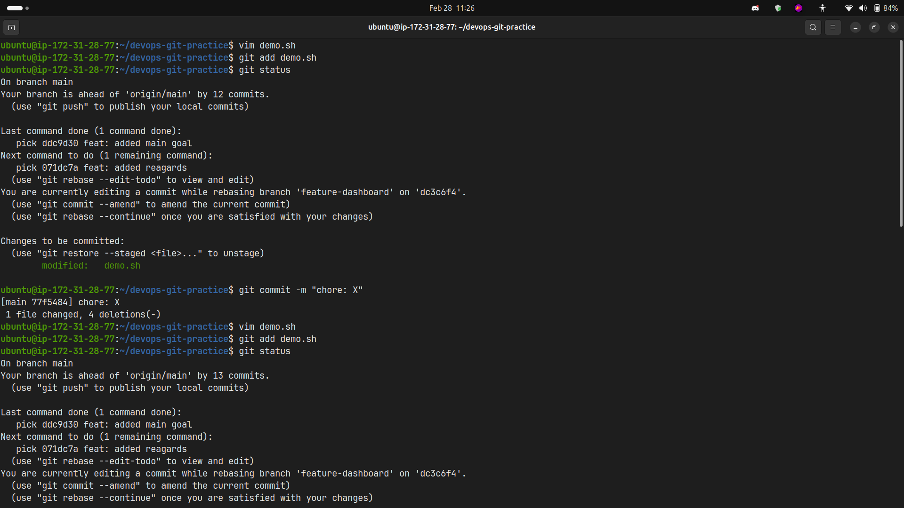
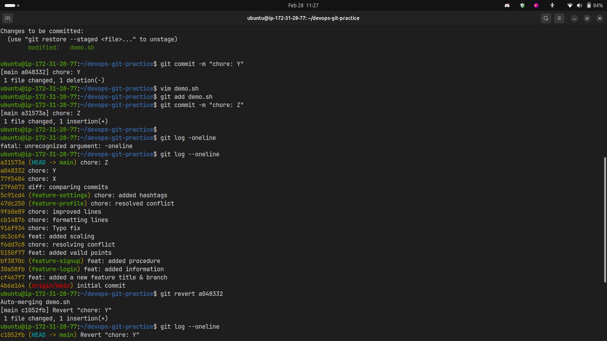
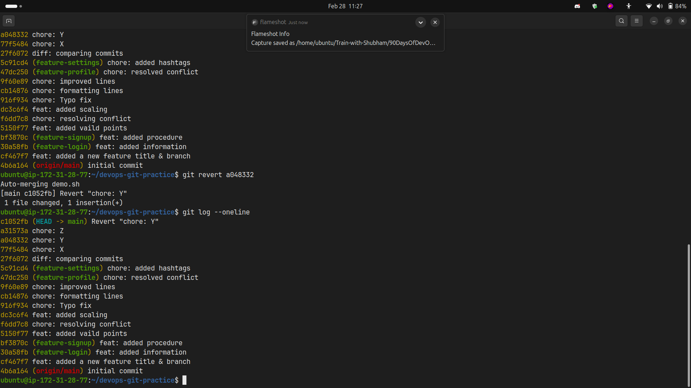

# Day 25 – Git Reset vs Revert & Branching Strategies

## Overview

This document contains my hands-on practice and learnings about Git reset, revert, and branching strategies.

---

## Task 1: Git Reset — Hands-On

### Practice Steps

I created 3 commits (A, B, C) and tested different reset modes.



### 1. `git reset --soft`

**Command:** `git reset --soft HEAD~1`



**What happened:**

- Moved HEAD back one commit
- Changes from the last commit remained **staged** (in the index)
- Working directory unchanged
- Ready to re-commit immediately

### 2. `git reset --mixed` (default)

**Command:** `git reset --mixed HEAD~1` or `git reset HEAD~1`



**What happened:**

- Moved HEAD back one commit
- Changes from the last commit moved to **working directory** (unstaged)
- Need to `git add` before committing again

### 3. `git reset --hard`

**Command:** `git reset --hard HEAD~1`



**What happened:**

- Moved HEAD back one commit
- **Completely removed** all changes from the last commit
- Working directory cleaned
- Changes are lost (unless recovered via `git reflog`)



### Answers:

**Q: What is the difference between `--soft`, `--mixed`, and `--hard`?**

| Mode      | HEAD  | Staging Area (Index) | Working Directory |
| --------- | ----- | -------------------- | ----------------- |
| `--soft`  | Moves | Unchanged            | Unchanged         |
| `--mixed` | Moves | Reset                | Unchanged         |
| `--hard`  | Moves | Reset                | Reset             |

**Q: Which one is destructive and why?**

- `--hard` is destructive because it permanently removes changes from both the staging area and working directory
- Changes are lost unless recovered using `git reflog`

**Q: When would you use each one?**

- **`--soft`**: When you want to redo a commit message or combine multiple commits into one
- **`--mixed`**: When you want to unstage changes and modify them before recommitting
- **`--hard`**: When you want to completely discard commits and all changes (use with caution!)

**Q: Should you ever use `git reset` on commits that are already pushed?**

- **NO!** Never use `git reset` on pushed commits
- It rewrites history and will cause conflicts for other team members
- Use `git revert` instead for shared branches

---

## Task 2: Git Revert — Hands-On

### Practice Steps

I created 3 commits (X, Y, Z) and reverted the middle commit (Y).



### Reverting Commit Y

**Command:** `git revert <commit-hash-of-Y>`



**What happened:**

- Git created a **new commit** that undoes the changes from commit Y
- Commit Y is still in the history
- The revert commit has its own hash and message

### Checking Git Log

**Command:** `git log --oneline`



**Observation:**

- Commit Y is still visible in the history
- A new "Revert" commit appears after commit Z
- History is preserved, not rewritten

### Answers:

**Q: How is `git revert` different from `git reset`?**

- **`git revert`**: Creates a new commit that undoes changes, preserves history
- **`git reset`**: Moves HEAD backward, rewrites history

**Q: Why is revert considered safer than reset for shared branches?**

- Revert doesn't rewrite history — it adds a new commit
- Other team members can pull the revert without conflicts
- Complete audit trail of what was changed and why
- No risk of losing work or causing sync issues

**Q: When would you use revert vs reset?**

- **Use `git revert`**:
  - On public/shared branches
  - When commits are already pushed
  - When you need to maintain history
  - In production environments

- **Use `git reset`**:
  - On local, unpushed commits only
  - When you want to clean up messy commit history
  - When you need to unstage changes
  - During local development

---

## Task 3: Reset vs Revert — Summary

|                                      | `git reset`                                         | `git revert`                                      |
| ------------------------------------ | --------------------------------------------------- | ------------------------------------------------- |
| **What it does**                     | Moves HEAD pointer backward, rewrites history       | Creates a new commit that undoes previous changes |
| **Removes commit from history?**     | Yes — commits are removed from log                  | No — all commits remain in history                |
| **Safe for shared/pushed branches?** | ❌ No — causes conflicts and sync issues            | ✅ Yes — safe for collaboration                   |
| **When to use**                      | Local unpushed commits, cleaning history, unstaging | Shared branches, pushed commits, production fixes |

---

## Task 4: Branching Strategies

### 1. GitFlow

**How it works:**

- Multiple long-lived branches: `main`, `develop`
- Supporting branches: `feature/*`, `release/*`, `hotfix/*`
- Features branch off `develop`, merge back to `develop`
- Releases branch off `develop`, merge to both `main` and `develop`
- Hotfixes branch off `main`, merge to both `main` and `develop`

**Flow Diagram:**

```
main     ──●────────────●──────────●──────────●──
            \          /          /          /
hotfix       \        /          /          /
              ●──────●          /          /
                              /          /
release                      /          /
                    ●───────●          /
                   /                  /
develop  ────●────●──────────●───────●──────●──
              \          /
feature        ●────────●
```

**When/Where it's used:**

- Large teams with scheduled releases
- Projects requiring multiple versions in production
- Enterprise software with strict release cycles

**Pros:**

- Clear separation of production and development code
- Supports parallel development
- Easy to manage releases and hotfixes
- Well-documented and widely understood

**Cons:**

- Complex — many branches to manage
- Slower — more overhead for small teams
- Can lead to merge conflicts
- Overkill for continuous deployment

---

### 2. GitHub Flow

**How it works:**

- Single main branch (`main` or `master`)
- Create feature branches from `main`
- Open pull request for review
- Merge to `main` after approval
- Deploy immediately from `main`

**Flow Diagram:**

```
main     ──●────●────●────●────●────●──
            \  /      \  /      \  /
feature      ●●        ●●        ●●
```

**When/Where it's used:**

- Startups and small teams
- Web applications with continuous deployment
- Projects using CI/CD pipelines
- Open-source projects

**Pros:**

- Simple and easy to understand
- Fast — encourages frequent deployments
- Works well with CI/CD
- Minimal overhead

**Cons:**

- No formal release process
- Not suitable for multiple production versions
- Requires robust testing automation
- Can be risky without proper CI/CD

---

### 3. Trunk-Based Development

**How it works:**

- Everyone commits directly to `main` (trunk)
- Very short-lived feature branches (< 1 day)
- Frequent integration (multiple times per day)
- Feature flags for incomplete features
- Continuous integration and testing

**Flow Diagram:**

```
main/trunk       ─●─●─●─●─●─●─●─●─●─●─●─
                  \/ \/ \/ \/ \/ \/ \/
short branches     ●  ●  ●  ●  ●  ●  ●
```

**When/Where it's used:**

- High-performing engineering teams
- Companies practicing DevOps/CI/CD
- Google, Facebook, Netflix
- Microservices architectures

**Pros:**

- Fastest integration — reduces merge conflicts
- Encourages small, incremental changes
- Simplifies CI/CD pipeline
- Forces good testing practices

**Cons:**

- Requires mature CI/CD infrastructure
- Needs strong automated testing
- Feature flags add complexity
- Not suitable for teams new to Git

---

### Strategy Recommendations

**Q: Which strategy would you use for a startup shipping fast?**

- **GitHub Flow** — Simple, fast, and perfect for continuous deployment. Minimal overhead allows focus on building features.

**Q: Which strategy would you use for a large team with scheduled releases?**

- **GitFlow** — Provides structure for managing multiple releases, hotfixes, and parallel development across large teams.

**Q: Which one does your favorite open-source project use?**

- **Linux Kernel**: Trunk-Based Development (with maintainer hierarchy)
- **React**: GitHub Flow (main branch + feature branches with PRs)
- **Kubernetes**: Modified GitHub Flow (main + release branches)

Most modern open-source projects use **GitHub Flow** because it's simple and works well with pull request workflows.

---

## Key Takeaways

1. **`git reset`** rewrites history — use only on local commits
2. **`git revert`** preserves history — safe for shared branches
3. **`git reflog`** is your safety net for recovering lost commits
4. Choose branching strategy based on team size, release cadence, and deployment model
5. Simpler is often better — don't over-engineer your workflow

---

## Safety Tips

- Always use `git status` before reset/revert
- Use `git log --oneline` to verify commit hashes
- Keep `git reflog` in mind as a recovery option
- Never force push to shared branches
- Communicate with team before reverting shared commits
