# Day 26 – GitHub CLI: Manage GitHub from Your Terminal

## Overview

Today I learned how to use GitHub CLI (`gh`) to manage GitHub repositories, issues, pull requests, and workflows directly from the terminal without switching to the browser. This is a game-changer for DevOps workflows and automation.

---

## Task 1: Install and Authenticate

### What I Did:

- Installed GitHub CLI on Ubuntu using the official package repository
- Authenticated with my GitHub account using `gh auth login`
- Verified authentication status with `gh auth status`

### Commands Used:

```bash
# Install GitHub CLI
curl -fsSL https://cli.github.com/packages/githubcli-archive-keyring.gpg | sudo dd of=/usr/share/keyrings/githubcli-archive-keyring.gpg
echo "deb [arch=$(dpkg --print-architecture) signed-by=/usr/share/keyrings/githubcli-archive-keyring.gpg] https://cli.github.com/packages stable main" | sudo tee /etc/apt/sources.list.d/github-cli.list > /dev/null
sudo apt update
sudo apt install gh

# Authenticate
gh auth login

# Verify authentication
gh auth status
gh auth status --show-token
```

### Answer: What authentication methods does `gh` support?

GitHub CLI supports the following authentication methods:

1. **OAuth Token via Web Browser** (Recommended) - Opens browser for secure authentication
2. **Personal Access Token (PAT)** - Manual token input for automation/scripts
3. **SSH Key Authentication** - Uses existing SSH keys for Git operations
4. **GitHub Enterprise Server** - Supports custom GitHub instances

### Screenshots:

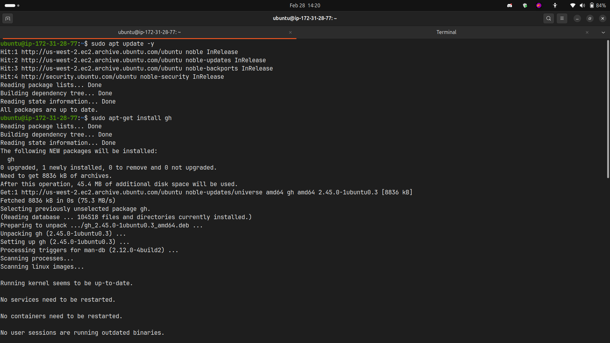
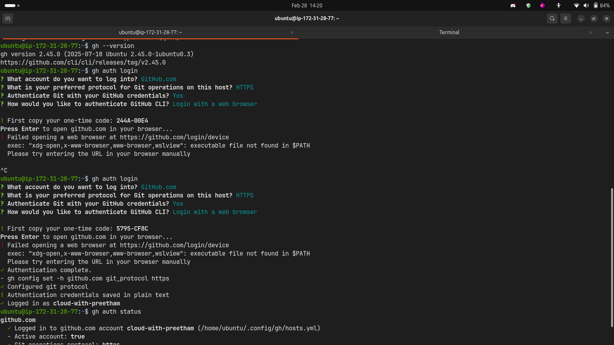
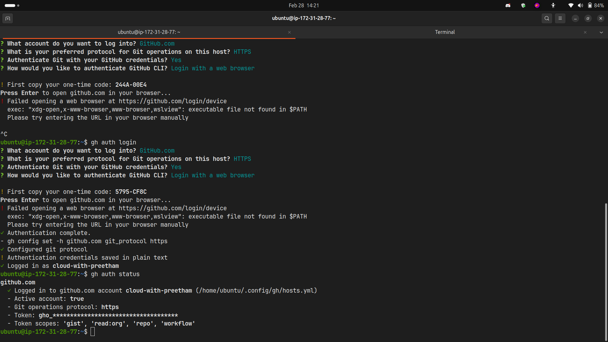

---

## Task 2: Working with Repositories

### What I Did:

- Created a new public repository with README from terminal
- Cloned repository using `gh repo clone`
- Viewed repository details and listed all my repositories
- Opened repository in browser from terminal
- Deleted the test repository (after refreshing auth with delete_repo scope)

### Commands Used:

```bash
# Create new repository
gh repo create day26-test-repo --public --add-readme

# Clone repository
gh repo clone day26-test-repo
cd day26-test-repo

# View repository details
gh repo view

# List all repositories
gh repo list

# Open repository in browser
gh repo view --web

# Delete repository (requires delete_repo scope)
gh auth refresh -h github.com -s delete_repo
gh repo delete day26-test-repo --yes
```

### Key Observations:

- `gh repo create` is much faster than creating via browser
- Deleting repos requires additional `delete_repo` scope for security
- `gh repo view` provides quick overview without leaving terminal

### Screenshots:

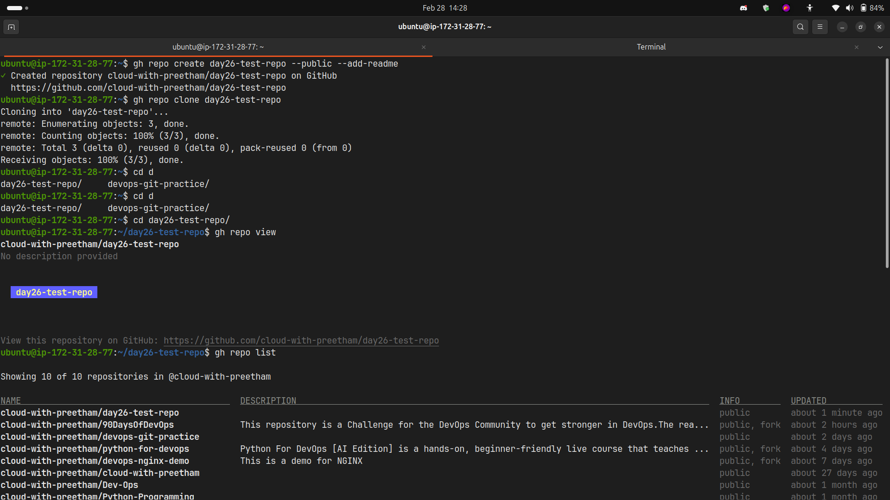
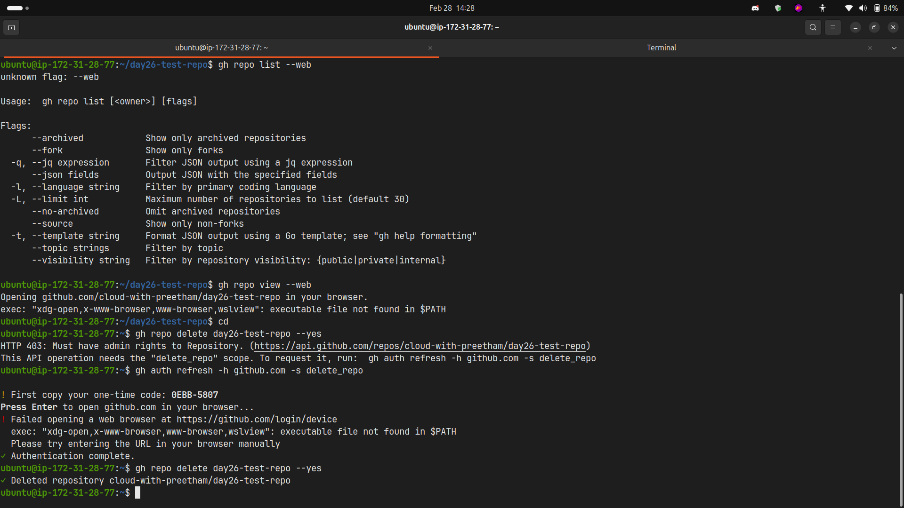

---

## Task 3: Issues

### What I Did:

- Created an issue with title, body, and label from terminal
- Listed all open issues on the repository
- Viewed specific issue details by number
- Closed an issue from terminal

### Commands Used:

```bash
# Create issue
gh issue create --title "Test Issue" --body "This is a test issue for Day 26" --label "bug"

# List all open issues
gh issue list

# View specific issue
gh issue view 1

# Close issue
gh issue close 1

# Reopen issue (if needed)
gh issue reopen 1
```

### Answer: How could you use `gh issue` in a script or automation?

**Automation Use Cases:**

1. **CI/CD Integration** - Auto-create issues when builds fail

   ```bash
   if [ $BUILD_STATUS == "failed" ]; then
     gh issue create --title "Build Failed: $BUILD_ID" --body "Build failed at $(date)" --label "ci-failure"
   fi
   ```

2. **Monitoring Alerts** - Create issues from monitoring tools

   ```bash
   gh issue create --title "High CPU Usage Alert" --body "CPU usage exceeded 90%" --label "alert"
   ```

3. **Bulk Operations** - Update multiple issues based on conditions

   ```bash
   gh issue list --json number,title --jq '.[] | select(.title | contains("bug")) | .number' | xargs -I {} gh issue close {}
   ```

4. **Report Generation** - Generate issue reports for standup meetings

   ```bash
   gh issue list --state open --json number,title,assignees --jq '.[] | "\(.number): \(.title)"'
   ```

5. **Integration with Other Tools** - Link issues with project management tools

### Screenshots:

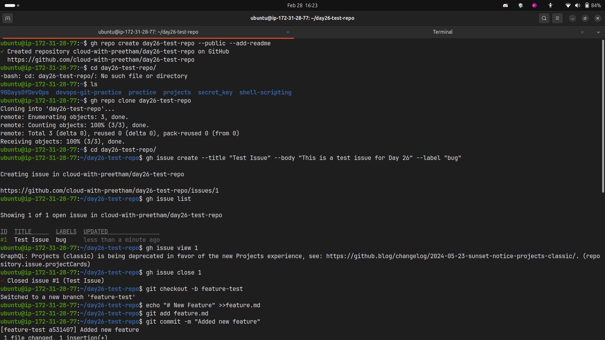

---

## Task 4: Pull Requests

### What I Did:

- Created a new branch and made changes
- Pushed changes and created PR entirely from terminal
- Listed all open PRs
- Viewed PR details including status and checks
- Merged PR from terminal

### Commands Used:

```bash
# Create branch and make changes
git checkout -b feature-branch
echo "# New Feature" >> feature.md
git add feature.md
git commit -m "Add new feature"
git push origin feature-branch

# Create pull request
gh pr create --title "Add new feature" --body "This PR adds a new feature" --fill

# List all PRs
gh pr list

# View PR details
gh pr view 1

# Check PR status
gh pr status

# Merge PR
gh pr merge 1 --merge

# Alternative: Checkout someone's PR for review
gh pr checkout 123
```

### Answer: What merge methods does `gh pr merge` support?

GitHub CLI supports three merge methods:

1. **`--merge`** - Creates a merge commit (default)
   - Preserves all commits from the feature branch
   - Creates a merge commit in the history
   - Best for: Maintaining complete history

2. **`--squash`** - Squashes all commits into one
   - Combines all commits into a single commit
   - Cleaner history but loses individual commit details
   - Best for: Feature branches with many small commits

3. **`--rebase`** - Rebases and merges
   - Replays commits on top of base branch
   - Linear history without merge commits
   - Best for: Maintaining clean, linear history

### Answer: How would you review someone else's PR using `gh`?

**PR Review Workflow:**

```bash
# 1. List PRs to find the one to review
gh pr list

# 2. View PR details
gh pr view 123

# 3. Checkout PR locally to test
gh pr checkout 123

# 4. Review the changes
gh pr diff 123

# 5. Add review comments
gh pr review 123 --comment --body "Looks good, but please add tests"

# 6. Approve PR
gh pr review 123 --approve --body "LGTM! Great work!"

# 7. Request changes
gh pr review 123 --request-changes --body "Please fix the security issue on line 45"

# 8. Add inline comments (via web)
gh pr view 123 --web
```

### Screenshots:

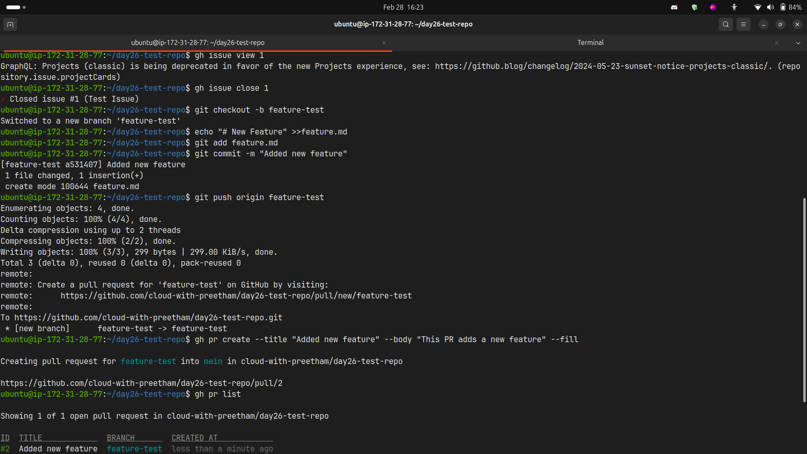
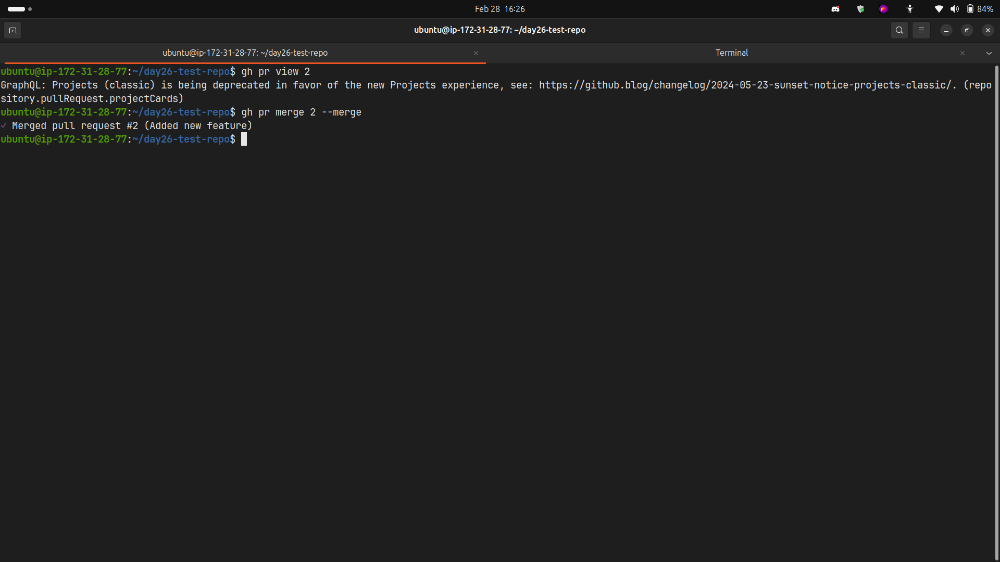

---

## Task 5: GitHub Actions & Workflows

### What I Did:

- Listed workflow runs on a public repository
- Viewed status of specific workflow runs
- Explored workflow details and logs

### Commands Used:

```bash
# List workflow runs on a public repo
gh run list --repo cli/cli

# View specific workflow run
gh run view <run-id> --repo cli/cli

# Watch a running workflow
gh run watch <run-id>

# View workflow logs
gh run view <run-id> --log

# List workflows
gh workflow list

# Trigger a workflow manually
gh workflow run <workflow-name>
```

### Answer: How could `gh run` and `gh workflow` be useful in a CI/CD pipeline?

**CI/CD Use Cases:**

1. **Pipeline Monitoring**

   ```bash
   # Monitor build status in real-time
   gh run watch
   # Get notified when build completes
   gh run list --limit 1 --json status,conclusion
   ```

2. **Automated Deployments**

   ```bash
   # Trigger deployment workflow after successful tests
   if [ $TEST_STATUS == "success" ]; then
     gh workflow run deploy.yml
   fi
   ```

3. **Debugging Failed Builds**

   ```bash
   # Quickly access logs of failed runs
   gh run list --status failure --limit 1 --json databaseId --jq '.[0].databaseId' | xargs gh run view --log
   ```

4. **Workflow Orchestration**

   ```bash
   # Chain multiple workflows
   gh workflow run build.yml && gh workflow run test.yml && gh workflow run deploy.yml
   ```

5. **Status Reporting**

   ```bash
   # Generate CI/CD status reports
   gh run list --json status,conclusion,name --jq '.[] | "\(.name): \(.conclusion)"'
   ```

6. **Re-running Failed Jobs**
   ```bash
   # Automatically retry failed workflows
   gh run rerun <run-id>
   ```

### Screenshots:

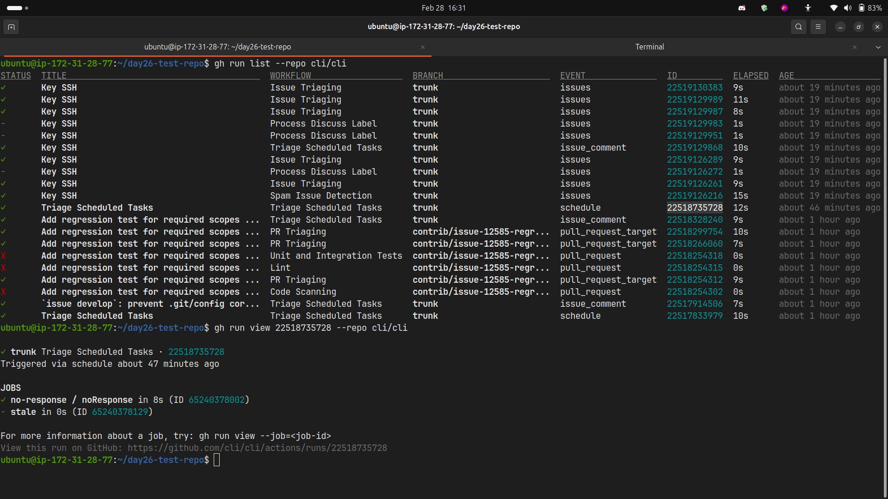

---

## Task 6: Useful `gh` Tricks

### What I Explored:

#### 1. `gh api` - Raw GitHub API Calls

```bash
# Get user information
gh api user

# Get repository information
gh api repos/OWNER/REPO

# List organization members
gh api orgs/ORG/members

# Create custom API requests
gh api graphql -f query='query { viewer { login }}'
```

#### 2. `gh gist` - Manage Gists

```bash
# Create a gist
echo "console.log('Hello World')" > test.js
gh gist create test.js --public

# List your gists
gh gist list

# View a gist
gh gist view <gist-id>

# Edit a gist
gh gist edit <gist-id>
```

#### 3. `gh release` - Manage Releases

```bash
# List releases
gh release list

# Create a release
gh release create v1.0.0 --title "Version 1.0.0" --notes "First release"

# Upload assets to release
gh release upload v1.0.0 ./build/app.zip

# Download release assets
gh release download v1.0.0
```

#### 4. `gh alias` - Create Command Shortcuts

```bash
# Create alias for pr view
gh alias set pv 'pr view'

# Create alias for issue list
gh alias set il 'issue list'

# Create alias for repo view
gh alias set rv 'repo view --web'

# List all aliases
gh alias list

# Use alias
gh pv 1
```

#### 5. `gh search` - Search GitHub

```bash
# Search repositories
gh search repos kubernetes --limit 5

# Search issues
gh search issues "bug" --repo OWNER/REPO

# Search code
gh search code "function" --repo OWNER/REPO

# Search users
gh search users "location:India"
```

### Screenshots:

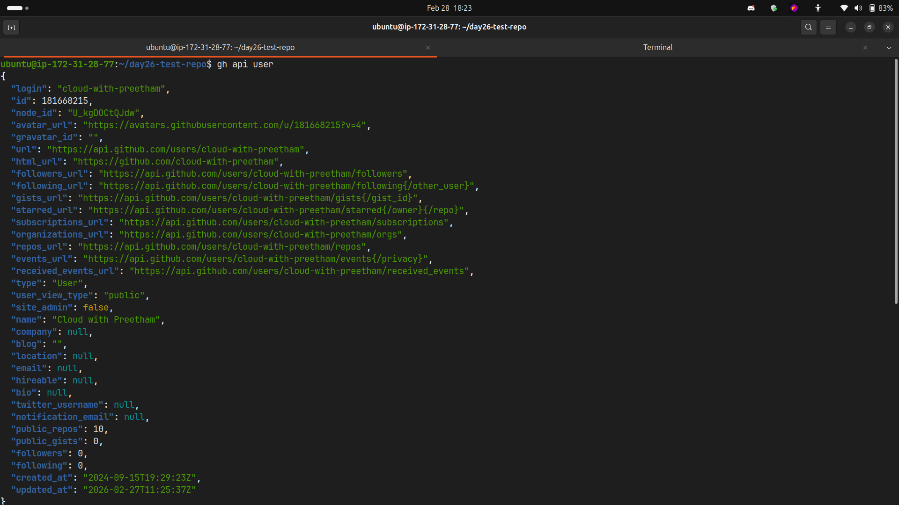
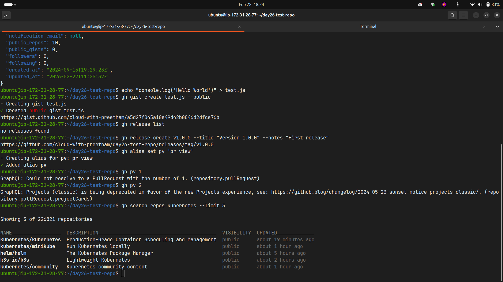

---

## Key Takeaways

### Benefits of GitHub CLI:

1. **Speed** - No context switching between terminal and browser
2. **Automation** - Easy to script and integrate into workflows
3. **Efficiency** - Batch operations and bulk updates
4. **CI/CD Integration** - Perfect for automated pipelines
5. **Consistency** - Same commands across different projects

### Most Useful Commands:

- `gh pr create --fill` - Auto-fills PR from commits
- `gh issue create` - Quick issue creation
- `gh repo view --web` - Open repo in browser when needed
- `gh pr checkout` - Test PRs locally
- `gh run watch` - Monitor CI/CD in real-time

### Pro Tips:

- Use `--json` flag for scripting and automation
- Use `--repo owner/repo` to work on any repository
- Combine with `jq` for powerful JSON processing
- Create aliases for frequently used commands
- Use `gh auth refresh` to add additional scopes when needed

---

## Challenges Faced

1. **Delete Repository Permission**
   - Issue: Couldn't delete repo without `delete_repo` scope
   - Solution: Used `gh auth refresh -h github.com -s delete_repo`

2. **Issue Creation Outside Repo**
   - Issue: Commands failed when not in a git repository
   - Solution: Either `cd` into repo or use `--repo` flag

3. **Understanding Merge Methods**
   - Learned the differences between merge, squash, and rebase
   - Each has specific use cases depending on project needs

---

## Next Steps

- Integrate `gh` commands into my daily workflow
- Create automation scripts for common tasks
- Set up aliases for frequently used commands
- Explore GitHub Actions integration with `gh workflow`
- Update my `git-commands.md` with all learned commands

---

## Conclusion

GitHub CLI is an essential tool for DevOps engineers. It eliminates context switching, enables powerful automation, and makes GitHub operations scriptable. Combined with shell scripting and CI/CD pipelines, `gh` can significantly improve productivity and workflow efficiency.
