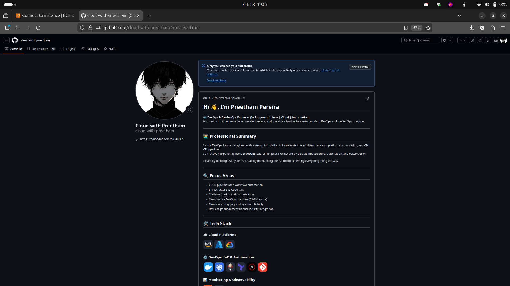
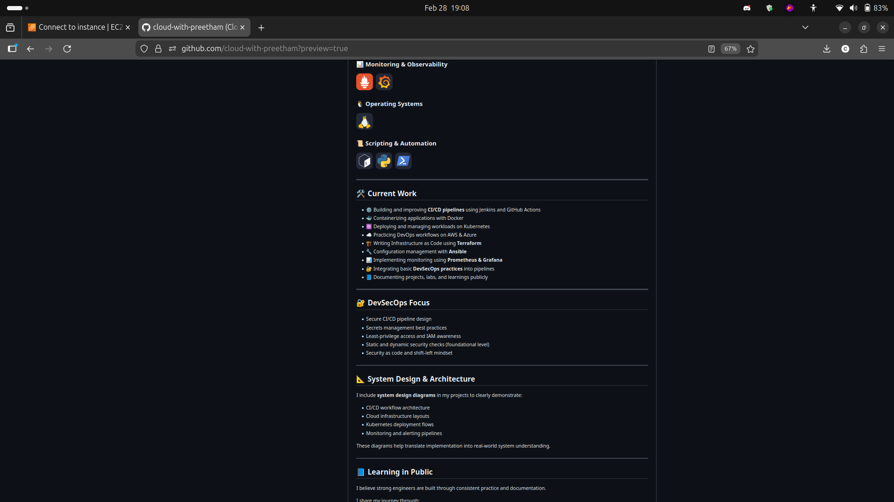
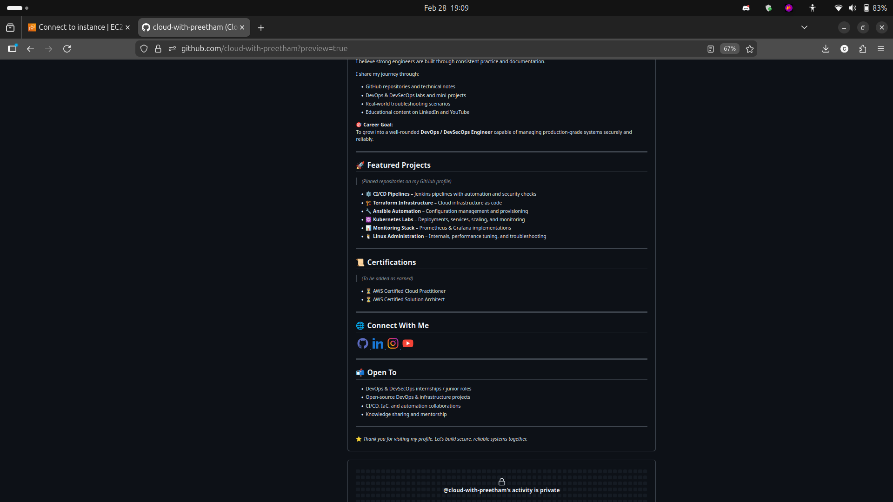
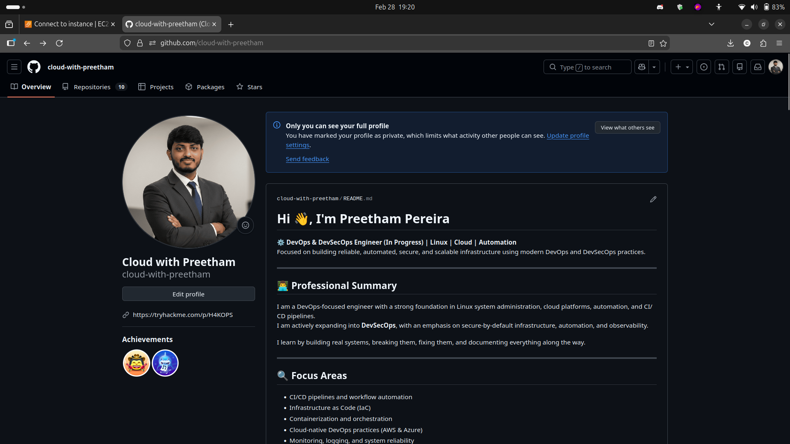
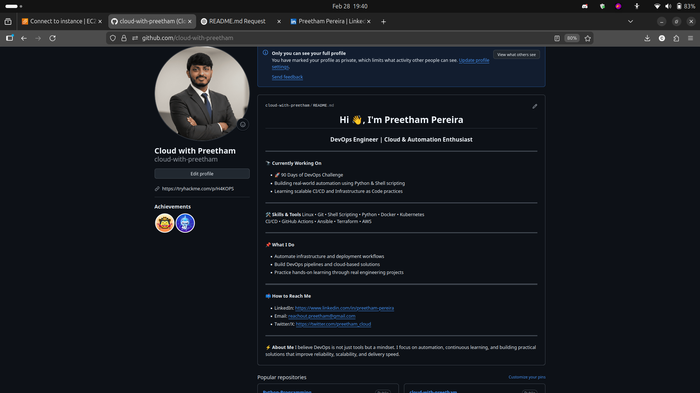
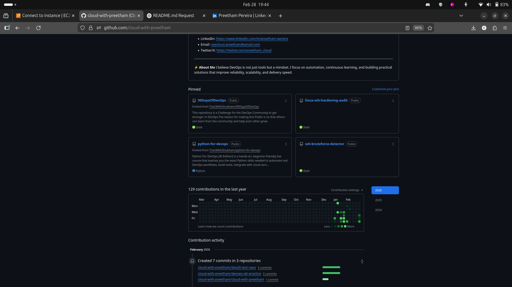

# Day 27 - GitHub Profile Makeover Notes

## Before Screenshots

## After Screenshots

---

## Task 1: Profile Audit

### Before State (Initial Assessment)
- **Profile Picture**: ❌ No profile picture - needs to be added
- **Bio**: ✅ Well-written bio present (DevOps/DevSecOps focused)
- **Pinned Repos**: ❌ No pinned repos - missing opportunity to showcase best work
- **Total Repos**: 9 public repositories
- **Repo Descriptions**: ❌ Most repos missing descriptions
- **Profile README**: ✅ Profile README repo exists (cloud-with-preetham/cloud-with-preetham)
- **Overall Impression**: Good bio but lacks visual identity and repo organization. Needs profile picture, pinned repos, and better repo descriptions to make strong first impression.

### After State (Post-Makeover)
- **Profile Picture**: ✅ Professional profile picture added
- **Bio**: ✅ Well-written bio present (DevOps/DevSecOps focused)
- **Pinned Repos**: ✅ 4 repositories pinned showcasing DevOps and security skills
- **Total Repos**: 9 public repositories
- **Repo Descriptions**: ⚠️ Still needs improvement - to be added
- **Profile README**: ✅ Fully updated with current work, skills, and contact info
- **Overall Impression**: Strong professional presence with clear identity, showcases best work upfront, ready for recruiter review

---

## Task 2: Profile README Updated

**Repository**: `github.com/cloud-with-preetham/cloud-with-preetham`

### What I Included:
- [x] Short introduction
- [x] Current work (90 Days of DevOps)
- [x] Skills/tools learning
- [x] Links to important repos
- [x] Contact information

**Status**: ✅ Profile README fully updated with all sections

---

## Task 3: Repository Organization

### Status:
- ⏭️ Skipped for now - Will organize repos in future iterations
- Current focus: Profile picture and README update

---

## Task 4: Pinned Repositories

### Status: ✅ Completed - Pinned 4 repositories

My 4 pinned repos:
1. **90DaysOfDevOps** - Showcases my ongoing DevOps learning journey and daily progress
2. **linux-ssh-hardening-audit** - Demonstrates Linux security and SSH hardening skills
3. **python-for-devops** - Highlights Python automation and scripting capabilities
4. **ssh-bruteforce-detector** - Shows security monitoring and threat detection expertise

---

## Task 5: Cleanup Done

### Actions Taken:
- Deleted repos: None
- Archived repos: None
- Renamed repos: None
- Security check: ✅ Confirmed no secrets exposed

---

## 3 Key Improvements

1. **Added Professional Profile Picture**
   - What: Uploaded profile picture to GitHub
   - Why: Creates visual identity and makes profile more approachable and professional

2. **Updated Profile README**
   - What: Added current work, skills, tools, and contact information
   - Why: Tells my story and helps recruiters/collaborators understand my focus areas

3. **Pinned Best Repositories**
   - What: Selected and pinned 4 repos showcasing DevOps, security, and automation skills
   - Why: Immediately shows visitors my strongest work and technical capabilities

---

## Updated GitHub Profile Link
[https://github.com/cloud-with-preetham](https://github.com/cloud-with-preetham)

---

## Reflection
This exercise made me realize that GitHub is more than just a code repository—it's my professional identity in the developer community. Adding a profile picture and updating my README transforms my profile from anonymous to approachable. Pinning my best repositories immediately showcases my DevOps and security skills to anyone visiting my profile. This makeover significantly improves my chances of being noticed by recruiters and potential collaborators.

## Next Steps
- [x] Add profile picture
- [x] Update profile README
- [x] Pin best repositories (4/6 completed)
- [ ] Add descriptions to all 9 repositories
- [ ] Pin 2 more repositories
- [ ] Create dedicated repos for shell-scripts, python-scripts, and devops-notes
