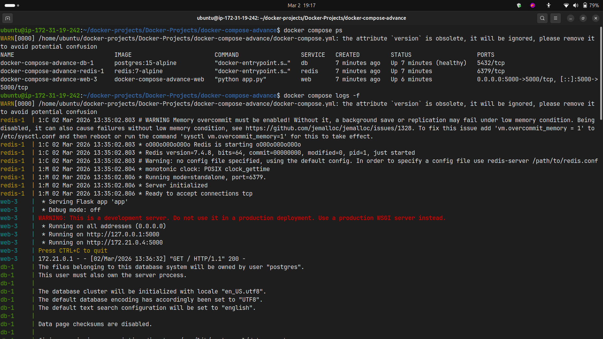
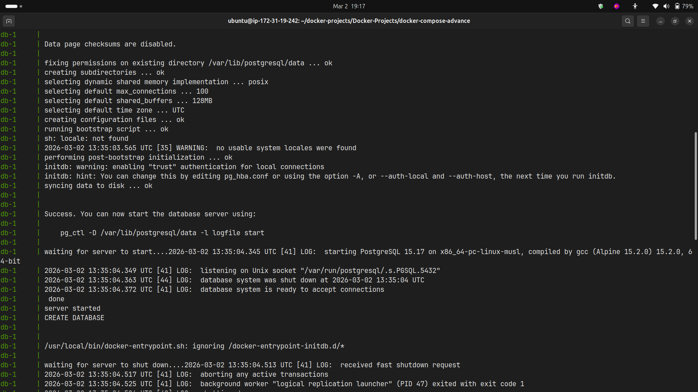
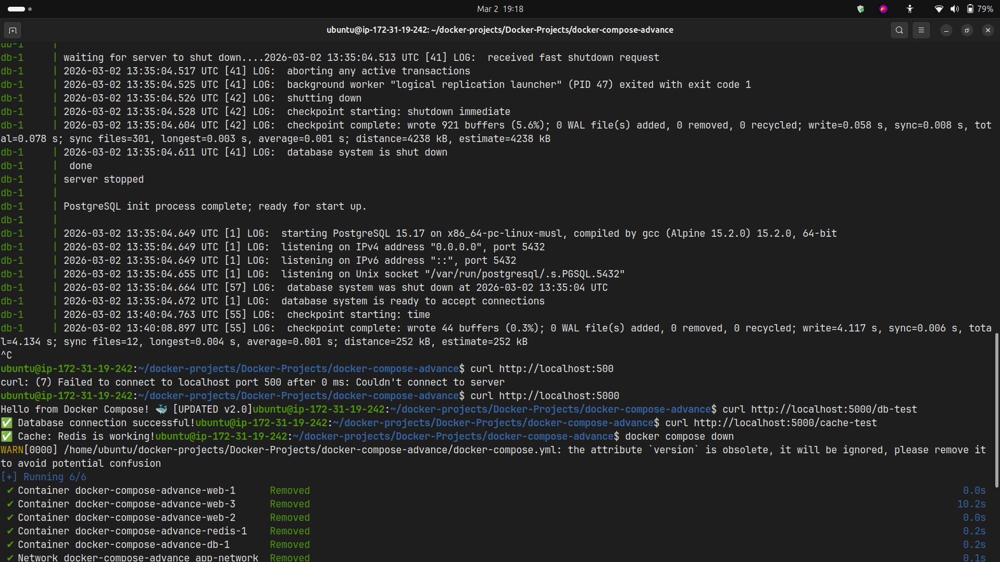
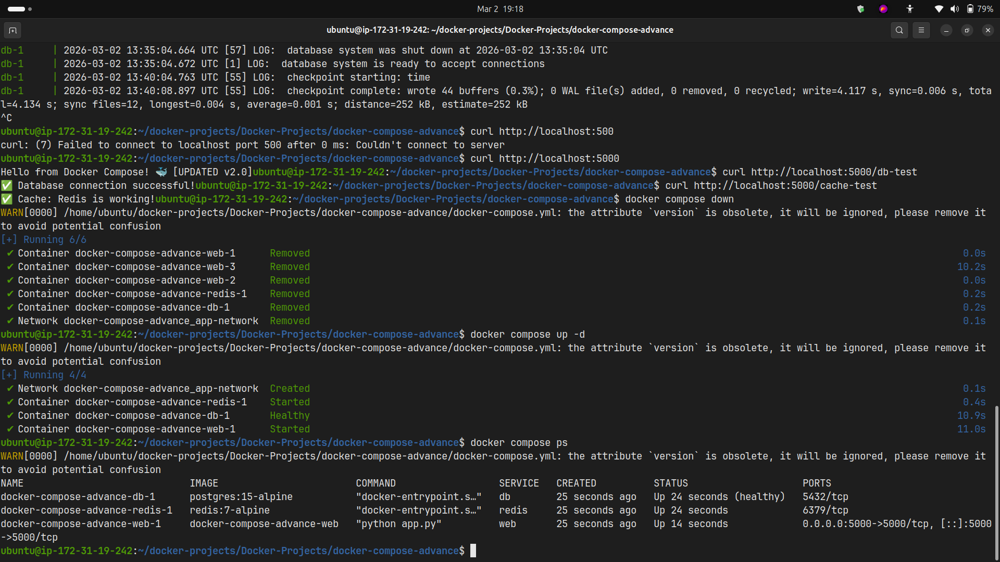

# Day 34 – Docker Compose: Advanced Multi-Container Apps

## Overview

Implemented a production-ready multi-container application using Docker Compose with healthchecks, restart policies, named networks, and volumes.

## Architecture

- **Web App**: Python Flask application
- **Database**: PostgreSQL with persistent storage
- **Cache**: Redis for in-memory caching

## Task 1: App Stack ✅

Created 3-service stack with Flask, PostgreSQL, and Redis.

**Files:**

- `app/app.py` - Flask app with 3 routes
- `app/Dockerfile` - Container build instructions
- `docker-compose.yml` - Service orchestration

**Screenshots:**


_Flask web application running_


_PostgreSQL database connection test_


_Redis cache functionality_

## Task 2: Dependencies & Healthchecks ✅

**Implemented:**

- Healthcheck on PostgreSQL using `pg_isready`
- `depends_on` with `condition: service_healthy`
- Web service waits for database to be ready

**Result:** No connection errors during startup

**Screenshots:**


_Docker Compose healthcheck setup_


_depends_on configuration_


_Service health status_


_Services starting in correct order_

## Task 3: Restart Policies ✅

**Tested:**

- `restart: always` - Container restarts after kill
- `restart: on-failure` - Only restarts on error exit

**Use Cases:**

- **always**: Production databases, critical services
- **on-failure**: Development, services that should stop cleanly
- **unless-stopped**: Persist across reboots but respect manual stops
- **no**: Default, no automatic restart

**Screenshots:**


_Restart policies in docker-compose.yml_


_Container automatically restarting after kill_

## Task 4: Custom Dockerfiles ✅

**Workflow:**

1. Modified `app.py` code
2. Ran `docker compose up --build`
3. Changes reflected immediately

**Benefit:** Single command to rebuild and deploy

**Screenshots:**


_Modified application code_


_docker compose up --build in action_

## Task 5: Named Networks & Volumes ✅

**Added:**

- Network: `app-network` (bridge driver)
- Volume: `postgres-data` (persistent database storage)
- Labels: project, environment, service metadata

**Result:** Data persists across container restarts

**Screenshots:**


_Named networks and volumes configuration_

## Task 6: Scaling ✅

**Command:** `docker compose up --scale web=3`

**Issue:** Port conflict - multiple containers can't bind to same port

**Why it breaks:**

- Each replica tries to bind to `5000:5000`
- Host can only have one service per port

**Solutions:**

- Remove explicit port mapping
- Use reverse proxy (nginx)
- Use orchestration (Kubernetes, Docker Swarm)

## Key Learnings

1. Healthchecks prevent race conditions during startup
2. Restart policies ensure service availability
3. Named volumes provide data persistence
4. Scaling requires load balancer for production
5. Labels improve service organization

## Commands Used

```bash
# Start services
docker compose up -d

# Rebuild
docker compose up --build

# Scale
docker compose up --scale web=3

# View status
docker compose ps

# View logs
docker compose logs -f

# Stop services
docker compose down

# Stop and remove volumes
docker compose down -v
```

## Testing Results

✅ All services running
✅ Database connection successful
✅ Redis cache working
✅ Data persists after restart
✅ Healthchecks functioning
✅ Auto-restart working

**Verification Screenshots:**


_All services running successfully_


_Service logs verification_


_Data persistence verification_


_Complete stack health check_
