# Day 44 - Secrets, Artifacts, and Real Tests in CI

## Repository

- Repo name: `github-actions-practice`
- Date: `2026-03-08`

## Solution Files Created

I prepared these ready-to-use files:

- `workflows/secrets.yml`
- `workflows/artifact-upload-download.yml`
- `workflows/real-tests.yml`
- `workflows/cache-demo.yml`
- `scripts/health_check.sh`
- `requirements.txt`

Copy the workflow files to your target repository under `.github/workflows/`.
Copy `scripts/health_check.sh` to `scripts/health_check.sh` and `requirements.txt` to repo root.

## Task 1: GitHub Secrets

I created `MY_SECRET_MESSAGE` in:
`Settings -> Secrets and variables -> Actions`.

Implemented in `secrets.yml`:

- Checks if secret exists and prints only boolean status:
  `The secret is set: true`
- Demonstrates that if printed, GitHub masks secret value as `***`
- Reads `DOCKER_USERNAME` and `DOCKER_TOKEN` as env vars without hardcoding

### Why secrets should never be printed in CI logs

- Logs may be visible to collaborators and retained for long periods.
- Any leaked token can be abused for registry/cloud access.
- Masking is a safety net, not a reason to expose secrets in scripts.

### Screenshots

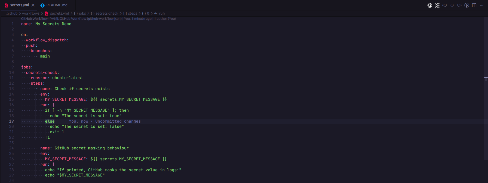
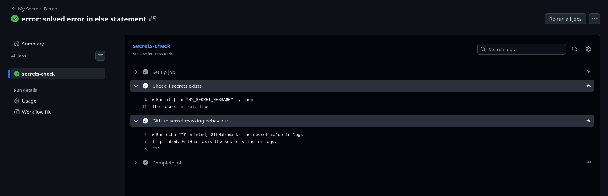

## Task 2: Use Secrets as Environment Variables

Used step-level env injection:

- `MY_SECRET_MESSAGE: ${{ secrets.MY_SECRET_MESSAGE }}`
- `DOCKER_USERNAME: ${{ secrets.DOCKER_USERNAME }}`
- `DOCKER_TOKEN: ${{ secrets.DOCKER_TOKEN }}`

No secret values are hardcoded in workflow files.

### Screenshots

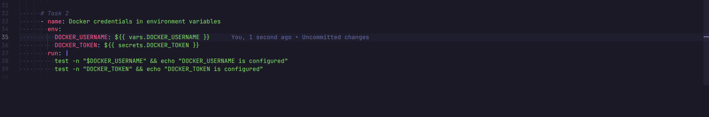
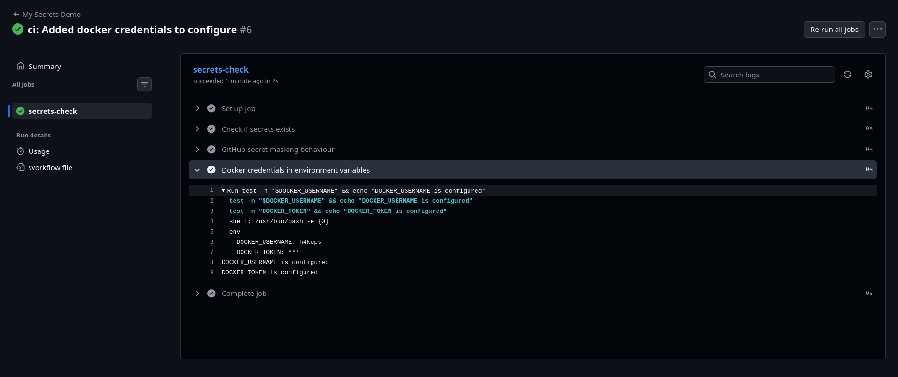

## Task 3: Upload Artifacts

Implemented in `artifact-upload-download.yml`:

- Generates `reports/build-report.txt`
- Uploads file using `actions/upload-artifact@v4`
- Artifact name: `my-build-report`

### Verification

- Artifact is visible in Actions run summary
- Artifact can be downloaded from the GitHub Actions UI

### Screenshots

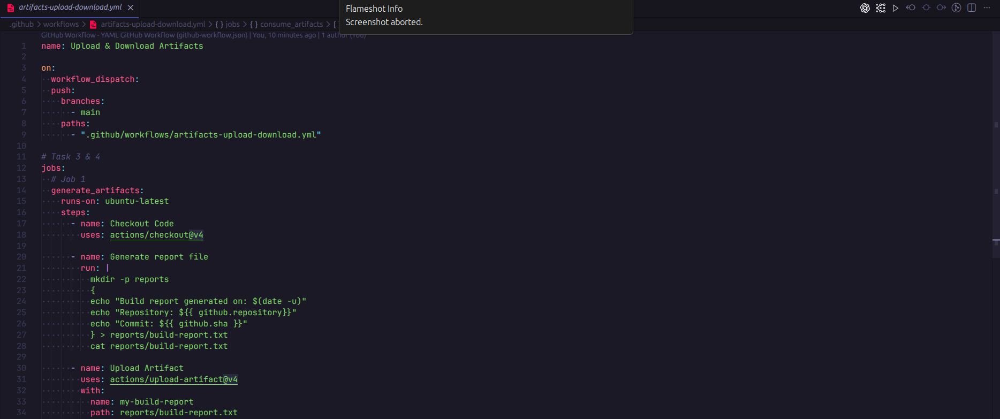
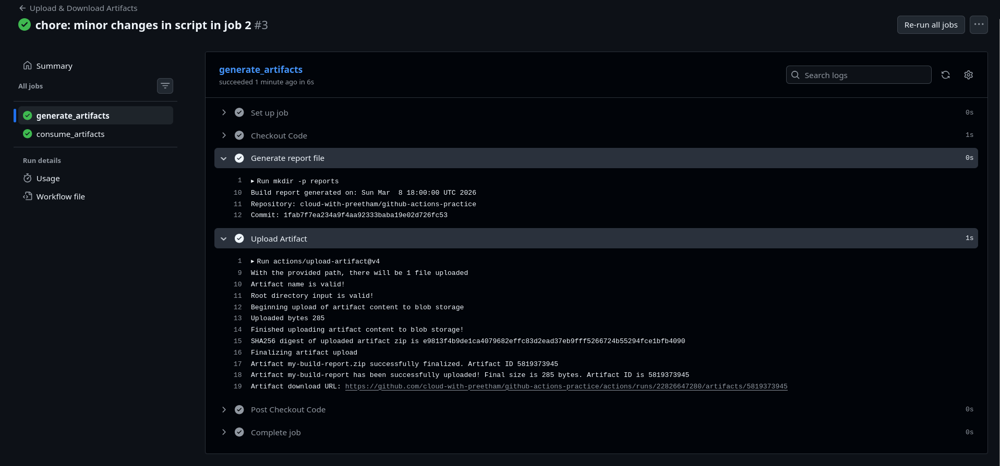

## Task 4: Download Artifacts Between Jobs

Implemented in `artifact-upload-download.yml`:

- Job `generate-artifact`: creates and uploads artifact
- Job `consume-artifact`: downloads artifact with `actions/download-artifact@v4`
- Prints artifact contents to verify handoff between jobs

### Real-world use of artifacts

- Passing binaries/reports across jobs
- Persisting logs for debugging
- Sharing outputs between build, test, and deploy stages

### Screenshots

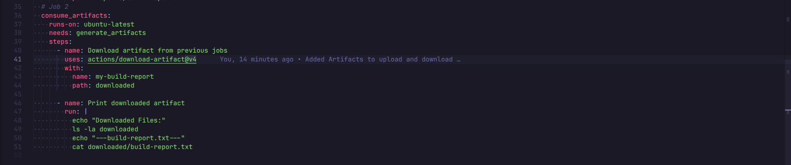
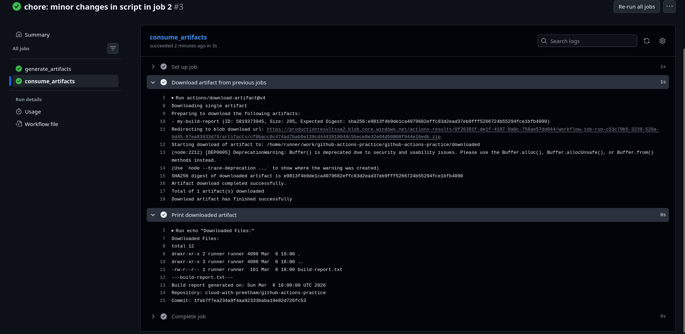
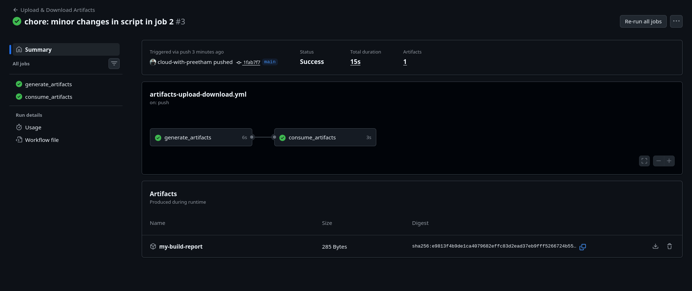

## Task 5: Run Real Tests in CI

Implemented in `real-test.yml` using `scripts/health_check.sh`:

- Checkout code
- `chmod 764 "scripts/health_check.sh"`
- Run script and fail workflow on non-zero exit

Validation:

- Intentionally break script logic to force failure (red pipeline)
- Fix script and rerun for success (green pipeline)

### Screenshots

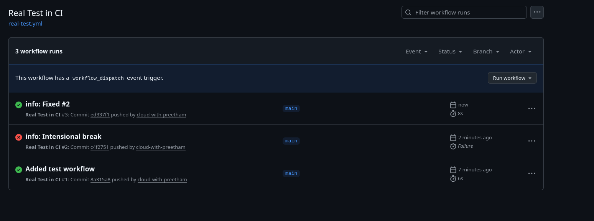
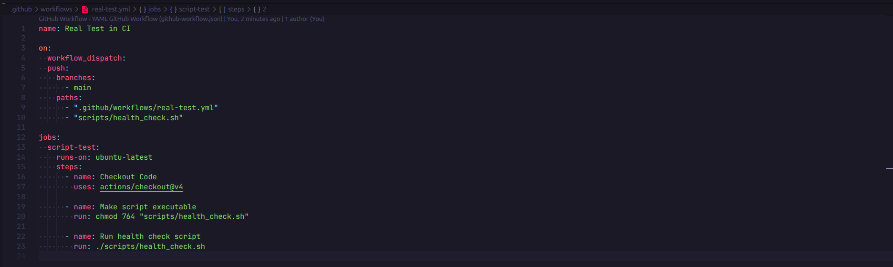
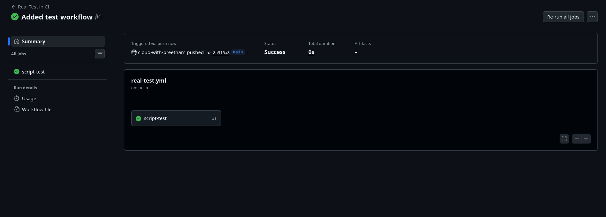
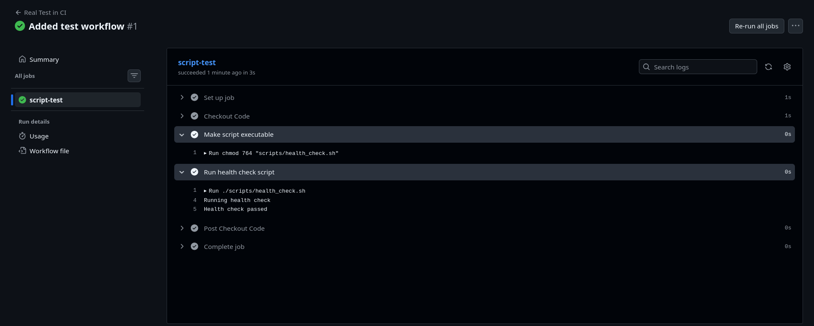
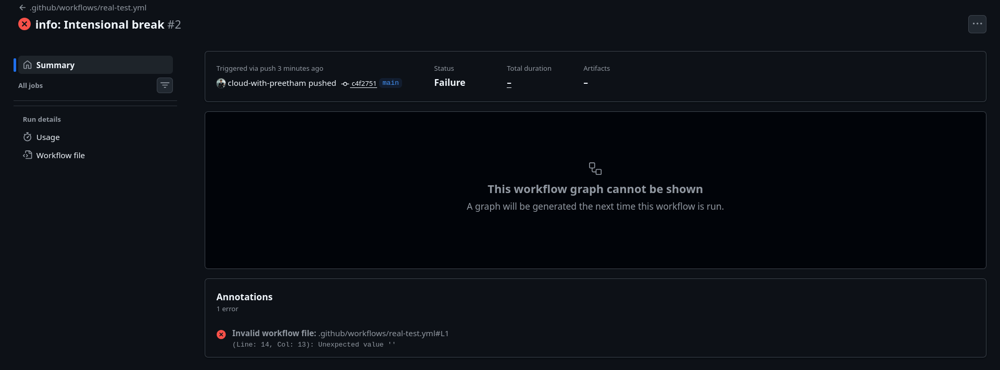
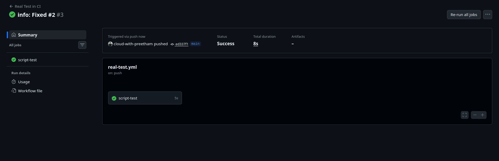

## Task 6: Caching

Implemented in `cache.yml`:

- Setup Python 3.12
- Cache path: `~/.cache/pip`
- Key: `${{ runner.os }}-pip-${{ hashFiles('requirements.txt') }}`
- Install deps from `requirements.txt`

### What is cached and where it is stored

- Cached content: pip download/install cache
- Storage location: GitHub Actions cache service (not your local machine)
- Benefit: faster installs on repeated runs when key matches

### Screenshots

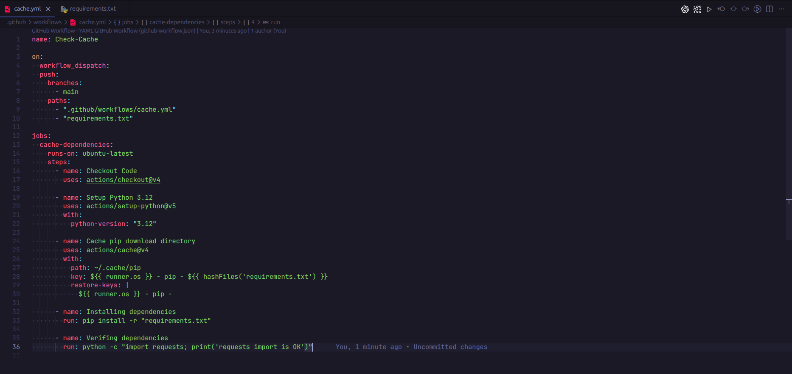
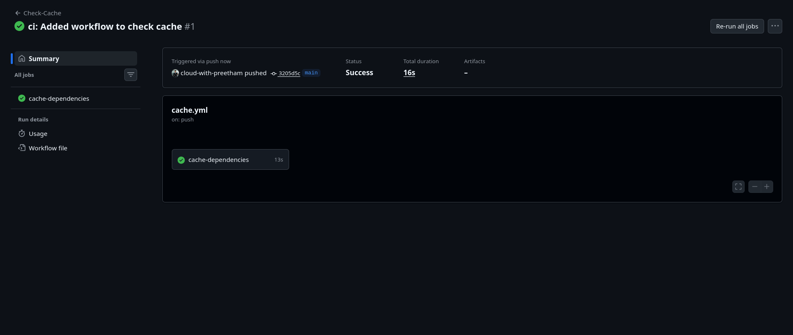
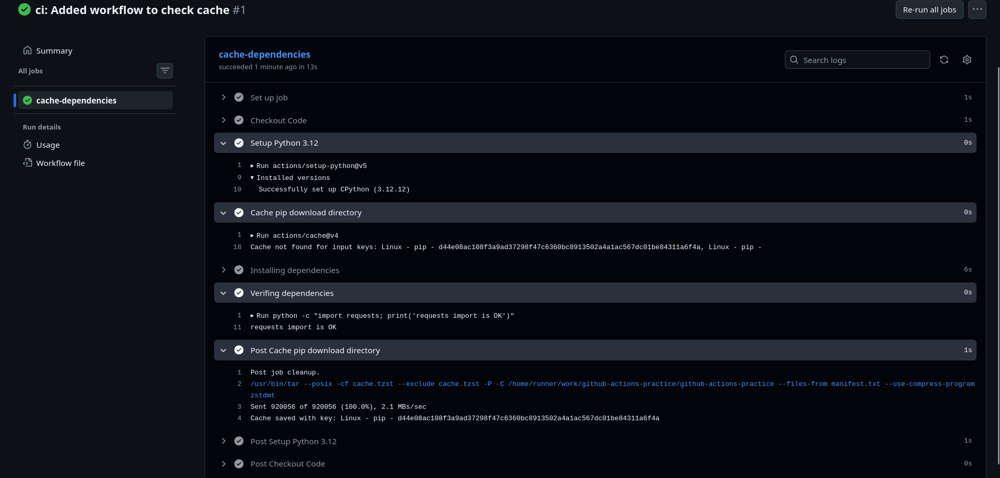

## Key Learnings

- Secrets should be referenced via `${{ secrets.* }}` and never hardcoded.
- Artifacts allow file sharing across jobs and better traceability.
- Real CI tests make failures visible early in development.
- Caching improves pipeline speed and reduces repeated dependency download.
