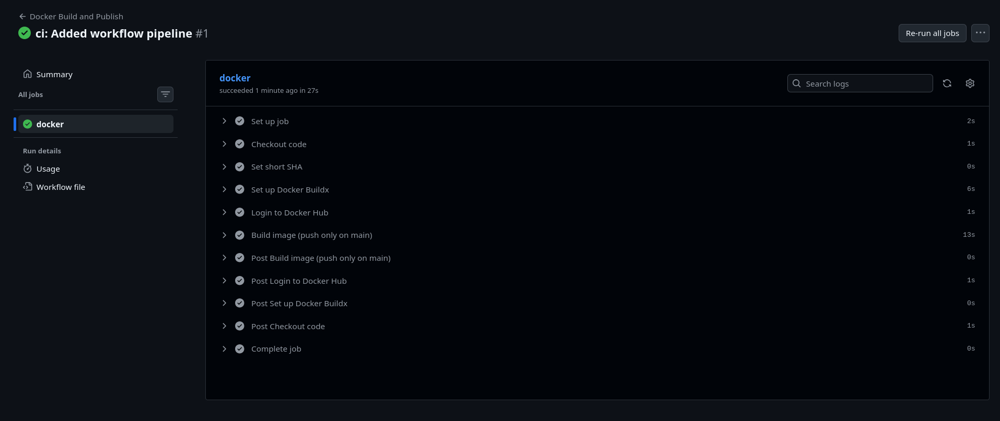
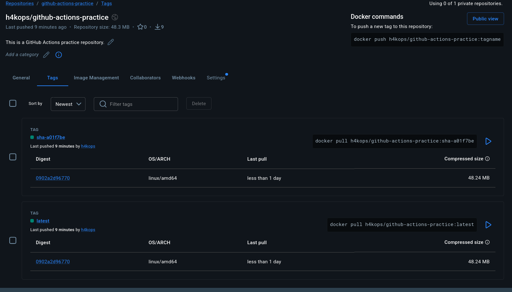

# Day 45 - Docker Build and Push in GitHub Actions

## Repository

- GitHub repo: `cloud-with-preetham/github-actions-practice`
- Workflow file: `.github/workflows/docker-publish.yml`
- Docker Hub repo: `h4kops/github-actions-practice`
- Date: `2026-03-11`

## Task 1: Prepare

I completed the setup by:

- Adding/using the Dockerfile in the repository root.
- Configuring credentials in GitHub:
  - `DOCKER_USERNAME` (Repository Variable)
  - `DOCKER_TOKEN` (Repository Secret)

## Task 2, 3 and 4: Build, Tag and Push (Only on Main)

I created this workflow:

```yaml
name: Docker Build and Publish

on:
  push:
    branches:
      - "**"
  pull_request:
    branches:
      - main

jobs:
  docker:
    runs-on: ubuntu-latest

    steps:
      - name: Checkout code
        uses: actions/checkout@v4

      - name: Set short SHA
        id: vars
        run: echo "short_sha=${GITHUB_SHA::7}" >> "$GITHUB_OUTPUT"

      - name: Set up Docker Buildx
        uses: docker/setup-buildx-action@v3

      - name: Login to Docker Hub
        if: github.event_name == 'push' && github.ref == 'refs/heads/main'
        uses: docker/login-action@v3
        with:
          username: ${{ vars.DOCKER_USERNAME }}
          password: ${{ secrets.DOCKER_TOKEN }}

      - name: Build image (push only on main)
        uses: docker/build-push-action@v5
        with:
          context: .
          push: ${{ github.event_name == 'push' && github.ref == 'refs/heads/main' }}
          tags: |
            ${{ vars.DOCKER_USERNAME }}/github-actions-practice:latest
            ${{ vars.DOCKER_USERNAME }}/github-actions-practice:sha-${{ steps.vars.outputs.short_sha }}
```

Verification I performed:

- On feature branch push: build ran, image was not pushed.
- On `main` push: image was built and pushed successfully.
- Docker Hub received both tags:
  - `latest`
  - `sha-<a01f7be>`

## Docker Hub Image

- Docker Hub link: `https://hub.docker.com/r/h4kops/github-actions-practice`
- Tags used:
  - `h4kops/github-actions-practice:latest`
  - `h4kops/github-actions-practice:sha-<a01f7be>`

## Task 5: Status Badge

I added this badge to my repository `README.md`:

```md

```

## Task 6: Pull and Run It

I tested the published image with:

```bash
docker pull h4kops/github-actions-practice:latest
docker run -d --name my-app -p 8080:8080 h4kops/github-actions-practice:latest
docker ps
```

## Full Journey: git push to Running Container

1. I push code to GitHub.
2. GitHub Actions triggers `docker-publish.yml`.
3. Runner checks out code and prepares Buildx.
4. Workflow generates short SHA tag.
5. Docker image is built from Dockerfile.
6. On `main` branch push, workflow logs in to Docker Hub and pushes image tags.
7. Image is available in Docker Hub.
8. I pull the image on my machine/server and run the container.
9. App is accessible on the mapped host port.

## Screenshots




## Key Learnings

- CI pipeline can automatically build and publish Docker images.
- Branch-based conditions prevent accidental pushes from non-main branches.
- SHA tags improve traceability and rollback safety.
- Badge integration gives quick visual status of pipeline health.
