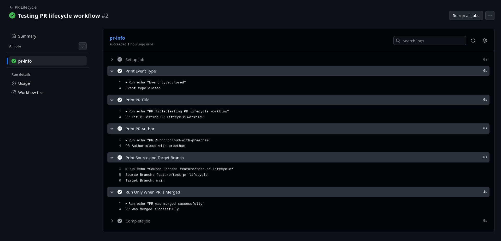
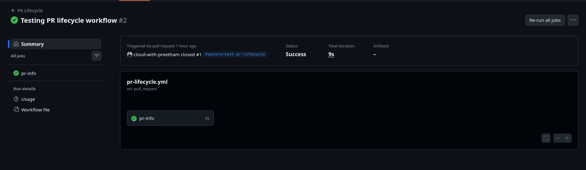

# Day 47 – Advanced Triggers: PR Events, Cron Schedules & Event-Driven Pipelines

## Task 1: Pull Request Lifecycle Workflow

File: `.github/workflows/pr-lifecycle.yml`

```yaml
name: PR Lifecycle

on:
  pull_request:
    types: [opened, synchronize, reopened, closed]

jobs:
  pr-info:
    runs-on: ubuntu-latest

    steps:
      - name: Print Event Type
        run: echo "Event type: ${{ github.event.action }}"

      - name: Print PR Title
        run: echo "PR Title: ${{ github.event.pull_request.title }}"

      - name: Print PR Author
        run: echo "PR Author: ${{ github.event.pull_request.user.login }}"

      - name: Print Source and Target Branch
        run: |
          echo "Source Branch: ${{ github.head_ref }}"
          echo "Target Branch: ${{ github.base_ref }}"

      - name: Run Only When PR is Merged
        if: github.event.pull_request.merged == true
        run: echo "PR was merged successfully"
```

---

## Task 2: PR Validation Workflow

File: `.github/workflows/pr-checks.yml`

```yaml
name: PR Validation

on:
  pull_request:
    branches:
      - main

jobs:
  file-size-check:
    runs-on: ubuntu-latest

    steps:
      - name: Checkout Repository
        uses: actions/checkout@v6
        with:
          fetch-depth: 0

      - name: Check File Size
        run: |
          files=$(git diff --name-only --diff-filter=AMR \
            "${{ github.event.pull_request.base.sha }}" \
            "${{ github.event.pull_request.head.sha }}")

          while IFS= read -r file; do
            [ -z "$file" ] && continue
            [ ! -f "$file" ] && continue

            size=$(wc -c < "$file")
            if [ "$size" -gt 1048576 ]; then
              echo "File $file is larger than 1MB"
              exit 1
            fi
          done <<< "$files"

  branch-name-check:
    runs-on: ubuntu-latest

    steps:
      - name: Validate Branch Name
        run: |
          branch="${{ github.head_ref }}"
          if [[ ! $branch =~ ^(feature|fix|docs)/ ]]; then
            echo "Branch name must start with feature/, fix/, or docs/"
            exit 1
          fi

  pr-body-check:
    runs-on: ubuntu-latest

    steps:
      - name: Check PR Body
        run: |
          body="${{ github.event.pull_request.body }}"
          if [ -z "$body" ]; then
            echo "Warning: PR description is empty"
          fi
```

---

## Task 3: Scheduled Workflows

File: `.github/workflows/scheduled-task.yml`

```yaml
name: Scheduled Tasks

on:
  schedule:
    - cron: '30 2 * * 1'
    - cron: '0 */6 * * *'
  workflow_dispatch:

jobs:
  scheduled-job:
    runs-on: ubuntu-latest

    steps:
      - name: Print Trigger Schedule
        run: echo "Triggered by schedule: ${{ github.event.schedule }}"

      - name: Health Check
        run: |
          response=$(curl -s -o /dev/null -w "%{http_code}" https://example.com)
          echo "HTTP Status: $response"

          if [ "$response" != "200" ]; then
            echo "Health check failed"
            exit 1
          fi
```

### Cron Expressions

Every weekday at 9 AM IST:

```
30 3 * * 1-5
```

First day of every month at midnight:

```
0 0 1 * *
```

### Why Scheduled Workflows May Be Delayed

GitHub scheduled workflows run on shared infrastructure. If a repository is inactive or there is heavy load on GitHub Actions runners, the scheduled workflow may be delayed or skipped. Additionally, scheduled workflows only run on the default branch.

---

## Task 4: Path & Branch Filters

File: `.github/workflows/smart-triggers.yml`

```yaml
name: Smart Triggers

on:
  push:
    branches:
      - main
      - "release/*"
    paths:
      - "src/**"
      - "app/**"

jobs:
  run-if-app-changed:
    runs-on: ubuntu-latest

    steps:
      - name: Run Job
        run: echo "Application code changed"
```

Second workflow ignoring docs changes:

```yaml
name: Ignore Docs Changes

on:
  push:
    paths-ignore:
      - "*.md"
      - "docs/**"

jobs:
  run-if-not-docs:
    runs-on: ubuntu-latest

    steps:
      - run: echo "Non documentation changes detected"
```

### When to Use `paths` vs `paths-ignore`

`paths` is used when you want a workflow to run only when specific files or directories change. `paths-ignore` is used when you want to skip the workflow when certain files (like documentation) change but still run it for everything else.

---

## Task 5: Chaining Workflows Using workflow_run

File: `.github/workflows/tests.yml`

```yaml
name: Run Tests

on:
  push:

jobs:
  tests:
    runs-on: ubuntu-latest

    steps:
      - uses: actions/checkout@v6

      - name: Run Tests
        run: echo "Running tests..."
```

File: `.github/workflows/deploy-after-run.yml`

```yaml
name: Deploy After Tests

on:
  workflow_run:
    workflows: ["Run Tests"]
    types: [completed]

jobs:
  deploy:
    runs-on: ubuntu-latest

    steps:
      - name: Deploy
        if: github.event.workflow_run.conclusion == 'success'
        run: echo "Tests passed. Deploying application..."

      - name: Handle Failure
        if: github.event.workflow_run.conclusion != 'success'
        run: |
          echo "Tests failed. Deployment stopped."
          exit 1
```

### workflow_run vs workflow_call

`workflow_run` triggers a workflow after another workflow completes. It is useful for chaining independent workflows such as running deployment only after tests succeed.

`workflow_call` allows one workflow to directly call another reusable workflow as a job. It is used for modular pipelines where common tasks like build, scan, or deploy are reused across multiple workflows.

---

## Task 6: External Event Trigger (repository_dispatch)

File: `.github/workflows/external-trigger.yml`

```yaml
name: External Trigger

on:
  repository_dispatch:
    types: [deploy-request]

jobs:
  external-deploy:
    runs-on: ubuntu-latest

    steps:
      - name: Print Environment
        run: echo "Deployment requested for ${{ github.event.client_payload.environment }}"
```

Trigger command:

```bash
gh api repos/<owner>/<repo>/dispatches \
  -f event_type=deploy-request \
  -f client_payload='{"environment":"production"}'
```

### When External Systems Trigger Pipelines

External systems such as monitoring tools, chatbots, or incident management platforms can trigger pipelines when specific events occur. For example, a monitoring system may trigger a deployment rollback when a health check fails, or a Slack bot may allow engineers to trigger deployments directly from chat.

---

## Screenshot

### PR Workflow Run



### PR Workflow View



---
