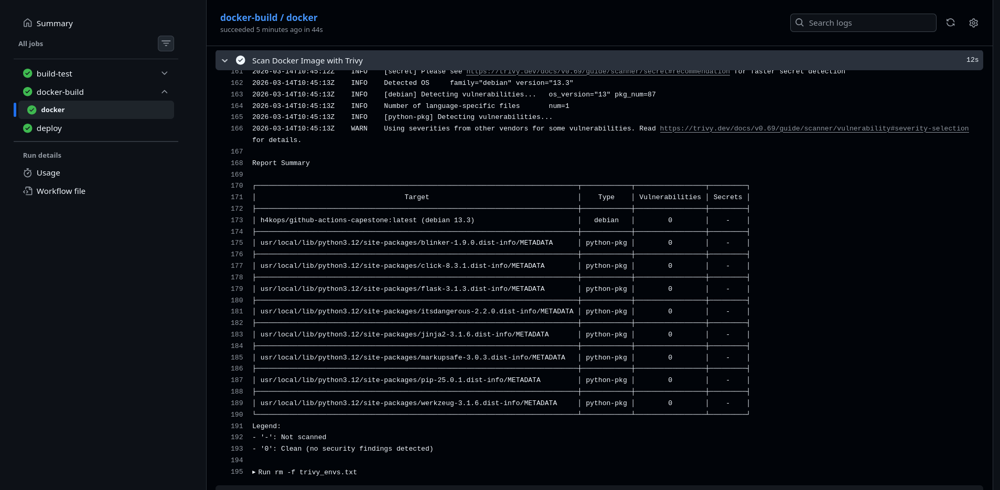
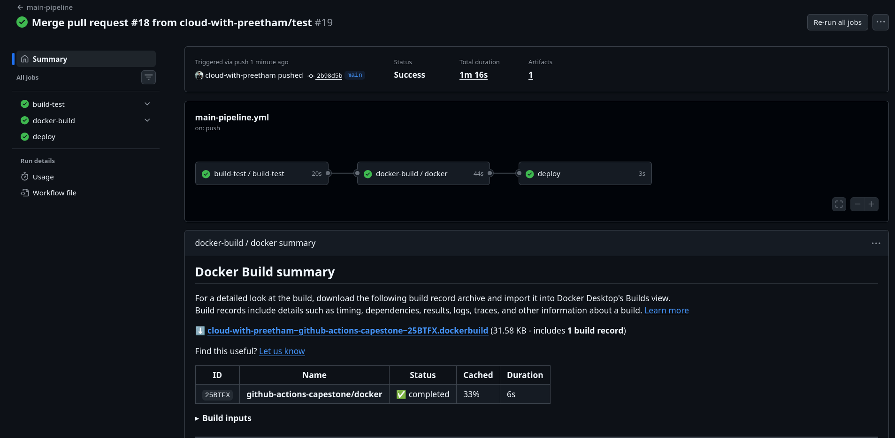
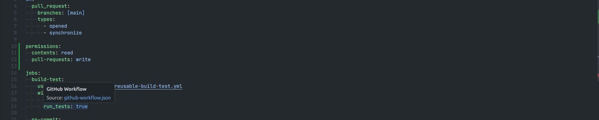
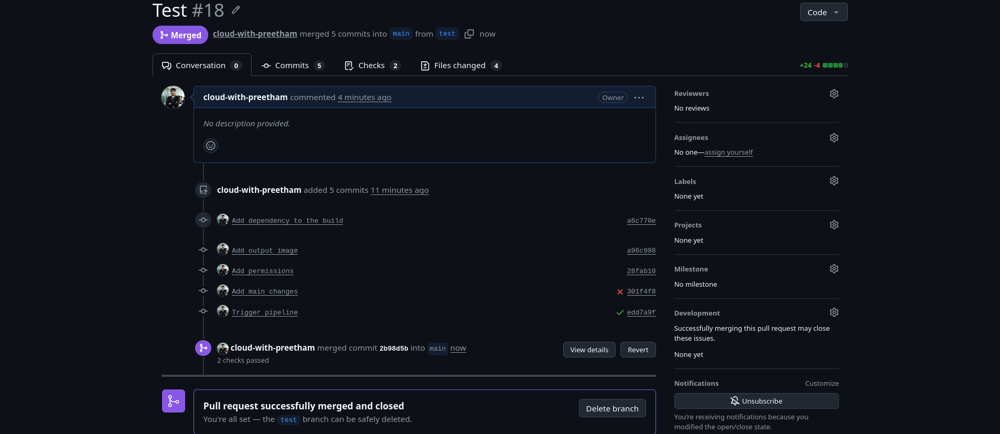

# Day 49 - DevSecOps: Add Security to Your CI/CD Pipeline

## What DevSecOps Means

DevSecOps means adding security checks directly into the CI/CD pipeline instead of treating security as a separate step at the end. The goal is to catch vulnerabilities, risky dependencies, and leaked secrets early so they can be fixed before code reaches production.

## What I Added

I updated the Day 48 GitHub Actions workflows to include the Day 49 security improvements:

- Added a Trivy image scan to the Docker workflow.
- Changed the Docker flow to build first, scan second, and push only after the scan passes.
- Added dependency review to the PR pipeline.
- Added `permissions` blocks to workflows to reduce unnecessary access.

## Trivy Image Scan

The main pipeline now scans the Docker image before it is pushed and deployed.

### Scan behavior

- Scanner: `aquasecurity/trivy-action`
- Severity gate: `CRITICAL,HIGH`
- Exit behavior: fail the workflow if serious vulnerabilities are found
- Image scanned: `h4kops/github-actions-capestone:latest`

### Result

From the Trivy scan output, no security findings were detected in the image. The base image in the Dockerfile is `python:3.12-slim`, and the scan output shows the OS layer as Debian 13.3. The Python packages that were checked also showed `0` vulnerabilities in the captured run.



## Dependency Review in PRs

The pull request pipeline now includes `actions/dependency-review-action@v4`. This checks newly introduced dependencies in a PR and fails the workflow if a dependency with a critical vulnerability is added.

### Why this matters

- It catches insecure packages before merge.
- It protects the main branch from risky dependency upgrades.
- It gives security feedback during code review, not after deployment.

## Secret Scanning and Push Protection

GitHub secret scanning and push protection are configured from the repository settings, not from the workflow YAML files.

### What I learned

- **Secret scanning** looks through the repository and alerts you if a secret has already been committed.
- **Push protection** blocks the push before the secret reaches the repository, if GitHub detects a supported secret pattern.
- If GitHub detects a leaked AWS key, the correct response is to treat it as compromised immediately, revoke or rotate it, and remove it from the codebase and Git history if needed.

## Workflow Permissions

I added `permissions` blocks to reduce the default access level of workflows.

### Why this is important

If a third-party action is compromised and the workflow has broad write access, it could modify code, comments, or repository settings. Limiting permissions follows the principle of least privilege and reduces the impact of a supply-chain issue.

## Secure Pipeline Diagram

```text
Pull Request Opened
  -> Build and Test
  -> Dependency Review
  -> PR checks pass or fail

Merge to Main
  -> Build and Test
  -> Build Docker Image
  -> Trivy Security Scan
  -> Push Docker Image
  -> Deploy

Always Active
  -> GitHub Secret Scanning
  -> Push Protection
```



## Extra Evidence

### PR workflow and permissions



### PR check / merge result



## Key Takeaways

- Security should run inside the pipeline, not outside it.
- Container images should be scanned before push and deploy.
- Dependency review is especially useful for PR-based workflows.
- Secret scanning and push protection help prevent accidental credential leaks.
- Limiting workflow permissions is a simple but important security improvement.

## Conclusion

Day 49 turned the CI/CD pipeline into a more secure DevSecOps pipeline. Now the workflow checks Docker images for vulnerabilities, reviews dependencies during PRs, limits workflow permissions, and works alongside GitHub secret scanning to catch security problems earlier.
