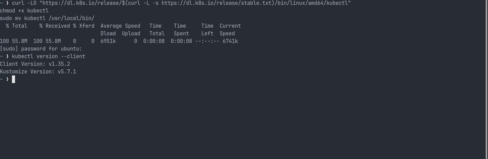
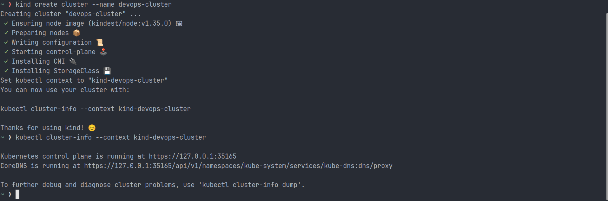
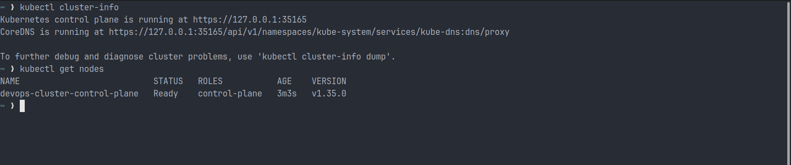
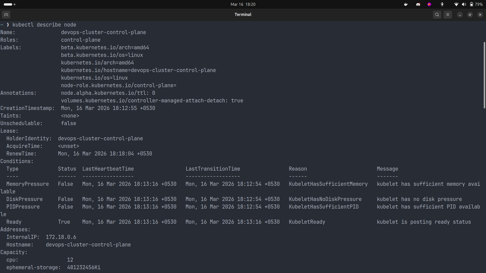
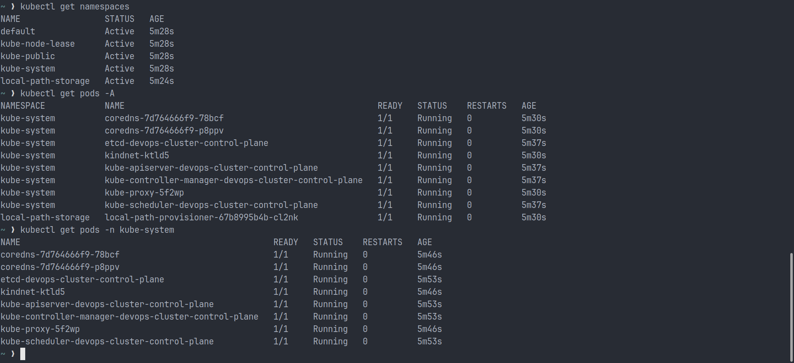
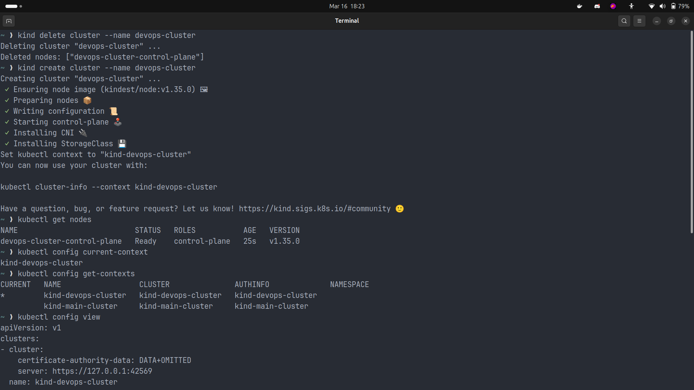
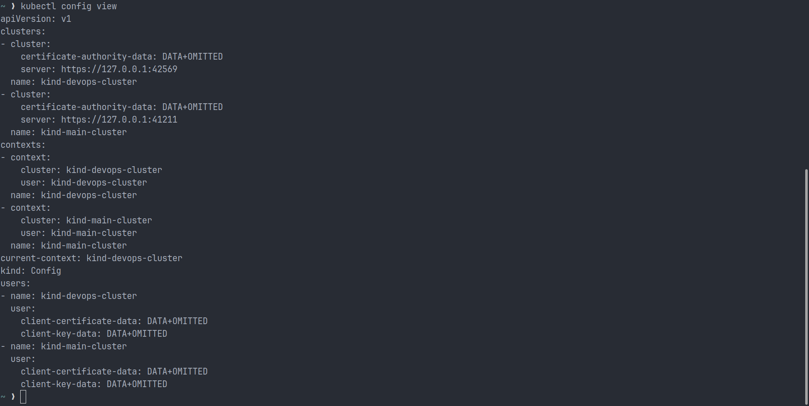

# Day 50 - Kubernetes Architecture and Cluster Setup

## Overview

Today I started learning Kubernetes, the platform used to manage containers across multiple machines. Docker is excellent for building and running containers, but Kubernetes solves the bigger problem of orchestration: scheduling, scaling, self-healing, service discovery, and managing workloads across a cluster. This day helped me move from container basics into real-world container operations.

## Task 1 - The Kubernetes Story

### What I remembered first

Kubernetes was created because Docker alone is not enough when applications need to run across many servers. Docker can start containers, but it does not manage cluster-wide scheduling, scaling, automatic recovery, or service networking by itself. Kubernetes was created by Google and inspired by Google's internal Borg system. The word "Kubernetes" means "helmsman" or "pilot," which fits its role in steering containerized applications.

### After verification

After reviewing the official Kubernetes documentation, my understanding was correct. Kubernetes is an open-source container orchestration platform that automates deployment, scaling, and operations for containerized applications. It was open-sourced by Google and built using ideas proven through Borg.

## Task 2 - Kubernetes Architecture

### Architecture Diagram

```text
+----------------------------------------------------------------------------------+
|                           KUBERNETES ARCHITECTURE                                |
|                                                                         [KUBECTL]|
|                                                                              |   |
|  +-------------------------- KUBERNETES CLUSTER ---------------------------+  |   |
|  |                                                                        |  |   |
|  |  +--------------------------- MASTER NODE ---------------------------+  |  |   |
|  |  |                                                                  |  |  |   |
|  |  |          +---------------+                                       |  |  |   |
|  |  |          |   SCHEDULER   |                                       |  |  |   |
|  |  |          +---------------+                                       |  |  |   |
|  |  |                  ^                                               |  |  |   |
|  |  |                  |                                               |  |  |   |
|  |  |   +------+   +----------------+                                  |  |  |   |
|  |  |   | etcd |<->|   API SERVER   |<---------------------------+     |<-+  |   |
|  |  |   +------+   +----------------+                            |     |     |   |
|  |  |                  |                                         |     |     |   |
|  |  |                  v                                         |     |     |   |
|  |  |      +---------------------------+                         |     |     |   |
|  |  |      |     CONTROLLER MANAGER    |                         |     |     |   |
|  |  |      +---------------------------+                         |     |     |   |
|  |  |                                                                  |     |   |
|  |  +------------------------------------------------------------------+     |   |
|  |                                                                         +--+--+
|  |                                                                         |     |
|  |                  +------------------------ WORKER NODE ----------------+ |     |
|  |                  |                                                     | |     |
|  |                  |                +---------------+                    | |     |
|  |                  |                |    KUBELET    |                    | |     |
|  |                  |                +---------------+                    | |     |
|  |                  |                     |                               | |     |
|  |                  |              +-------------+                        | |     |
|  |                  |              | PODS / APP  |                        | |     |
|  |                  |              +-------------+                        | |     |
|  |                  |                                                     | |     |
|  |                  |         +-------------------------+                 | |     |
|  |                  |         |      SERVICE PROXY      |-----------------+-+--> [USER]
|  |                  |         +-------------------------+                 |       |
|  |                  +-----------------------------------------------------+       |
|  |                                                                                 |
|  +---------------------------------------------------------------------------------+
|
| <--------------------- CONTAINER NETWORKING INTERFACE (CNI) ---------------------->
+----------------------------------------------------------------------------------+
```

### Core Components

| Component                 | Role                                                     |
| ------------------------- | -------------------------------------------------------- |
| `kube-apiserver`          | Front door of the cluster; every command goes through it |
| `etcd`                    | Stores all cluster state                                 |
| `kube-scheduler`          | Decides which node should run a new pod                  |
| `kube-controller-manager` | Makes sure actual state matches desired state            |
| `kubelet`                 | Node agent that manages pods on the worker node          |
| `kube-proxy`              | Handles service networking rules                         |
| `container runtime`       | Runs the actual containers                               |

### What Happens When I Run `kubectl apply -f pod.yaml`

1. `kubectl` sends the manifest to the `kube-apiserver`.
2. The API server validates the request and stores the desired state in `etcd`.
3. The scheduler selects a worker node for the new pod.
4. The kubelet on that node receives the assignment.
5. The container runtime pulls the image and starts the containers.
6. `kube-proxy` updates networking rules so the pod can communicate.
7. Controllers keep checking that the cluster stays in the desired state.

### Failure Scenarios

**If the API server goes down:**
New cluster management operations stop working because all control requests pass through the API server. Existing pods may continue running for some time, but the cluster cannot be managed properly until the API server is back.

**If a worker node goes down:**
The pods on that node become unavailable. Kubernetes detects the failure and, if the workload is managed by a Deployment or ReplicaSet, tries to recreate those pods on a healthy node.

## Task 3 - Install and Verify `kubectl`

`kubectl` is the CLI tool used to communicate with the Kubernetes cluster.

### Installation Commands

```bash
curl -LO "https://dl.k8s.io/release/$(curl -L -s https://dl.k8s.io/release/stable.txt)/bin/linux/amd64/kubectl"
chmod +x kubectl
sudo mv kubectl /usr/local/bin/
```

### Verification

```bash
kubectl version --client
```

In my setup, `kubectl` was installed successfully and the screenshot shows:

- Client Version: `v1.35.2`
- Kustomize Version: `v5.7.1`



## Task 4 - Set Up a Local Kubernetes Cluster

### Tool I Chose

I chose `kind` because it is lightweight and creates Kubernetes clusters using Docker containers. It is perfect for practice on a local machine and gives a real Kubernetes environment without needing a cloud provider.

### Cluster Setup Commands

```bash
kind create cluster --name devops-cluster
kubectl cluster-info
kubectl get nodes
```

### Cluster Verification

The cluster came up successfully, and the control plane node entered the `Ready` state.

- Cluster endpoint: `https://127.0.0.1:35165`
- Node name: `devops-cluster-control-plane`
- Role: `control-plane`
- Kubernetes version: `v1.35.0`




## Task 5 - Explore the Cluster

### Commands Used

```bash
kubectl cluster-info
kubectl get nodes
kubectl describe node <node-name>
kubectl get namespaces
kubectl get pods -A
kubectl get pods -n kube-system
```

### What I Observed

The cluster was healthy and the core Kubernetes system components were running in the `kube-system` namespace. I could also see all namespaces and inspect the node in more detail using `kubectl describe node`.

### `kube-system` Pods and Their Purpose

| Pod / Component           | Purpose                                     |
| ------------------------- | ------------------------------------------- |
| `etcd`                    | Stores the cluster state                    |
| `kube-apiserver`          | Exposes the Kubernetes API                  |
| `kube-scheduler`          | Schedules pods onto nodes                   |
| `kube-controller-manager` | Reconciles actual state with desired state  |
| `coredns`                 | Provides internal DNS for services and pods |
| `kube-proxy`              | Handles cluster networking rules            |
| `kindnet`                 | Provides pod networking in a kind cluster   |

### Pods Seen in My Cluster

- `coredns-7d764666f9-78bcf`
- `coredns-7d764666f9-p8ppv`
- `etcd-devops-cluster-control-plane`
- `kindnet-ktld5`
- `kube-apiserver-devops-cluster-control-plane`
- `kube-controller-manager-devops-cluster-control-plane`
- `kube-proxy-5f2wp`
- `kube-scheduler-devops-cluster-control-plane`

### Mapping Running Pods to the Architecture Diagram

- `kube-apiserver` matches the API Server in the control plane.
- `etcd` matches the cluster state database.
- `kube-scheduler` matches the scheduling component.
- `kube-controller-manager` matches the controller process that keeps the cluster stable.
- `kube-proxy` matches the networking component on the worker side.
- `coredns` supports service discovery inside the cluster.
- `kindnet` provides networking for the local kind environment.







## Task 6 - Cluster Lifecycle and kubeconfig

### Lifecycle Commands

```bash
kind delete cluster --name devops-cluster
kind create cluster --name devops-cluster
kubectl get nodes
```

### kubeconfig Commands

```bash
kubectl config current-context
kubectl config get-contexts
kubectl config view
```

### What Is kubeconfig?

A kubeconfig file stores information about clusters, users, and contexts. It tells `kubectl` which cluster to connect to and which credentials to use. The default location is:

```text
~/.kube/config
```

### What I Saw in My kubeconfig

My current context was `kind-devops-cluster`. I also had another context named `kind-main-cluster`, which shows that one kubeconfig file can store multiple cluster connections.





## Required Screenshots

### `kubectl get nodes`


### `kubectl get pods -n kube-system`


## Key Learnings

- Kubernetes solves orchestration problems that Docker alone does not solve.
- The control plane manages decisions, scheduling, and cluster state.
- Worker nodes run the actual workloads.
- `kubectl` communicates with the API server, not directly with the containers.
- Kubernetes components can be seen running as pods inside the cluster.

## Conclusion

Day 50 gave me a strong introduction to Kubernetes architecture, local cluster setup, and cluster exploration. I learned how the control plane and worker node components work together, how to inspect a cluster using `kubectl`, and how important components like `etcd`, `kube-apiserver`, and `kube-scheduler` appear inside the `kube-system` namespace. This was my first real step into Kubernetes orchestration.

## References

- Kubernetes Overview: https://kubernetes.io/docs/concepts/overview/what-is-kubernetes/
- Kubernetes Components: https://kubernetes.io/docs/concepts/overview/components/
