# Day 51 - Kubernetes Manifests and Your First Pods

## Overview

Today I learned how Kubernetes resources are defined with YAML manifests and how Pods are created and managed using `kubectl`. I created three Pod manifests by hand, verified the running containers, compared imperative and declarative approaches, validated manifests using dry-run, and worked with labels for filtering.

Note: the task examples in `README.md` use `.yaml`, but in this folder I saved the manifests as `.yml`.

---

## Kubernetes Manifest Structure

Every Kubernetes resource is defined using four main top-level fields:

- `apiVersion` - specifies the Kubernetes API version
- `kind` - defines the resource type
- `metadata` - contains identifying information like name and labels
- `spec` - defines the desired state of the resource

Example manifest:

```yaml
apiVersion: v1
kind: Pod
metadata:
  name: nginx-pod
  labels:
    app: nginx
spec:
  containers:
    - name: nginx-container
      image: nginx:latest
      ports:
        - containerPort: 80
```

---

## Task 1: Create Your First Pod (Nginx)

I created an Nginx Pod using the `nginx-pod.yml` manifest:

```yaml
kind: Pod
apiVersion: v1
metadata:
  name: nginx-pod
  labels:
    app: nginx
spec:
  containers:
    - name: nginx-container
      image: nginx:latest
      ports:
        - containerPort: 80
```

Commands used:

```bash
kubectl apply -f nginx-pod.yml
kubectl get pods
kubectl describe pod nginx-pod
kubectl logs nginx-pod
kubectl exec -it nginx-pod -- /bin/bash
curl localhost:80
```

Result:

- The `nginx-pod` reached `Running` status.
- `kubectl describe` showed the container details and Pod events.
- `kubectl logs` returned the Nginx startup logs.
- `curl localhost:80` from inside the container returned the Nginx welcome page.

### Screenshots

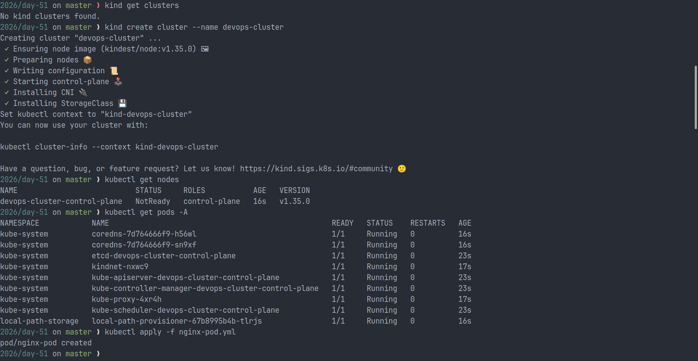
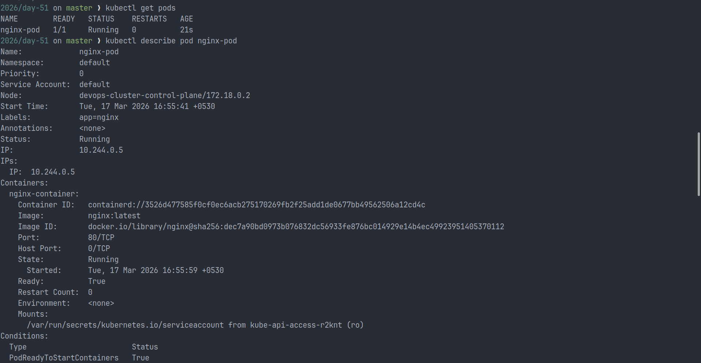
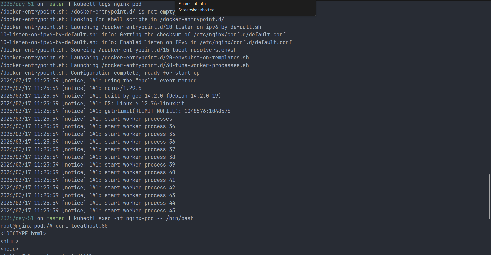
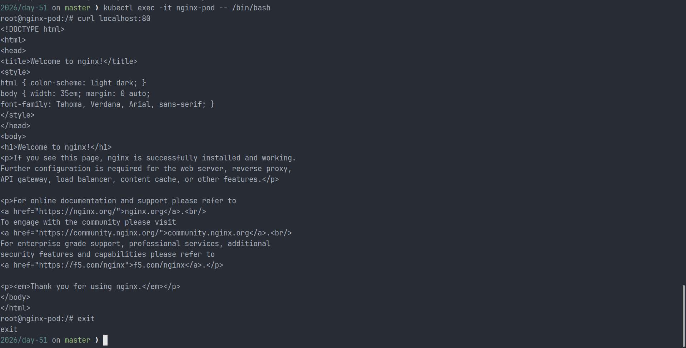
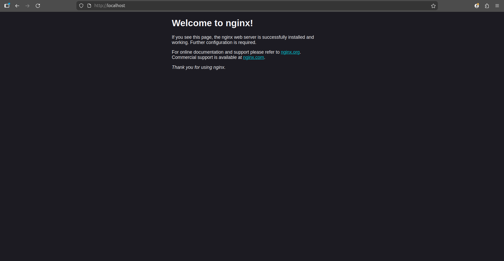

---

## Task 2: Create a Custom Pod (BusyBox)

I created a BusyBox Pod using a custom command so the container would stay alive:

```yaml
kind: Pod
apiVersion: v1
metadata:
  name: busybox-pod
  labels:
    app: busybox
    environment: dev
spec:
  containers:
    - name: busybox-container
      image: busybox:latest
      command:
        - sh
        - -c
        - "echo Hello from Busybox && sleep 3600"
```

Commands used:

```bash
kubectl apply -f busybox-pod.yml
kubectl logs busybox-pod
```

Result:

- The first log check showed the container was still starting.
- After the Pod became ready, the logs printed `Hello from Busybox`.
- The custom `sleep 3600` command kept the container running.

### Screenshot

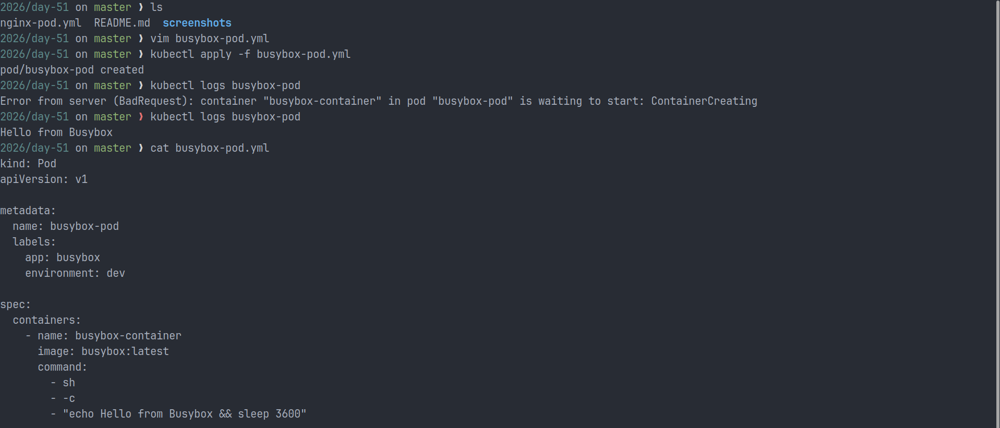

---

## Task 3: Imperative vs Declarative

I also created a Pod imperatively to compare both approaches:

```bash
kubectl run redis-pod --image=redis:latest
kubectl get pod redis-pod -o yaml
kubectl run test-pod --image=nginx --dry-run=client -o yaml
```

### What I Observed

- Declarative workflow uses manifest files such as `nginx-pod.yml`, `busybox-pod.yml`, and `labels-pod.yml`.
- Imperative workflow creates resources directly from the command line.
- Both approaches contain the same core structure: `apiVersion`, `kind`, `metadata`, and `spec`.
- The YAML generated by Kubernetes includes extra runtime and system-managed fields such as timestamps, resource version, UID, and status details.

### Screenshots

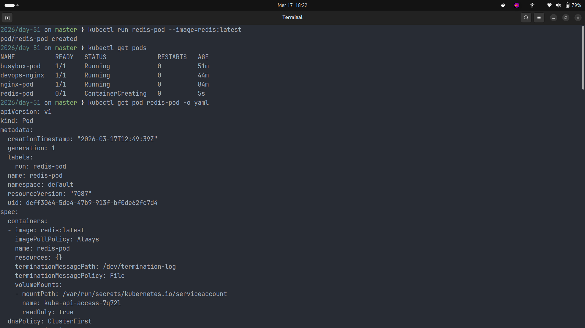
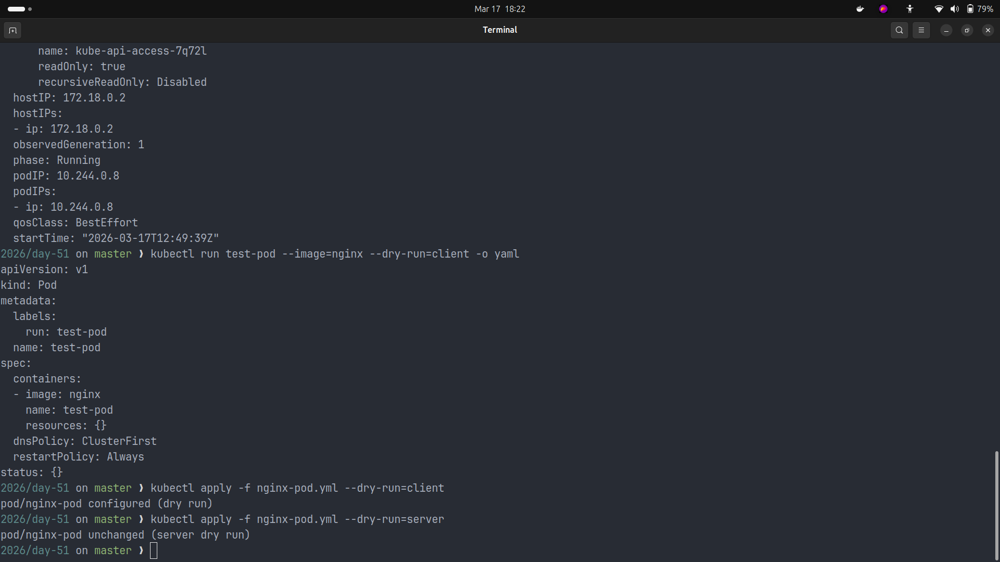

---

## Task 4: Validate Before Applying

I validated the manifest before applying it:

```bash
kubectl apply -f nginx-pod.yml --dry-run=client
kubectl apply -f nginx-pod.yml --dry-run=server
```

Result:

- `--dry-run=client` checked the manifest syntax locally.
- `--dry-run=server` validated it against the Kubernetes API server.
- If the `image` field is removed, Kubernetes reports that the container image is required.

Example validation error:

```text
spec.containers[0].image: Required value
```

### Screenshot

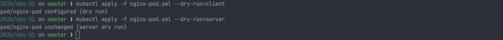

---

## Task 5: Pod Labels and Filtering

To practice labels, I created a third Pod with multiple labels:

```yaml
kind: Pod
apiVersion: v1
metadata:
  name: devops-nginx
  labels:
    app: nginx
    environment: dev
    team: devops
spec:
  containers:
    - name: nginx
      image: nginx:latest
      ports:
        - containerPort: 80
```

Commands used:

```bash
kubectl apply -f labels-pod.yml
kubectl get pods --show-labels
kubectl get pods -l app=nginx
kubectl get pods -l environment=dev
kubectl get pods -l team=devops
kubectl label pod nginx-pod environment=production
kubectl get pods --show-labels
kubectl label pod nginx-pod environment-
```

Result:

- I successfully created a third Pod with `app`, `environment`, and `team` labels.
- Label selectors helped filter Pods by their metadata.
- I was also able to add and remove labels from an existing Pod.

### Screenshots

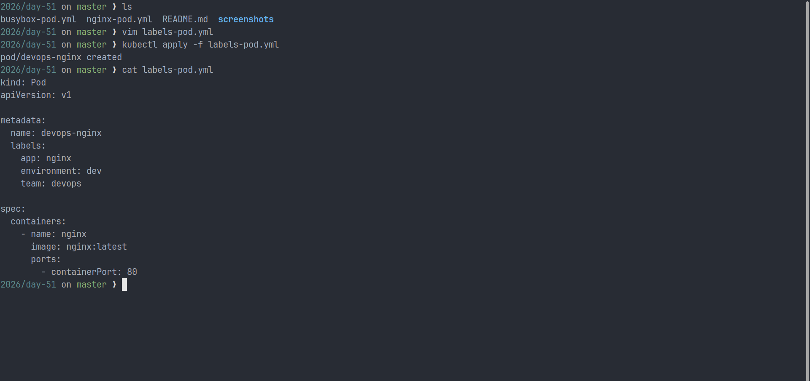
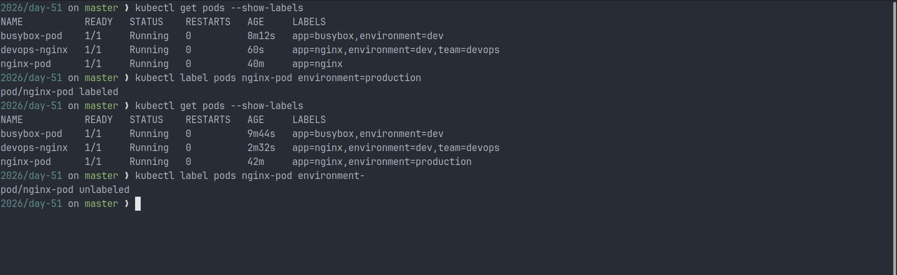

---

## Running Pods

The README asks for a screenshot of running Pods. Here is the output of `kubectl get pods -o wide` showing all Pods in the `Running` state:

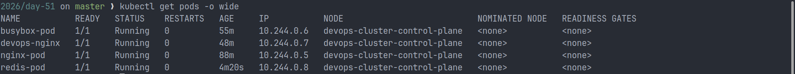

---

## Task 6: Clean Up

After completing the exercises, I removed the Pods:

```bash
kubectl delete pod nginx-pod
kubectl delete pod busybox-pod
kubectl delete pod redis-pod
kubectl delete pod devops-nginx
kubectl get pods
```

Result:

- All standalone Pods were deleted successfully.
- `kubectl get pods` returned `No resources found in default namespace.`
- Since these were standalone Pods, Kubernetes did not recreate them automatically.

### Screenshot


---

## Key Learnings

- Kubernetes manifests are built around `apiVersion`, `kind`, `metadata`, and `spec`.
- Pods can be created either declaratively with YAML or imperatively with `kubectl run`.
- Labels help organize and filter resources.
- Dry-run validation helps catch manifest issues before deployment.
- Standalone Pods are not recreated automatically after deletion because no controller manages them.

---

## Conclusion

This task helped me understand how Kubernetes Pods are defined, created, inspected, validated, labeled, and deleted. It also gave me hands-on experience with both manifest-based and command-based workflows.

#90DaysOfDevOps
#Kubernetes
#DevOpsKaJosh
#TrainWithShubham
