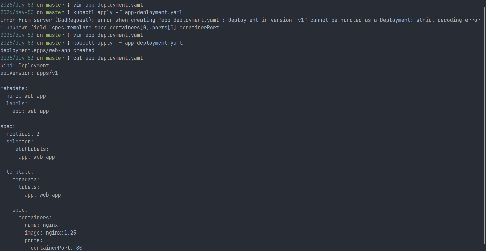
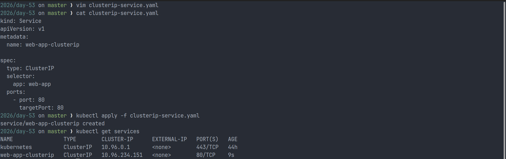
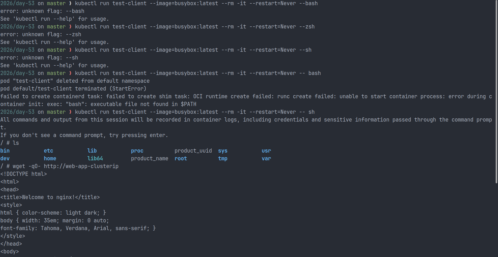
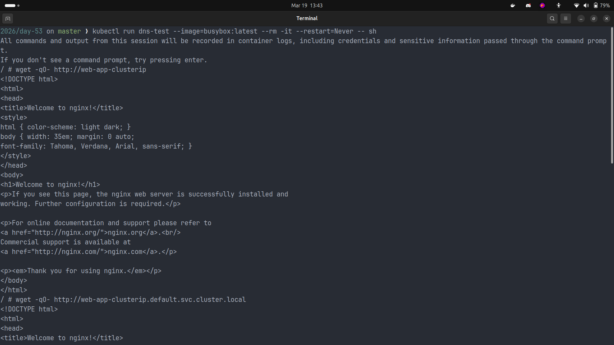
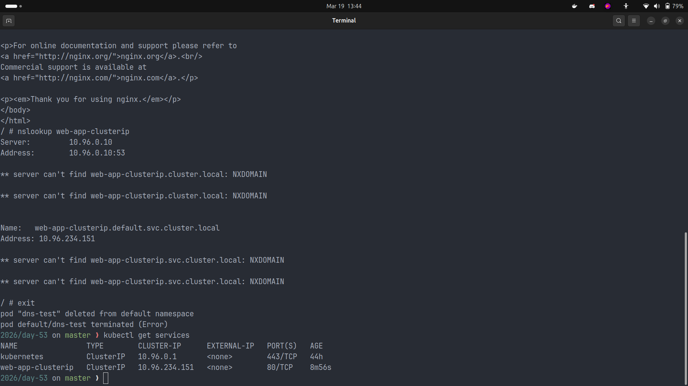
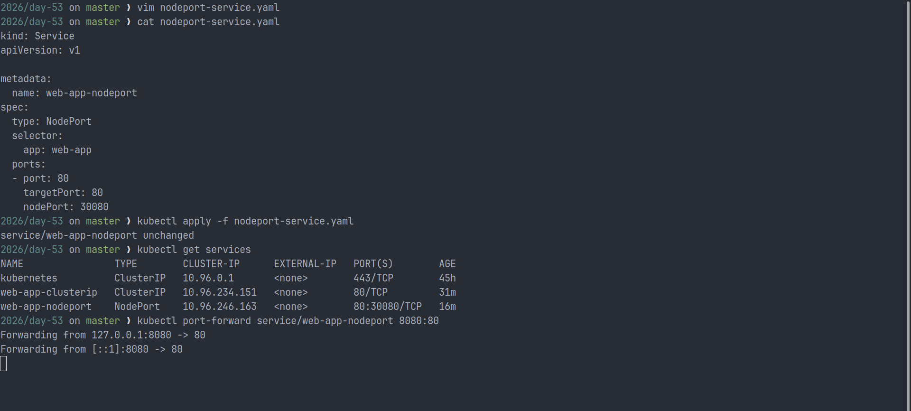
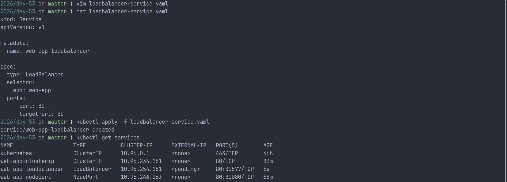
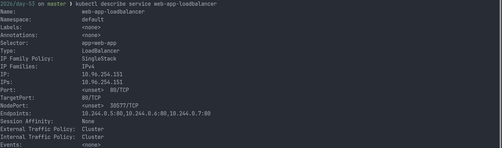
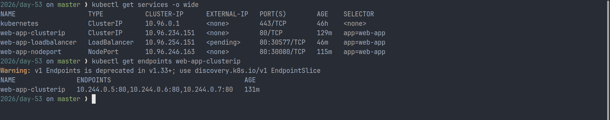
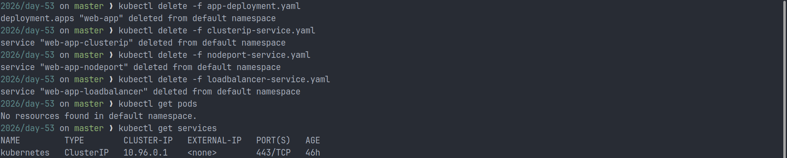

# Day 53 - Kubernetes Services

## Overview

This lab focused on exposing a replicated application through Kubernetes Services. Since Pods are ephemeral and their IP addresses can change when they restart or are replaced, direct Pod-to-Pod communication is not reliable for real workloads.

To solve that, I deployed an Nginx application with three replicas and exposed it using the three primary Kubernetes Service types:

- `ClusterIP` for internal-only communication
- `NodePort` for node-level external access
- `LoadBalancer` for cloud-based external access

Along the way, I also verified Kubernetes DNS, inspected service backends, and compared how each Service type fits different deployment scenarios.

---

## Objectives Achieved

- Created a Deployment with 3 Nginx replicas
- Exposed the Deployment using `ClusterIP`, `NodePort`, and `LoadBalancer`
- Verified in-cluster communication using a temporary BusyBox Pod
- Tested DNS-based service discovery
- Inspected `Endpoints` and `EndpointSlices`
- Documented the work with screenshot evidence

---

## Lab Files

| File                        | Purpose                                                  |
| --------------------------- | -------------------------------------------------------- |
| `app-deployment.yaml`       | Deploys the sample Nginx application with three replicas |
| `clusterip-service.yaml`    | Creates an internal-only Service                         |
| `nodeport-service.yaml`     | Exposes the application on port `30080`                  |
| `loadbalancer-service.yaml` | Simulates production-style external exposure             |

---

## Why Kubernetes Services Matter

Pods are designed to be disposable. That is useful for self-healing and scaling, but it creates a networking problem:

- Pod IPs are not permanent
- Deployments can create multiple Pod replicas
- Clients need a stable way to reach the application

A Kubernetes Service provides that stable access layer by offering:

- A consistent virtual IP
- A DNS name inside the cluster
- Built-in load balancing across matching Pods

---

## Task 1: Deploy the Application

I first created a Deployment named `web-app` with three Nginx replicas. This gave me a set of Pods that could later be exposed through different Service types.

### Manifest

```yaml
kind: Deployment
apiVersion: apps/v1
metadata:
  name: web-app
  labels:
    app: web-app
spec:
  replicas: 3
  selector:
    matchLabels:
      app: web-app
  template:
    metadata:
      labels:
        app: web-app
    spec:
      containers:
        - name: nginx
          image: nginx:1.25
          ports:
            - containerPort: 80
```

### Commands Used

```bash
kubectl apply -f app-deployment.yaml
kubectl get pods -o wide
```

### Result

- The Deployment created three running Pods
- Each Pod received its own IP address
- Those Pod IPs are not stable enough to use as a permanent application endpoint

### Screenshots




---

## Task 2: Create a ClusterIP Service

`ClusterIP` is the default Kubernetes Service type. It exposes an application on an internal virtual IP so other workloads inside the cluster can reach it reliably.

### Manifest

```yaml
kind: Service
apiVersion: v1
metadata:
  name: web-app-clusterip
spec:
  type: ClusterIP
  selector:
    app: web-app
  ports:
    - port: 80
      targetPort: 80
```

### Commands Used

```bash
kubectl apply -f clusterip-service.yaml
kubectl get services
kubectl run test-client --image=busybox --rm -it --restart=Never -- sh
wget -qO- http://web-app-clusterip
```

### Result

- The Service received a stable internal `CLUSTER-IP`
- Traffic sent to `web-app-clusterip` was forwarded to the Nginx Pods
- The selector `app: web-app` linked the Service to the Deployment Pods

### Screenshots





---

## Task 3: Verify DNS-Based Service Discovery

Kubernetes automatically creates DNS records for Services, which means workloads can communicate using service names instead of IP addresses.

The standard DNS format is:

```text
<service-name>.<namespace>.svc.cluster.local
```

For this lab, both of the following resolved to the same Service:

- `web-app-clusterip`
- `web-app-clusterip.default.svc.cluster.local`

### Commands Used

```bash
kubectl run dns-test --image=busybox --rm -it --restart=Never -- sh
wget -qO- http://web-app-clusterip
wget -qO- http://web-app-clusterip.default.svc.cluster.local
nslookup web-app-clusterip
```

### Result

- The short Service name worked within the same namespace
- The fully qualified DNS name also resolved correctly
- `nslookup` confirmed the DNS record pointed to the Service rather than an individual Pod

### Screenshots




---

## Task 4: Expose the Application with NodePort

`NodePort` exposes the application on a port on every cluster node. This makes the Service reachable from outside the cluster using `<NodeIP>:<NodePort>`.

### Manifest

```yaml
kind: Service
apiVersion: v1
metadata:
  name: web-app-nodeport
spec:
  type: NodePort
  selector:
    app: web-app
  ports:
    - port: 80
      targetPort: 80
      nodePort: 30080
```

### Commands Used

```bash
kubectl apply -f nodeport-service.yaml
kubectl get services
curl http://localhost:30080
```

### Result

- The application became reachable through port `30080`
- `NodePort` provided a simple way to test external access in a local environment
- The request still flowed through the Service before reaching a backend Pod

### Screenshots




---

## Task 5: Create a LoadBalancer Service

`LoadBalancer` is typically used in managed cloud environments where Kubernetes can provision an external load balancer automatically.

### Manifest

```yaml
kind: Service
apiVersion: v1
metadata:
  name: web-app-loadbalancer
spec:
  type: LoadBalancer
  selector:
    app: web-app
  ports:
    - port: 80
      targetPort: 80
```

### Commands Used

```bash
kubectl apply -f loadbalancer-service.yaml
kubectl get services
```

### Result

- The Service was created successfully
- In a local cluster, the `EXTERNAL-IP` remained `<pending>`, which is expected without a cloud provider
- In a cloud environment, this Service type would provision a public load balancer automatically

### Screenshots




---

## Task 6: Compare Service Types and Inspect Backends

After creating all three Services, I compared them side by side and inspected the backend endpoints that power service routing.

### Service Type Comparison

| Type           | Access Scope                      | Typical Use Case                           |
| -------------- | --------------------------------- | ------------------------------------------ |
| `ClusterIP`    | Inside the cluster only           | Service-to-service communication           |
| `NodePort`     | Outside via `<NodeIP>:<NodePort>` | Local development and testing              |
| `LoadBalancer` | Outside via cloud load balancer   | Production traffic in managed environments |

### Commands Used

```bash
kubectl get services -o wide
kubectl describe service web-app-loadbalancer
kubectl get endpoints web-app-clusterip
kubectl get endpointslices
```

### Result

- `LoadBalancer` builds on top of `NodePort` and `ClusterIP`
- `Endpoints` showed the real Pod IPs receiving traffic from the Service
- `EndpointSlice` provides the newer and more scalable backend representation

Example endpoint output:

```text
10.244.0.5:80,10.244.0.6:80,10.244.0.7:80
```

### Screenshot



---

## Key Observations

- Services solve the instability of direct Pod IP communication
- DNS makes internal service discovery straightforward
- Label selectors are critical because Services only route to matching Pods
- `NodePort` is useful for local access, while `LoadBalancer` is designed for cloud-native exposure
- Service backends can be inspected through `Endpoints` and `EndpointSlices`

---

## Task 7: Clean Up Resources

After verification, I removed the Deployment and all three Services:

```bash
kubectl delete -f app-deployment.yaml
kubectl delete -f clusterip-service.yaml
kubectl delete -f nodeport-service.yaml
kubectl delete -f loadbalancer-service.yaml
```

Optional verification:

```bash
kubectl get pods
kubectl get services
```

At the end of the cleanup, only the default Kubernetes service should remain in the namespace.

### Screenshot



---

## Conclusion

This exercise demonstrated how Kubernetes Services provide stable networking for dynamic workloads. By creating `ClusterIP`, `NodePort`, and `LoadBalancer` Services for the same Deployment, I was able to understand how Kubernetes handles internal communication, external access, service discovery, and traffic distribution.

These networking primitives are essential for building reliable and scalable applications on Kubernetes.
