# Day 54 - Kubernetes ConfigMaps and Secrets

## Overview

Kubernetes applications often need configuration such as application settings, database details, feature flags, and credentials. Storing these values directly inside container images is not a good practice because every change would require rebuilding and redeploying the image.

Kubernetes solves this with two resources:

- **ConfigMaps** for non-sensitive configuration
- **Secrets** for sensitive information

These resources help keep configuration separate from application code and container images.

---

## What Are ConfigMaps and Secrets?

### ConfigMaps

ConfigMaps store non-sensitive data in key-value form or as complete configuration files.

Common use cases:

- Application environment variables
- Nginx or Apache configuration files
- Feature flags
- Service URLs and ports

### Secrets

Secrets store sensitive information that should not be exposed in plain text configuration.

Common use cases:

- Database usernames and passwords
- API keys
- Access tokens
- SSH keys and certificates

---

## Task 1 - Create a ConfigMap from Literals

I created a ConfigMap named `app-config` using literal key-value pairs:

```bash
kubectl create configmap app-config --from-literal=APP_ENV=production --from-literal=APP_DEBUG=false --from-literal=APP_PORT=8080
```

### Verification

```bash
kubectl describe configmap app-config
kubectl get configmap app-config -o yaml
```

This confirms that all three values are stored inside the ConfigMap as plain text.

### Actual Output

```text
$ kubectl create configmap app-config --from-literal=APP_ENV=production --from-literal=APP_DEBUG=false --from-literal=APP_PORT=8080
configmap/app-config created

$ kubectl describe configmap app-config
Name:         app-config
Namespace:    default
Labels:       <none>
Annotations:  <none>

Data
====
APP_DEBUG:
----
false

APP_ENV:
----
production

APP_PORT:
----
8080

BinaryData
====

Events:  <none>

$ kubectl get configmap app-config -o yaml
apiVersion: v1
data:
  APP_DEBUG: "false"
  APP_ENV: production
  APP_PORT: "8080"
kind: ConfigMap
metadata:
  creationTimestamp: "2026-03-23T06:01:07Z"
  name: app-config
  namespace: default
  resourceVersion: "33653"
  uid: c3b761be-0f96-48bd-9ed7-3fcfbcc48f08
```

### Screenshots

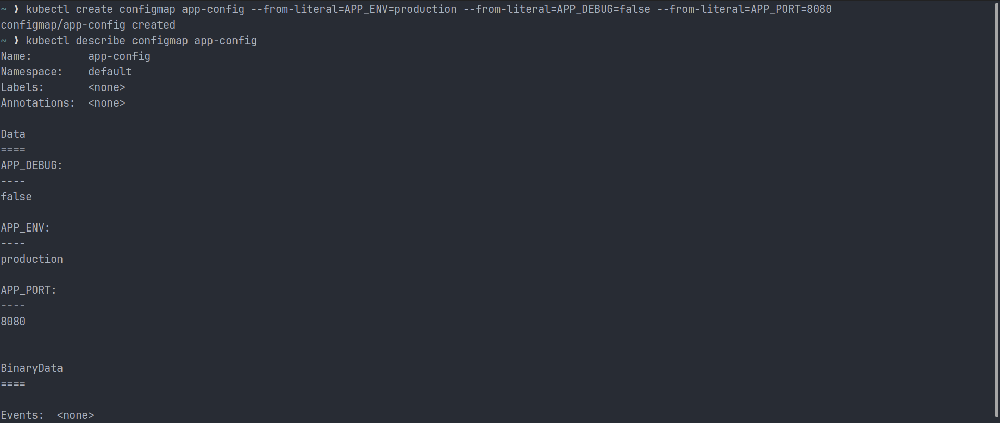
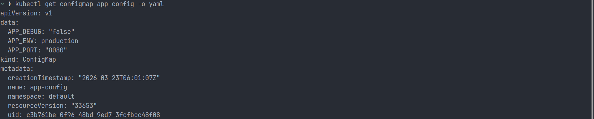

---

## Task 2 - Create a ConfigMap from a File

For this task, a custom Nginx configuration file was used to expose a `/health` endpoint.

### Example Nginx Configuration

```nginx
server {
    listen 80;

    location /health {
        return 200 'healthy';
        add_header Content-Type text/plain;
    }
}
```

### Create the ConfigMap

```bash
kubectl create configmap nginx-config --from-file=default.conf=default.conf
```

### Verification

```bash
kubectl get configmap nginx-config -o yaml
```

Here, `default.conf` becomes the key in the ConfigMap and the mounted filename inside the Pod.

### Actual Output

```text
$ cat default.conf
server {
        listen 80;
        location /health {
                return 200 'healthy';
                add_header Content-Type text/plain;
        }
}

$ kubectl create configmap nginx-config --from-file=default.conf=default.conf
configmap/nginx-config created

$ kubectl get configmap nginx-config -o yaml
apiVersion: v1
data:
  default.conf: "server {\n\tlisten 80;\n\tlocation /health {\n\t\treturn 200 'healthy';\n\t\tadd_header
    Content-Type text/plain;\n\t}\n}\n"
kind: ConfigMap
metadata:
  creationTimestamp: "2026-03-23T06:12:24Z"
  name: nginx-config
  namespace: default
  resourceVersion: "34533"
  uid: ee3baaa6-6d0e-4da3-b571-285193985032
```

### Screenshot

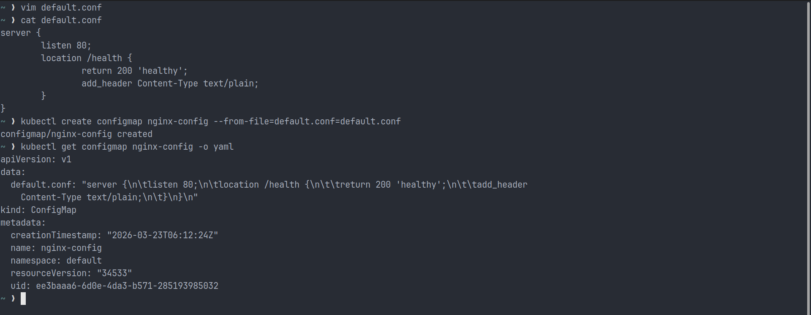

---

## Task 3 - Use ConfigMaps in a Pod

ConfigMaps can be consumed in two common ways:

- As environment variables
- As mounted files inside a volume

### ConfigMap as Environment Variables

```yaml
apiVersion: v1
kind: Pod
metadata:
  name: configmap-env-pod
spec:
  containers:
    - name: busybox
      image: busybox
      command: ["/bin/sh", "-c", "env | grep APP_ && sleep 3600"]
      envFrom:
        - configMapRef:
            name: app-config
```

This loads all keys from `app-config` into the container as environment variables.

### Actual Output

```text
$ kubectl apply -f configmap-env-pod.yml
pod/configmap-env-pod created

$ cat configmap-env-pod.yml
kind: Pod
apiVersion: v1
metadata:
  name: configmap-env-pod

spec:
  containers:
  - name: busybox
    image: busybox:latest
    command: ["/bin/sh", "-c", "env | grep APP_ && sleep 3600"]
    envFrom:
      - configMapRef:
          name: app-config

$ kubectl logs configmap-env-pod
APP_DEBUG=false
APP_PORT=8080
APP_ENV=production
```

### ConfigMap as a Volume Mount

```yaml
apiVersion: v1
kind: Pod
metadata:
  name: nginx-config-pod
spec:
  containers:
    - name: nginx
      image: nginx
      volumeMounts:
        - name: nginx-config-volume
          mountPath: /etc/nginx/conf.d
  volumes:
    - name: nginx-config-volume
      configMap:
        name: nginx-config
```

### Verification

```bash
kubectl exec <pod-name> -- curl -s http://localhost/health
```

The `/health` endpoint should return `healthy`, confirming that the mounted configuration is working correctly.

### Actual Output

```text
$ cat nginx-config-pod.yml
kind: Pod
apiVersion: v1
metadata:
  name: nginx-config-pod

spec:
  containers:
    - name: nginx
      image: nginx:latest
      volumeMounts:
        - name: nginx-config-volume
          mountPath: /etc/nginx/conf.d
  volumes:
    - name: nginx-config-volume
      configMap:
        name: nginx-config

$ kubectl apply -f nginx-config-pod.yml
pod/nginx-config-pod created

$ kubectl get pods
NAME                READY   STATUS    RESTARTS   AGE
configmap-env-pod   1/1     Running   0          8m33s
nginx-config-pod    1/1     Running   0          34s

$ kubectl exec nginx-config-pod -- curl -s http://localhost/health
healthy%
```

### Screenshots

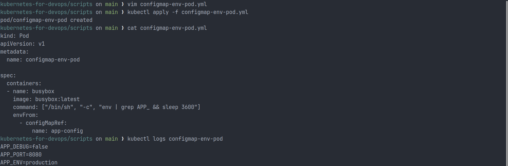
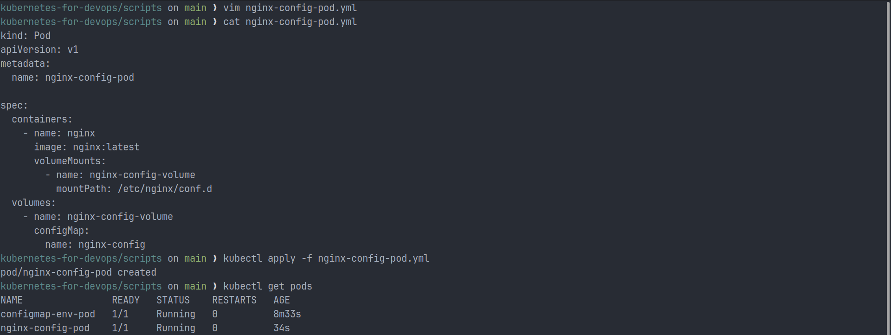


---

## Task 4 - Create a Secret

Secrets are meant for sensitive values. I created a Secret named `db-credentials` with a username and password:

```bash
kubectl create secret generic db-credentials \
  --from-literal=DB_USER=admin \
  --from-literal=DB_PASSWORD='s3cureP@ssw0rd'
```

### Verification

```bash
kubectl get secret db-credentials -o yaml
```

The values appear in Base64-encoded form.

### Decode a Secret Value

```bash
kubectl get secret db-credentials -o jsonpath='{.data.DB_PASSWORD}' | base64 --decode
```

### Actual Output

```text
$ kubectl create secret generic db-credentials --from-literal=DB_USER=admin --from-literal=DB_PASSWORD=s3cureP@ssw0rd
secret/db-credentials created

$ kubectl get secret db-credentials -o yaml
apiVersion: v1
data:
  DB_PASSWORD: czNjdXJlUEBzc3cwcmQ=
  DB_USER: YWRtaW4=
kind: Secret
metadata:
  creationTimestamp: "2026-03-23T06:34:08Z"
  name: db-credentials
  namespace: default
  resourceVersion: "36241"
  uid: 4d4fca2f-b046-46a8-a7e6-f6f475367da9
type: Opaque

$ echo "YWRtaW4=" | base64
WVdSdGFXND0K

$ echo "YWRtaW4=" | base64 --decode
admin%

$ echo "czNjdXJlUEBzc3cwcmQ=" | base64 --decode
s3cureP@ssw0rd%
```

### Important Note

Base64 is **encoding**, not **encryption**.

That means:

- It makes data safe for transport and storage in text-based formats
- It does **not** protect the secret from being read
- Anyone with access to the encoded value can decode it easily

Secrets are still useful because Kubernetes can control access through RBAC and can also support encryption at rest when enabled in the cluster.

### Screenshot

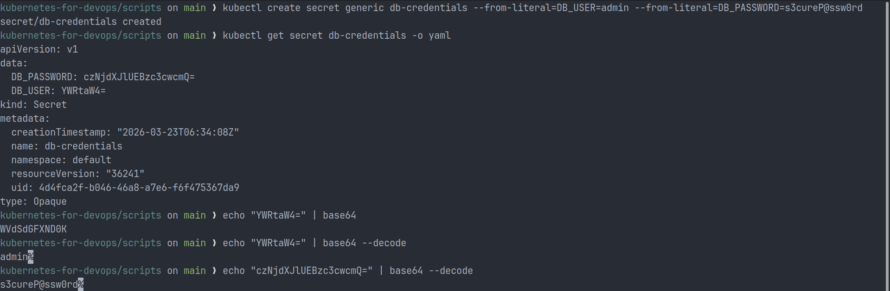

---

## Task 5 - Use Secrets in a Pod

Secrets can also be used as environment variables or as mounted files.

```yaml
apiVersion: v1
kind: Pod
metadata:
  name: secret-pod
spec:
  containers:
    - name: busybox
      image: busybox
      command:
        [
          "/bin/sh",
          "-c",
          "env | grep DB_ && ls /etc/db-credentials && cat /etc/db-credentials/DB_PASSWORD && sleep 3600",
        ]
      env:
        - name: DB_USER
          valueFrom:
            secretKeyRef:
              name: db-credentials
              key: DB_USER
      volumeMounts:
        - name: secret-volume
          mountPath: /etc/db-credentials
          readOnly: true
  volumes:
    - name: secret-volume
      secret:
        secretName: db-credentials
```

### Key Observation

When a Secret is mounted as a volume:

- Each key becomes a separate file
- The file content is available in decoded plaintext form inside the container

### Actual Output

```text
$ cat secret-pod.yml
kind: Pod
apiVersion: v1
metadata:
  name: secret-pod
spec:
  containers:
    - name: busybox
      image: busybox:latest
      command: ["/bin/sh", "-c", "env | grep DB_ && ls /etc/db-credentials && cat /etc/db-credentials/DB_PASSWORD && sleep 3600"]
      env:
        - name: DB_USER
          valueFrom:
            secretKeyRef:
              name: db-credentials
              key: DB_USER
      volumeMounts:
        - name: secret-volume
          mountPath: /etc/db-credentials
          readOnly: true
  volumes:
    - name: secret-volume
      secret:
        secretName: db-credentials

$ kubectl apply -f secret-pod.yml
pod/secret-pod created

$ kubectl logs secret-pod.yml
error: error from server (NotFound): pods "secret-pod.yml" not found in namespace "default"

$ kubectl logs secret-pod
DB_USER=admin
DB_PASSWORD
DB_USER

$ kubectl get pods
NAME                READY   STATUS    RESTARTS   AGE
configmap-env-pod   1/1     Running   0          24m
nginx-config-pod    1/1     Running   0          16m
secret-pod          1/1     Running   0          54s
```

### Screenshots

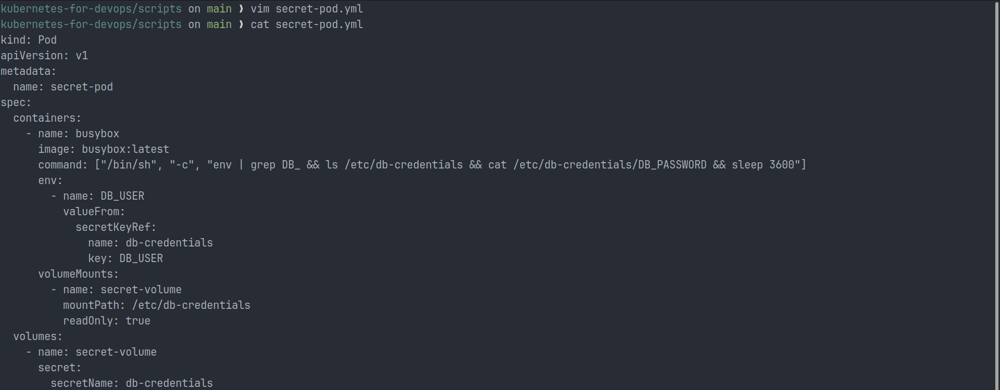
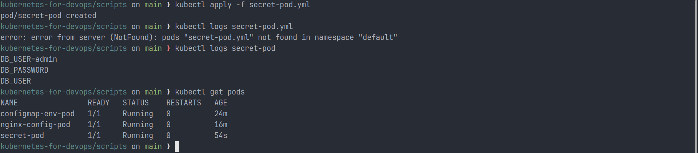

---

## Task 6 - Update a ConfigMap and Observe Propagation

This task demonstrates one of the most important differences between environment variables and mounted volumes.

### Create the ConfigMap

```bash
kubectl create configmap live-config --from-literal=message=hello
```

### Pod Manifest

```yaml
apiVersion: v1
kind: Pod
metadata:
  name: live-config-pod
spec:
  containers:
    - name: busybox
      image: busybox
      command:
        - /bin/sh
        - -c
        - while true; do echo "Message: $(cat /config/message)"; sleep 5; done
      volumeMounts:
        - name: config-volume
          mountPath: /config
  volumes:
    - name: config-volume
      configMap:
        name: live-config
```

### Actual Output

```text
$ cat live-config-pod.yml
kind: Pod
apiVersion: v1
metadata:
  name: live-config-pod
spec:
  containers:
  - name: busybox
    image: busybox:latest
    command: ["/bin/sh", "-c", "while true; do echo Message: $(cat /config/message); sleep 5; done"]
    volumeMounts:
    - name: config-volume
      mountPath: /config
volumes:
- name: config-volume
  configMap:
    name: live-config

$ kubectl apply -f live-config-pod.yml
pod/live-config-pod created

$ kubectl logs -f live-config-pod
Message: world
Message: world
Message: world
Message: world
Message: world
Message: world
Message: world
Message: world
Message: world
Message: world
```

### Update the ConfigMap

```bash
kubectl patch configmap live-config --type merge -p '{"data":{"message":"auto-update-working"}}'
```

### Result

In my run, the mounted file was initially printing `world`. After patching the ConfigMap, the value changed to `auto-update-working` without restarting the Pod.

This happens only for volume-mounted ConfigMaps. Environment variables do not refresh automatically after the Pod starts.

### Actual Output After Patch

```text
$ kubectl patch configmap live-config --type merge -p '{"data":{"message":"auto-update-working"}}'
configmap/live-config patched

$ kubectl logs -f live-config-pod
Message: world
Message: world
Message: world
Message: world
Message: world
Message: world
Message: world
Message: world
Message: world
Message: world
Message: world
Message: world
Message: world
Message: world
Message: world
Message: world
Message: world
Message: auto-update-working
Message: auto-update-working
Message: auto-update-working
Message: auto-update-working
Message: auto-update-working
```

### Screenshots

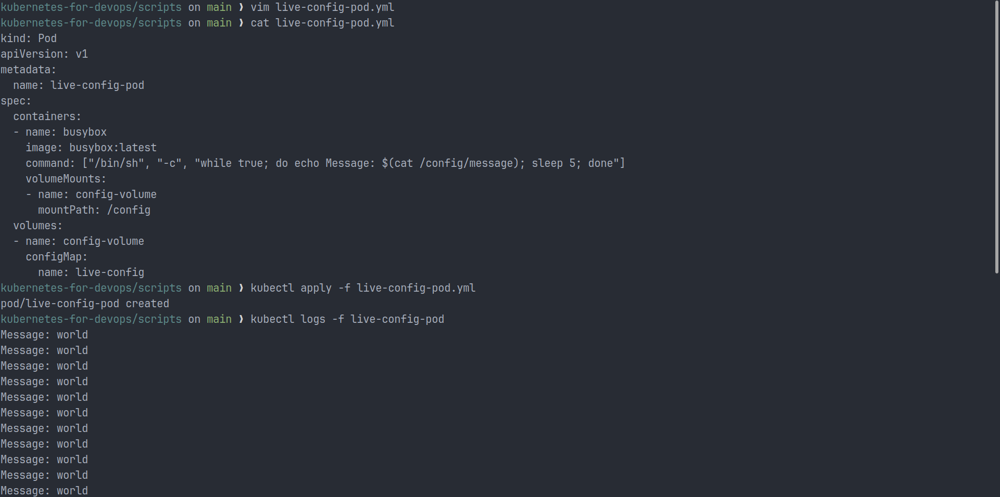
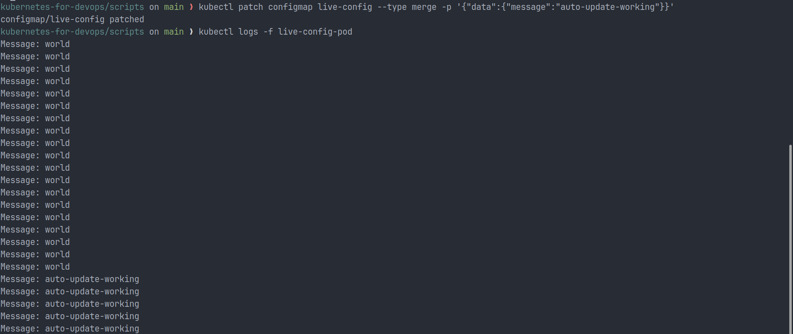

---

## Task 7 - Clean Up

After finishing the exercises, all created Pods, ConfigMaps, and Secrets should be removed.

```bash
kubectl delete pod configmap-env-pod nginx-config-pod secret-pod live-config-pod
kubectl delete configmap app-config nginx-config live-config
kubectl delete secret db-credentials
```

### Actual Output

```text
$ kubectl get all
NAME                READY   STATUS    RESTARTS      AGE
pod/configmap-env-pod  1/1  Running   1 (82s ago)   61m
pod/live-config-pod    1/1  Running   0             4m10s
pod/nginx-config-pod   1/1  Running   0             53m
pod/secret-pod         1/1  Running   0             37m

NAME                 TYPE        CLUSTER-IP   EXTERNAL-IP   PORT(S)   AGE
service/kubernetes   ClusterIP   10.96.0.1   <none>        443/TCP   5d19h

$ kubectl get configmap
NAME               DATA   AGE
app-config         3      81m
kube-root-ca.crt   1      5d19h
live-config        1      34m
nginx-config       1      70m

$ kubectl get secret
NAME             TYPE     DATA   AGE
db-credentials   Opaque   2      48m

$ kubectl delete pod configmap-env-pod
pod "configmap-env-pod" deleted from default namespace

$ kubectl delete pod nginx-config-pod
pod "nginx-config-pod" deleted from default namespace

$ kubectl delete pod secret-pod
pod "secret-pod" deleted from default namespace

$ kubectl delete pod live-config-pod
pod "live-config-pod" deleted from default namespace

$ kubectl delete configmap app-config
configmap "app-config" deleted from default namespace

$ kubectl delete configmap nginx-config
configmap "nginx-config" deleted from default namespace

$ kubectl delete configmap live-config
configmap "live-config" deleted from default namespace

$ kubectl delete secret db-credentials
```

The screenshot ends right after the final delete command, so the success line for the Secret deletion is not visible there.

### Screenshot

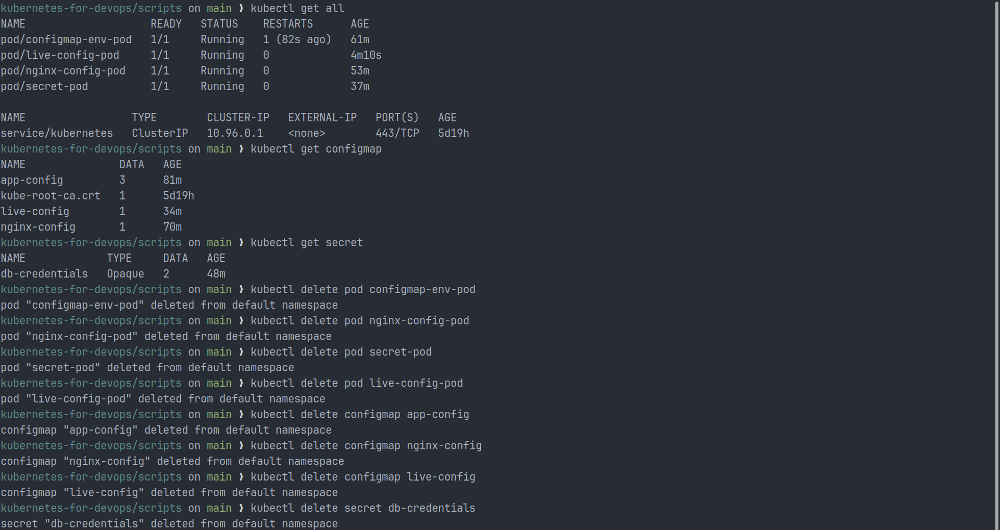

---

## Environment Variables vs Volume Mounts

| Method                 | Best For                                     | Auto Updates | Notes                                      |
| ---------------------- | -------------------------------------------- | ------------ | ------------------------------------------ |
| Environment variables  | Simple key-value settings                    | No           | Values are fixed when the container starts |
| ConfigMap volume mount | Config files and dynamic settings            | Yes          | Updated values appear after a short delay  |
| Secret volume mount    | Sensitive files such as credentials or certs | Yes          | Files are mounted as decoded content       |

In short:

- Use environment variables for simple application settings
- Use volume mounts for full config files
- Use Secrets for anything sensitive

---

## Why Base64 Is Encoding, Not Encryption

Base64 changes binary or text data into a text-safe format. It does not hide or protect the information.

For example:

```bash
echo -n 'admin' | base64
```

Anyone can decode it with:

```bash
echo 'YWRtaW4=' | base64 --decode
```

So while Kubernetes Secrets use Base64 encoding in YAML output, real protection depends on access control, cluster security, and optional encryption at rest.

---

## Key Learnings

- ConfigMaps are used for non-sensitive configuration
- Secrets are used for sensitive data
- Configuration can be injected as environment variables or volume-mounted files
- Volume-mounted ConfigMaps and Secrets can update automatically
- Environment variables do not update after Pod startup
- Base64 is encoding, not encryption
- Externalizing configuration makes workloads easier to manage

---

## Files in Day 54

```text
day-54/
|-- README.md
|-- day-54-configmaps-secrets.md
`-- screenshots/
    |-- Task_1/
    |-- Task_2/
    |-- Task_3/
    |-- Task_4/
    |-- Task_5/
    |-- Task_6/
    `-- Task_7/
```

---

## Conclusion

ConfigMaps and Secrets are core Kubernetes resources for managing application configuration properly. ConfigMaps help with non-sensitive settings, while Secrets are used for sensitive values. Together, they make workloads more flexible, easier to update, and better aligned with production best practices.
