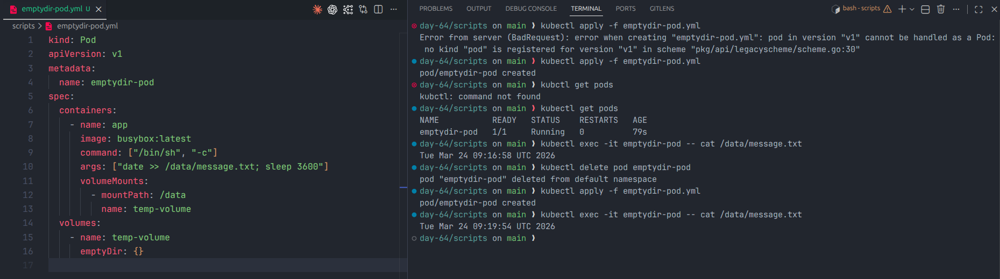
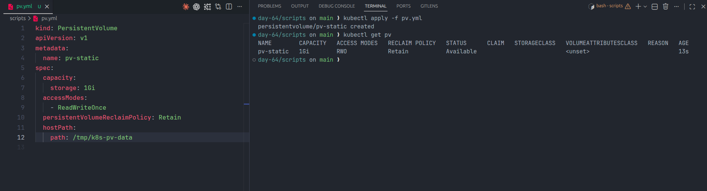
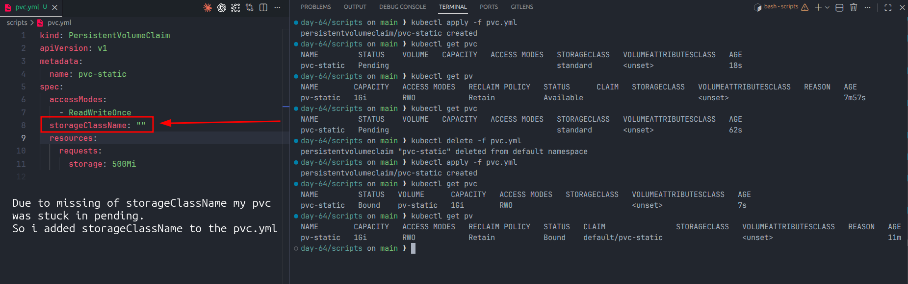
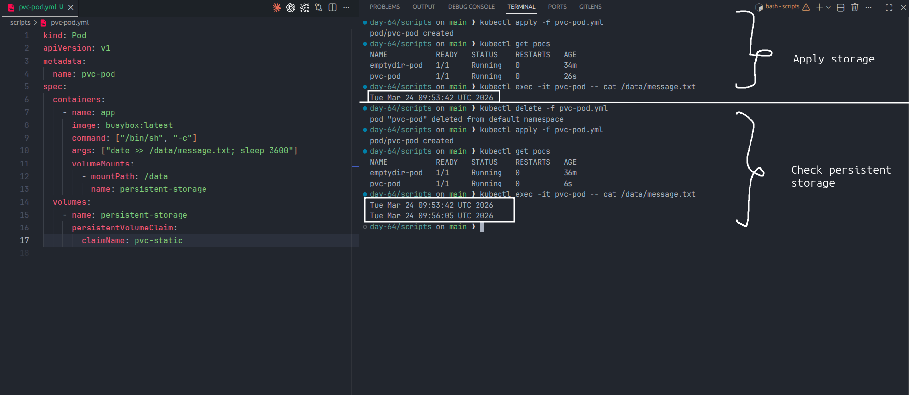
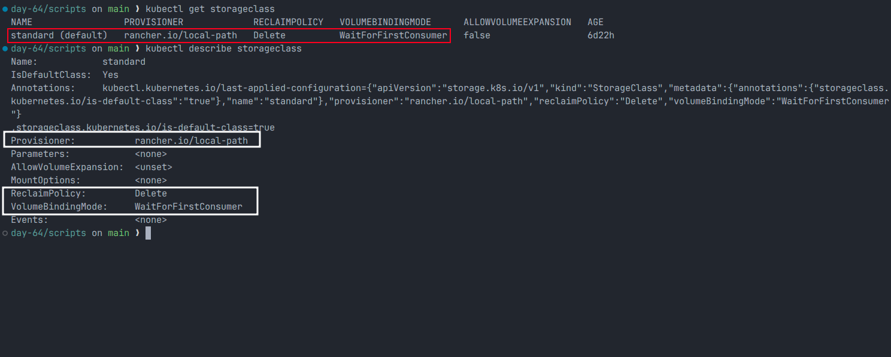
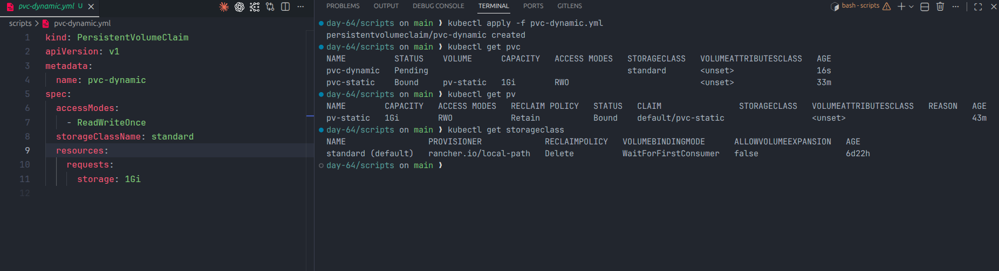
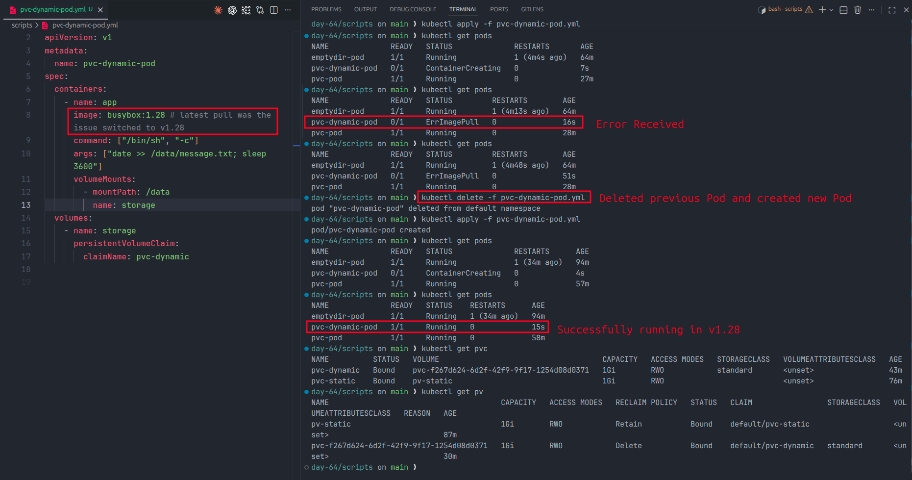
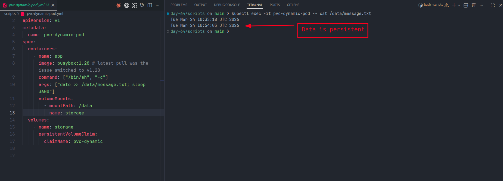
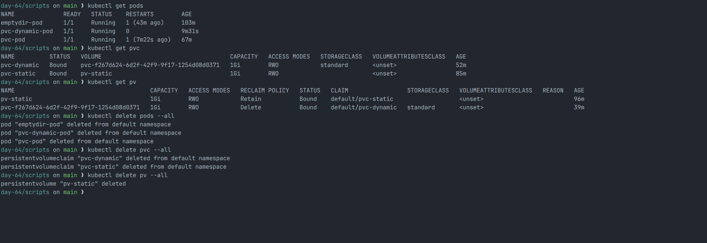

# Day 55 – Persistent Volumes (PV) and Persistent Volume Claims (PVC)

## Table of Contents

1. Introduction
2. Kubernetes Storage Architecture
3. Task 1 – Data Loss with emptyDir
4. Task 2 – Persistent Volume (Static Provisioning)
5. Task 3 – Persistent Volume Claim
6. Task 4 – Using PVC in a Pod
7. Task 5 – StorageClass and Dynamic Provisioning
8. Task 6 – Dynamic Provisioning Demo
9. Task 7 – Clean Up and Reclaim Policy
10. Access Modes
11. Static vs Dynamic Provisioning
12. Verification Answers
13. Key Takeaways
14. Folder Structure
15. Conclusion

---

# 1. Introduction

Containers in Kubernetes are **ephemeral**, meaning when a Pod is deleted or restarted, the data inside the container is lost. This is a problem for stateful applications like databases, logs, and file storage.

Kubernetes solves this problem using:

- Persistent Volume (PV)
- Persistent Volume Claim (PVC)
- StorageClass

These components provide persistent storage that survives Pod deletion.

---

# 2. Kubernetes Storage Architecture

```
Pod → PersistentVolumeClaim → PersistentVolume → Physical Storage
```

| Component    | Description                      |
| ------------ | -------------------------------- |
| Pod          | Application using storage        |
| PVC          | Request for storage              |
| PV           | Actual storage resource          |
| StorageClass | Automatically provisions storage |

---

# 3. Task 1 – Data Loss with emptyDir

## Pod Manifest

```yaml
kind: Pod
apiVersion: v1
metadata:
  name: emptydir-pod
spec:
  containers:
    - name: app
      image: busybox:latest
      command: ["/bin/sh", "-c"]
      args: ["date > /data/message.txt; sleep 3600"]
      volumeMounts:
        - name: temp-volume
          mountPath: /data
  volumes:
    - name: temp-volume
      emptyDir: {}
```

## Commands

```bash
kubectl apply -f emptydir-pod.yml
kubectl get pods
kubectl exec -it emptydir-pod -- cat /data/message.txt

kubectl delete pod emptydir-pod
kubectl get pods
kubectl apply -f emptydir-pod.yml
kubectl get pods
kubectl exec -it emptydir-pod -- cat /data/message.txt
```

## Result

The timestamp changed after Pod recreation → Data is lost.

## Screenshot



## Conclusion

`emptyDir` is ephemeral storage.

---

# 4. Task 2 – Persistent Volume (Static Provisioning)

## PV Manifest

```yaml
kind: PersistentVolume
apiVersion: v1
metadata:
  name: pv-static
spec:
  capacity:
    storage: 1Gi
  accessModes:
    - ReadWriteOnce
  persistentVolumeReclaimPolicy: Retain
  hostPath:
    path: /tmp/k8s-pv-data
```

## Commands

```bash
kubectl apply -f pv.yml
kubectl get pv
```

## Result

PV Status = Available

## Screenshot



---

# 5. Task 3 – Persistent Volume Claim

## PVC Manifest

```yaml
kind: PersistentVolumeClaim
apiVersion: v1
metadata:
  name: pvc-static
spec:
  accessModes:
    - ReadWriteOnce
  storageClassName: ""
  resources:
    requests:
      storage: 500Mi
```

## Commands

```bash
kubectl apply -f pvc.yml
kubectl get pvc
kubectl get pv

kubectl delete -f pvc.yml
kubectl apply -f pvc.yml
kubectl get pvc
kubectl get pv
```

## Result

The PVC was initially `Pending` because the default StorageClass was being used.
After setting `storageClassName: ""` and re-applying, the PVC became `Bound`, the PV became `Bound`, and the PVC `VOLUME` column showed `pv-static`.

## Screenshot



---

# 6. Task 4 – Using PVC in a Pod

## Pod Manifest

```yaml
kind: Pod
apiVersion: v1
metadata:
  name: pvc-pod
spec:
  containers:
    - name: app
      image: busybox:latest
      command: ["/bin/sh", "-c"]
      args: ["date >> /data/message.txt; sleep 3600"]
      volumeMounts:
        - mountPath: /data
          name: persistent-storage
  volumes:
    - name: persistent-storage
      persistentVolumeClaim:
        claimName: pvc-static
```

## Commands

```bash
kubectl apply -f pvc-pod.yml
kubectl get pods
kubectl exec -it pvc-pod -- cat /data/message.txt

kubectl delete -f pvc-pod.yml
kubectl apply -f pvc-pod.yml
kubectl get pods
kubectl exec -it pvc-pod -- cat /data/message.txt
```

## Result

Data persisted across Pod deletion.

## Screenshot



---

# 7. Task 5 – StorageClass and Dynamic Provisioning

## Commands

```bash
kubectl get storageclass
kubectl describe storageclass standard
```

## StorageClass Details

| Field               | Value                 |
| ------------------- | --------------------- |
| Name                | standard              |
| Provisioner         | rancher.io/local-path |
| Reclaim Policy      | Delete                |
| Volume Binding Mode | WaitForFirstConsumer  |

## Screenshot



---

# 8. Task 6 – Dynamic Provisioning Demo

## Dynamic PVC

```yaml
kind: PersistentVolumeClaim
apiVersion: v1
metadata:
  name: pvc-dynamic
spec:
  accessModes:
    - ReadWriteOnce
  storageClassName: standard
  resources:
    requests:
      storage: 1Gi
```

## Pod Using Dynamic PVC

```yaml
kind: Pod
apiVersion: v1
metadata:
  name: pvc-dynamic-pod
spec:
  containers:
    - name: app
      image: busybox:1.28
      command: ["/bin/sh", "-c"]
      args: ["date >> /data/message.txt; sleep 3600"]
      volumeMounts:
        - mountPath: /data
          name: storage
  volumes:
    - name: storage
      persistentVolumeClaim:
        claimName: pvc-dynamic
```

## Commands

```bash
kubectl apply -f pvc-dynamic.yml
kubectl get pvc
kubectl get pv

kubectl apply -f pvc-dynamic-pod.yml
kubectl get pods
kubectl get pods
kubectl delete -f pvc-dynamic-pod.yml
kubectl apply -f pvc-dynamic-pod.yml
kubectl get pods
kubectl get pvc
kubectl get pv
kubectl exec -it pvc-dynamic-pod -- cat /data/message.txt
```

## Result

The dynamic PVC was initially `Pending`.
The first Pod run hit an image pull issue, so the Pod was recreated with `busybox:1.28`.
Once the Pod used the claim, Kubernetes provisioned the PV automatically, the PVC became `Bound`, and the data persisted.

## Screenshots







---

# 9. Task 7 – Clean Up and Reclaim Policy

## Commands

```bash
kubectl get pods
kubectl get pvc
kubectl get pv

kubectl delete pods --all
kubectl delete pvc --all
kubectl delete pv --all
```

## Result

Before cleanup, both the static and dynamic volumes were `Bound`.
After deleting the PVCs, only `pv-static` remained to be deleted manually with `kubectl delete pv --all`, which shows the dynamic PV was removed automatically while the static PV was retained until manual deletion.

## Screenshot



---

# 10. Access Modes

| Access Mode   | Meaning               |
| ------------- | --------------------- |
| ReadWriteOnce | One node read/write   |
| ReadOnlyMany  | Many nodes read-only  |
| ReadWriteMany | Many nodes read/write |

---

# 11. Static vs Dynamic Provisioning

| Static Provisioning | Dynamic Provisioning     |
| ------------------- | ------------------------ |
| PV created manually | PV created automatically |
| Manual              | Automatic                |
| More control        | Easy                     |

---

# 12. Verification Answers

| Question                                | Answer               |
| --------------------------------------- | -------------------- |
| Is timestamp same after Pod recreation? | No                   |
| PV status after creation                | Available            |
| PVC VOLUME column                       | pv-static            |
| Does file contain data from both Pods?  | Yes                  |
| Default StorageClass                    | standard             |
| VolumeBindingMode                       | WaitForFirstConsumer |
| When is dynamic PV created?             | When Pod uses PVC    |
| Dynamic PV reclaim policy               | Delete               |
| Static PV reclaim policy                | Retain               |
| Which PV deleted after PVC delete?      | Dynamic PV           |
| Which PV retained?                      | Static PV            |

---

# 13. Key Takeaways

- Containers are ephemeral
- Persistent storage is required for stateful applications
- PV provides storage
- PVC requests storage
- StorageClass enables dynamic provisioning
- Reclaim policy controls storage lifecycle

---

# 14. Folder Structure

```
day-55/
 ├── scripts/
 │    ├── emptydir-pod.yml
 │    ├── pv.yml
 │    ├── pvc.yml
 │    ├── pvc-pod.yml
 │    ├── pvc-dynamic.yml
 │    └── pvc-dynamic-pod.yml
 ├── screenshots/
 │    ├── Task_1/
 │    ├── Task_2/
 │    ├── Task_3/
 │    ├── Task_4/
 │    ├── Task_5/
 │    ├── Task_6/
 │    └── Task_7/
 └── day-55-persistent-volumes.md
```

---

# 15. Conclusion

In this lab, I learned how Kubernetes provides persistent storage using Persistent Volumes and Persistent Volume Claims. I demonstrated data loss using emptyDir and solved the problem using PV and PVC. I also implemented dynamic provisioning using StorageClass and understood reclaim policies.

Persistent storage is a critical concept for running databases and stateful applications in Kubernetes.
