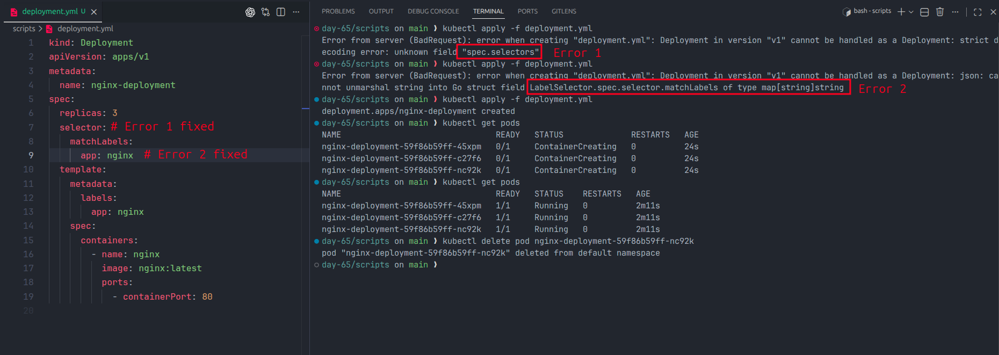
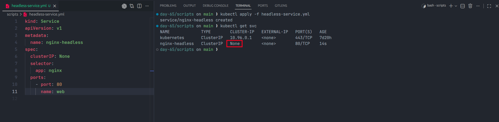
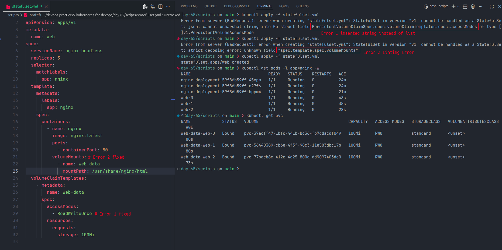
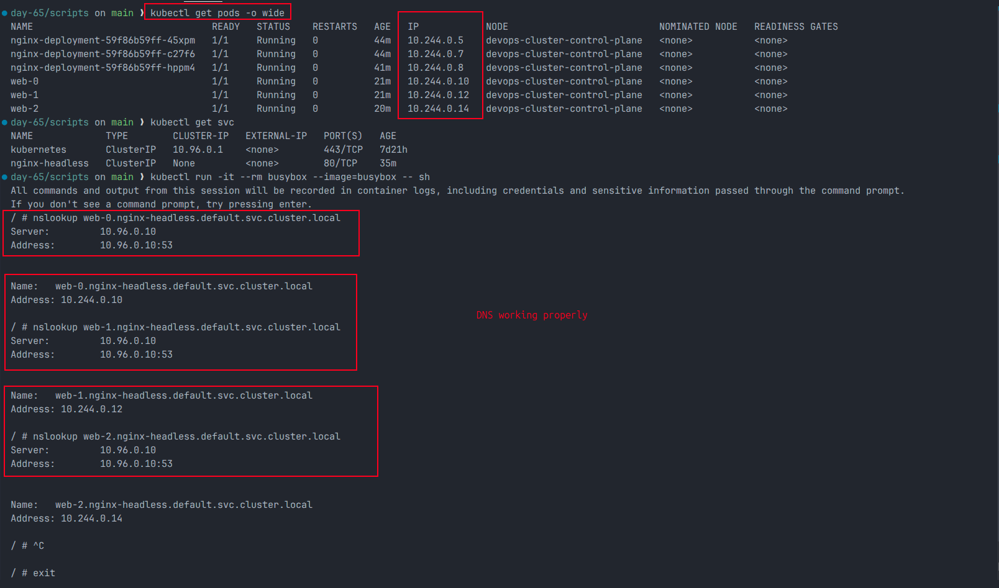
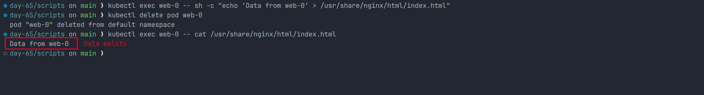
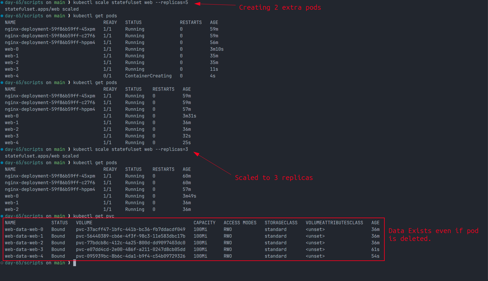
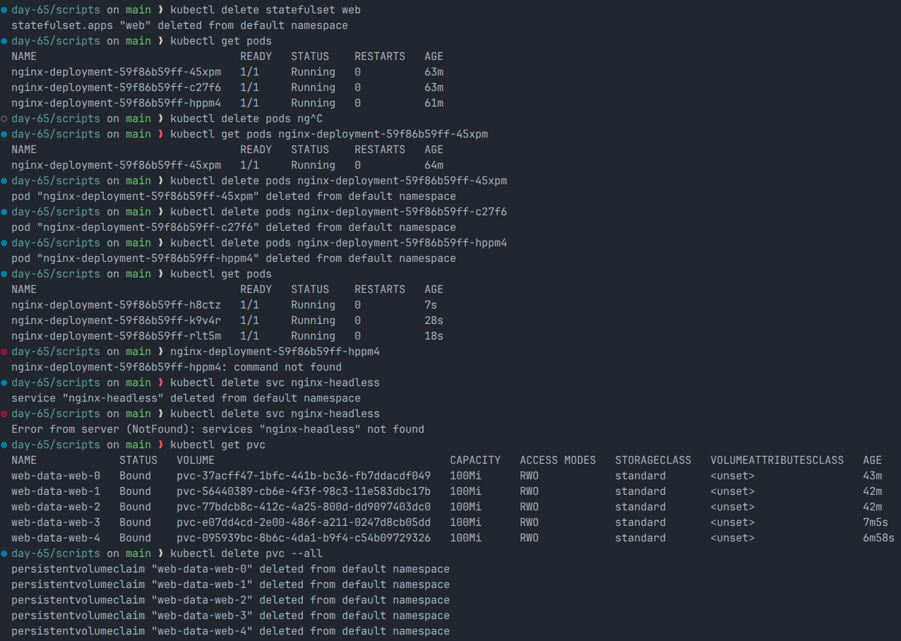

# Day 56 - Kubernetes StatefulSets

## Introduction

Deployments are great for stateless workloads, but databases and clustered applications need stable identity, ordered rollout, and persistent storage. Kubernetes provides **StatefulSets** for exactly that use case.

This day covers:

- stable pod names
- stable DNS per pod
- persistent storage per replica
- ordered pod creation and deletion

---

## Expected Outcome

By the end of this lab, we should have:

- a StatefulSet with 3 replicas
- stable pod names like `web-0`, `web-1`, and `web-2`
- DNS resolution working for each pod
- persistent data surviving pod recreation
- ordered scale up and scale down behavior

---

## Files Used In This Folder

The manifests for this day are stored in the `scripts/` directory:

- `scripts/deployment.yml`
- `scripts/headless-service.yml`
- `scripts/statefulset.yml`

Screenshots are stored task-wise in:

- `screenshots/Task_1/`
- `screenshots/Task_2/`
- `screenshots/Task_3/`
- `screenshots/Task_4/`
- `screenshots/Task_5/`
- `screenshots/Task_6/`
- `screenshots/Task_7/`

---

## Deployment vs StatefulSet

| Feature          | Deployment                 | StatefulSet                 |
| ---------------- | -------------------------- | --------------------------- |
| Pod names        | Random                     | Stable and ordered          |
| Startup order    | All at once                | Ordered                     |
| Storage          | Usually shared or external | Dedicated PVC per pod       |
| Network identity | No fixed hostname per pod  | Stable DNS per pod          |
| Best for         | Stateless apps             | Databases and stateful apps |

Use a **Deployment** for apps like frontend or API servers.

Use a **StatefulSet** for apps like:

- MySQL
- PostgreSQL
- MongoDB
- Kafka
- Elasticsearch

---

## Task 1 - Deployment Example

To understand why StatefulSets matter, we first create a normal Deployment.

### Manifest: `scripts/deployment.yml`

```yaml
kind: Deployment
apiVersion: apps/v1
metadata:
  name: nginx-deployment
spec:
  replicas: 3
  selector:
    matchLabels:
      app: nginx
  template:
    metadata:
      labels:
        app: nginx
    spec:
      containers:
        - name: nginx
          image: nginx:latest
          ports:
            - containerPort: 80
```

### Apply

```bash
kubectl apply -f scripts/deployment.yml
kubectl get pods
```

You will notice random pod names such as:

```text
nginx-deployment-xxxxxxxxxx-xxxxx
```

If one pod is deleted:

```bash
kubectl delete pod <pod-name>
```

Kubernetes creates a replacement pod, but the new pod gets a different random name. That behavior is fine for stateless apps, but not for database clusters that depend on stable identity.

Before moving to the StatefulSet example, delete the Deployment:

```bash
kubectl delete deployment nginx-deployment
```

### Screenshot



---

## Task 2 - Headless Service

StatefulSets require a **Headless Service** so each pod gets its own DNS record.

### Manifest: `scripts/headless-service.yml`

```yaml
kind: Service
apiVersion: v1
metadata:
  name: nginx-headless
spec:
  clusterIP: None
  selector:
    app: nginx
  ports:
    - port: 80
      name: web
```

### Apply

```bash
kubectl apply -f scripts/headless-service.yml
kubectl get svc
```

The important detail is:

```text
CLUSTER-IP   None
```

A Headless Service does not load balance behind one virtual IP. Instead, it helps expose individual pod DNS records.

### Screenshot



---

## Task 3 - Create the StatefulSet

Now create the StatefulSet that will manage ordered pod creation and persistent storage.

### Manifest: `scripts/statefulset.yml`

```yaml
kind: StatefulSet
apiVersion: apps/v1
metadata:
  name: web
spec:
  serviceName: nginx-headless
  replicas: 3
  selector:
    matchLabels:
      app: nginx
  template:
    metadata:
      labels:
        app: nginx
    spec:
      containers:
        - name: nginx
          image: nginx:latest
          ports:
            - containerPort: 80
          volumeMounts:
            - name: web-data
              mountPath: /usr/share/nginx/html
  volumeClaimTemplates:
    - metadata:
        name: web-data
      spec:
        accessModes:
          - ReadWriteOnce
        resources:
          requests:
            storage: 100Mi
```

### Apply

```bash
kubectl apply -f scripts/statefulset.yml
kubectl get pods -l app=nginx -w
```

Pods are created in order:

```text
web-0
web-1
web-2
```

Check the PersistentVolumeClaims:

```bash
kubectl get pvc
```

Expected PVC names:

```text
web-data-web-0
web-data-web-1
web-data-web-2
```

This happens because `volumeClaimTemplates` creates one PVC per pod replica.

### Screenshot



---

## Task 4 - Stable DNS Per Pod

Each StatefulSet pod gets a predictable DNS name:

```text
<pod-name>.<service-name>.<namespace>.svc.cluster.local
```

For this lab, examples are:

```text
web-0.nginx-headless.default.svc.cluster.local
web-1.nginx-headless.default.svc.cluster.local
web-2.nginx-headless.default.svc.cluster.local
```

### Test DNS

```bash
kubectl run -it --rm busybox --image=busybox -- sh
```

Inside the pod:

```bash
nslookup web-0.nginx-headless.default.svc.cluster.local
nslookup web-1.nginx-headless.default.svc.cluster.local
nslookup web-2.nginx-headless.default.svc.cluster.local
```

You can compare the resolved IPs with this command in another terminal:

```bash
kubectl get pods -o wide
```

### Screenshot



---

## Task 5 - Persistent Storage Test

StatefulSets keep storage attached to the pod identity.

Write data into `web-0`:

```bash
kubectl exec web-0 -- sh -c "echo 'Data from web-0' > /usr/share/nginx/html/index.html"
```

Delete the pod:

```bash
kubectl delete pod web-0
```

After Kubernetes recreates it, check the file again:

```bash
kubectl exec web-0 -- cat /usr/share/nginx/html/index.html
```

Expected output:

```text
Data from web-0
```

This proves the recreated pod reattached to the same PVC instead of starting with empty storage.

### Screenshot



---

## Task 6 - Ordered Scaling

Scale up:

```bash
kubectl scale statefulset web --replicas=5
```

New pods are created in order:

```text
web-3
web-4
```

Scale back down:

```bash
kubectl scale statefulset web --replicas=3
```

Pods are deleted in reverse order:

```text
web-4
web-3
```

Check the PVCs again:

```bash
kubectl get pvc
```

Even after scaling back down, the PVCs remain. Kubernetes keeps them so data is preserved if the workload scales up again later.

### Screenshot



---

## Task 7 - Clean Up

Delete the StatefulSet and Headless Service:

```bash
kubectl delete statefulset web
kubectl delete svc nginx-headless
```

Check the PVCs:

```bash
kubectl get pvc
```

They still exist, so remove them manually:

```bash
kubectl delete pvc --all
```

This is expected behavior. Deleting a StatefulSet does not automatically delete the PVCs created for its pods.

### Screenshot



---

## Key Concepts

| Concept              | Meaning                                     |
| -------------------- | ------------------------------------------- |
| Headless Service     | Gives each pod its own DNS identity         |
| StatefulSet          | Manages stateful apps with stable naming    |
| volumeClaimTemplates | Creates one PVC per pod                     |
| Stable DNS           | Predictable hostname for each replica       |
| Ordered rollout      | Pods start in sequence                      |
| Ordered termination  | Pods stop in reverse sequence               |
| Persistent storage   | Data survives pod restarts and rescheduling |

---

## Quick Notes

- `kubectl get sts` is the short form for StatefulSets
- `serviceName` in the StatefulSet must match the Headless Service
- Pod DNS follows `<pod-name>.<service-name>.<namespace>.svc.cluster.local`
- PVC naming follows the pattern `<claim-template-name>-<pod-name>`
- Scaling down does not remove PVCs
- Deleting the StatefulSet also does not remove PVCs automatically

---

## Conclusion

Day 56 made the difference between stateless and stateful workloads very clear. Deployments are perfect for stateless apps, but StatefulSets are the right choice when pods need stable names, stable DNS, ordered rollout, and persistent storage.

This lab showed how a Headless Service, StatefulSet, and `volumeClaimTemplates` work together to support real-world stateful applications such as databases and clustered services.

---

`#90DaysOfDevOps` `#Kubernetes` `#StatefulSets` `#DevOpsKaJosh` `#TrainWithShubham`
