# Day 57 - Kubernetes Resources, Limits, and Probes

## Overview

On Day 57, I practiced two important Kubernetes concepts:

- resource requests and limits for scheduling and runtime control
- health probes for self-healing and traffic management

I created the following manifests in the [`scripts/`](./scripts) directory:

- `resources-demo.yml`
- `stress-pod.yml`
- `huge-request.yml`
- `liveness-pod.yml`
- `readiness-pod.yml`
- `startup-pod.yml`

---

## Requests vs Limits

Kubernetes uses **requests** while scheduling a Pod and **limits** while enforcing runtime boundaries on the container.

| Resource setting | What it does                                             |
| ---------------- | -------------------------------------------------------- |
| Requests         | Minimum resources reserved for the Pod during scheduling |
| Limits           | Maximum resources the container can use at runtime       |

In this lab, I used the following resource values:

```yaml
resources:
  requests:
    cpu: "100m"
    memory: "128Mi"
  limits:
    cpu: "250m"
    memory: "256Mi"
```

---

## Task 1 - Resource Requests and Limits

### Manifest

File: `scripts/resources-demo.yml`

```yaml
kind: Pod
apiVersion: v1
metadata:
  name: resources-demo
spec:
  containers:
    - name: nginx
      image: nginx:latest
      resources:
        requests:
          cpu: "100m"
          memory: "128Mi"
        limits:
          cpu: "250m"
          memory: "256Mi"
```

### Commands used

```bash
kubectl apply -f scripts/resources-demo.yml
kubectl get pods
kubectl describe pod resources-demo
```

### What I observed

- The pod came up in `Running` state.
- `kubectl describe pod resources-demo` showed `Requests` as `100m` CPU and `128Mi` memory.
- The same output showed `Limits` as `250m` CPU and `256Mi` memory.
- The pod QoS class was `Burstable` because the requests and limits were different.

### Screenshots

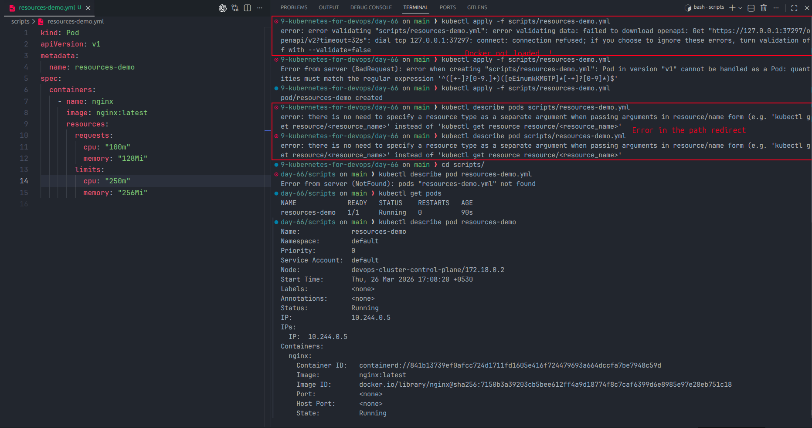

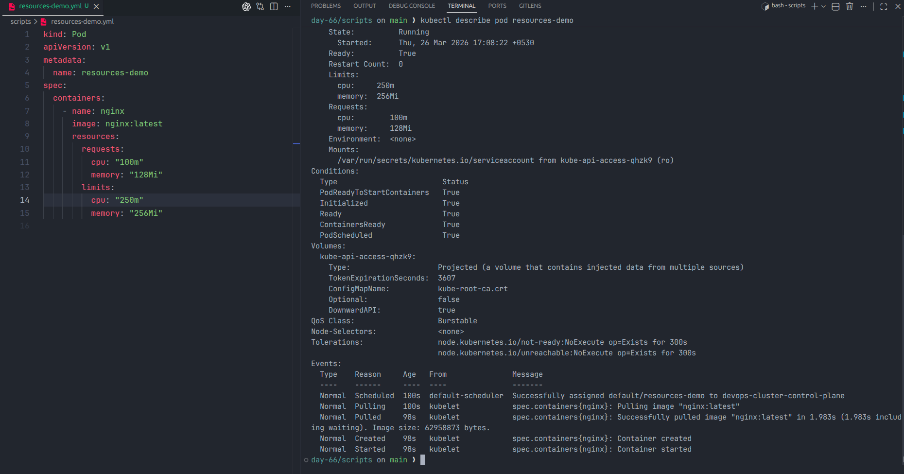

---

## Task 2 - Memory Limit Stress Test

### Manifest

File: `scripts/stress-pod.yml`

```yaml
kind: Pod
apiVersion: v1
metadata:
  name: stress-pod
spec:
  containers:
    - name: stress
      image: polinux/stress
      resources:
        limits:
          memory: "100Mi"
      command: ["stress"]
      args: ["--vm", "1", "--vm-bytes", "200Mi", "--vm-hang", "1"]
```

### Commands used

```bash
kubectl apply -f scripts/stress-pod.yml
kubectl describe pod stress-pod
```

### What I observed

- The container was configured to try using more memory than the `100Mi` limit.
- In my captured run, the pod did not show a clean `OOMKilled` message in the screenshot.
- Instead, the container terminated and the pod moved into repeated restart behavior, later showing `CrashLoopBackOff`.
- The describe output showed repeated pull/create/start events followed by `Back-off restarting failed container`.

### Note

The expected lesson for this task is that memory pressure causes container termination, unlike CPU which is usually throttled. In my screenshots, the visible result was repeated container failure and back-off rather than a clearly captured `OOMKilled` line.

### Screenshots

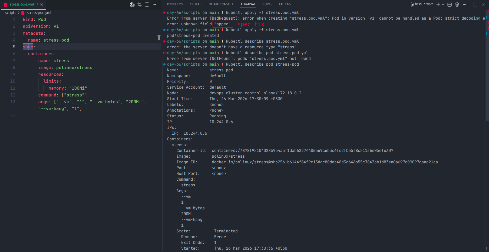

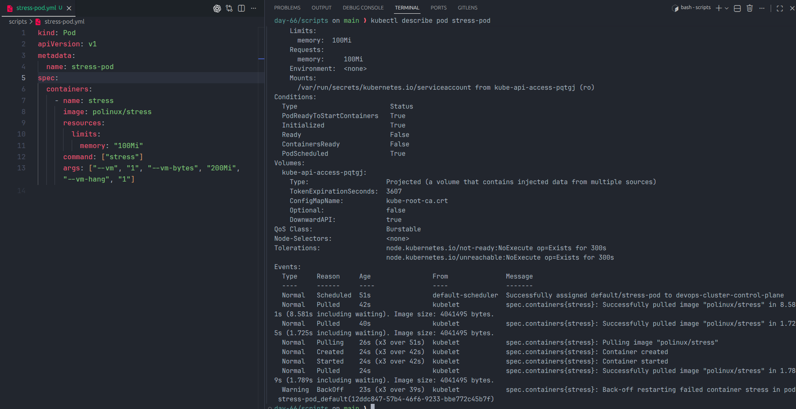

---

## Task 3 - Pod Stuck in Pending Due to Huge Requests

### Manifest

File: `scripts/huge-request.yml`

```yaml
kind: Pod
apiVersion: v1
metadata:
  name: huge-request
spec:
  containers:
    - name: nginx
      image: nginx:latest
      resources:
        requests:
          cpu: "100"
          memory: "128Gi"
```

### Commands used

```bash
kubectl apply -f scripts/huge-request.yml
kubectl get pods
kubectl describe pod huge-request
```

### What I observed

- The pod stayed in `Pending` state.
- `PodScheduled` was `False`.
- The scheduler reported that the node did not have enough CPU and memory for the request.
- This showed how Kubernetes blocks scheduling when requests are larger than the available cluster capacity.

### Screenshots

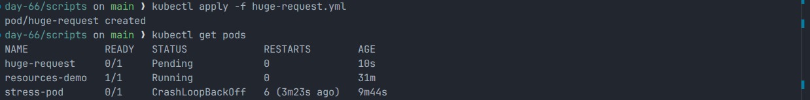

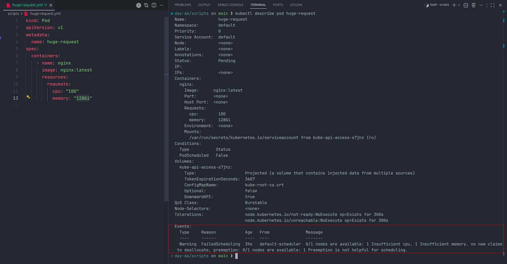

---

## Task 4 - Liveness Probe

### Manifest

File: `scripts/liveness-pod.yml`

```yaml
kind: Pod
apiVersion: v1
metadata:
  name: liveness-pod
spec:
  containers:
    - name: busybox
      image: busybox:latest
      args:
        [
          "/bin/sh",
          "-c",
          "touch /tmp/healthy; sleep 30; rm -f /tmp/healthy; sleep 600",
        ]
      livenessProbe:
        exec:
          command: ["cat", "/tmp/healthy"]
        initialDelaySeconds: 5
        periodSeconds: 5
        failureThreshold: 3
```

### Commands used

```bash
kubectl apply -f scripts/liveness-pod.yml
kubectl get pod liveness-pod
```

### What I observed

- The pod started as `Running` with `0` restarts in the first screenshot.
- The container created `/tmp/healthy` at startup, then removed it after 30 seconds.
- Once the file disappeared, the liveness probe began failing.
- Later in the lab, the same pod showed repeated restarts and ended up in `CrashLoopBackOff`, confirming that liveness failures trigger restarts.

### Screenshot

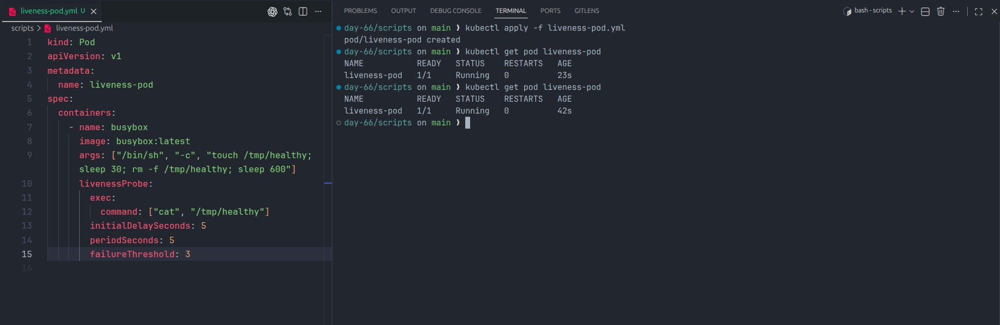

---

## Task 5 - Readiness Probe

### Manifest

File: `scripts/readiness-pod.yml`

```yaml
kind: Pod
apiVersion: v1
metadata:
  name: readiness-pod
  labels:
    app: readiness
spec:
  containers:
    - name: nginx
      image: nginx:latest
      readinessProbe:
        httpGet:
          path: /
          port: 80
        initialDelaySeconds: 5
        periodSeconds: 5
```

### Commands used

```bash
kubectl apply -f scripts/readiness-pod.yml
kubectl expose pod readiness-pod --port=80 --name=readiness-svc
kubectl get endpoints readiness-svc
kubectl exec readiness-pod -- rm /usr/share/nginx/html/index.html
kubectl get pod
kubectl get endpoints readiness-svc
kubectl describe pod readiness-pod
```

### What I observed

- My first expose attempt failed because the pod needed a label that Kubernetes could use for the Service selector.
- After adding `app: readiness`, the Service was created successfully.
- Before breaking the app, `kubectl get endpoints readiness-svc` showed the pod IP as an endpoint.
- After removing `index.html`, the pod stayed in `Running` state but changed to `0/1` ready.
- The Service endpoints became empty.
- `kubectl describe pod readiness-pod` showed `Ready: False`, `Restart Count: 0`, and readiness probe failures with HTTP status `403`.

### Screenshots

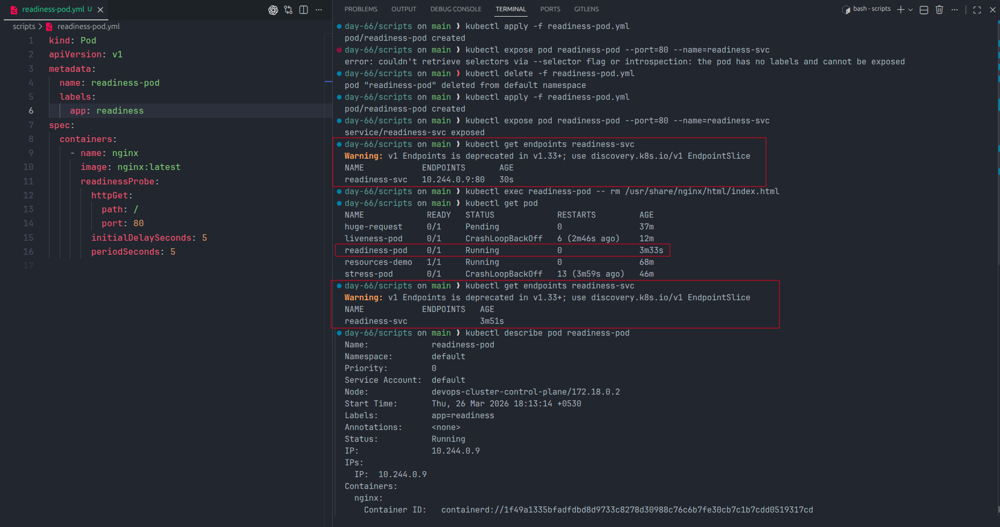

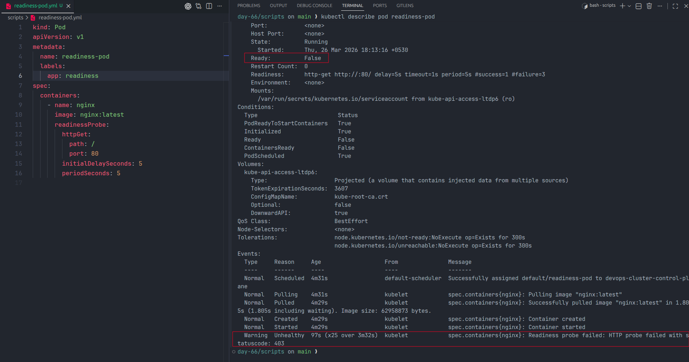

---

## Task 6 - Startup Probe

### Manifest

File: `scripts/startup-pod.yml`

```yaml
kind: Pod
apiVersion: v1
metadata:
  name: startup-pod
spec:
  containers:
    - name: busybox
      image: busybox:latest
      args: ["/bin/sh", "-c", "sleep 20; touch /tmp/started; sleep 600"]
      startupProbe:
        exec:
          command: ["cat", "/tmp/started"]
        periodSeconds: 5
        failureThreshold: 12
      livenessProbe:
        exec:
          command: ["cat", "/tmp/started"]
        periodSeconds: 5
```

### Commands used

```bash
kubectl apply -f scripts/startup-pod.yml
kubectl describe pod startup-pod
```

### What I observed

- The container intentionally slept for 20 seconds before creating `/tmp/started`.
- Early in the pod lifecycle, the startup probe failed because the file did not exist yet.
- `kubectl describe pod startup-pod` showed `Ready: False`, `Restart Count: 0`, and the event `Startup probe failed: cat: can't open '/tmp/started': No such file or directory`.
- Because `periodSeconds: 5` and `failureThreshold: 12` gave the container a 60 second startup window, the pod was not restarted during the initial delay.
- Later in the lab, the pod reached `1/1 Running` with `0` restarts, which showed the startup probe gave the app enough time to come up.
- If `failureThreshold` had been `2`, Kubernetes would likely have restarted the container before the app finished starting.

### Screenshots

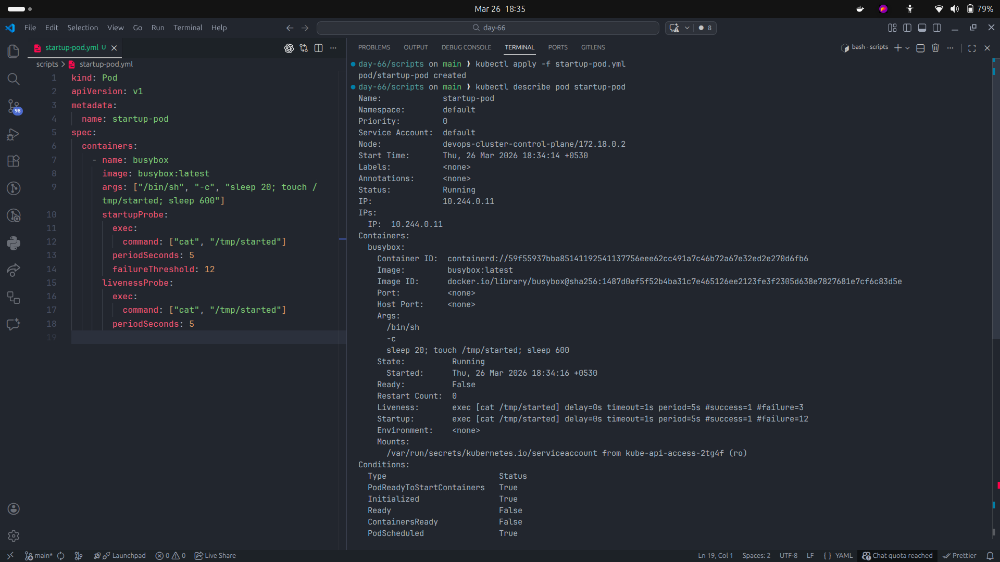

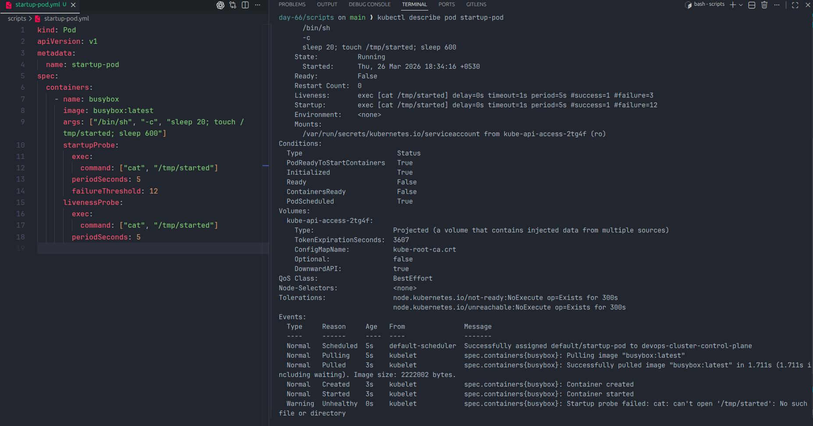

---

## Probe Comparison

| Probe type      | Purpose                                                  | What Kubernetes does on failure                               |
| --------------- | -------------------------------------------------------- | ------------------------------------------------------------- |
| Liveness probe  | Checks whether the container is still healthy/alive      | Restarts the container                                        |
| Readiness probe | Checks whether the container is ready to receive traffic | Removes the Pod from Service endpoints                        |
| Startup probe   | Checks whether a slow app has finished starting          | Delays other probes and can restart if startup never succeeds |

---

## QoS Classes I Saw In This Lab

| Pod              | QoS class    | Why                                                            |
| ---------------- | ------------ | -------------------------------------------------------------- |
| `resources-demo` | `Burstable`  | Requests and limits were both set, but not equal               |
| `stress-pod`     | `Burstable`  | The describe output showed memory request and limit at `100Mi` |
| `huge-request`   | `Burstable`  | Requests were set                                              |
| `liveness-pod`   | `BestEffort` | No CPU or memory requests/limits were defined                  |
| `readiness-pod`  | `BestEffort` | No CPU or memory requests/limits were defined                  |
| `startup-pod`    | `BestEffort` | No CPU or memory requests/limits were defined                  |

---

## Key Takeaways

- Requests affect scheduling, while limits control runtime usage.
- CPU overuse is throttled, but memory pressure causes container termination behavior.
- Very large requests can prevent a Pod from being scheduled at all.
- Liveness probes restart unhealthy containers.
- Readiness probes do not restart containers; they only control traffic flow.
- Startup probes protect slow applications from being killed too early.

---

## Cleanup

I cleaned up the lab resources after testing. A safer targeted cleanup for this exercise is:

```bash
kubectl delete pod resources-demo stress-pod huge-request liveness-pod readiness-pod startup-pod
kubectl delete svc readiness-svc
```
