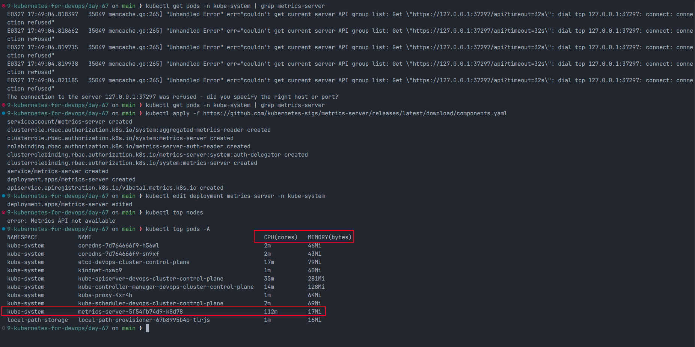
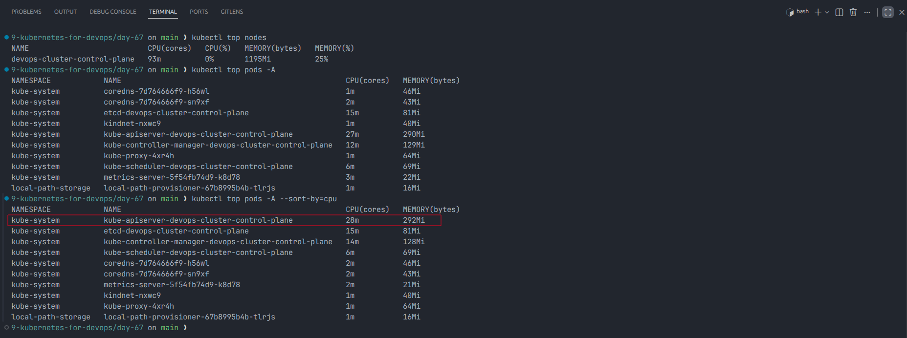
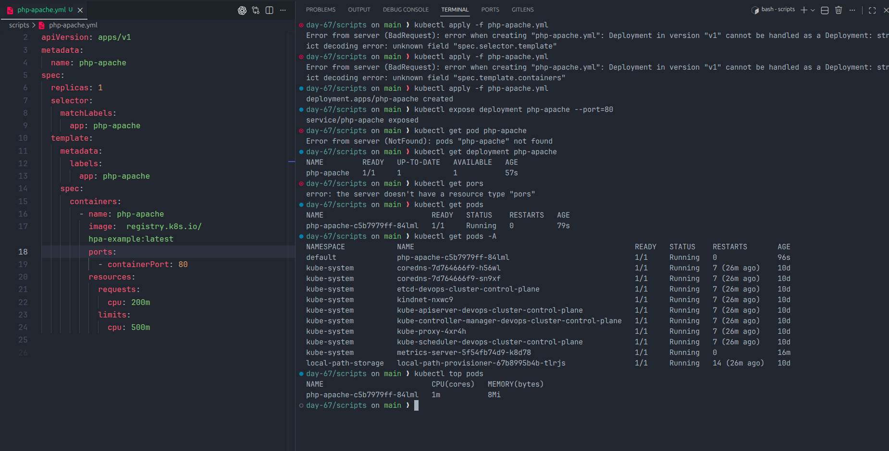
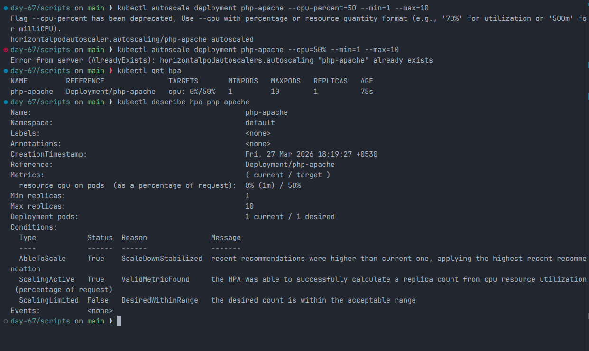
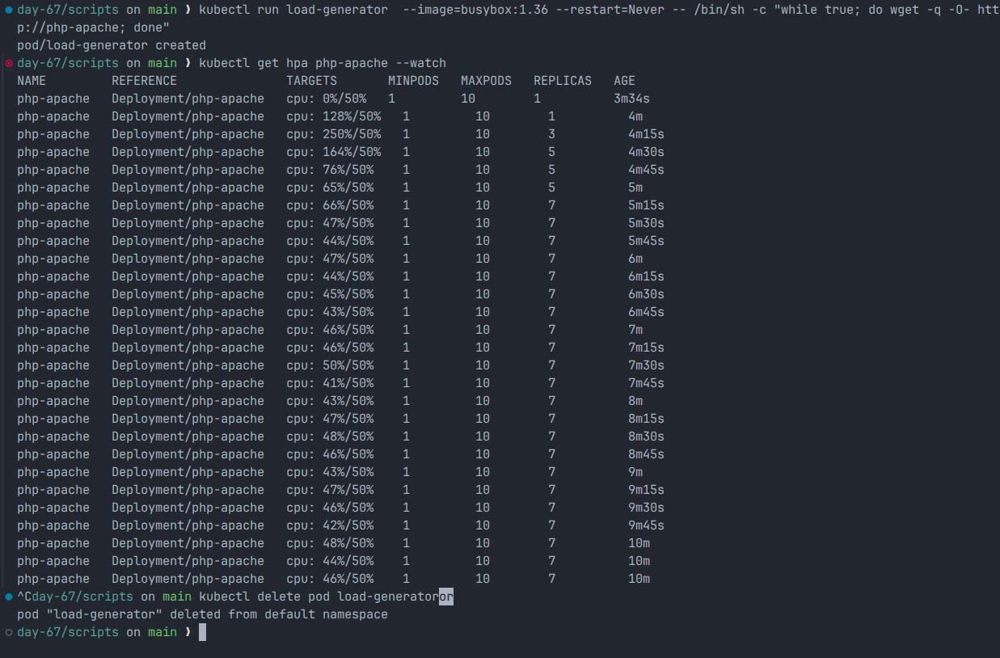
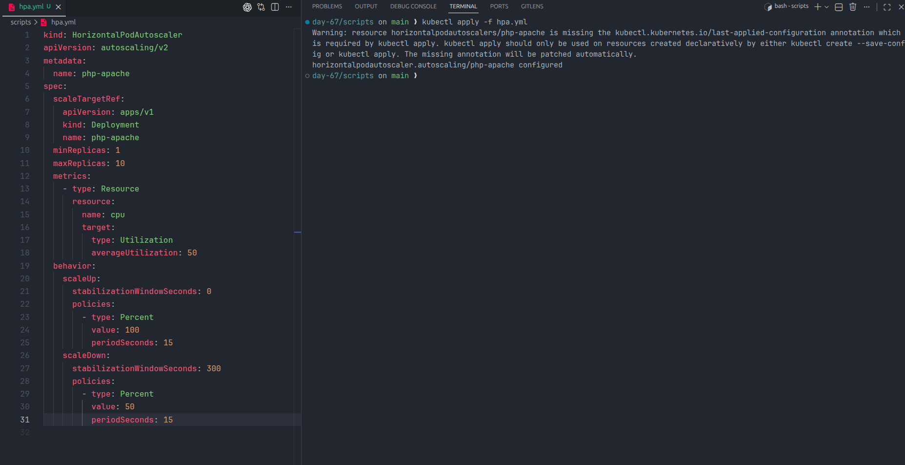
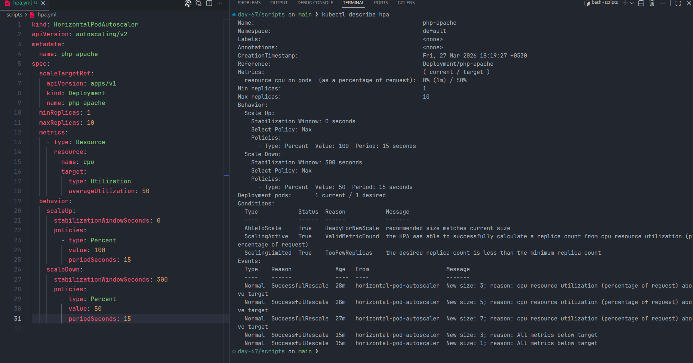
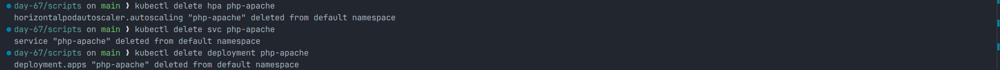

# Day 58 - Metrics Server and Horizontal Pod Autoscaler (HPA)

## Objective

On Day 58, I installed the Kubernetes Metrics Server and used it to power a Horizontal Pod Autoscaler (HPA) for a CPU-intensive `php-apache` deployment. I verified live resource usage with `kubectl top`, generated load, and watched the deployment scale automatically from 1 replica up to 7 replicas.

---

## What Is Metrics Server?

Metrics Server is a cluster-wide Kubernetes component that collects CPU and memory usage data from each node's kubelet and exposes it through the Metrics API.

### Why HPA Needs It

HPA makes scaling decisions from live usage metrics. Without Metrics Server, Kubernetes cannot calculate CPU or memory utilization for pods, so the HPA may show `TARGETS` as `<unknown>` or fail to make scaling decisions.

---

## Task 1 - Install Metrics Server

### Check Whether It Is Already Running

```bash
kubectl get pods -n kube-system | grep metrics-server
```

### Install Metrics Server

For a kind or kubeadm-based local cluster, I used:

```bash
kubectl apply -f https://github.com/kubernetes-sigs/metrics-server/releases/latest/download/components.yaml
```

### Fix TLS for a Local Cluster

On local clusters, kubelet certificate validation can block metrics collection. I edited the deployment and added the insecure TLS flag:

```bash
kubectl edit deployment metrics-server -n kube-system
```

```yaml
- --kubelet-insecure-tls
```

### Verify Metrics Collection

```bash
kubectl top nodes
kubectl top pods -A
```

At first, `kubectl top nodes` returned `error: Metrics API not available`, which is common right after installation while the API registers. After waiting, metrics became available.

**Verification:** My node `devops-cluster-control-plane` reported `93m` CPU and `1195Mi` memory usage, which was about `25%` memory utilization.

### Screenshot



---

## Task 2 - Explore `kubectl top`

```bash
kubectl top nodes
kubectl top pods -A
kubectl top pods -A --sort-by=cpu
```

### What `kubectl top` Shows

| Command | Shows |
| --- | --- |
| `kubectl top` | Real-time CPU and memory usage |
| `kubectl describe` | Configured requests, limits, status, and events |

`kubectl top` shows actual usage, not requested resources. It depends on Metrics Server polling kubelets and publishing fresh values to the Metrics API.

**Verification:** The pod using the most CPU in my cluster at that moment was `kube-apiserver-devops-cluster-control-plane`, using `28m` CPU.

### Screenshot



---

## Task 3 - Create a Deployment with CPU Requests

HPA needs CPU requests so that it can convert raw CPU usage into utilization percentages. For this task I created a deployment using the `registry.k8s.io/hpa-example:latest` image and requested `200m` CPU.

### Deployment Manifest

```yaml
apiVersion: apps/v1
kind: Deployment
metadata:
  name: php-apache
spec:
  replicas: 1
  selector:
    matchLabels:
      app: php-apache
  template:
    metadata:
      labels:
        app: php-apache
    spec:
      containers:
        - name: php-apache
          image: registry.k8s.io/hpa-example:latest
          ports:
            - containerPort: 80
          resources:
            requests:
              cpu: 200m
            limits:
              cpu: 500m
```

### Apply the Deployment and Expose It

```bash
kubectl apply -f scripts/php-apache.yml
kubectl expose deployment php-apache --port=80
```

**Verification:** The running `php-apache` pod was using about `1m` CPU and `8Mi` memory before load generation.

### Screenshot



---

## Task 4 - Create an HPA Imperatively

I created the initial HPA from the command line:

```bash
kubectl autoscale deployment php-apache --cpu-percent=50 --min=1 --max=10
```

Newer `kubectl` versions warn that `--cpu-percent` is deprecated and recommend `--cpu=50%`, but the exercise command still works and creates the HPA successfully.

### Verify the HPA

```bash
kubectl get hpa
kubectl describe hpa php-apache
```

The HPA was configured to keep average CPU usage near `50%` of the requested CPU.

**Verification:** The `TARGETS` column showed `cpu: 0%/50%` once metrics were available.

### Screenshot



---

## Task 5 - Generate Load and Watch Autoscaling

To force the application to scale, I created a continuous load generator:

```bash
kubectl run load-generator --image=busybox:1.36 --restart=Never -- /bin/sh -c "while true; do wget -q -O- http://php-apache; done"
```

Then I watched the HPA respond:

```bash
kubectl get hpa php-apache --watch
```

After the test, I removed the load pod:

```bash
kubectl delete pod load-generator
```

### What Happened

- CPU utilization rose from `0%/50%` to `128%/50%`, then `250%/50%`
- HPA increased replicas from `1` to `3`, then `5`, and then `7`
- Once the extra pods were running, utilization dropped closer to the target range

**Verification:** The HPA scaled the deployment up to **7 replicas** under load.

### Screenshot



---

## Task 6 - Create an HPA from YAML (`autoscaling/v2`)

I deleted the imperative HPA and recreated it declaratively with `autoscaling/v2`, which supports richer behavior tuning than `autoscaling/v1`.

### Declarative HPA Manifest

```yaml
apiVersion: autoscaling/v2
kind: HorizontalPodAutoscaler
metadata:
  name: php-apache
spec:
  scaleTargetRef:
    apiVersion: apps/v1
    kind: Deployment
    name: php-apache
  minReplicas: 1
  maxReplicas: 10
  metrics:
    - type: Resource
      resource:
        name: cpu
        target:
          type: Utilization
          averageUtilization: 50
  behavior:
    scaleUp:
      stabilizationWindowSeconds: 0
      policies:
        - type: Percent
          value: 100
          periodSeconds: 15
    scaleDown:
      stabilizationWindowSeconds: 300
      policies:
        - type: Percent
          value: 50
          periodSeconds: 15
```

### Apply and Verify

```bash
kubectl delete hpa php-apache
kubectl apply -f scripts/hpa.yml
kubectl describe hpa php-apache
```

### What the `behavior` Section Controls

- How aggressively the HPA scales up when metrics are above target
- How slowly it scales down when traffic drops
- How long Kubernetes waits before allowing scale-down
- The maximum change allowed during each scaling period

In my manifest:

- `scaleUp.stabilizationWindowSeconds: 0` allowed immediate scale-up decisions
- `scaleUp` policy allowed up to `100%` growth every `15` seconds
- `scaleDown.stabilizationWindowSeconds: 300` delayed scale-down for five minutes
- `scaleDown` policy limited shrinkage to `50%` every `15` seconds

The HPA events showed successful scaling to `3`, `5`, and `7` replicas under load, and later back down to `3` and `1` when usage dropped.

**Verification:** The `behavior` section controls scaling speed, stabilization windows, and the scale-up or scale-down policy rules.

### Screenshots





---

## Task 7 - Cleanup

I removed the workload resources but left Metrics Server installed:

```bash
kubectl delete pod load-generator --ignore-not-found
kubectl delete hpa php-apache
kubectl delete svc php-apache
kubectl delete deployment php-apache
```

### Screenshot



---

## How HPA Calculates Desired Replicas

For CPU-based autoscaling, HPA compares current average CPU usage with the target percentage and calculates a desired replica count:

```text
desiredReplicas = ceil(currentReplicas * (currentUsage / targetUsage))
```

### Example

- Current replicas: `2`
- Current average CPU utilization: `80%`
- Target CPU utilization: `50%`

```text
desiredReplicas = ceil(2 * (80 / 50))
                = ceil(3.2)
                = 4
```

That means Kubernetes should increase the deployment from `2` pods to `4` pods.

This calculation works only when the workload has CPU requests configured, because utilization is measured as a percentage of the requested CPU, not the node's total CPU.

---

## `autoscaling/v1` vs `autoscaling/v2`

| Feature | `autoscaling/v1` | `autoscaling/v2` |
| --- | --- | --- |
| CPU scaling | Yes | Yes |
| Memory scaling | No | Yes |
| Custom or external metrics | No | Yes |
| Multiple metrics in one HPA | No | Yes |
| Behavior tuning | No | Yes |

`autoscaling/v1` is good for simple CPU-based autoscaling. `autoscaling/v2` is better for production-style workloads because it supports more metric types and gives precise control over scale-up and scale-down behavior.

---

## Scripts Used

### `scripts/php-apache.yml`

This manifest creates the demo deployment with:

- Deployment name: `php-apache`
- Image: `registry.k8s.io/hpa-example:latest`
- Initial replicas: `1`
- CPU request: `200m`
- CPU limit: `500m`
- Container port: `80`

### `scripts/hpa.yml`

This manifest creates the declarative HPA with:

- API version: `autoscaling/v2`
- Target deployment: `php-apache`
- Minimum replicas: `1`
- Maximum replicas: `10`
- Target CPU utilization: `50%`
- Scale-up policy: `100%` every `15s`
- Scale-down policy: `50%` every `15s`
- Scale-down stabilization window: `300s`

---

## Key Learnings

- Metrics Server provides the live usage data that HPA depends on
- `kubectl top` shows actual usage, while `kubectl describe` shows configured resources and events
- CPU requests are required for percentage-based CPU autoscaling
- HPA reacts quickly to rising load but intentionally scales down more slowly
- `autoscaling/v2` is more flexible than `autoscaling/v1` because it supports multiple metrics and scaling behavior rules

---

## Conclusion

On Day 58, I successfully installed Metrics Server, validated live metrics with `kubectl top`, created an HPA, generated CPU load, and watched Kubernetes scale the application from 1 to 7 replicas automatically. This exercise showed how Kubernetes uses real-time metrics and resource requests to handle changing traffic efficiently.
