# Day 59 – Helm — Kubernetes Package Manager

## What is Helm?

Helm is the **package manager for Kubernetes**. It helps you define, install, and manage Kubernetes applications using **Helm Charts** instead of writing many YAML files manually.

Helm is similar to:

- **apt** for Ubuntu
- **yum** for RHEL
- **brew** for macOS

With Helm, one command can deploy:

- Deployment
- Service
- ConfigMap
- Secret
- Ingress
- PVC

---

## Three Core Concepts

### 1. Chart

A **Chart** is a package that contains Kubernetes YAML templates and configuration needed to run an application.

Example:

- nginx chart
- mysql chart
- wordpress chart

### 2. Release

A **Release** is a running instance of a chart in a Kubernetes cluster.

Example:

- You install nginx chart → Release name = my-nginx

### 3. Repository

A **Repository** is a collection of Helm charts.

Example:

- Bitnami Helm Repo

---

## Task 1 – Install Helm

### Install Helm (Linux)

```bash
curl https://raw.githubusercontent.com/helm/helm/main/scripts/get-helm-3 | bash
```

### Verify Installation

```bash
helm version
helm env
```

### Screenshots

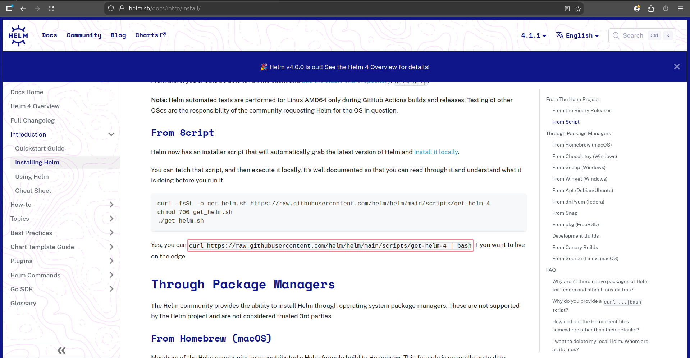

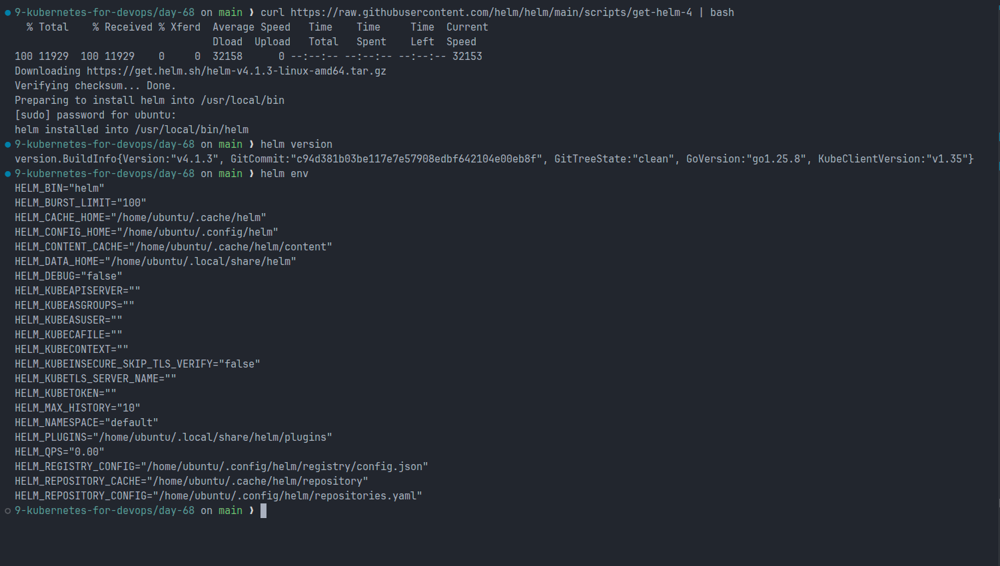

---

## Task 2 – Add Repository and Search Charts

```bash
helm repo add bitnami https://charts.bitnami.com/bitnami
helm repo update

helm search repo nginx
helm search repo bitnami
```

Bitnami repository contains **many production-ready charts** like nginx, mysql, redis, mongodb, wordpress, etc.

### Screenshots

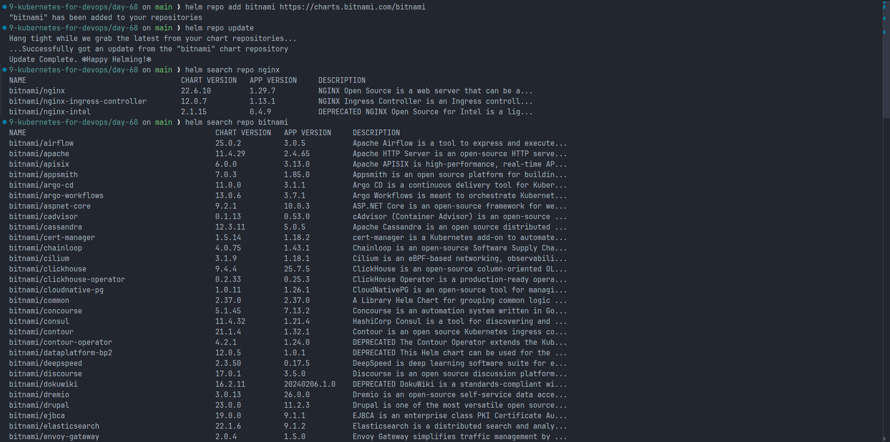

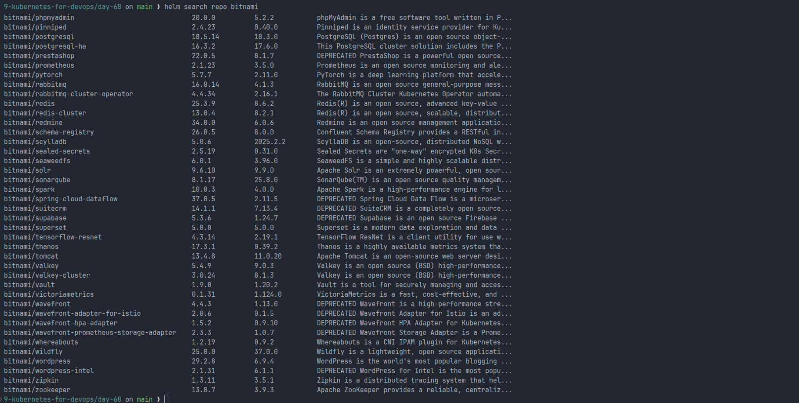

---

## Task 3 – Install a Chart

```bash
helm install my-nginx bitnami/nginx
```

### Verify Resources

```bash
kubectl get all
helm list
helm status my-nginx
helm get manifest my-nginx
```

Helm automatically created:

- Deployment
- Service
- ConfigMap
- Pod

### Screenshots

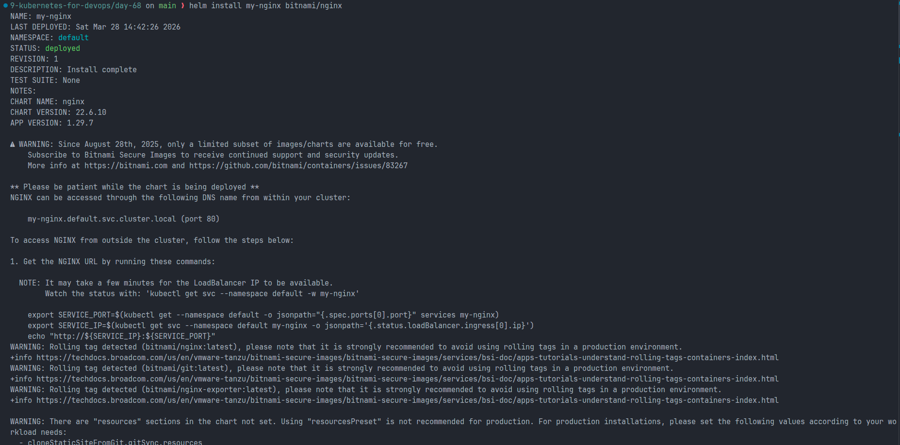

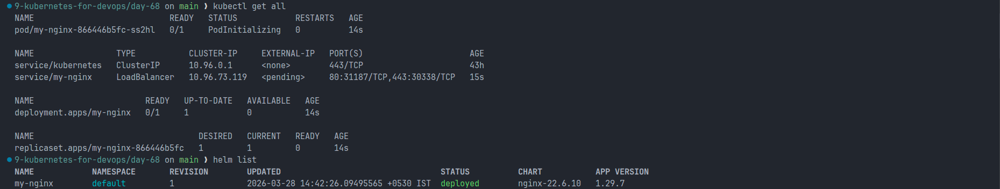

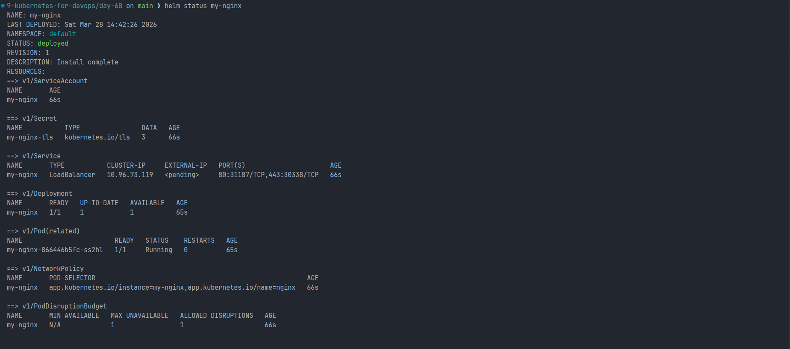

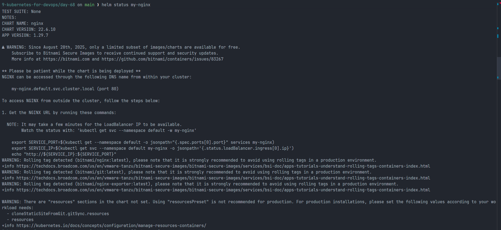

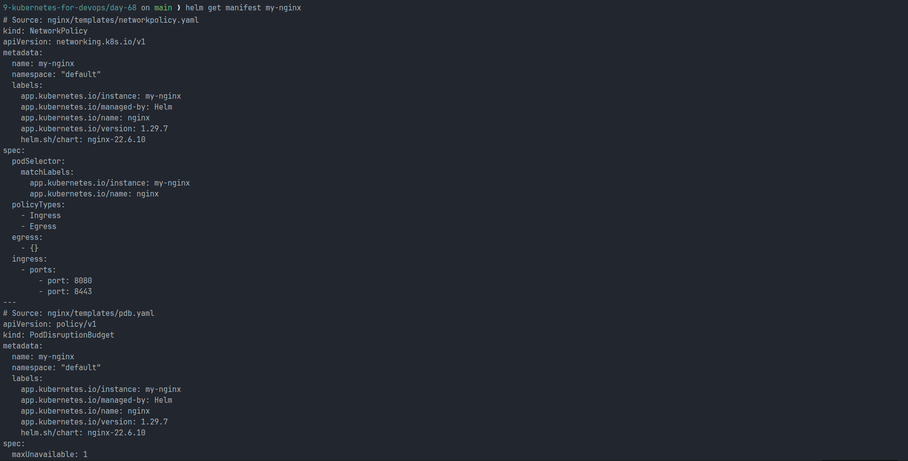

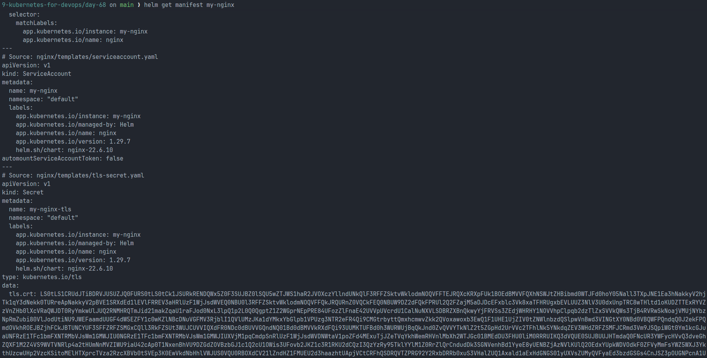

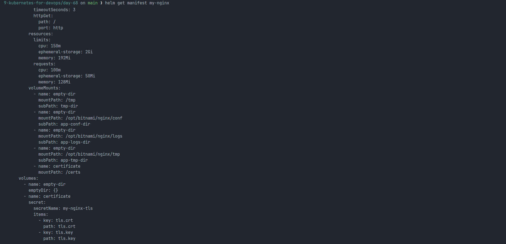

---

## Task 4 – Customize with Values

### View Default Values

```bash
helm show values bitnami/nginx
```

### Install with Custom Values Using --set

```bash
helm install my-nginx-custom bitnami/nginx \
  --set replicaCount=3 \
  --set service.type=NodePort
```

### custom-values.yaml

```yaml
replicaCount: 3

service:
  type: NodePort
  port: 80

resources:
  limits:
    cpu: 200m
    memory: 256Mi
  requests:
    cpu: 100m
    memory: 128Mi
```

### Install Using Values File

```bash
helm install my-nginx-values bitnami/nginx -f custom-values.yaml
```

### Verify Values

```bash
helm get values my-nginx-values
```

### Screenshots

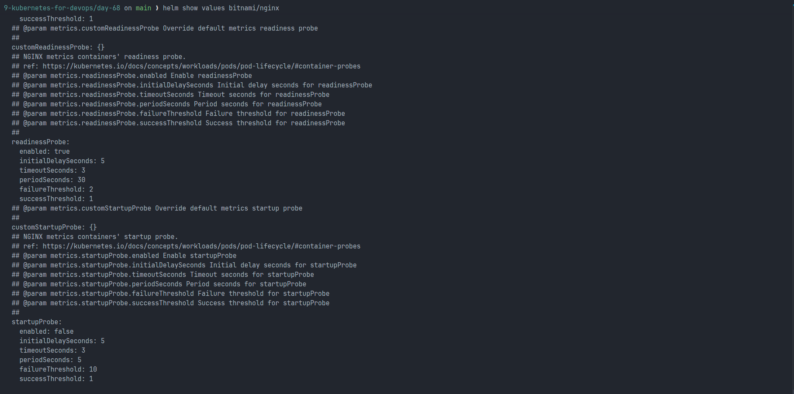

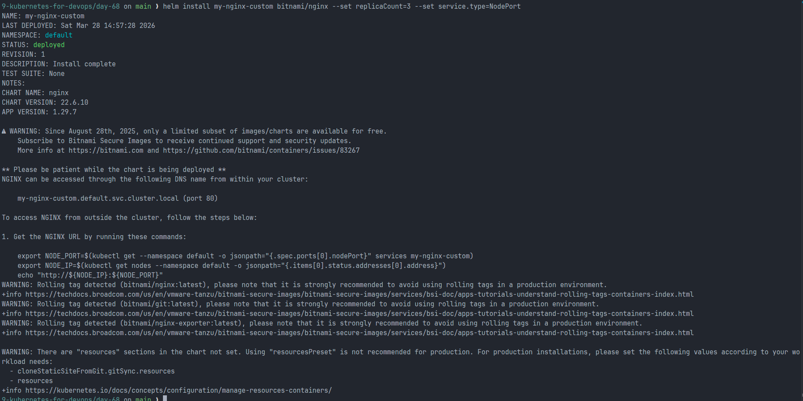

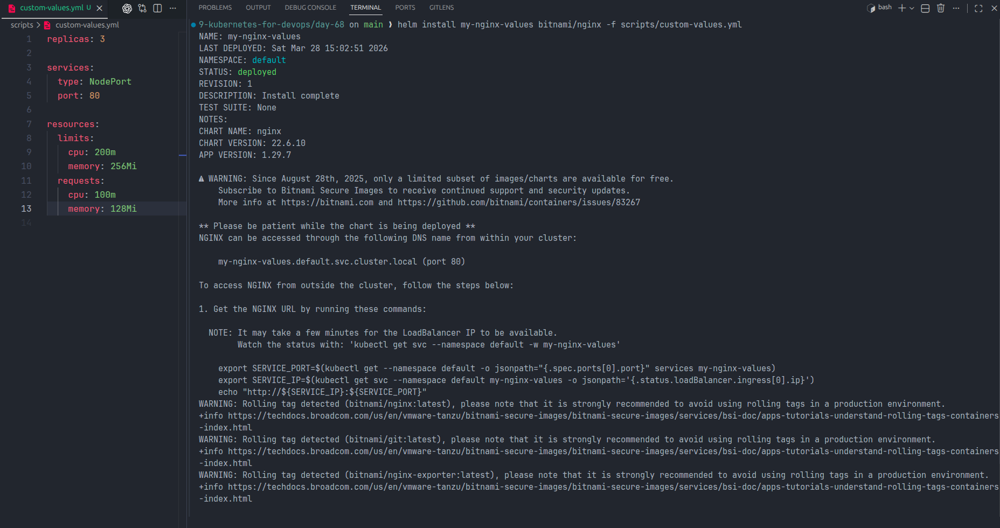

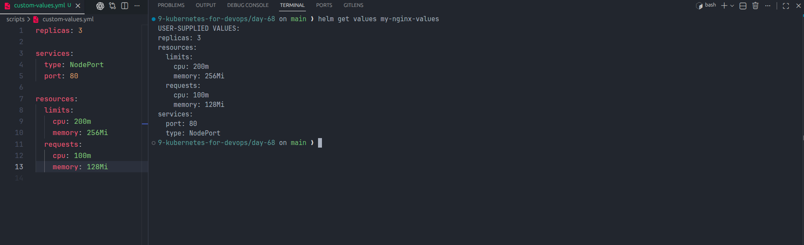

---

## Task 5 – Upgrade and Rollback

### Upgrade Release

```bash
helm upgrade my-nginx bitnami/nginx --set replicaCount=5
```

### Check History

```bash
helm history my-nginx
```

### Rollback

```bash
helm rollback my-nginx 1
```

Rollback creates a **new revision** instead of overwriting the old one.

### Screenshots

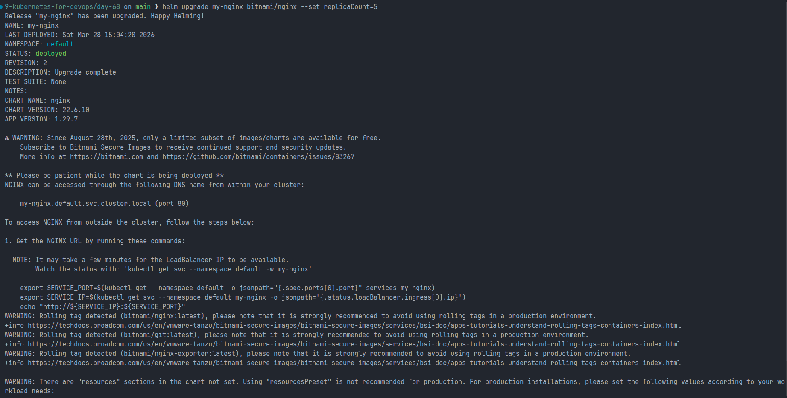

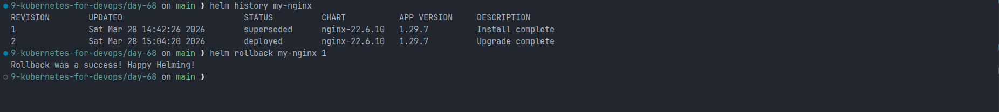

---

## Task 6 – Create Your Own Chart

### Create Chart

```bash
helm create my-app
```

### Chart Structure

```
my-app/
  Chart.yaml
  values.yaml
  charts/
  templates/
      deployment.yaml
      service.yaml
      ingress.yaml
      _helpers.tpl
```

### Important Files

| File          | Purpose                   |
| ------------- | ------------------------- |
| Chart.yaml    | Chart metadata            |
| values.yaml   | Default values            |
| templates/    | Kubernetes YAML templates |
| \_helpers.tpl | Template helpers          |

### Go Template Example

```yaml
replicas: { { .Values.replicaCount } }
image: { { .Values.image.repository } }
name: { { .Chart.Name } }
release: { { .Release.Name } }
```

### Edit values.yaml

```yaml
replicaCount: 3

image:
  repository: nginx
  tag: "1.25"
```

### Validate and Install

```bash
helm lint my-app
helm template my-release ./my-app
helm install my-release ./my-app
```

### Upgrade

```bash
helm upgrade my-release ./my-app --set replicaCount=5
```

### Screenshots

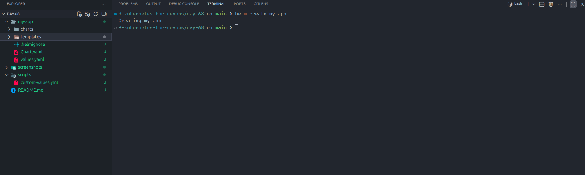

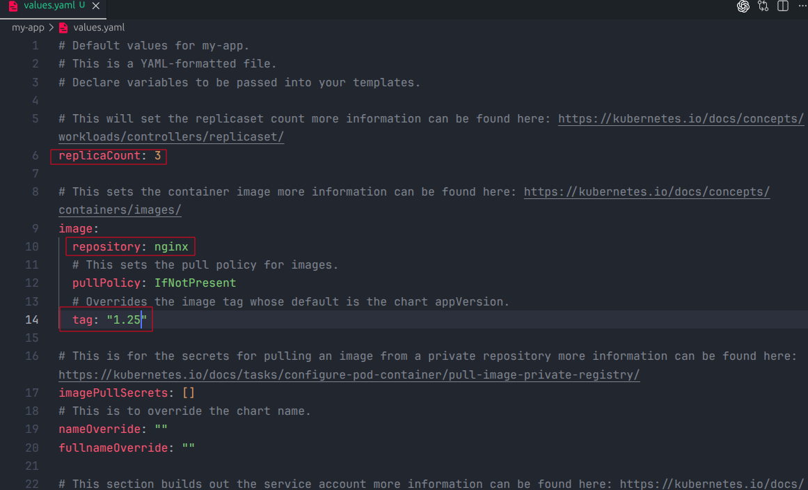

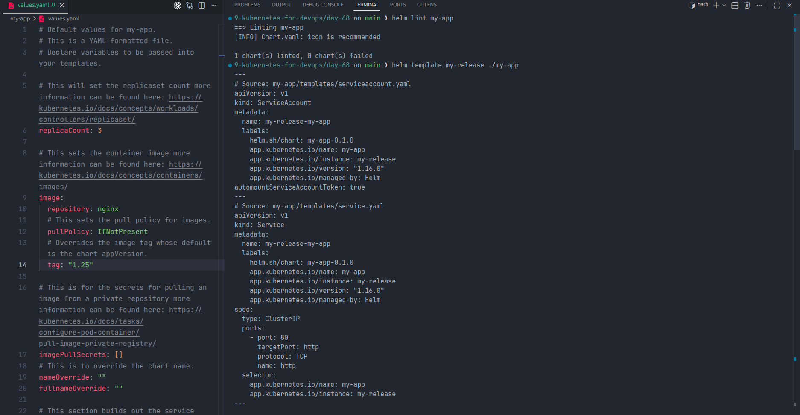

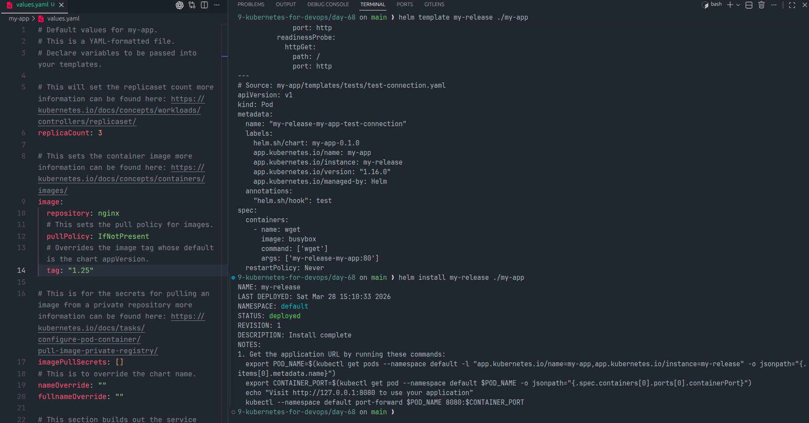

---

## Task 7 – Cleanup

```bash
helm uninstall my-nginx
helm uninstall my-nginx-custom
helm uninstall my-nginx-values
helm uninstall my-release

helm list
```

If you want to keep history:

```bash
helm uninstall my-nginx --keep-history
```

### Screenshot

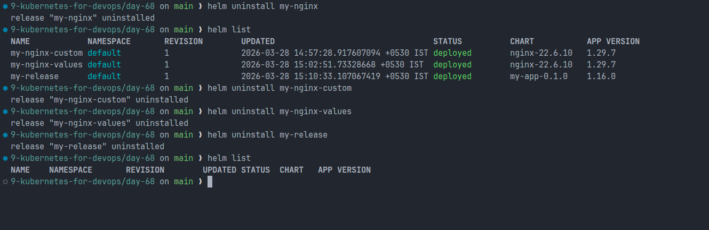

---

## Important Helm Commands Summary

| Command          | Purpose             |
| ---------------- | ------------------- |
| helm install     | Install a chart     |
| helm list        | List releases       |
| helm status      | Show release status |
| helm upgrade     | Upgrade release     |
| helm rollback    | Rollback release    |
| helm uninstall   | Remove release      |
| helm show values | Show default values |
| helm get values  | Show custom values  |
| helm template    | Render YAML         |
| helm lint        | Validate chart      |

---

## Key Learning Summary

Today I learned:

- Helm is Kubernetes package manager
- Helm uses Charts, Releases, and Repositories
- Installed applications using Helm charts
- Customized applications using values.yaml
- Upgraded and rolled back releases
- Created my own Helm chart
- Used Go templating in Helm

Helm makes Kubernetes application deployment **faster, reusable, and production-ready**.
