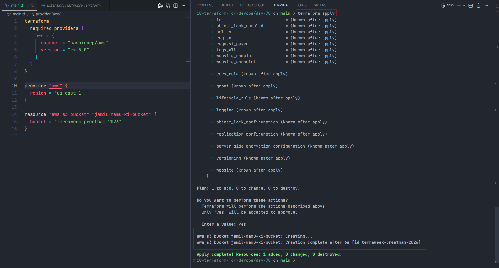
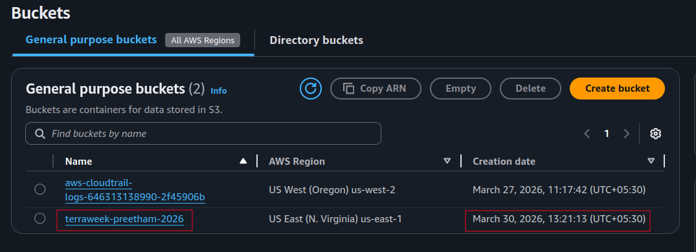
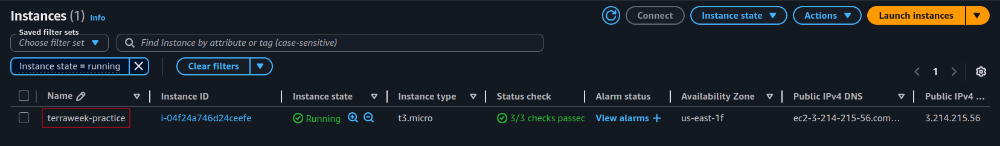
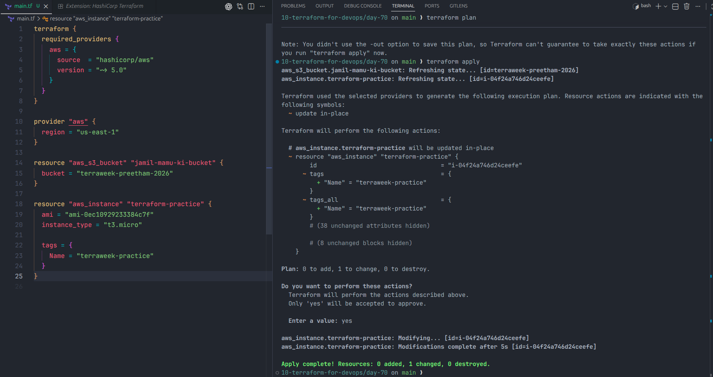

# Day 70 - Introduction to Terraform and Your First AWS Infrastructure

## Task 1: What is Infrastructure as Code (IaC)?

Infrastructure as Code (IaC) means creating and managing infrastructure through code instead of manually clicking through a cloud console. In DevOps, this matters because the same infrastructure can be created again and again in a consistent way. It improves automation, reduces human error, and makes infrastructure easy to track in Git. IaC also acts like documentation because the setup is written clearly in code.

IaC solves problems such as manual mistakes, inconsistent environments, and slow infrastructure setup. Instead of remembering every step in AWS, we can define everything in a file and let Terraform build it for us.

Terraform is different from some other tools in these ways:

- Terraform is declarative and works across multiple cloud providers.
- AWS CloudFormation is AWS-specific.
- Ansible is mainly used for configuration management and automation after machines are available.
- Pulumi also supports IaC, but it uses general-purpose languages such as Python, JavaScript, and TypeScript.

Terraform is called declarative because we describe the final infrastructure we want, and Terraform decides how to create it. It is cloud-agnostic because the same Terraform workflow can be used with AWS, Azure, GCP, and other providers.

---

## Task 2: Install Terraform and Configure AWS

### Install Terraform on Ubuntu

```bash
wget -O - https://apt.releases.hashicorp.com/gpg | sudo gpg --dearmor -o /usr/share/keyrings/hashicorp-archive-keyring.gpg
echo "deb [signed-by=/usr/share/keyrings/hashicorp-archive-keyring.gpg] https://apt.releases.hashicorp.com $(lsb_release -cs) main" | sudo tee /etc/apt/sources.list.d/hashicorp.list
sudo apt update && sudo apt install terraform
```

### Verify Terraform

```bash
terraform -version
```

### Configure AWS CLI

```bash
aws configure
```

### Verify AWS Access

```bash
aws sts get-caller-identity
```

For this project, the Terraform configuration uses the `us-east-1` region.

---

## Task 3: Create S3 Bucket Using Terraform

### `main.tf` used in this folder

```hcl
terraform {
  required_providers {
    aws = {
      source  = "hashicorp/aws"
      version = "~> 5.0"
    }
  }
}

provider "aws" {
  region = "us-east-1"
}

resource "aws_s3_bucket" "jamil-mamu-ki-bucket" {
  bucket = "terraweek-preetham-2026"
}
```

### Terraform Commands

```bash
terraform init
terraform plan
terraform apply
```

### Screenshots





### What `terraform init` did

`terraform init` initialized the working directory, downloaded the AWS provider plugin, and prepared Terraform to manage the resources defined in `main.tf`. It also creates the `.terraform/` directory, which stores downloaded providers and other initialization data needed for this project.

---

## Task 4: Add EC2 Instance

The same Terraform file was extended with an EC2 resource:

```hcl
resource "aws_instance" "terraform-practice" {
  ami           = "ami-0ec10929233384c7f"
  instance_type = "t3.micro"

  tags = {
    Name = "terraweek-practice"
  }
}
```

### Run

```bash
terraform plan
terraform apply
```

### Screenshot



### How Terraform knows what already exists

Terraform uses the `terraform.tfstate` file to track the infrastructure it has already created. When `terraform plan` runs, Terraform compares the code in `main.tf` with the recorded state and the real infrastructure in AWS. Because of that, Terraform can tell which resources already exist and which resources need to be created or updated.

---

## Task 5: Terraform State File

### Useful Commands

```bash
terraform show
terraform state list
terraform state show aws_s3_bucket.jamil-mamu-ki-bucket
terraform state show aws_instance.terraform-practice
```

### What the state file contains

The state file stores important information about each managed resource, such as:

- Resource IDs
- ARNs
- Current attributes
- Tags
- Region and metadata
- Dependency information

### Why the state file matters

Terraform depends on the state file to understand what it manages. Without it, Terraform cannot safely compare the desired configuration with the existing infrastructure.

### Why we should not edit it manually

Manual edits can break the mapping between Terraform code and the real cloud resources. That can lead to incorrect plans, failed applies, or accidental recreation and deletion of infrastructure.

### Why it should not be committed to Git

The state file can contain sensitive infrastructure details such as IDs, public IP addresses, and other metadata. It also changes often, so committing it can create unnecessary conflicts in version control.

---

## Task 6: Modify, Plan, and Destroy

After the EC2 resource was added, Terraform was also used to make an in-place update to the EC2 instance tags.

### Screenshot of the in-place update



### Symbols in `terraform plan`

- `+` means Terraform will create a resource.
- `~` means Terraform will update a resource in place.
- `-` means Terraform will destroy a resource.

In this case, Terraform showed an in-place update for the EC2 instance tags instead of destroying and recreating the instance.

### Destroy Infrastructure

```bash
terraform destroy
```

This command removes all resources managed by the current Terraform configuration.

---

## Terraform Commands Summary

| Command                | What it does                                             |
| ---------------------- | -------------------------------------------------------- |
| `terraform init`       | Initializes the project and downloads required providers |
| `terraform plan`       | Shows what Terraform will create, update, or destroy     |
| `terraform apply`      | Applies the planned infrastructure changes               |
| `terraform destroy`    | Removes the managed infrastructure                       |
| `terraform show`       | Displays the current state in a readable format          |
| `terraform state list` | Lists all resources Terraform is currently managing      |

---

## `.gitignore`

```gitignore
.terraform/
*.tfstate
*.tfstate.backup
```

---

## Outcome

Today I used Terraform to define AWS infrastructure as code, create an S3 bucket, and manage an EC2 instance from a single `main.tf` file. I also learned how Terraform uses the state file to track infrastructure and how `plan`, `apply`, and `destroy` control the full lifecycle of cloud resources.
