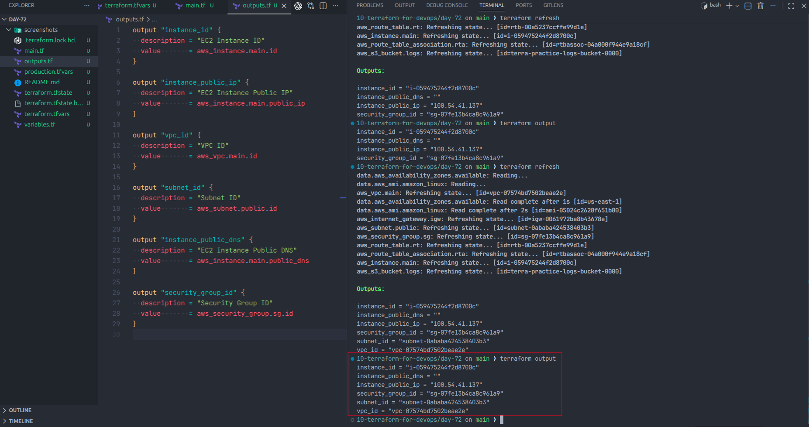
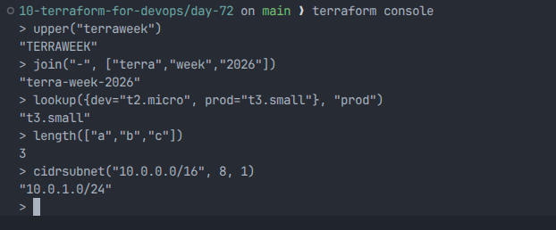
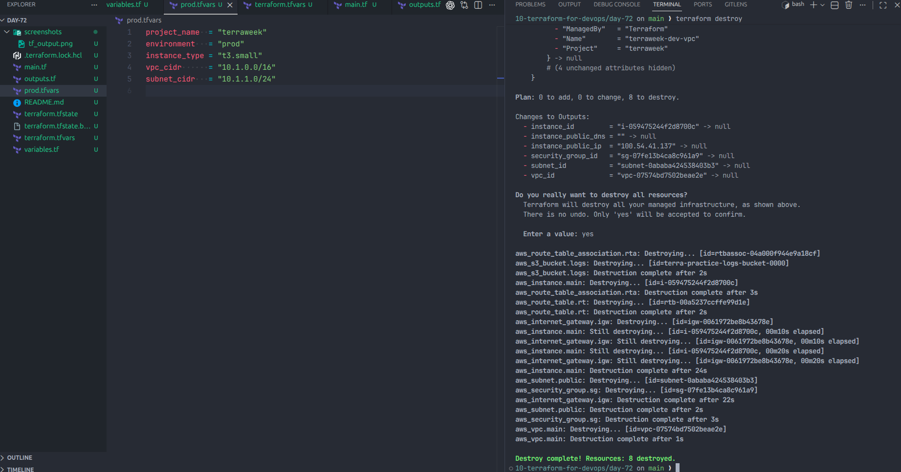

# Day 63 – Variables, Outputs, Data Sources and Expressions

## Project Overview

On Day 63, I refactored my Terraform configuration to make it dynamic, reusable, and environment-aware by removing hardcoded values and using variables, tfvars files, outputs, data sources, locals, and built-in functions.

---

## Task 1 – Extract Variables

I created a `variables.tf` file and defined input variables to remove hardcoded values from the Terraform configuration.

### variables.tf

```hcl
variable "region" {
  description = "AWS region"
  type        = string
  default     = "us-east-1"
}

variable "vpc_cidr" {
  description = "VPC CIDR block"
  type        = string
  default     = "10.0.0.0/16"
}

variable "subnet_cidr" {
  description = "Subnet CIDR block"
  type        = string
  default     = "10.0.1.0/24"
}

variable "instance_type" {
  description = "EC2 instance type"
  type        = string
  default     = "t3.micro"
}

variable "project_name" {
  description = "Project name for tagging resources"
  type        = string
  default     = "MyProject"
}

variable "environment" {
  description = "Environment name for tagging resources"
  type        = string
  default     = "dev"
}

variable "allowed_ports" {
  description = "List of allowed ports"
  type        = list(number)
  default     = [22, 80, 443]
}

variable "extra_tags" {
  description = "Additional tags to apply to resources"
  type        = map(string)
  default     = {}
}
```

### Terraform Variable Types

Terraform supports five main variable types:

- string
- number
- bool
- list
- map

---

## Task 2 – Variable Files and Precedence

### terraform.tfvars (Dev)

```hcl
project_name  = "terraweek"
environment   = "dev"
instance_type = "t3.micro"
```

### prod.tfvars

```hcl
project_name  = "terraweek"
environment   = "prod"
instance_type = "t3.small"
vpc_cidr      = "10.1.0.0/16"
subnet_cidr   = "10.1.1.0/24"
```

### Variable Precedence (Low → High)

1. Default values in variables.tf
2. terraform.tfvars
3. \*.auto.tfvars
4. -var-file
5. -var
6. `TF_VAR_*` environment variables

---

## Task 3 – Outputs

### outputs.tf

```hcl
output "instance_id" {
  description = "EC2 Instance ID"
  value       = aws_instance.main.id
}

output "instance_public_ip" {
  description = "EC2 Instance Public IP"
  value       = aws_instance.main.public_ip
}

output "vpc_id" {
  description = "VPC ID"
  value       = aws_vpc.main.id
}

output "subnet_id" {
  description = "Subnet ID"
  value       = aws_subnet.public.id
}

output "instance_public_dns" {
  description = "EC2 Instance Public DNS"
  value       = aws_instance.main.public_dns
}

output "security_group_id" {
  description = "Security Group ID"
  value       = aws_security_group.sg.id
}
```

### Screenshot



This screenshot was taken before running `terraform destroy`, which is why the current local state may no longer show these output values.

---

## Task 4 – Data Sources

### AMI Data Source

```hcl
data "aws_ami" "amazon_linux" {
  most_recent = true
  owners      = ["amazon"]

  filter {
    name   = "name"
    values = ["amzn2-ami-hvm-*"]
  }

  filter {
    name   = "virtualization-type"
    values = ["hvm"]
  }

  filter {
    name   = "root-device-type"
    values = ["ebs"]
  }

  filter {
    name   = "architecture"
    values = ["x86_64"]
  }
}
```

### Availability Zones Data Source

```hcl
data "aws_availability_zones" "available" {
  state = "available"
}
```

### Difference Between Resource and Data Source

- Resource: Creates infrastructure (EC2, VPC, Subnet)
- Data Source: Fetches existing information (AMI ID, Availability Zones)

---

## Task 5 – Locals

```hcl
locals {
  name_prefix = "${var.project_name}-${var.environment}"

  common_tags = {
    Project     = var.project_name
    Environment = var.environment
    ManagedBy   = "Terraform"
  }
}
```

Used merge function for tags:

```hcl
tags = merge(local.common_tags, {
  Name = "${local.name_prefix}-server"
})
```

---

## Task 6 – Built-in Functions and Conditional Expressions

### Useful Terraform Functions

1. upper("terraweek") → Converts string to uppercase
2. join("-", ["terra", "week", "2026"]) → Joins list into string
3. lookup({dev = "t2.micro", prod = "t3.small"}, "prod") → Gets value from map
4. length(["a", "b", "c"]) → Counts number of elements
5. cidrsubnet("10.0.0.0/16", 8, 1) → Creates subnet from CIDR

### Conditional Expression

```hcl
instance_type = var.environment == "prod" ? "t3.small" : "t3.micro"
```

### Screenshot



---

## Terraform Lifecycle

Terraform follows a lifecycle to manage infrastructure:

1. terraform init – Initialize project
2. terraform plan – Preview changes
3. terraform apply – Create infrastructure
4. terraform output – Show resource values
5. terraform destroy – Delete infrastructure

### Screenshot



---

## Difference Between Terraform Components

| Component | Purpose                      |
| --------- | ---------------------------- |
| variable  | Input values                 |
| local     | Internal reusable values     |
| output    | Values printed after apply   |
| data      | Fetch existing resource info |

---

## Outcome

- Converted Terraform config into reusable, environment-based configuration
- Removed hardcoded values
- Implemented variables, tfvars, outputs, data sources, locals, and functions
- Infrastructure can now be deployed in multiple environments without changing the code
