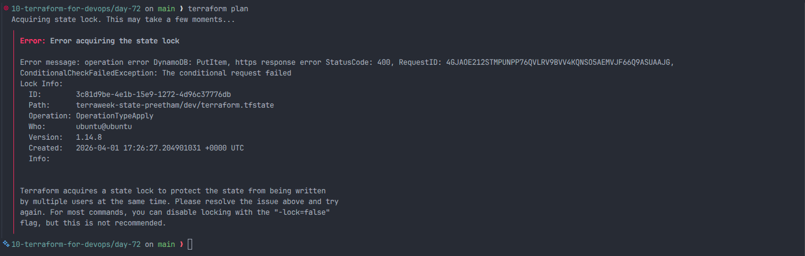
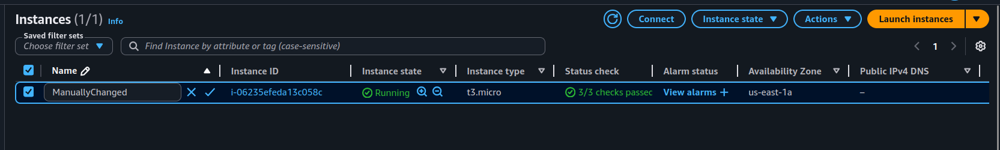

# Day 64 – Terraform State Management and Remote Backends

## Project Overview

On Day 64, I learned and implemented Terraform State Management, which is one of the most critical concepts in Terraform. The Terraform state file acts as the source of truth that maps Terraform configuration to real-world infrastructure. In this task, I inspected the Terraform state, migrated the state from local to a remote backend using AWS S3, enabled state locking using DynamoDB, imported existing AWS resources into Terraform, performed state operations, and simulated infrastructure drift.

---

# Task 1 – Inspect Current Terraform State

## Commands Used

```bash
terraform state list
terraform show
terraform state show aws_instance.main
terraform state show aws_vpc.main
cat terraform.tfstate | grep serial
```

## How many resources does Terraform track?

Terraform was tracking the following resources and data sources:

### Data Sources

- data.aws_ami.amazon_linux
- data.aws_availability_zones.available

### AWS Resources

- aws_instance.main
- aws_internet_gateway.igw
- aws_route_table.rt
- aws_route_table_association.rta
- aws_s3_bucket.logs
- aws_security_group.sg
- aws_subnet.public
- aws_vpc.main

**Total resources tracked by Terraform: 10**

This shows Terraform state tracks both resources and data sources.

## What attributes does the state store for an EC2 instance?

Terraform state stores many attributes including:

### Basic Attributes

- Instance ID
- AMI ID
- Instance type
- Availability zone
- Subnet ID
- Security group IDs
- Public IP
- Private IP
- Tags
- ARN

### Computed Attributes

- Root block device details
- Network interface details
- CPU options
- Credit specification
- Metadata options
- Monitoring configuration
- Instance state
- Tenancy

This shows Terraform state stores the complete infrastructure configuration, including computed attributes generated by AWS.

## What does the serial number represent?

From the terraform.tfstate file:

```json
"serial": 33
```

The serial number represents the version of the Terraform state file. Every time Terraform updates infrastructure or state, the serial number increases.

**Serial number = State file version**

---

# Task 2 – Migrate Terraform State to S3 Remote Backend

## Objective

The objective was to migrate Terraform state from local backend to a remote backend using AWS S3 for state storage and DynamoDB for state locking.

## Steps Performed

### 1. Created S3 Bucket

```bash
aws s3api create-bucket --bucket terraweek-state-preetham --region us-east-1
```

### 2. Enabled Versioning

```bash
aws s3api put-bucket-versioning \
  --bucket terraweek-state-preetham \
  --versioning-configuration Status=Enabled
```

### 3. Created DynamoDB Table for Locking

```bash
aws dynamodb create-table \
  --table-name terraweek-state-lock \
  --attribute-definitions AttributeName=LockID,AttributeType=S \
  --key-schema AttributeName=LockID,KeyType=HASH \
  --billing-mode PAY_PER_REQUEST \
  --region us-east-1
```

### 4. Configured Backend in Terraform

```hcl
terraform {
  backend "s3" {
    bucket         = "terraweek-state-preetham"
    key            = "dev/terraform.tfstate"
    region         = "us-east-1"
    dynamodb_table = "terraweek-state-lock"
    encrypt        = true
  }
}
```

### 5. Migrated State

```bash
terraform init
```

Selected "yes" to migrate existing state to S3.

### 6. Verified Remote State

```bash
terraform plan
aws s3 ls s3://terraweek-state-preetham/dev/
```

State file was successfully stored in S3.

## Architecture

```
Terraform → S3 (State File)
           ↓
        DynamoDB (State Lock)
```

---

# Task 3 – Terraform State Locking

## Locking Test

I opened two terminals and ran terraform apply in one terminal and terraform plan in another terminal.

Terraform produced a state lock error because the state was already locked by another operation.

### Screenshot Evidence

State lock error when `terraform plan` tried to run while another operation was already holding the lock:



## Why Locking is Important

State locking prevents multiple users from modifying Terraform state at the same time. This prevents:

- State corruption
- Infrastructure conflicts
- Accidental deletion
- Overwriting changes

If the lock gets stuck, we can use:

```bash
terraform force-unlock <LOCK_ID>
```

---

# Task 4 – Import Existing Resource

## Steps Performed

1. Created S3 bucket manually in AWS
2. Added resource block in Terraform
3. Imported resource into Terraform state

```bash
terraform import aws_s3_bucket.imported terraweek-import-test-preetham
```

Terraform successfully imported the existing bucket into Terraform state.

## Key Concept

Terraform compares configuration with state. If a resource exists in state but not in configuration, Terraform will destroy it.

---

# Task 5 – Terraform State Surgery

## Rename Resource

```bash
terraform state mv aws_s3_bucket.imported aws_s3_bucket.logs_bucket
```

## Remove Resource From State

```bash
terraform state rm aws_s3_bucket.logs_bucket
```

This removed the resource from Terraform state but did not delete it in AWS.

## Re-import Resource

```bash
terraform import aws_s3_bucket.logs_bucket terraweek-import-test-preetham
```

## When to Use

| Command            | Use Case                              |
| ------------------ | ------------------------------------- |
| terraform state mv | Rename resource                       |
| terraform state rm | Stop Terraform from managing resource |
| terraform import   | Import existing resource              |

---

# Task 6 – Terraform State Drift

## Drift Simulation

I manually changed the EC2 instance tag in AWS console.

### Screenshot Evidence

The EC2 instance tag was manually changed in the AWS console to simulate infrastructure drift:



Then ran:

```bash
terraform plan
```

Terraform detected drift and showed changes.

## Fix Drift

```bash
terraform apply
```

Terraform updated infrastructure to match Terraform configuration.

## How Teams Prevent Drift

- Restrict console access
- Use IAM policies
- Use CI/CD pipelines
- Run terraform plan regularly

---

# Key Learnings

- Terraform state is the source of truth
- Always use remote backend
- Enable state locking
- Enable S3 versioning
- Never edit state file manually
- Prevent infrastructure drift

---

# Conclusion

On Day 64, I learned how to manage Terraform state professionally using remote backends, state locking, importing resources, state operations, and drift management. This is a critical concept for real-world DevOps and Infrastructure as Code environments.
