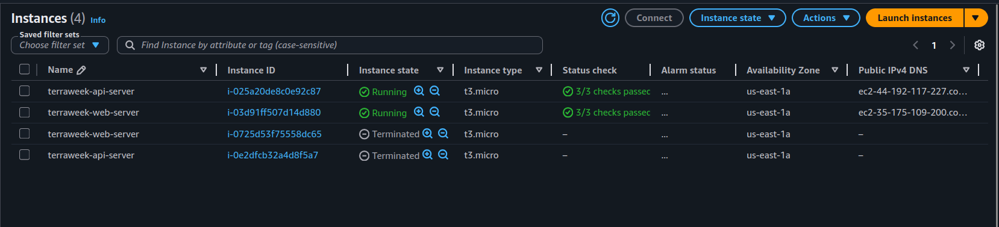
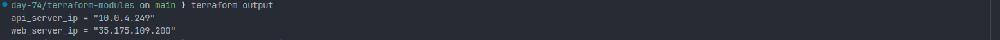
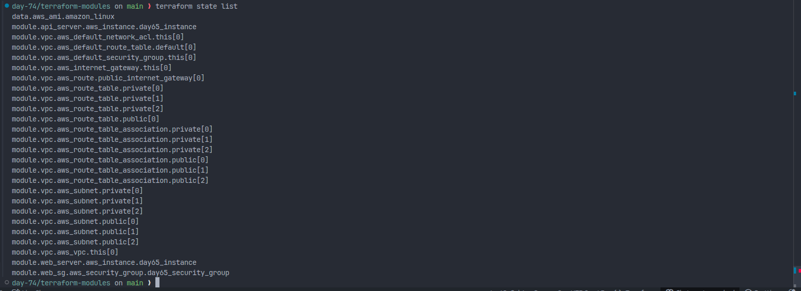
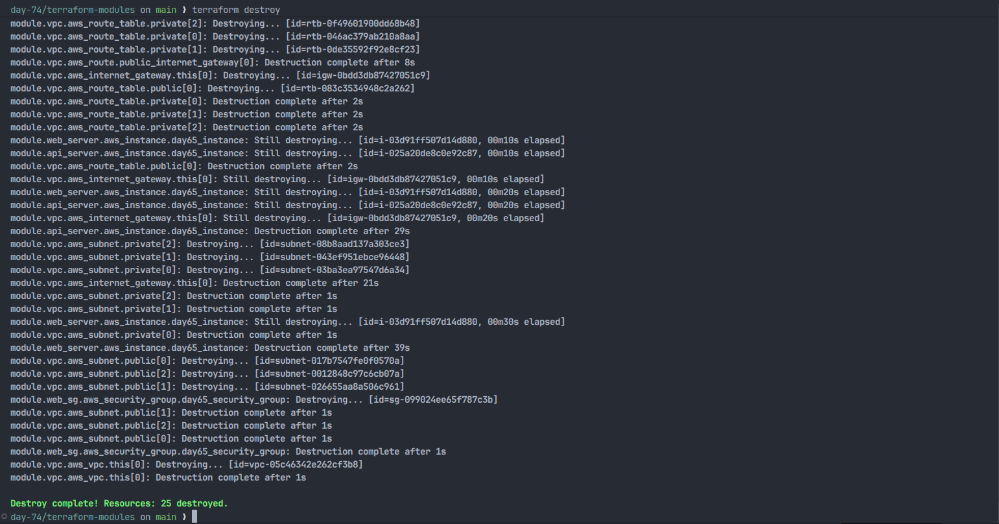

# Day 65 — Terraform Modules: Build Reusable Infrastructure

## Overview

Today I learned how to use Terraform Modules to build reusable infrastructure. Instead of writing all resources in one `main.tf`, I created reusable modules for EC2 and Security Groups and used the official Terraform AWS VPC registry module.

This is how real-world Terraform projects are structured for scalability and reusability.

---

## Root Module vs Child Module

**Root Module:**
The root module is the main Terraform configuration where we run `terraform init`, `terraform plan`, and `terraform apply`. It calls child modules and connects all resources together.

**Child Module:**
A child module is a reusable Terraform configuration stored in a separate folder. It accepts input variables and returns outputs.

**Simple Analogy:**

- Root module = Main program
- Child module = Function

---

## Terraform Project Structure

```
terraform-modules/
│
├── main.tf
├── variables.tf
├── outputs.tf
├── providers.tf
├── versions.tf
├── locals.tf
├── day-65-modules.md
├── .gitignore
│
└── modules/
    ├── ec2-instance/
    │   ├── main.tf
    │   ├── variables.tf
    │   └── outputs.tf
    │
    └── security-group/
        ├── main.tf
        ├── variables.tf
        └── outputs.tf
```

---

## EC2 Module

### modules/ec2-instance/variables.tf

```hcl
variable "ami_id" {
  type = string
}

variable "instance_type" {
  type    = string
  default = "t3.micro"
}

variable "subnet_id" {
  type = string
}

variable "security_group_ids" {
  type = list(string)
}

variable "instance_name" {
  type = string
}

variable "tags" {
  type    = map(string)
  default = {}
}
```

### modules/ec2-instance/main.tf

```hcl
resource "aws_instance" "this" {
  ami                         = var.ami_id
  instance_type               = var.instance_type
  subnet_id                   = var.subnet_id
  vpc_security_group_ids      = var.security_group_ids
  associate_public_ip_address = true

  tags = merge(
    {
      Name = var.instance_name
    },
    var.tags
  )
}
```

### modules/ec2-instance/outputs.tf

```hcl
output "instance_id" {
  value = aws_instance.this.id
}

output "public_ip" {
  value = aws_instance.this.public_ip
}

output "private_ip" {
  value = aws_instance.this.private_ip
}
```

---

## Security Group Module

### modules/security-group/variables.tf

```hcl
variable "vpc_id" {
  type = string
}

variable "sg_name" {
  type = string
}

variable "ingress_ports" {
  type    = list(number)
  default = [22, 80]
}

variable "tags" {
  type    = map(string)
  default = {}
}
```

### modules/security-group/main.tf

```hcl
resource "aws_security_group" "this" {
  name        = var.sg_name
  description = "Managed by Terraform"
  vpc_id      = var.vpc_id

  dynamic "ingress" {
    for_each = var.ingress_ports
    content {
      from_port   = ingress.value
      to_port     = ingress.value
      protocol    = "tcp"
      cidr_blocks = ["0.0.0.0/0"]
    }
  }

  egress {
    from_port   = 0
    to_port     = 0
    protocol    = "-1"
    cidr_blocks = ["0.0.0.0/0"]
  }

  tags = var.tags
}
```

### modules/security-group/outputs.tf

```hcl
output "sg_id" {
  value = aws_security_group.this.id
}
```

---

## Root main.tf (Calling Modules)

```hcl
locals {
  common_tags = {
    Project = "Terraform Modules"
    Owner   = "Preetham"
  }
}

data "aws_ami" "amazon_linux" {
  most_recent = true
  owners      = ["amazon"]

  filter {
    name   = "name"
    values = ["amzn2-ami-hvm-*-x86_64-gp2"]
  }
}

module "vpc" {
  source  = "terraform-aws-modules/vpc/aws"
  version = "~> 5.0"

  name = "terraweek-vpc"
  cidr = "10.0.0.0/16"

  azs             = ["us-east-1a", "us-east-1b"]
  public_subnets  = ["10.0.1.0/24", "10.0.2.0/24"]
  private_subnets = ["10.0.3.0/24", "10.0.4.0/24"]

  enable_nat_gateway     = false
  enable_dns_hostnames   = true
  map_public_ip_on_launch = true

  tags = local.common_tags
}

module "web_sg" {
  source        = "./modules/security-group"
  vpc_id        = module.vpc.vpc_id
  sg_name       = "terraweek-web-sg"
  ingress_ports = [22, 80, 443]
  tags          = local.common_tags
}

module "web_server" {
  source             = "./modules/ec2-instance"
  ami_id             = data.aws_ami.amazon_linux.id
  subnet_id          = module.vpc.public_subnets[0]
  security_group_ids = [module.web_sg.sg_id]
  instance_name      = "terraweek-web-server"
  tags               = local.common_tags
}

module "api_server" {
  source             = "./modules/ec2-instance"
  ami_id             = data.aws_ami.amazon_linux.id
  subnet_id          = module.vpc.private_subnets[0]
  security_group_ids = [module.web_sg.sg_id]
  instance_name      = "terraweek-api-server"
  tags               = local.common_tags
}
```

The same EC2 module was reused to create both the web server and the API server:



---

## Root outputs.tf

```hcl
output "web_server_ip" {
  value = module.web_server.public_ip
}

output "api_server_ip" {
  value = module.api_server.private_ip
}
```

Running `terraform output` showed the values returned from the root module outputs:



---

## Hand-Written VPC vs Registry VPC Module

| Feature           | Hand-Written VPC | Registry VPC Module |
| ----------------- | ---------------- | ------------------- |
| Lines of Code     | ~70              | ~10                 |
| Resources Created | Few              | Many                |
| Production Ready  | No               | Yes                 |
| Maintained        | By Developer     | By Community        |
| Reusable          | Limited          | High                |

**Conclusion:** Registry modules save time and are production-ready.

---

## Terraform Best Practices

1. Use modules for reusable infrastructure.
2. Pin provider and module versions.
3. Never commit `.tfstate` files.
4. Use `.gitignore` for Terraform files.
5. Use `locals` for common values like tags.
6. Keep modules focused on one responsibility.
7. Always define outputs in modules.
8. Use registry modules for standard infrastructure like VPC.
9. Use separate files: `main.tf`, `variables.tf`, `outputs.tf`, `providers.tf`.
10. Use remote backend (S3 + DynamoDB) for team environments.

---

## Where Terraform Downloads Registry Modules

Terraform downloads registry modules into:

```
.terraform/modules/
```

---

## Commands Used

```bash
terraform init
terraform plan
terraform apply
terraform state list
terraform output
terraform destroy
```

`terraform state list` confirmed the resources created through the root module and child modules:



`terraform destroy` successfully removed the provisioned infrastructure:



---

## Final Architecture

The following diagram shows the final modular AWS infrastructure built with Terraform:

```
VPC
├── Public Subnet → Web Server (Public IP)
├── Private Subnet → API Server (Private IP)
└── Security Group
```


## Module Communication Flow

Terraform modules communicate using outputs and inputs:

- VPC module outputs public and private subnet IDs
- Security Group module outputs security group ID
- EC2 module takes subnet ID and security group ID as inputs
- Root module connects all modules together

This modular approach makes infrastructure reusable, scalable, and easier to maintain.

## Key Learning

Terraform modules are like functions — write once and reuse multiple times. Modules help in building scalable, reusable, and production-ready infrastructure.

This is the standard way Terraform is used in real-world DevOps environments.
