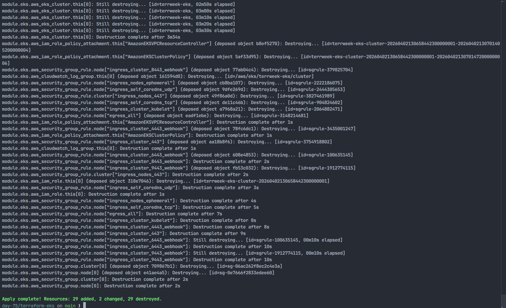
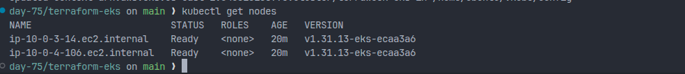
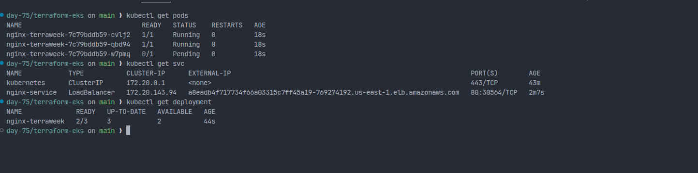
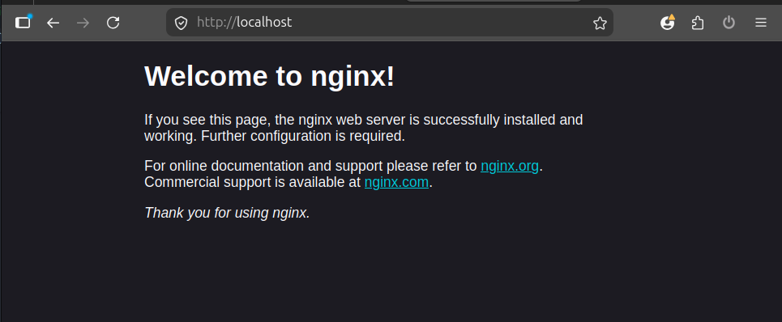
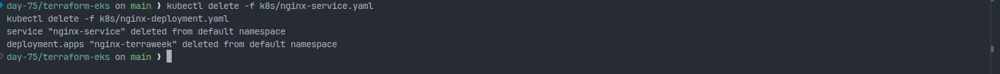
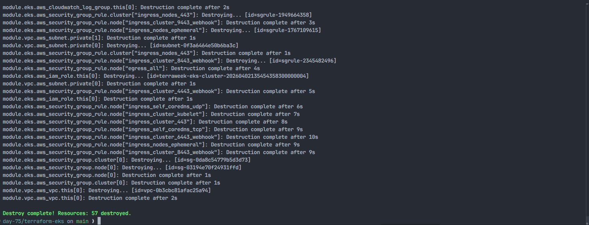

# Day 66 — Provision an AWS EKS Cluster Using Terraform Modules

## Overview

On Day 66, I provisioned a production-style Kubernetes cluster on AWS using Terraform registry modules. The infrastructure included a custom VPC, public and private subnets, NAT Gateway, Internet Gateway, IAM roles, an EKS control plane, and a managed node group. After provisioning the cluster, I connected kubectl, deployed an Nginx application, exposed it using a LoadBalancer service, and then destroyed all infrastructure to avoid unnecessary AWS costs.

This project demonstrates how DevOps engineers provision and manage Kubernetes infrastructure using Infrastructure as Code (IaC).

---

## Project Structure

```
DAY-66/
│
├── terraform-eks/
│   ├── providers.tf
│   ├── variables.tf
│   ├── terraform.tfvars
│   ├── vpc.tf
│   ├── eks.tf
│   ├── outputs.tf
│   ├── .terraform.lock.hcl
│   └── k8s/
│       ├── nginx-deployment.yaml
│       └── nginx-service.yaml
│
└── screenshots/
```

---

## Terraform Configuration

### providers.tf

Configured AWS and Kubernetes providers and pinned provider versions.

### variables.tf

Defined input variables:

- region
- cluster_name
- cluster_version
- node_instance_type
- node_desired_count
- vpc_cidr

### terraform.tfvars

Defined actual values for the variables such as region, instance type, and cluster name.

---

## VPC Module (vpc.tf)

Used Terraform AWS VPC module to create:

- VPC
- Public Subnets
- Private Subnets
- Internet Gateway
- NAT Gateway
- Route Tables
- Subnet associations

### Why Public and Private Subnets?

- Public subnets are used for LoadBalancers.
- Private subnets are used for EKS worker nodes for security.
- NAT Gateway allows private instances to access the internet (for pulling Docker images and updates).

### Subnet Tags

Subnet tags help Kubernetes decide where to create LoadBalancers:

- Public Subnet Tag → kubernetes.io/role/elb
- Private Subnet Tag → kubernetes.io/role/internal-elb

---

## EKS Module (eks.tf)

Used Terraform AWS EKS module to create:

- EKS Control Plane
- Managed Node Group
- IAM Roles and Policies
- Security Groups
- Launch Template
- KMS Encryption

### Why Managed Node Groups?

Managed node groups are managed by AWS and handle:

- Auto Scaling
- Node updates
- Health checks

---

## Outputs (outputs.tf)

Terraform outputs used:

- cluster_name
- cluster_endpoint
- cluster_region

These outputs were used to connect kubectl to the EKS cluster.

---

## Terraform Apply

After reviewing the plan, I ran `terraform apply` to provision the VPC, IAM resources, EKS control plane, and managed node group.



_Terraform apply completed successfully for the EKS infrastructure._

---

## Connecting to the Cluster

```bash
aws eks update-kubeconfig --name terraweek-eks --region us-east-1
kubectl get nodes
kubectl get pods -A
kubectl cluster-info
```

Verified that worker nodes were in **Ready** state.



_Both EKS worker nodes were in `Ready` state after updating kubeconfig._

---

## Kubernetes Deployment

### Nginx Deployment

Created a Kubernetes Deployment with:

- 3 replicas
- Resource requests and limits
- Container port 80

### Nginx Service

Created a Service of type **LoadBalancer** which provisioned an AWS Elastic Load Balancer automatically.

Traffic Flow:

```
Internet → AWS LoadBalancer → EKS Node → Kubernetes Pod → Nginx Container
```



_The deployment was rolling out, and the `LoadBalancer` service received an external endpoint._

### Nginx Verification

Opened the Nginx service in the browser to confirm external access.



_The external service endpoint returned the default Nginx welcome page._

---

## Challenges Faced and Fixes

| Issue                      | Cause                                | Fix                                       |
| -------------------------- | ------------------------------------ | ----------------------------------------- |
| Node group creation failed | Instance type not free-tier eligible | Changed to t3.micro                       |
| kubectl unauthorized       | IAM user not mapped in aws-auth      | Enabled cluster creator admin permissions |
| One pod pending            | Low resources on t3.micro            | Normal behavior                           |

---

## Terraform Destroy

To avoid AWS charges, all infrastructure was destroyed:

```bash
kubectl delete -f k8s/nginx-service.yaml
kubectl delete -f k8s/nginx-deployment.yaml
terraform destroy
```

Before destroying the AWS infrastructure, I removed the Kubernetes service and deployment from the cluster.



_The Nginx service and deployment were deleted successfully._

Verified that all resources were deleted:

- EKS Cluster
- EC2 Instances
- Load Balancers
- NAT Gateway
- VPC
- Elastic IP



_Terraform destroy completed and removed the remaining AWS resources._

---

## Key Learnings

- Terraform Registry Modules simplify complex infrastructure
- EKS requires proper VPC and subnet configuration
- Managed Node Groups reduce operational overhead
- Kubernetes Services of type LoadBalancer create AWS ELB automatically
- Infrastructure should always be destroyed after testing to reduce cost
- Resource requests and limits prevent resource starvation in Kubernetes

---

## Terraform vs Manual Kubernetes

| Manual Setup         | Terraform + EKS          |
| -------------------- | ------------------------ |
| Local cluster        | Production-grade cluster |
| Manual setup         | Automated                |
| Not reusable         | Reusable                 |
| Not scalable         | Scalable                 |
| No IAM integration   | IAM integrated           |
| Not highly available | Highly available         |

---

## Conclusion

In this project, I successfully provisioned a production-style AWS EKS cluster using Terraform modules, deployed an Nginx application on Kubernetes, exposed it using a LoadBalancer, and destroyed the infrastructure using Terraform.

This project helped me understand real-world DevOps workflows including Infrastructure as Code, Kubernetes deployment, cloud networking, and infrastructure lifecycle management.
