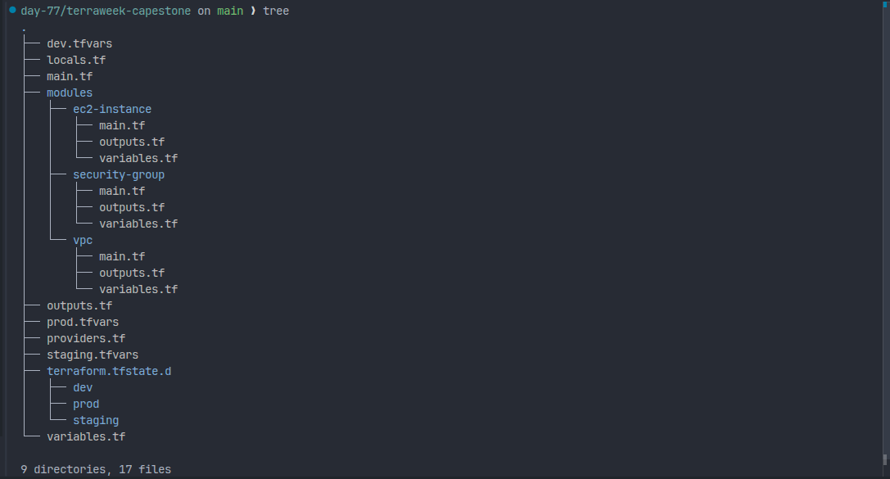
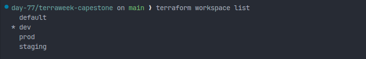
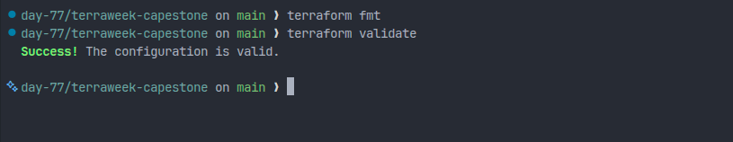
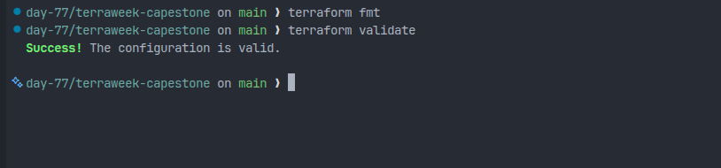
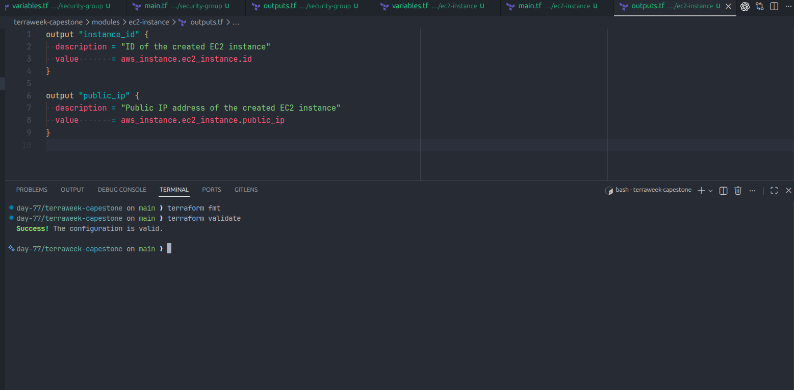
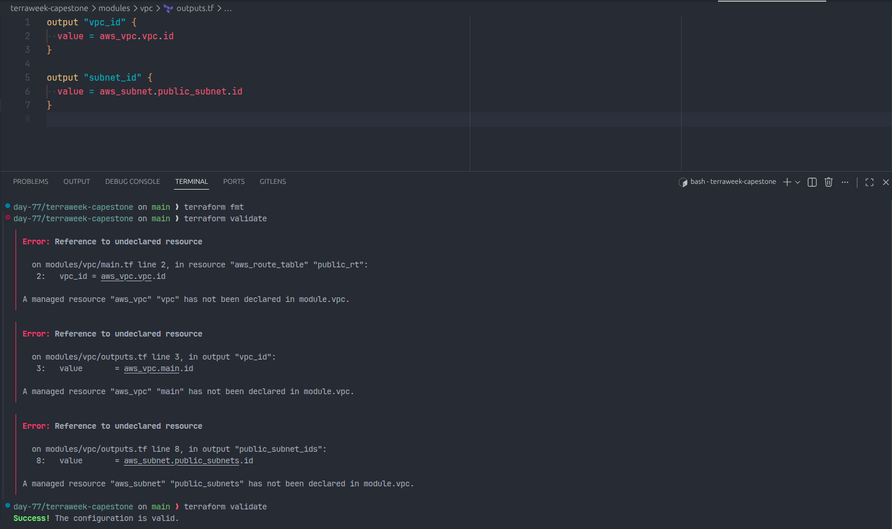
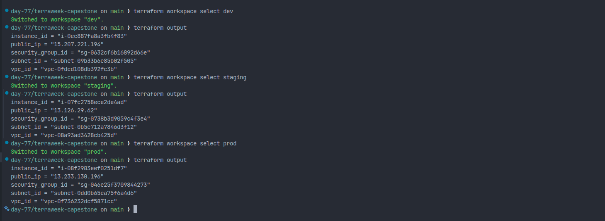
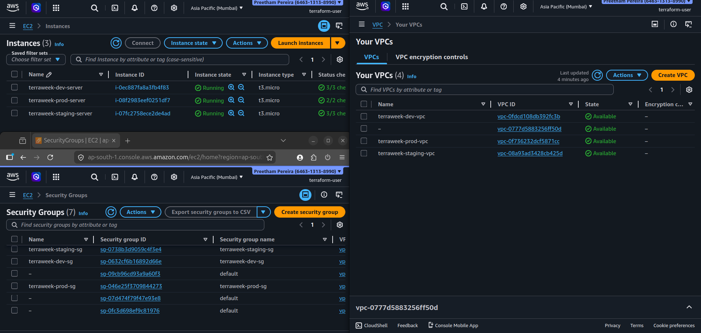
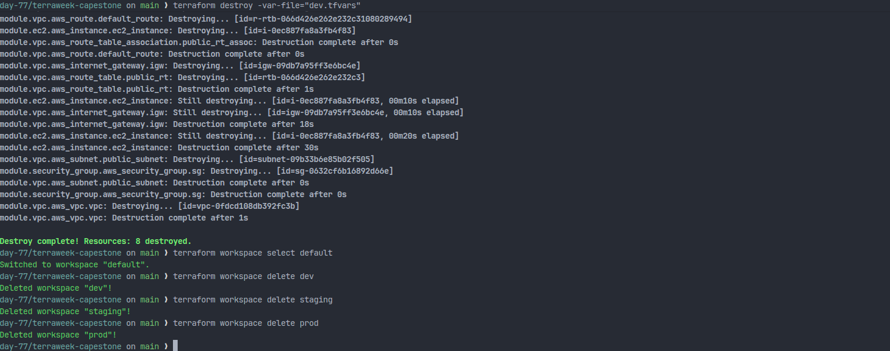

# Day 67 – TerraWeek Capstone: Multi-Environment Infrastructure with Terraform Workspaces and Modules

## Project Overview

In this capstone project, I built a production-style multi-environment AWS infrastructure using Terraform. The goal was to manage dev, staging, and prod environments using a single Terraform codebase by leveraging Terraform Workspaces and reusable modules.

This project demonstrates how real-world DevOps teams manage infrastructure across multiple environments using Infrastructure as Code (IaC), modular design, and environment-specific configurations.

---

## Project Structure

```
terraweek-capstone/
│
├── main.tf
├── variables.tf
├── providers.tf
├── locals.tf
├── outputs.tf
├── dev.tfvars
├── staging.tfvars
├── prod.tfvars
├── .gitignore
│
├── modules/
│   ├── vpc/
│   │   ├── main.tf
│   │   ├── variables.tf
│   │   └── outputs.tf
│   │
│   ├── security-group/
│   │   ├── main.tf
│   │   ├── variables.tf
│   │   └── outputs.tf
│   │
│   └── ec2-instance/
│       ├── main.tf
│       ├── variables.tf
│       └── outputs.tf
│
└── screenshots/
```



---

## Terraform Workspaces

Terraform workspaces were used to create and manage three separate environments:

- dev
- staging
- prod

Each workspace maintains its own separate state file:

```
terraform.tfstate.d/dev/terraform.tfstate
terraform.tfstate.d/staging/terraform.tfstate
terraform.tfstate.d/prod/terraform.tfstate
```

This allows infrastructure environments to be isolated while using the same Terraform code.



---

## Custom Terraform Modules

### 1. VPC Module

This module creates:

- VPC
- Public Subnet
- Internet Gateway
- Route Table
- Route Table Association

It outputs:

- vpc_id
- subnet_id

Each resource is tagged with Project, Environment, and ManagedBy.



### 2. Security Group Module

This module creates a Security Group and dynamically allows ingress ports based on the environment using Terraform dynamic blocks.

Example:

- Dev → SSH (22) + HTTP (80)
- Staging → SSH (22) + HTTP (80) + HTTPS (443)
- Prod → HTTP (80) + HTTPS (443)



### 3. EC2 Module

This module launches an EC2 instance inside the subnet created by the VPC module and attaches the Security Group.

It outputs:

- instance_id
- public_ip



---

## Environment Configuration (tfvars)

| Environment | VPC CIDR    | Subnet CIDR | Instance Type | Allowed Ports |
| ----------- | ----------- | ----------- | ------------- | ------------- |
| dev         | 10.0.0.0/16 | 10.0.1.0/24 | t2.micro      | 22, 80        |
| staging     | 10.1.0.0/16 | 10.1.1.0/24 | t2.micro      | 22, 80, 443   |
| prod        | 10.2.0.0/16 | 10.2.1.0/24 | t2.micro      | 80, 443       |

This shows environment-based infrastructure configuration using tfvars files.

---

## How the Project Works

1. Terraform modules were created for VPC, Security Group, and EC2.
2. The root module calls these child modules.
3. Terraform workspaces are used to separate environments.
4. Environment-specific values are passed using tfvars files.
5. Each workspace deploys its own infrastructure.
6. Outputs are used to pass values between modules.
7. Infrastructure was verified in AWS Console.
8. All resources were destroyed after testing to avoid charges.

After wiring all child modules together, the complete root module was validated successfully.



Terraform outputs confirmed the deployed values from the active workspace.



AWS Console verification confirmed the created VPC, EC2 instance, and Security Group resources.



After testing, all provisioned infrastructure was destroyed to avoid unnecessary AWS charges.



---

## Terraform Best Practices Used

- Modular Infrastructure (Reusable Modules)
- Workspace-based Environment Isolation
- Environment-specific tfvars
- Proper Resource Tagging
- Clean File Structure
- Separate variables, outputs, providers, locals
- Used terraform fmt and terraform validate
- Used terraform plan before apply
- Destroyed infrastructure after testing

---

## TerraWeek Learning Summary

| Day | Concepts Learned                                |
| --- | ----------------------------------------------- |
| 61  | Terraform Basics (init, plan, apply, destroy)   |
| 62  | Providers, Resources, Dependencies              |
| 63  | Variables, Outputs, Locals                      |
| 64  | Remote State and Locking                        |
| 65  | Terraform Modules                               |
| 66  | EKS with Terraform                              |
| 67  | Workspaces and Multi-Environment Infrastructure |

---

## Outcome

This project demonstrates how to design and deploy multi-environment infrastructure using Terraform in a production-style setup. By using modules and workspaces, the same codebase was reused to deploy dev, staging, and prod environments with isolated state and environment-specific configurations.

This is a real-world Infrastructure as Code implementation similar to how companies manage infrastructure across environments.

---

## Author

**Preetham**
90 Days of DevOps Challenge
Day 67 – TerraWeek Capstone Project
