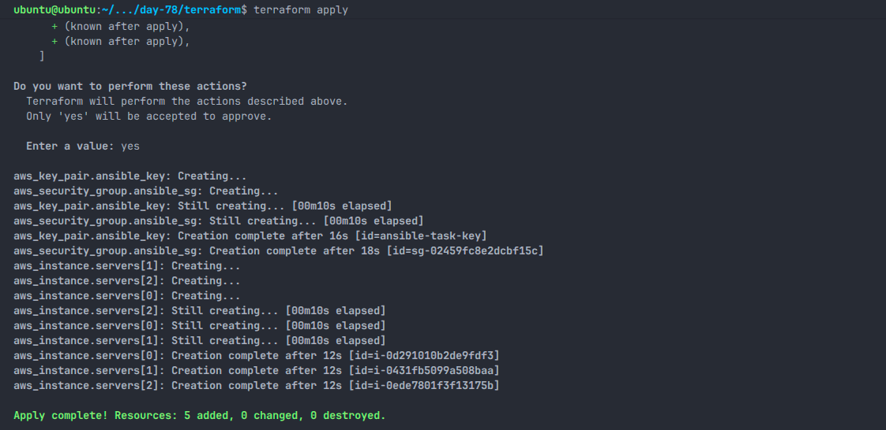
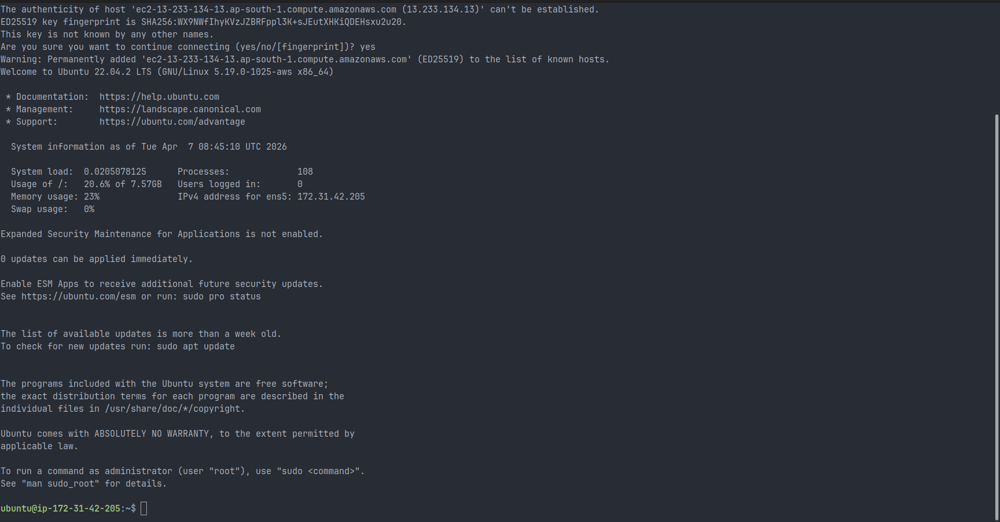
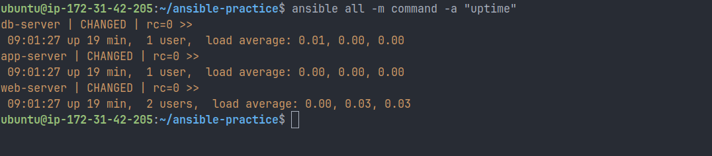
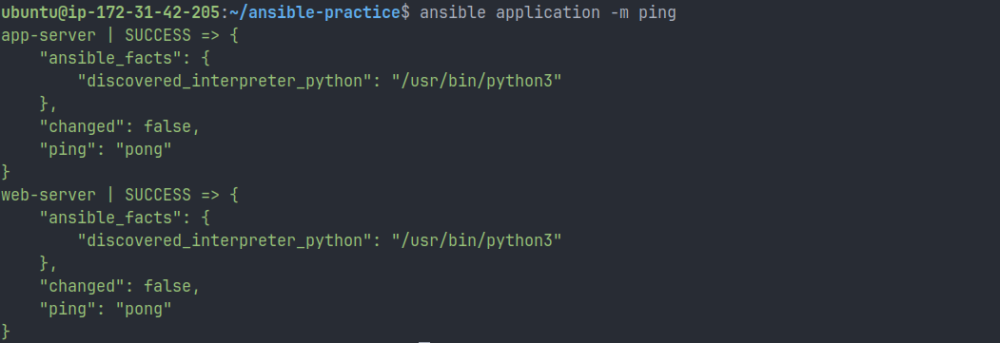

# Day 68 — Introduction to Ansible & Inventory Setup

## 📌 Overview

Today, I worked on understanding and implementing **Ansible**, a configuration management tool used to automate server setup and management.

After provisioning infrastructure using Terraform, I used Ansible to manage multiple EC2 instances from a single control node using SSH.

This workflow followed:
**Provision → Connect → Configure → Automate**

---

## 🧠 What I Learned

### 🔹 Configuration Management

Configuration management ensures that systems remain in a consistent and desired state using automation.

I understood that it helps to:

- Reduce manual errors
- Maintain consistency
- Scale infrastructure easily
- Enable repeatable deployments

---

### 🔹 Why Ansible?

| Tool    | Agent Required | Language | Complexity |
| ------- | -------------- | -------- | ---------- |
| Ansible | ❌ No          | YAML     | Easy       |
| Chef    | ✅ Yes         | Ruby     | Hard       |
| Puppet  | ✅ Yes         | DSL      | Medium     |
| Salt    | Optional       | YAML     | Medium     |

I learned that Ansible is preferred because it is **simple and agentless**.

---

### 🔹 Agentless Concept

I learned that Ansible does not require any software installation on managed nodes. It uses **SSH** to connect and execute tasks.

---

### 🔹 Ansible Architecture

- **Control Node** → Where I installed Ansible
- **Managed Nodes** → My EC2 instances
- **Inventory** → File containing server details
- **Modules** → Tasks like install, copy, execute
- **Playbooks** → YAML files for automation

---

## ⚙️ Lab Setup

### Infrastructure Setup

I used Terraform to provision 3 EC2 instances:




- Region: ap-south-1
- Instance Type: t2.micro
- OS: Ubuntu 22.04
- Security Group: SSH (Port 22)

### Server Roles

- Web Server
- App Server
- Database Server

### Public IPs

- Web → 13.233.134.13
- App → 13.234.238.228
- DB → 13.201.29.142

---

## 🔐 SSH Verification

I successfully connected to all instances using:

```bash
ssh ubuntu@<public-ip>
```



---

## 🖥️ Ansible Installation

I installed Ansible on my control node:

```bash
sudo apt update
sudo apt install ansible -y
ansible --version
```

I verified the installation successfully.

---

## 📂 Inventory Configuration

I created an `inventory.ini` file:


```ini
[web]
web-server ansible_host=13.233.134.13

[app]
app-server ansible_host=13.234.238.228

[db]
db-server ansible_host=13.201.29.142

[all:vars]
ansible_user=ubuntu
ansible_ssh_private_key_file=~/ansible-practice/keys/ansible-task-key
```

---

## ⚙️ Ansible Configuration

I created an `ansible.cfg` file for better usability:

```ini
[defaults]
inventory = inventory.ini
host_key_checking = False
remote_user = ubuntu
private_key_file = ~/ansible-practice/keys/ansible-task-key
```

---

## ✅ Connectivity Test

I tested connectivity using:

```bash
ansible all -m ping
```

All servers responded successfully with:

```
"ping": "pong"
```

---

## ⚡ Ad-Hoc Commands I Executed

### Check uptime

```bash
ansible all -m command -a "uptime"
```



### Check memory (web servers)

```bash
ansible web -m command -a "free -h"
```

### Check disk usage

```bash
ansible all -m command -a "df -h"
```

### Install Git

```bash
ansible web -m apt -a "name=git state=present" --become
```

### Copy file to all servers

```bash
echo "Hello from Ansible" > hello.txt
ansible all -m copy -a "src=hello.txt dest=/tmp/hello.txt"
```

### Verify copied file

```bash
ansible all -m command -a "cat /tmp/hello.txt"
```

---

## 🔑 Understanding `--become`

I learned that `--become` is used for privilege escalation (similar to sudo).

It is required when:

- Installing packages
- Managing services
- Performing system-level changes

---

## 🧩 Groups & Patterns

I extended my inventory using groups:

```ini
[application:children]
web
app

[all_servers:children]
application
db
```

### Commands I tested

```bash
ansible application -m ping
ansible db -m ping
ansible all_servers -m ping

ansible 'web:app' -m ping
ansible 'all:!db' -m ping
```



---

## ⚖️ Command vs Shell

| Feature   | command | shell |
| --------- | ------- | ----- |
| Pipes     | ❌      | ✅    |
| Redirects | ❌      | ✅    |
| Security  | ✅      | ⚠️    |

---

## 🎯 Key Takeaways

- I understood how Ansible simplifies server management
- I learned how to manage multiple servers from one machine
- I practiced using inventory, groups, and ad-hoc commands
- I learned the importance of SSH-based automation

---

## 🚀 Outcome

By the end of this task, I was able to:

- Provision infrastructure using Terraform
- Connect to instances using SSH
- Install and configure Ansible
- Create inventory and groups
- Execute commands across multiple servers

---
