# Day 69 — Ansible Playbooks and Modules

## Overview

On Day 69, I transitioned from ad-hoc Ansible commands to structured, repeatable automation using playbooks. I implemented real-world scenarios covering package management, service control, file and configuration management, multi-host execution, conditionals, and handlers.

---

## Task 1: Install Nginx Playbook

### Playbook: `install-nginx.yaml`

- Install Nginx using apt
- Start and enable the service
- Deploy a custom index page

### Run

```bash
ansible-playbook -i inventory.ini install-nginx.yaml
```

### Result

- First run → changed
- Second run → ok

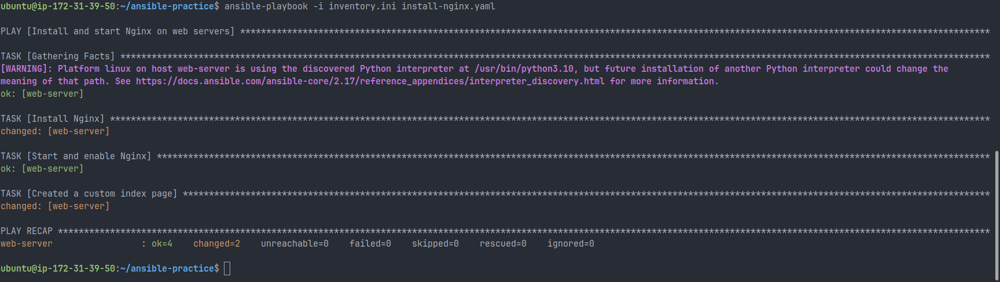

This demonstrates idempotency, where changes are applied only when required.

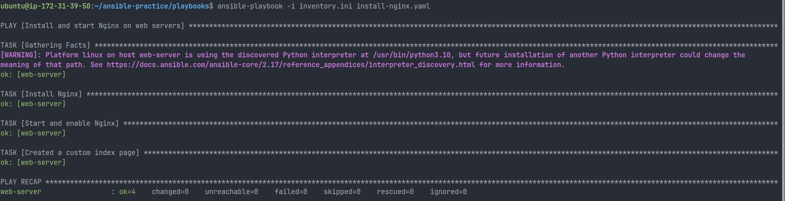

---

## Verification

- Accessed EC2 public IP
- Verified custom page:

```
Deployed by Ansible - Terraweek Server
```

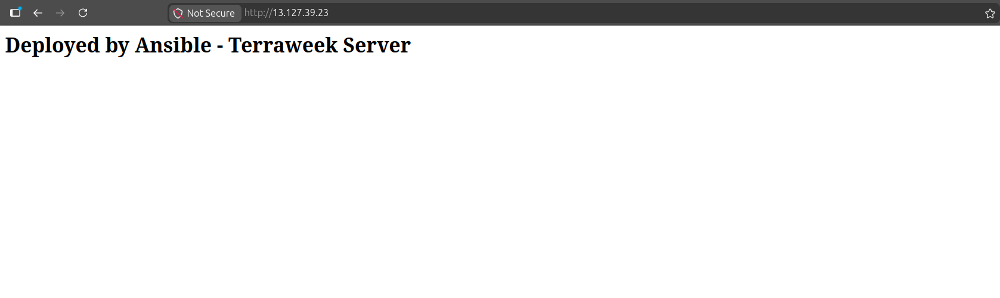

---

## Task 2: Core Concepts

### Play vs Task

- Play: Targets a group of hosts (for example, web)
- Task: Performs a single unit of work (install, start, copy, etc.)

### Privilege Escalation (become: true)

- At play level: applies to all tasks
- At task level: applies only to specific tasks

### Failure Handling

- A failed task stops execution for that host
- Other hosts continue execution independently

### Multiple Plays

A single playbook can define multiple plays for different groups:

- web: Nginx setup
- app: application setup
- db: database setup

### Idempotency

Running the same playbook multiple times ensures the system reaches the same desired state without unnecessary changes.

---

## Task 3: Essential Modules

### Modules Used

- apt: package installation
- service: service management
- copy: file and content deployment
- file: directory and permission management
- command: execute commands without shell features
- shell: execute commands with shell capabilities
- lineinfile: manage single lines in files

### command vs shell

- command: safer, no shell interpretation
- shell: supports pipes and redirection, use only when required

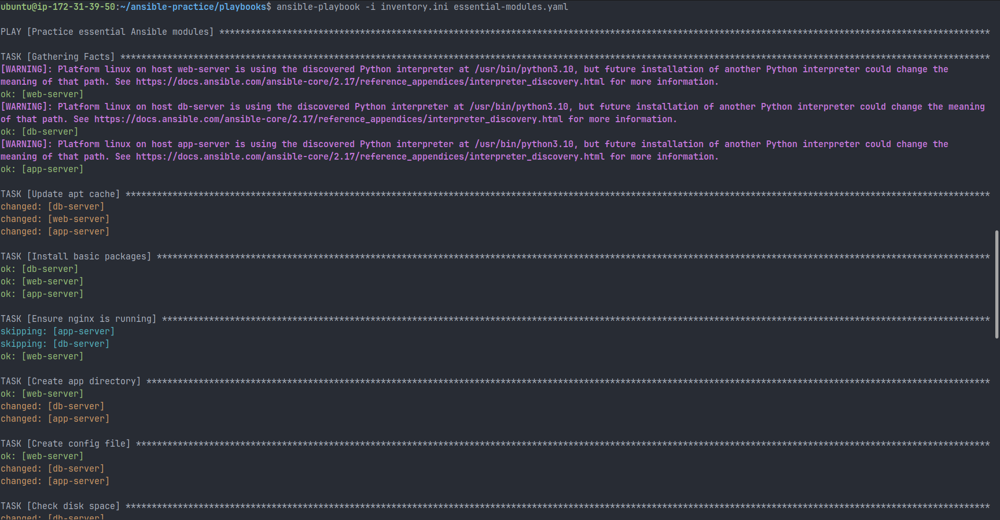

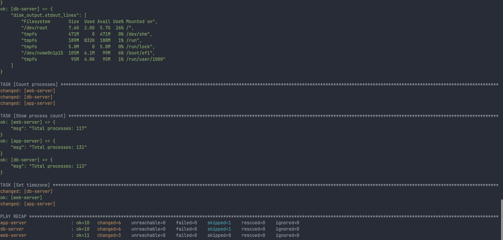

---

## Multi-Host Execution

Playbook executed across:

- web-server
- app-server
- db-server

### Conditional Execution

```yaml
when: "'web' in group_names"
```

This ensures tasks run only on relevant hosts.

---

## Task 4: Handlers

### Playbook: `nginx-handler.yaml`

### Purpose

Restart Nginx only when configuration changes occur.

### Run

```bash
ansible-playbook -i inventory.ini nginx-handler.yaml
```

### Behavior

| Run        | Result            |
| ---------- | ----------------- |
| First run  | Handler triggered |
| Second run | Handler skipped   |

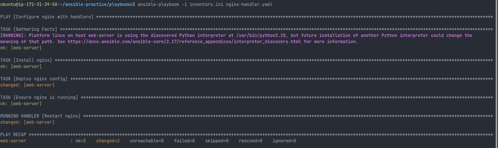

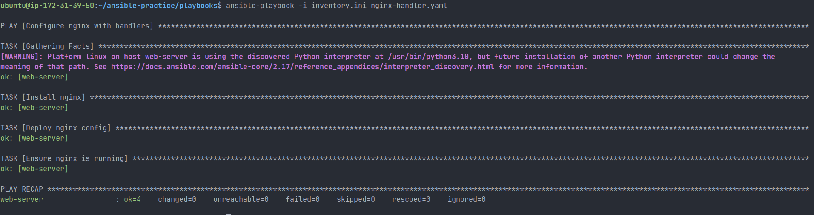

This prevents unnecessary restarts and reduces downtime.

---

## Task 5: Production Safety

### Commands

```bash
ansible-playbook -i inventory.ini nginx-handler.yaml --check
ansible-playbook -i inventory.ini nginx-handler.yaml --check --diff
ansible-playbook -i inventory.ini nginx-handler.yaml -vv
```

### Importance

- --check: dry run without applying changes
- --diff: shows file-level differences
- -v / -vv: provides detailed debugging output

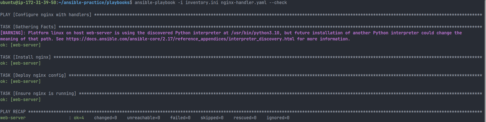

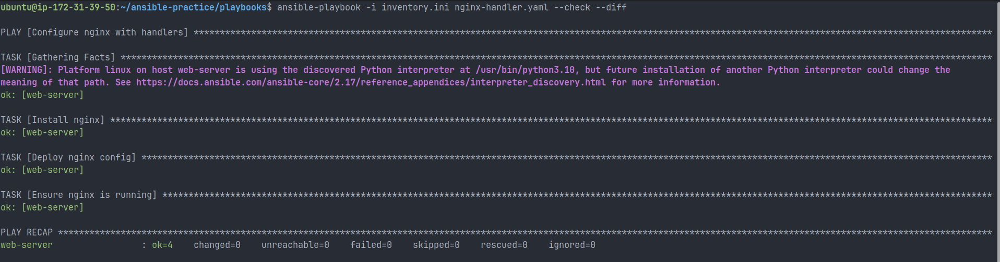

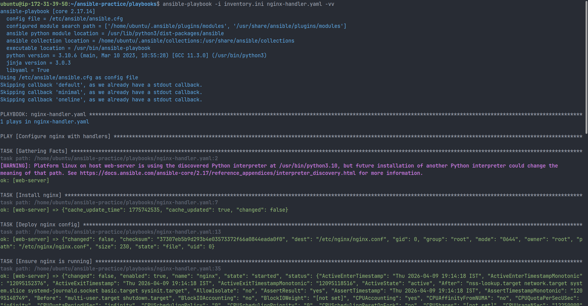

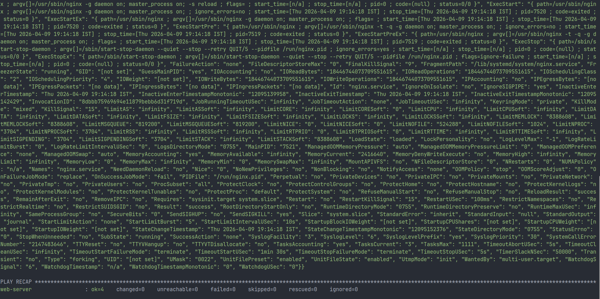

---

## Key Learnings

- Playbooks are declarative and idempotent
- Different hosts require role-based configurations
- Conditionals are essential in multi-host environments
- Handlers optimize service restarts
- Check mode, diff, and verbosity are critical for safe production changes

---

## Final Thoughts

This day marked a shift from basic command execution to structured infrastructure automation. I can now design scalable, maintainable, and production-ready Ansible playbooks with proper safety and control mechanisms.

---

#90DaysOfDevOps #DevOpsKaJosh #TrainWithShubham
