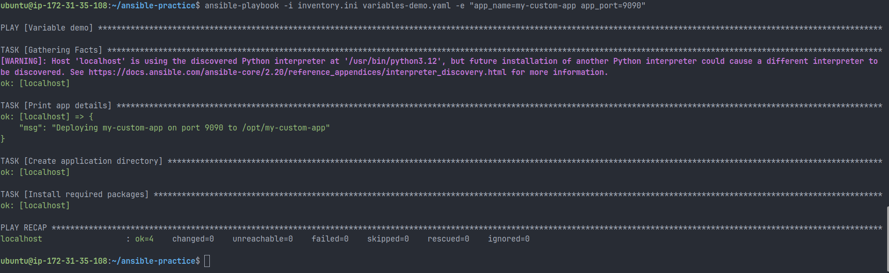
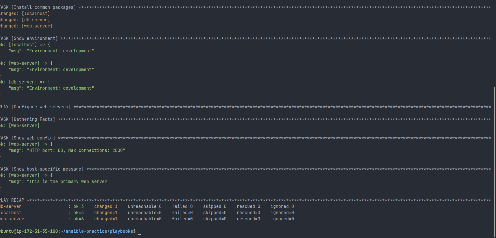
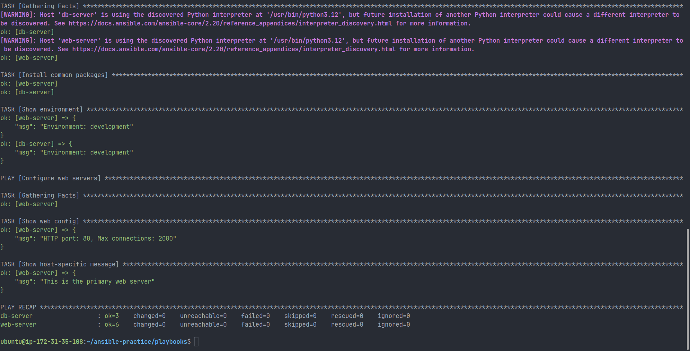
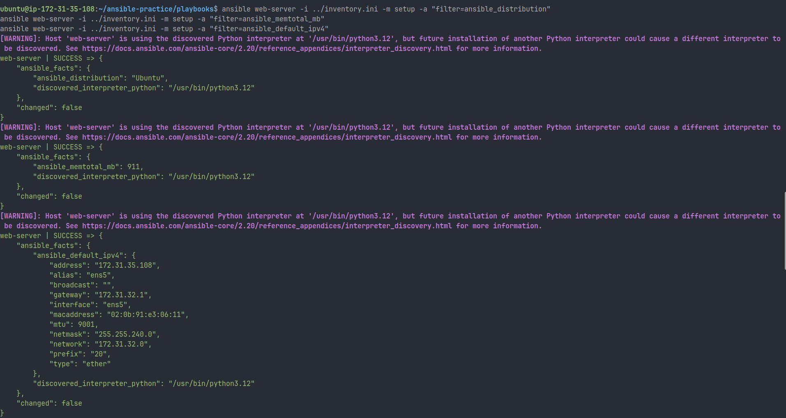
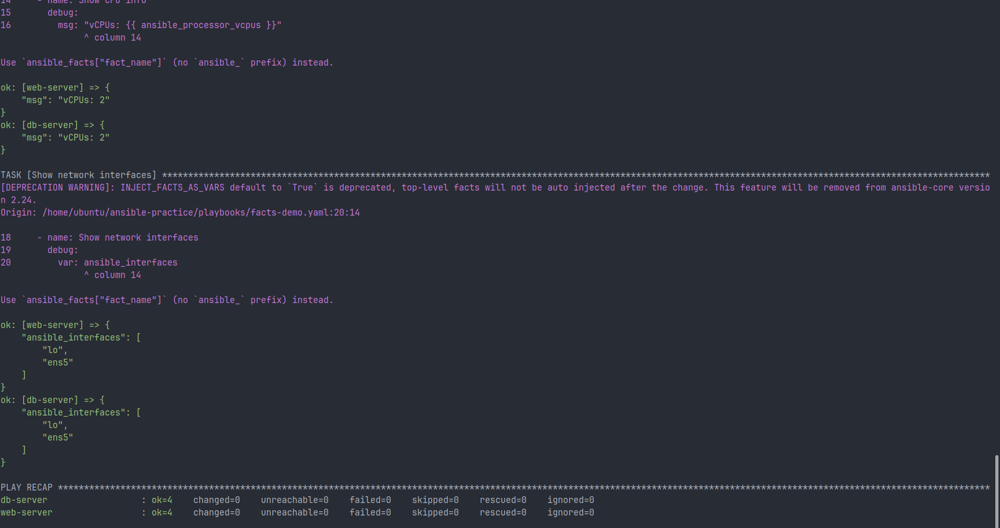
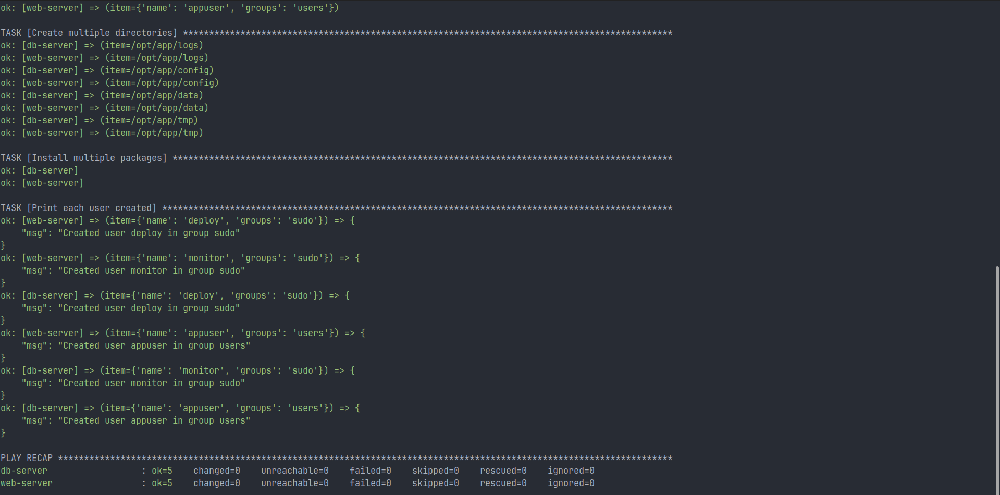
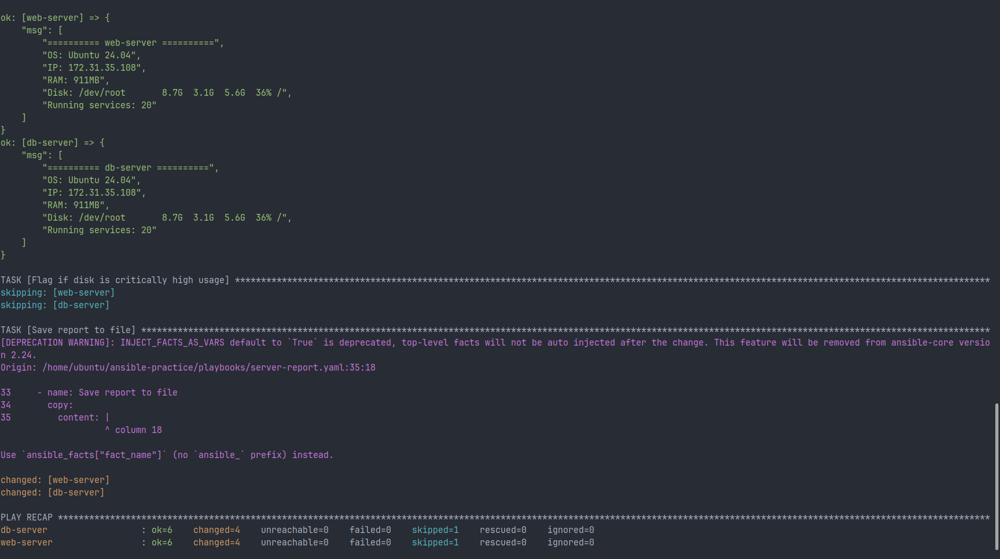

# Day 70 — Variables, Facts, Conditionals, and Loops

## 1. Variables and Overrides

### Playbook: variables-demo.yml

- Variables defined: `app_name`, `app_port`, `app_dir`, `packages`
- Interpolation used: `app_dir: "/opt/{{ app_name }}"`

### Override Test

```bash
ansible-playbook -i inventory.ini variables-demo.yml -e "app_name=my-custom-app app_port=9090"
```

### Before Override

- app_name → terraweek-app
- app_dir → /opt/terraweek-app

### After Override

- app_name → my-custom-app
- app_dir → /opt/my-custom-app

### Key Insight

- CLI (`-e`) overrides playbook variables
- Dependent variables are re-evaluated after override

### Idempotency Observation

- Re-running the playbook resulted in `changed=0`
- Directory and packages were already in desired state

### Screenshot



---

## 2. group_vars and host_vars

### Directory Structure

```
ansible-practice/
  inventory.ini
  group_vars/
    all.yml
    web.yml
    db.yml
  host_vars/
    web-server.yml
  playbooks/
    site.yml
```

### Variable Scope

- `group_vars/all.yml` → global
- `group_vars/web.yml` → web group
- `group_vars/db.yml` → db group
- `host_vars/web-server.yml` → specific host override

### Verified Behavior

- web-server:
  - http_port → 80 (group_vars/web)
  - max_connections → 2000 (host_vars override)
  - custom_message → available

- db-server:
  - only global variables applied
  - no access to web-specific variables

### Variable Precedence (low → high)

1. group_vars/all
2. group_vars/<group>
3. host_vars/<host>
4. playbook vars
5. task vars
6. extra vars (-e)

### Example

- group_vars/all → 500
- group_vars/web → 1000
- host_vars/web-server → 2000

Final → 2000

### Observation: Inventory Issue

- Initially included `localhost` unintentionally
- Caused extra execution
- Fixed by removing it

### Screenshots





---

## 3. Ansible Facts

### Commands Used

```bash
ansible web-server -i inventory.ini -m setup -a "filter=ansible_distribution"
ansible web-server -i inventory.ini -m setup -a "filter=ansible_memtotal_mb"
ansible web-server -i inventory.ini -m setup -a "filter=ansible_default_ipv4"
```

### Observed Values

- OS → Ubuntu
- RAM → 911 MB
- IP → 172.31.x.x

### Fact-Based Logic Example

```yaml
- name: Warn if low memory
  debug:
    msg: "WARNING: Low memory system"
  when: ansible_memtotal_mb < 1024
```

### Insight

Facts are used to drive decisions, not just display information

### Useful Facts

1. ansible_os_family → choose package manager
2. ansible_distribution → OS-specific configs
3. ansible_memtotal_mb → resource-based decisions
4. ansible_default_ipv4.address → networking
5. ansible_processor_vcpus → scaling apps

### Screenshots





---

## 4. Conditionals

### Implementation

- Nginx → only web group
- MySQL → only db group
- Low memory warning → based on RAM
- Ubuntu check → based on OS
- Production check → based on env

### Observations

- Nginx executed only on web-server
- MySQL executed only on db-server
- Low memory warning triggered on both (<1024MB)
- Production task skipped (env=development)
- AND condition executed correctly
- OR condition executed correctly

### Key Insight

Conditionals control execution dynamically using:

- group membership
- facts
- environment variables

### Deprecation Insight

- Direct fact variables like `ansible_memtotal_mb` are deprecated
- Future-safe usage:

```yaml
ansible_facts['memtotal_mb']
```

---

## 5. Loops

### Implementation

- Created users using structured data
- Created directories dynamically
- Installed packages using list input

### Behavior

- Single task executed multiple times
- Each item processed independently

### Example

```yaml
loop: "{{ users }}"
```

### Idempotency

- Re-run resulted in `changed=0`
- No duplicate operations

### loop vs with_items

- loop → modern, consistent, recommended
- with_items → deprecated

### Insight

Loops enable scalable automation by replacing repetitive tasks with data-driven execution

### Screenshot



---

## 6. Server Health Report

### Tasks

- Disk usage → `df -h`
- Memory → `free -m`
- Running services → `systemctl`
- System info → Ansible facts

### register Usage

- disk_result
- memory_result
- services_result

### Output Example

- Hostname
- OS version
- IP address
- RAM
- Disk usage
- Running services count

### Conditional Alert

- Alert triggered only if disk usage is high
- Skipped in current run (36%)

### File Output

```
/tmp/server-report-<hostname>.txt
```

### Real Observation

- web-server and db-server returned same IP
- Both mapped to same machine (localhost simulation)

### Limitation

- Not a true multi-node environment

### Insight

Combining:

- facts
- commands
- conditionals
- register

creates real automation workflows like monitoring and reporting

### Screenshot



---

## Final Takeaways

- Variables remove hardcoding
- group_vars and host_vars separate logic from configuration
- Facts enable dynamic decisions
- Conditionals control execution flow
- Loops eliminate repetition
- Register enables runtime data handling

This transforms static playbooks into adaptive infrastructure automation.
