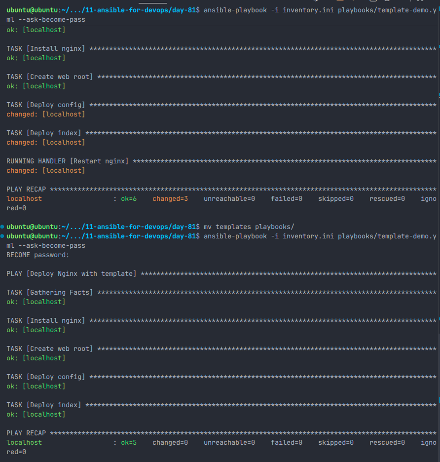
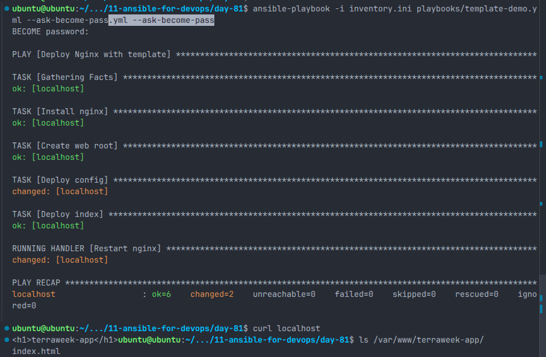
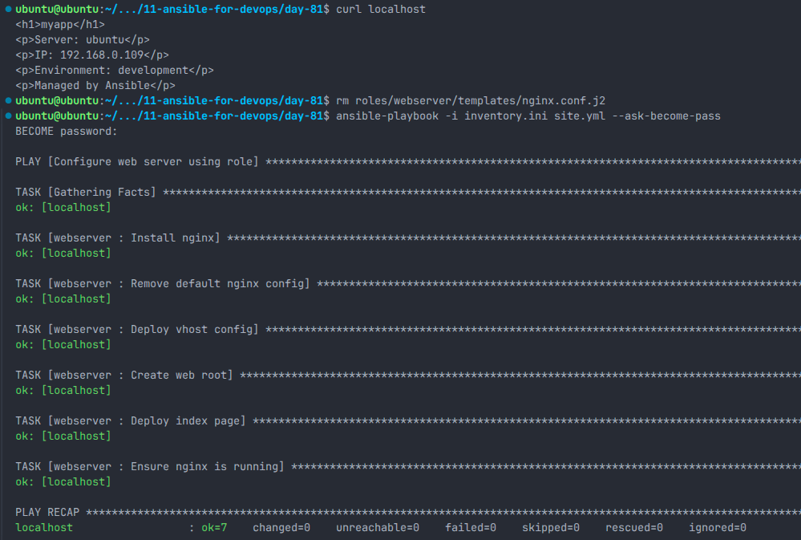
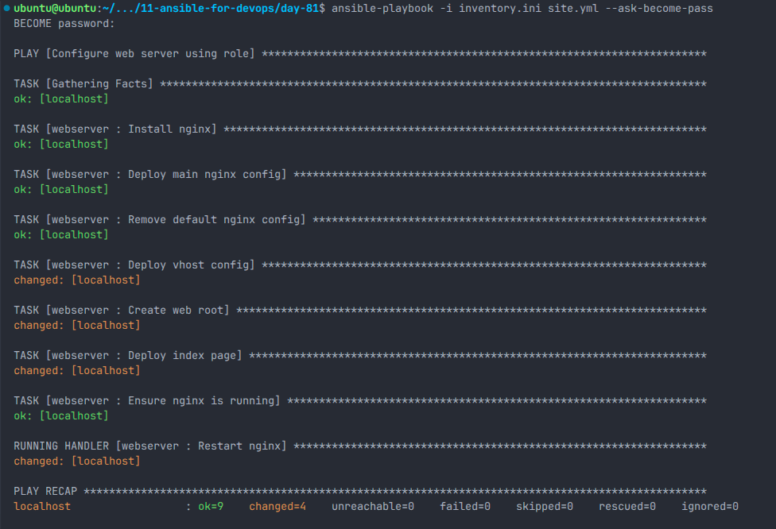
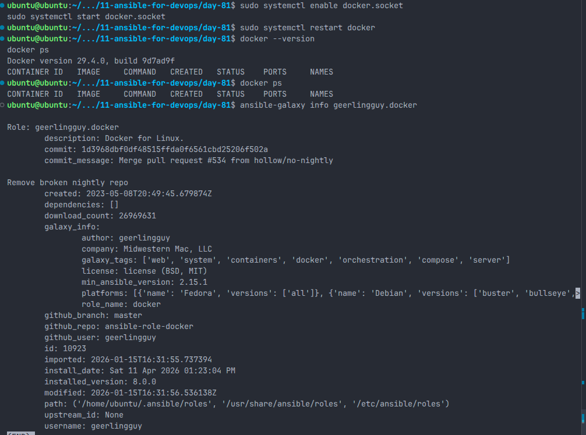
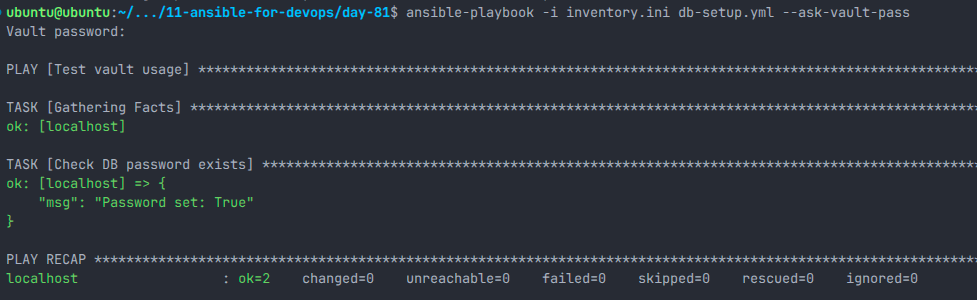
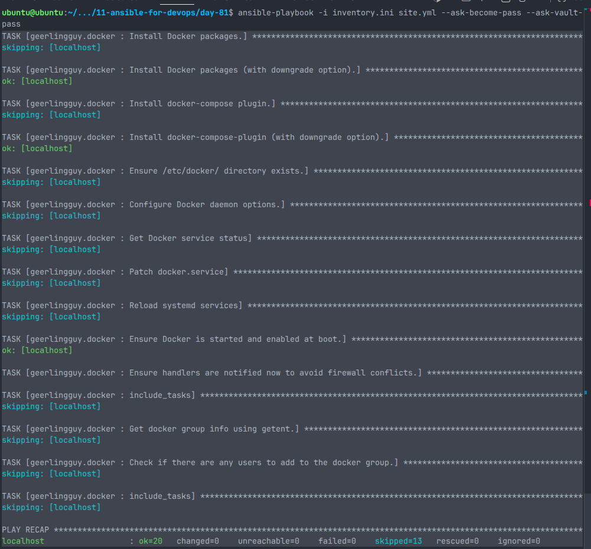

# Day 71 — Ansible Roles, Templates, Galaxy & Vault (Hands-on)

## Overview

Today focused on building production-style automation using:

- Ansible Roles (modular structure)
- Jinja2 Templates (dynamic configuration)
- Ansible Galaxy (reusable community roles)
- Ansible Vault (secrets management)

The goal was not just execution, but understanding structure, debugging failures, and achieving idempotent automation.

---

## 1. Jinja2 Templates

Created dynamic Nginx configuration using templates.

### Example: `vhost.conf.j2`

```nginx
server {
    listen {{ http_port }};
    server_name _;

    root /var/www/{{ app_name }};
    index index.html;

    location / {
        try_files $uri $uri/ =404;
    }

    access_log /var/log/nginx/{{ app_name }}_access.log;
    error_log /var/log/nginx/{{ app_name }}_error.log;
}
```

### Key Learnings

- Templates avoid hardcoding
- Use facts like `ansible_hostname`, `ansible_default_ipv4.address`
- Use `default()` filter to prevent failures

### Screenshot



---

## 2. Custom Role: `webserver`

### Structure

```
roles/webserver/
├── defaults/main.yml
├── handlers/main.yml
├── tasks/main.yml
├── templates/
│   ├── vhost.conf.j2
│   ├── index.html.j2
│   └── db-config.j2
```

### Defaults

```yaml
http_port: 80
app_name: myapp
app_env: development
```

### Key Tasks

- Install nginx
- Remove default config
- Deploy vhost config
- Create web root
- Deploy index page
- Deploy DB config (using Vault secrets)
- Ensure nginx is running

### Handler

```yaml
- name: Restart nginx
  service:
    name: nginx
    state: restarted
```

### Screenshot



---

## 3. Idempotency Validation

Re-running playbook:

```bash
ansible-playbook -i inventory.ini site.yml
```

Result:

```
changed=0
```

Ensures safe re-execution without unintended changes.

### Screenshot



---

## 4. Ansible Galaxy Integration

### Installed Role

```bash
ansible-galaxy install geerlingguy.docker
```

### Usage

```yaml
- hosts: web
  roles:
    - geerlingguy.docker
```

### Key Learning

- Roles are not plug-and-play
- Must validate system compatibility
- Debugging required (systemd/socket issue fixed manually)

### Screenshot



---

## 5. Debugging Docker Failure

### Issue

Docker service failed due to:

```
no sockets found via socket activation
```

### Fix

```bash
sudo systemctl enable docker.socket
sudo systemctl start docker.socket
sudo systemctl restart docker
```

### Verification

```bash
docker ps
```

### Screenshot



---

## 6. Ansible Vault

### Create Vault File

```bash
ansible-vault create group_vars/all/vault.yml
```

### Example Content

```yaml
vault_db_password: ********
vault_db_root_password: ********
vault_api_key: ********
```

### Usage in Template

```jinja2
DB_PASSWORD={{ vault_db_password }}
DB_ROOT_PASSWORD={{ vault_db_root_password }}
```

### Execution

```bash
ansible-playbook --ask-vault-pass
```

### Screenshot



---

## 7. Final site.yml

```yaml
- name: Configure web servers
  hosts: web
  become: true
  roles:
    - webserver

- name: Configure app servers (Docker)
  hosts: web
  become: true
  roles:
    - geerlingguy.docker
```

### Screenshot



---

## 8. Final Verification

### Web Server

```bash
curl localhost
```

### Docker

```bash
docker ps
```

### DB Config

```bash
cat /etc/db-config.env
ls -l /etc/db-config.env
```

Permissions:

```
-rw-------
```

---

## 9. Key Mistakes & Lessons

### Mistakes

- Mixed playbook and role structure
- Incorrect template paths
- Overwrote system nginx config (broke service)
- Duplicate tasks across role and playbook
- Misunderstood variable scope (group_vars)

### Lessons

- Roles must own implementation
- Playbooks should only orchestrate
- Never modify core system configs blindly
- Always validate services after deployment
- Understand variable scope in Ansible

---

## 10. Production Risks Identified

- No environment separation (dev/prod)
- Secrets stored in plain text on server
- No validation before service restart
- All services running on same host
- No rollback strategy

---

## Conclusion

This exercise moved from basic automation to structured, reusable, and idempotent infrastructure.

Key transition:

- Scripts → Roles
- Static configs → Templates
- Manual installs → Galaxy roles
- Plain secrets → Vault

Focus shifted from “making it work” to “making it reliable and maintainable”.
