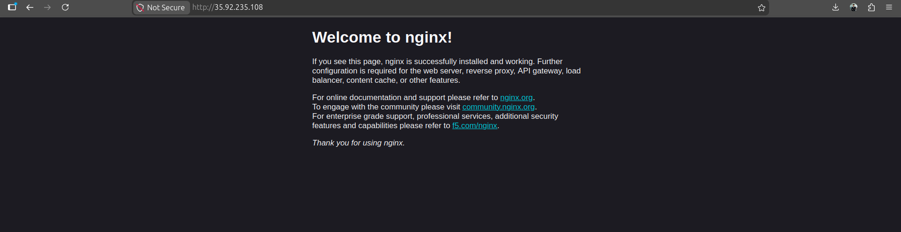
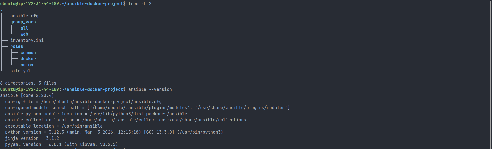
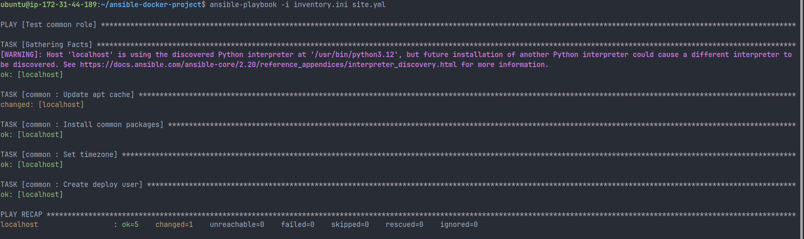
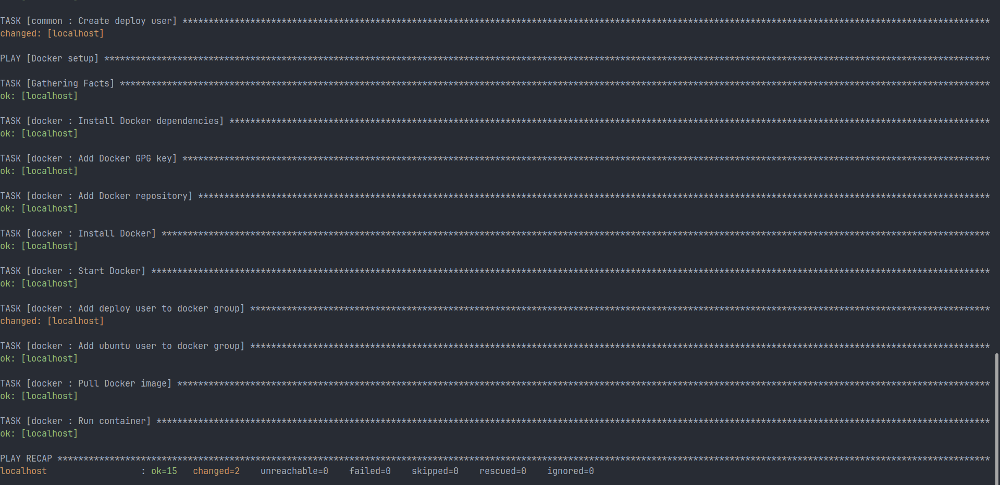
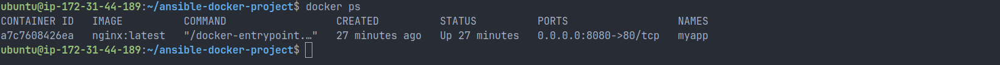
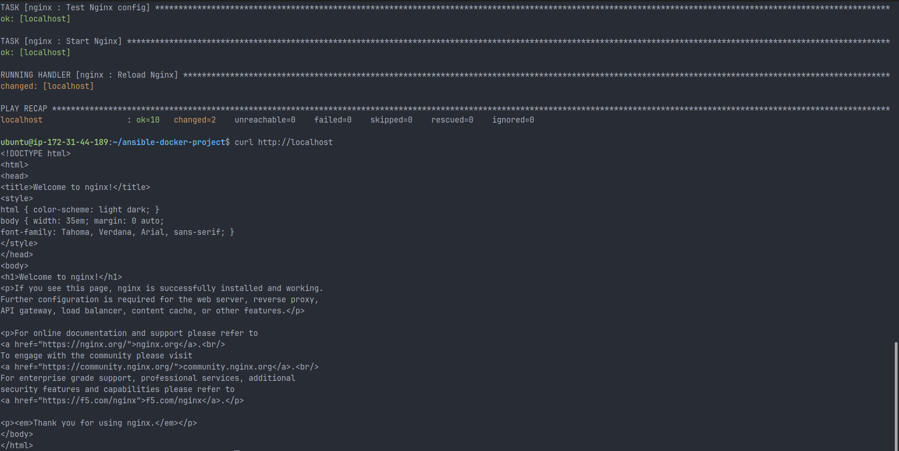

# Day 72 — Ansible Project: Docker & Nginx Automated Deployment

## Overview

This project demonstrates a complete infrastructure automation workflow using Ansible.
It provisions a server, installs Docker, deploys a containerized application, and configures Nginx as a reverse proxy — all using a role-based architecture.

The entire setup is executed through a single playbook, ensuring consistency, repeatability, and idempotency.

---

## Project Structure





```
ansible-docker-project/
├── ansible.cfg
├── inventory.ini
├── site.yml
├── group_vars/
│   ├── all.yml
│   └── web/
│       └── vault.yml
├── roles/
│   ├── common/
│   │   └── tasks/main.yml
│   ├── docker/
│   │   ├── tasks/main.yml
│   │   └── defaults/main.yml
│   └── nginx/
│       ├── tasks/main.yml
│       ├── defaults/main.yml
│       ├── handlers/main.yml
│       └── templates/app-proxy.conf.j2
```

---

## Implementation Details

### 1. Common Role

- Updates system packages
- Installs essential utilities
- Configures timezone
- Creates a deploy user

---

### 2. Docker Role

- Installs Docker and dependencies
- Starts and enables Docker service
- Adds users to Docker group
- Pulls application image (nginx)
- Runs container with port mapping (8080 → 80)
- Configures restart policy for reliability

---

### 3. Nginx Role

- Installs Nginx
- Removes default configuration
- Deploys reverse proxy configuration using Jinja2 template
- Enables site configuration
- Validates configuration using `nginx -t`
- Reloads Nginx using handlers

---

## Architecture

```
Client → Nginx (Port 80) → Docker Container (Port 8080)
```

---

## Deployment

### Dry Run

```
ansible-playbook -i inventory.ini site.yml --check --diff
```

### Full Deployment

```
ansible-playbook -i inventory.ini site.yml
```





### Run Specific Roles

```
ansible-playbook -i inventory.ini site.yml --tags docker
ansible-playbook -i inventory.ini site.yml --tags nginx
```

---

## Verification

- Container running:

  ```
  docker ps
  ```

  

- Direct container access:

  ```
  curl http://localhost:8080
  ```

- Reverse proxy validation:

  ```
  curl http://localhost
  ```

  

---

## Security

- Sensitive data handled using Ansible Vault
- Proper user permissions configured for Docker access

---

## Idempotency

Re-running the playbook results in:

- Majority of tasks marked as `ok`
- Minimal changes only when required

This ensures safe and repeatable deployments.

---

## Challenges Faced & Fixes

- Inventory not detected → fixed via `ansible.cfg`
- Variables not loading → corrected `group_vars` structure
- Docker permission issues → added user to docker group
- Missing templates → created proper role structure
- Undefined variables → added defaults
- Missing handlers → implemented reload handler

---

## Key Learnings

- Role-based Ansible project design
- Importance of proper directory structure
- Debugging real-world automation issues
- Using templates and variables effectively
- Managing services using handlers
- Building idempotent infrastructure

---

## Outcome

Successfully automated a production-style deployment using Ansible.
The system can be provisioned and configured end-to-end using a single command.

---

## Repository

[Project Link](https://github.com/cloud-with-preetham/90DaysOfDevOps/tree/f244ec3887289852c21068d334dca99a2dbb1217/2026/day-72)

---

## Conclusion

This project simulates a real-world DevOps workflow where infrastructure and application deployment are fully automated, consistent, and scalable.

---
