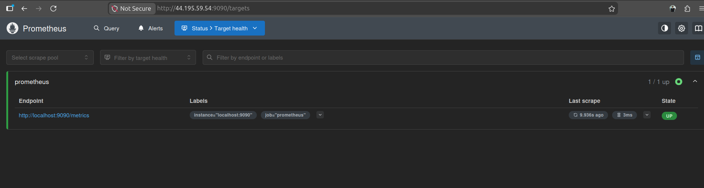
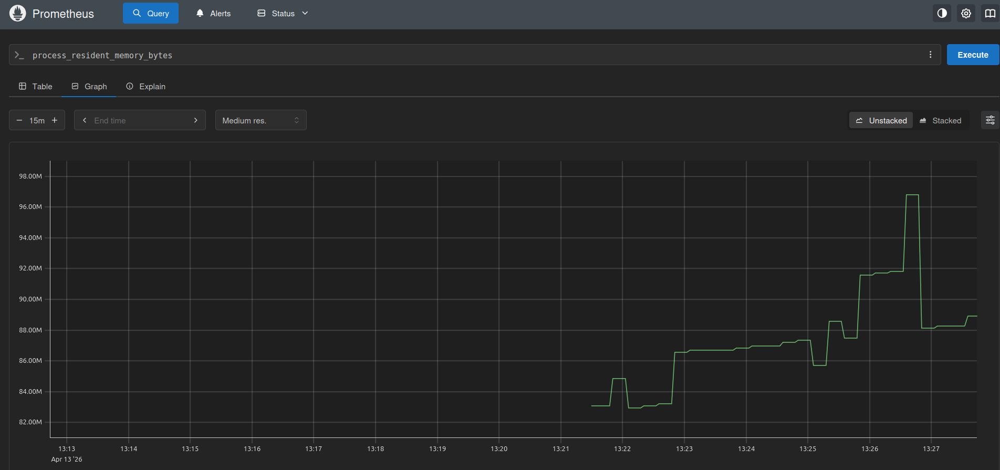
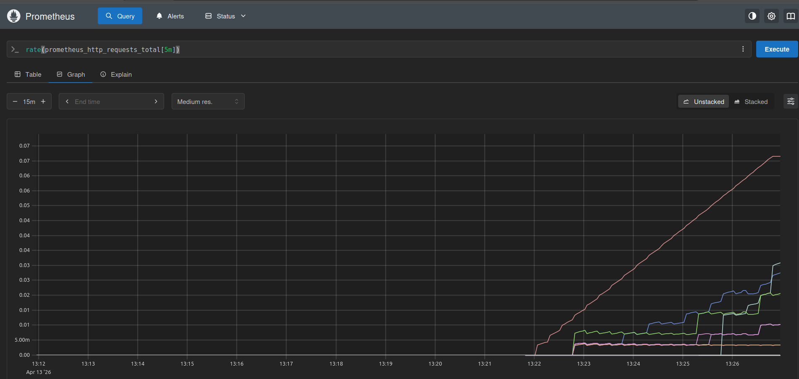
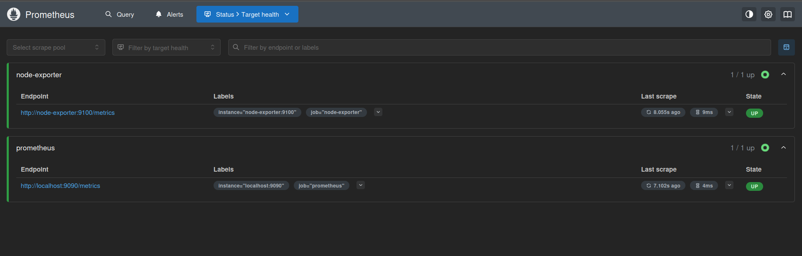

# Day 73 – Observability & Prometheus

## Overview

Today I learned the fundamentals of observability and implemented Prometheus using Docker to monitor system-level metrics.

---

## What is Observability?

Observability is the ability to understand the internal state of a system using the data it produces.

### Observability vs Monitoring

- Monitoring → tells _when_ something is wrong
- Observability → tells _why_ something is wrong

---

## Three Pillars of Observability

### 1. Metrics

- Numerical data over time
- Example: CPU usage, memory usage

### 2. Logs

- Timestamped records of events
- Example: application logs, error logs

### 3. Traces

- Tracks request flow across services

### Why All Three?

- Metrics → What is wrong
- Logs → Why it is wrong
- Traces → Where it is wrong

---

## Architecture

```
[App] → Metrics → Prometheus → Grafana
[App] → Logs → Promtail → Loki → Grafana
[App] → Traces → OTEL → Grafana
[Host] → Node Exporter → Prometheus
```

---

## Prometheus Setup

### prometheus.yml

```yaml
global:
  scrape_interval: 15s
  evaluation_interval: 15s

scrape_configs:
  - job_name: "prometheus"
    static_configs:
      - targets: ["localhost:9090"]

  - job_name: "node-exporter"
    static_configs:
      - targets: ["node-exporter:9100"]
```

### docker-compose.yml

```yaml
services:
  prometheus:
    image: prom/prometheus:latest
    container_name: prometheus
    ports:
      - "9090:9090"
    volumes:
      - ./prometheus.yml:/etc/prometheus/prometheus.yml
      - prometheus_data:/prometheus
    command:
      - "--config.file=/etc/prometheus/prometheus.yml"
    restart: unless-stopped

  node-exporter:
    image: prom/node-exporter:latest
    container_name: node-exporter
    ports:
      - "9100:9100"
    restart: unless-stopped

volumes:
  prometheus_data:
```

---

## Prometheus Concepts

### Scrape Targets

Endpoints Prometheus collects metrics from.

### Metric Types

- Counter → only increases
- Gauge → increases and decreases
- Histogram → value distribution
- Summary → percentiles

### Labels

Used to filter metrics (key-value pairs)

### Time Series

Metric + labels combination

---

## PromQL Queries

### 1. Check target health

```promql
up
```



### 2. Count metrics

```promql
count({__name__=~".+"})
```

### 3. Memory usage

```promql
process_resident_memory_bytes
```



### 4. HTTP request rate

```promql
rate(prometheus_http_requests_total[5m])
```



### 5. CPU usage %

```promql
100 * (1 - avg(rate(node_cpu_seconds_total{mode="idle"}[5m])))
```

### 6. Memory usage %

```promql
(1 - (node_memory_MemAvailable_bytes / node_memory_MemTotal_bytes)) * 100
```

---

## Counter vs Gauge

### Counter

- Only increases
- Example: total API requests

### Gauge

- Can increase/decrease
- Example: memory usage

---

## Key Learnings

- Prometheus uses pull-based monitoring
- rate() is required for counters
- CPU usage is derived from idle time
- Labels are critical for filtering metrics
- Node Exporter provides system-level metrics

---

## Debugging Experience

- Fixed YAML syntax errors (scrape_interval, static_configs)
- Understood Prometheus DOWN state due to missing /metrics endpoint
- Learned difference between service running vs metrics available

---

## Verification

- Prometheus UI accessible
- Targets UP:
  - prometheus
  - node-exporter



---

## Next Steps

- Add Grafana dashboards
- Add Loki for logs
- Add cAdvisor for container metrics

---

## Summary

- Set up Prometheus using Docker
- Learned PromQL basics
- Monitored system metrics using Node Exporter
- Understood real-world debugging scenarios

---
