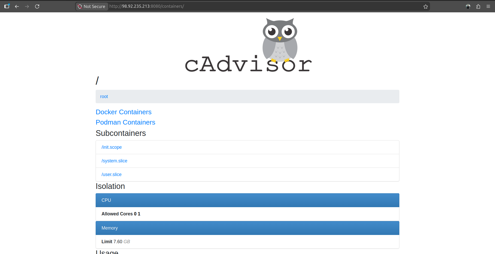
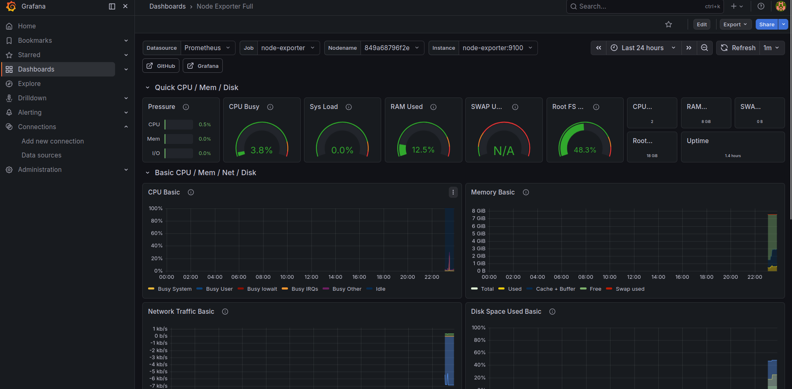
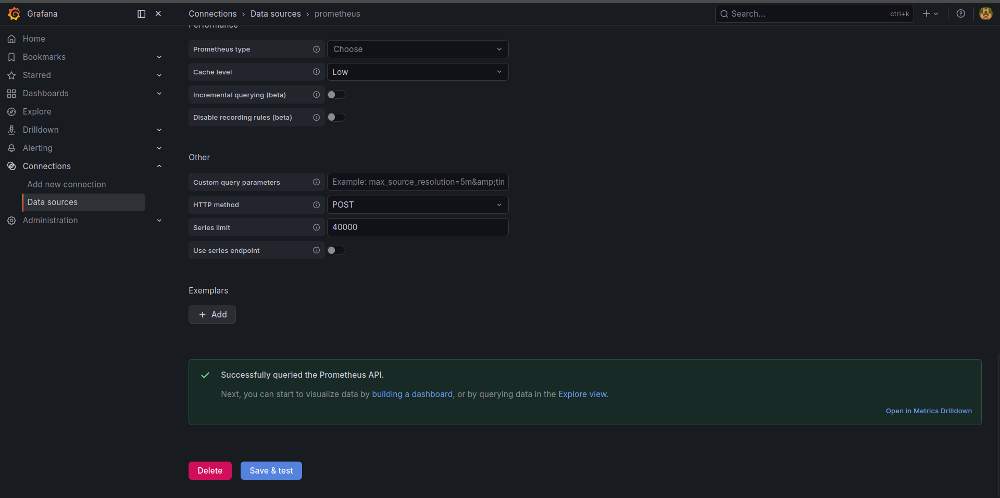

# Day 74 – Node Exporter, cAdvisor, and Grafana Dashboards

## Overview

On Day 74, I implemented a complete observability stack using:

- Node Exporter (Host metrics)
- cAdvisor (Container metrics)
- Prometheus (Metrics collection)
- Grafana (Visualization)

This setup provides full visibility into both system and container-level performance.

---

## Architecture

Node Exporter + cAdvisor → Prometheus → Grafana

---

## Docker Compose Configuration

```yaml
version: "3.8"

services:
  prometheus:
    image: prom/prometheus:latest
    container_name: prometheus
    volumes:
      - ./prometheus.yml:/etc/prometheus/prometheus.yml
      - prometheus_data:/prometheus
    ports:
      - "9090:9090"
    restart: unless-stopped

  node-exporter:
    image: prom/node-exporter:latest
    container_name: node-exporter
    ports:
      - "9100:9100"
    volumes:
      - /proc:/host/proc:ro
      - /sys:/host/sys:ro
      - /:/rootfs:ro
    command:
      - "--path.procfs=/host/proc"
      - "--path.sysfs=/host/sys"
      - "--path.rootfs=/rootfs"
    restart: unless-stopped

  cadvisor:
    image: gcr.io/cadvisor/cadvisor:latest
    container_name: cadvisor
    ports:
      - "8080:8080"
    volumes:
      - /:/rootfs:ro
      - /var/run/docker.sock:/var/run/docker.sock:ro
      - /var/lib/docker/:/var/lib/docker:ro
      - /sys:/sys:ro
      - /var/run:/var/run:ro
    privileged: true
    restart: unless-stopped

  grafana:
    image: grafana/grafana-enterprise:latest
    container_name: grafana
    ports:
      - "3000:3000"
    volumes:
      - grafana_data:/var/lib/grafana
      - ./grafana/provisioning:/etc/grafana/provisioning
    environment:
      - GF_SECURITY_ADMIN_USER=admin
      - GF_SECURITY_ADMIN_PASSWORD=admin123
    restart: unless-stopped

volumes:
  prometheus_data:
  grafana_data:
```

---

## Prometheus Configuration

```yaml
global:
  scrape_interval: 15s

scrape_configs:
  - job_name: "prometheus"
    static_configs:
      - targets: ["localhost:9090"]

  - job_name: "node-exporter"
    static_configs:
      - targets: ["node-exporter:9100"]

  - job_name: "cadvisor"
    static_configs:
      - targets: ["cadvisor:8080"]
```

Prometheus successfully scraped all configured targets:


Node Exporter target health:


---

## PromQL Queries Used

### Host Metrics

```promql
100 - (avg(rate(node_cpu_seconds_total{mode="idle"}[5m])) * 100)

(1 - node_memory_MemAvailable_bytes / node_memory_MemTotal_bytes) * 100

(1 - node_filesystem_avail_bytes{mountpoint="/"} / node_filesystem_size_bytes{mountpoint="/"}) * 100
```

### Container Metrics

```promql
topk(3, container_memory_usage_bytes{name!=""}) / 1024 / 1024

rate(container_cpu_usage_seconds_total{name!=""}[5m]) * 100
```

Prometheus query output for container memory usage:


Prometheus table output for top container memory consumers:


cAdvisor metrics also exposed container memory data directly:


cAdvisor web UI listing containers and subcontainers:



---

## Grafana Dashboard

Created dashboard: **DevOps Observability Overview**

### Panels

- CPU Usage (Gauge)
- Memory Usage (Gauge)
- Container CPU Usage (Time Series)
- Container Memory (Bar Chart)
- Disk Usage (Stat)

---

## Imported Dashboards

- Node Exporter Full → ID: 1860
- Docker Monitoring → ID: 193

Imported Node Exporter dashboard in Grafana:



---

## Node Exporter vs cAdvisor

| Feature  | Node Exporter     | cAdvisor              |
| -------- | ----------------- | --------------------- |
| Scope    | Host              | Containers            |
| Metrics  | CPU, Memory, Disk | Container CPU, Memory |
| Use Case | System monitoring | Container monitoring  |

---

## Grafana Provisioning

```yaml
apiVersion: 1

datasources:
  - name: Prometheus
    type: prometheus
    access: proxy
    url: http://prometheus:9090
    isDefault: true
    editable: false
```

Grafana datasource validation:



### Benefits

- No manual setup
- Reproducible
- Version controlled
- Production-ready

---

## Key Learnings

- Observability requires multiple layers
- Node Exporter + cAdvisor is standard setup
- Grafana makes monitoring actionable
- YAML provisioning is essential in production

---

## Conclusion

Successfully built a complete observability stack with:

- Host monitoring
- Container monitoring
- Visualization dashboards
- Automated provisioning

This setup mirrors real-world DevOps monitoring systems.
