# Day 75 – Log Management with Loki and Promtail

## Project Overview

Today I implemented the **logging pillar of observability** by integrating:

- Grafana Loki (log storage)
- Promtail (log collector)
- Grafana (visualization)

This extends the existing metrics stack (Prometheus + Grafana) to a full **observability pipeline (metrics + logs)**.

---

## Architecture Diagram

```
[Docker Containers]
        |
        v
   [Promtail]
        |
        v
     [Loki]
        |
        v
    [Grafana]
```

---

## Logging Pipeline Explanation

1. Docker containers generate logs and store them as JSON files
2. Promtail reads these log files from the host system
3. Promtail attaches labels (container_name, service, etc.)
4. Promtail pushes logs to Loki
5. Loki stores logs and indexes only labels
6. Grafana queries Loki using LogQL and visualizes logs

---

## Log Storage Verification

```bash
docker inspect <container-id> | grep LogPath
```

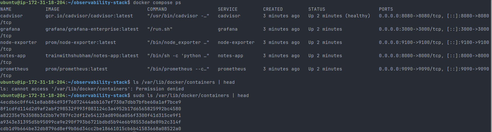

_Verified the running containers first, then confirmed Docker stores container logs under `/var/lib/docker/containers/`._

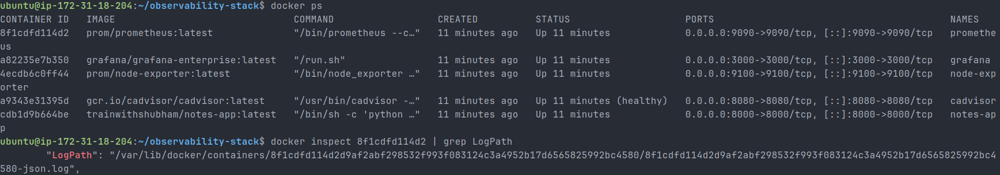

_Used `docker inspect` to confirm the exact JSON log file path for the Prometheus container._

Logs are stored at:

```
/var/lib/docker/containers/<container-id>/<container-id>-json.log
```

---

## Why Loki Indexes Only Labels

Loki indexes only labels instead of full log content.

### Advantages:

- Lower storage cost
- Faster ingestion
- Simpler architecture

### Trade-offs:

- Slower full-text search
- Less powerful querying than ELK

---

## Loki Configuration (loki-config.yml)

```yaml
auth_enabled: false

server:
  http_listen_port: 3100

common:
  ring:
    instance_addr: 127.0.0.1
    kvstore:
      store: inmemory
  replication_factor: 1
  path_prefix: /loki

schema_config:
  configs:
    - from: 2020-10-24
      store: tsdb
      object_store: filesystem
      schema: v13
      index:
        prefix: index_
        period: 24h

storage_config:
  filesystem:
    directory: /loki/chunks
```

---

## Promtail Configuration (promtail-config.yml)

```yaml
server:
  http_listen_port: 9080
  grpc_listen_port: 0

positions:
  filename: /tmp/positions.yaml

clients:
  - url: http://loki:3100/loki/api/v1/push

scrape_configs:
  - job_name: docker
    docker_sd_configs:
      - host: unix:///var/run/docker.sock
        refresh_interval: 5s

    relabel_configs:
      - source_labels: ["__meta_docker_container_name"]
        target_label: "container_name"

      - source_labels:
          ["__meta_docker_container_label_com_docker_compose_service"]
        target_label: "service"

    pipeline_stages:
      - docker: {}
```

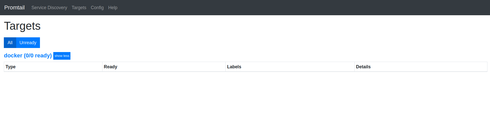

_Initial Promtail targets page showing no ready targets while validating the setup._

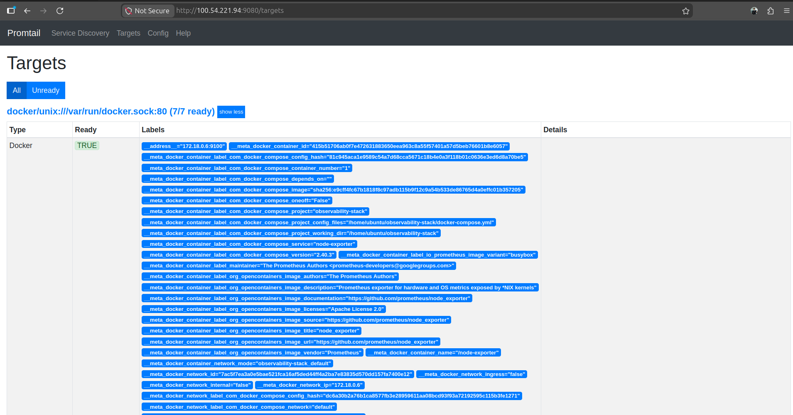

_Promtail successfully discovered Docker containers and exposed their labels once the configuration was working._

---

## Docker Compose (Updated Services)

```yaml
loki:
  image: grafana/loki:latest
  container_name: loki
  ports:
    - "3100:3100"
  volumes:
    - ./loki/loki-config.yml:/etc/loki/loki-config.yml
    - loki_data:/loki
  command: -config.file=/etc/loki/loki-config.yml

promtail:
  image: grafana/promtail:latest
  container_name: promtail
  ports:
    - "9080:9080"
  volumes:
    - ./promtail/promtail-config.yml:/etc/promtail/promtail-config.yml
    - /var/lib/docker/containers:/var/lib/docker/containers:ro
    - /var/run/docker.sock:/var/run/docker.sock
  command: -config.file=/etc/promtail/promtail-config.yml

volumes:
  loki_data:
```

---

## LogQL Queries

### 1. View all logs

```
{job="docker"}
```

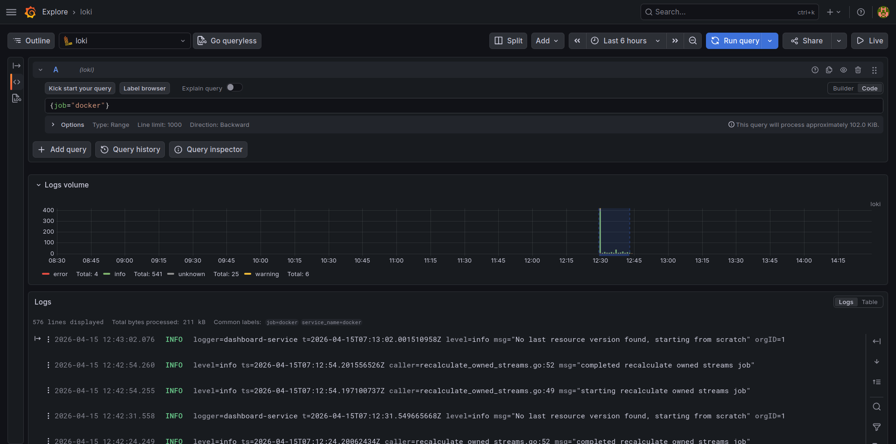

_This query shows all logs collected under the `docker` job, confirming Loki is ingesting logs from multiple containers._

### 2. Filter error logs

```
{job="docker"} |= "error"
```

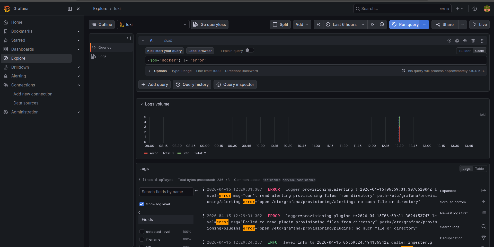

_Grafana Explore returning log lines that match `error` from Loki._

### 3. Notes app logs

```
{container_name="/notes-app"}
```

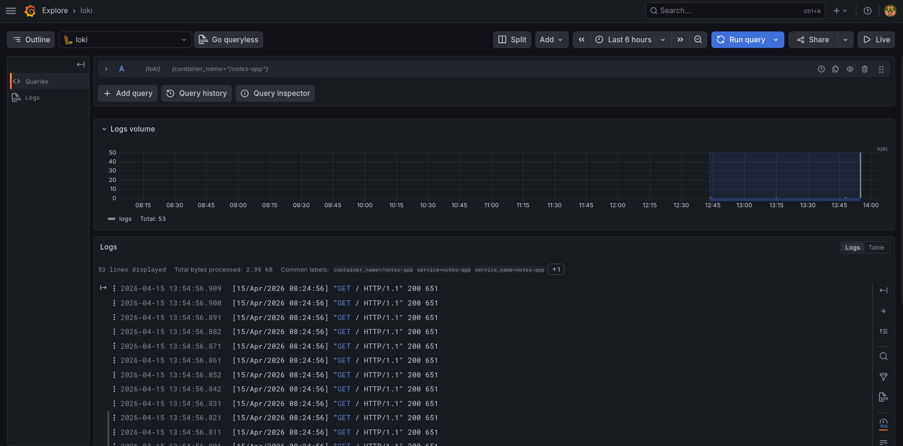

_Queried the Notes app container directly to verify request logs were reaching Loki._

### 4. Count logs per minute

```
count_over_time({job="docker"}[1m])
```

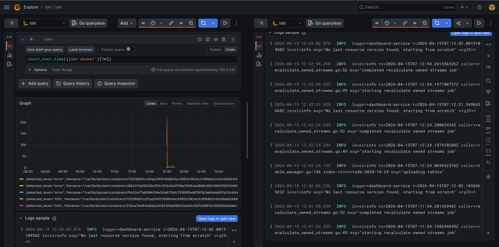

_Used `count_over_time` to visualize how log volume changed over time and spot bursts of activity._

### 5. Top containers by log volume

```
topk(3, sum by (container_name) (rate({job="docker"}[5m])))
```

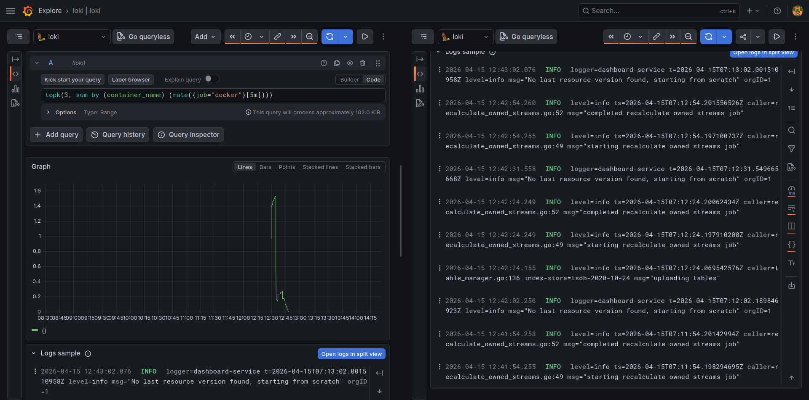

_This LogQL query highlights which containers generated the most logs during the selected time range._

---

## Metrics + Logs Correlation

Using Grafana Explore split view:

- Left panel: Prometheus (metrics)
- Right panel: Loki (logs)

This allows:

- Detecting spikes (CPU, memory)
- Immediately checking logs at the same timestamp

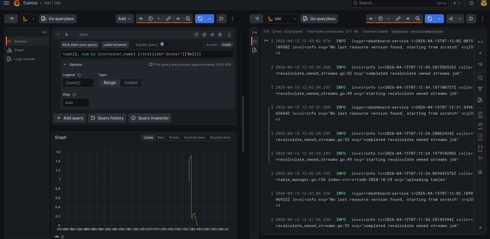

_Used split view in Grafana Explore to correlate a log-volume query with raw Loki logs side by side._

---

## Debugging Scenario (Real Example)

Issue: Grafana not loading / system slow

Investigation:

- Checked system using `top`
- Observed high CPU and memory usage
- Logs showed system pressure and service delays

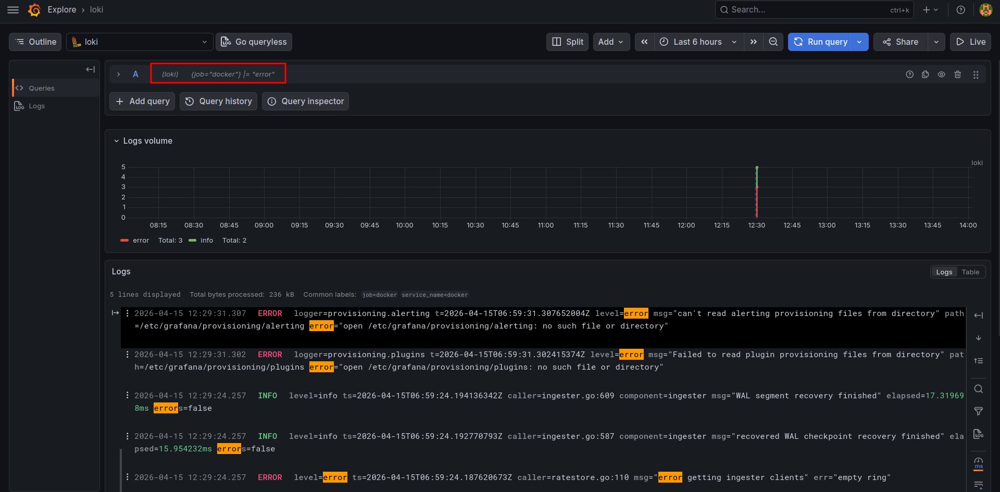

_During debugging, the focused Loki query helped surface error messages quickly in Grafana Explore._

Root Cause:

- EC2 instance had insufficient RAM (t2.micro)

Fix:

- Upgraded instance to t3.small

---

## Loki vs ELK Stack

| Feature     | Loki           | ELK              |
| ----------- | -------------- | ---------------- |
| Indexing    | Labels only    | Full-text        |
| Cost        | Low            | High             |
| Complexity  | Simple         | Complex          |
| Performance | High ingestion | Heavy processing |

---

## Key Learnings

- Logs explain WHY failures happen
- Label-based logging improves efficiency
- Service discovery is better than static configs
- Resource planning is critical in observability systems
- Metrics + logs together enable faster debugging

---

## Conclusion

Successfully implemented a full **centralized logging system** using Loki and Promtail and integrated it with Grafana for visualization and debugging.

This completes the second pillar of observability: **Logs**.
