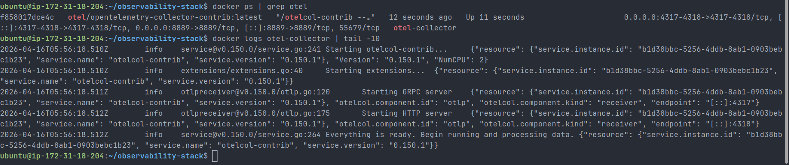
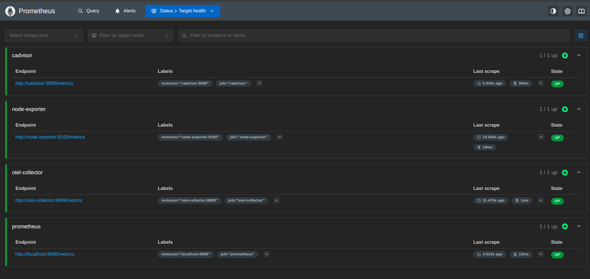
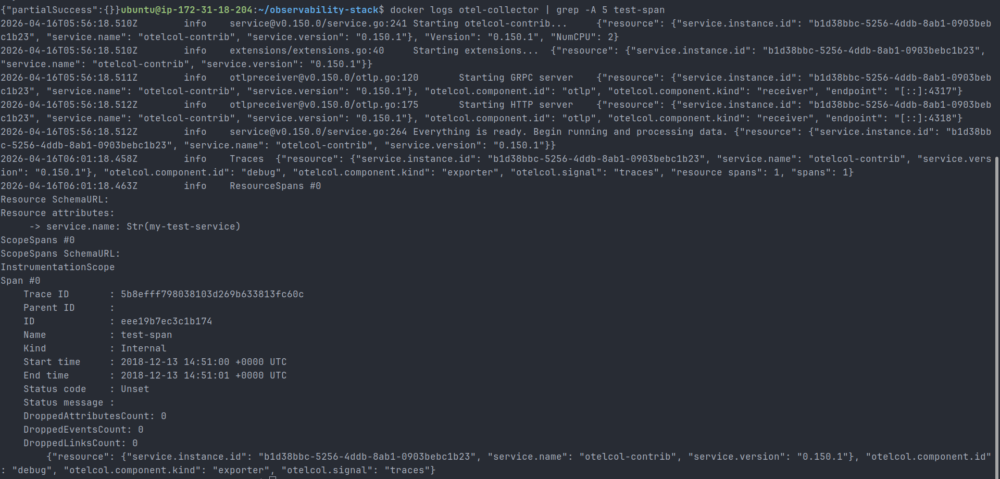
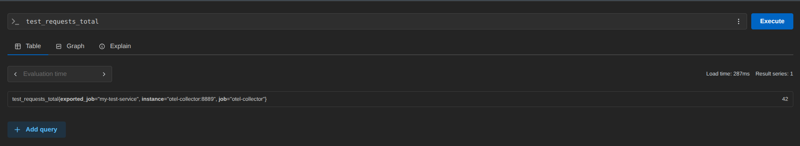
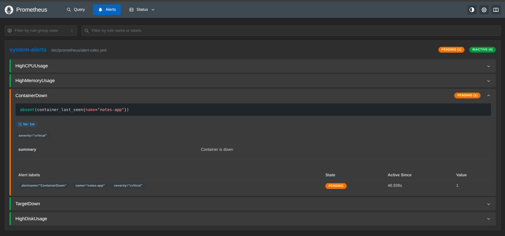
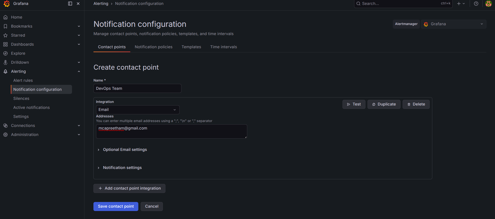
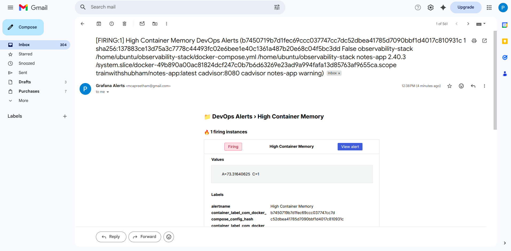

# Day 76 – Observability and Alerting (OpenTelemetry, Prometheus, Grafana)

## Objective

Build a complete observability stack covering metrics, logs, and traces, along with a production-style alerting system using Prometheus and Grafana.

---

## Architecture Overview

### Metrics Pipeline

```
Node Exporter → Prometheus → Grafana
cAdvisor → Prometheus → Grafana
OTEL Collector → Prometheus → Grafana
```

### Logs Pipeline

```
Promtail → Loki → Grafana
```

### Traces Pipeline

```
Application / curl → OTLP → OTEL Collector → Debug Exporter
```

### Alerting Pipeline

```
Prometheus → Alert Rules → Grafana → SMTP → Email
```

---

## Implementation Steps

### 1. OpenTelemetry Collector Setup

- Configured OTLP receivers (HTTP and gRPC)
- Enabled debug exporter for trace validation

Verification:

```
docker logs otel-collector
```

Screenshot:



---

### 2. Sending Test Trace

```
curl -X POST http://localhost:4318/v1/traces \
  -H "Content-Type: application/json" \
  -d '{
    "resourceSpans": [{
      "resource": {
        "attributes": [{
          "key": "service.name",
          "value": { "stringValue": "my-test-service" }
        }]
      },
      "scopeSpans": [{
        "spans": [{
          "name": "test-span",
          "kind": 1,
          "startTimeUnixNano": "1544712660000000000",
          "endTimeUnixNano": "1544712661000000000"
        }]
      }]
    }]
  }'
```

Collector status in Prometheus:



Trace visible in collector logs:



---

### 3. Sending Test Metric

```
curl -X POST http://localhost:4318/v1/metrics \
  -H "Content-Type: application/json" \
  -d '{
    "resourceMetrics": [{
      "resource": {
        "attributes": [{
          "key": "service.name",
          "value": { "stringValue": "my-test-service" }
        }]
      },
      "scopeMetrics": [{
        "metrics": [{
          "name": "test_requests_total",
          "sum": {
            "dataPoints": [{
              "asInt": "42",
              "startTimeUnixNano": "1544712660000000000",
              "timeUnixNano": "1544712661000000000"
            }],
            "aggregationTemporality": 2,
            "isMonotonic": true
          }
        }]
      }]
    }]
  }'
```

Verification in Prometheus:

```
test_requests_total
```

Metric visible after OTEL export:



---

### 4. Prometheus Alert Rules

Created `alert-rules.yml`:

```
groups:
  - name: system-alerts
    rules:
      - alert: HighCPUUsage
        expr: 100 - (avg(rate(node_cpu_seconds_total{mode="idle"}[5m])) * 100) > 80
        for: 2m

      - alert: HighMemoryUsage
        expr: (1 - node_memory_MemAvailable_bytes / node_memory_MemTotal_bytes) * 100 > 85
        for: 2m

      - alert: ContainerDown
        expr: absent(container_last_seen{name="notes-app"})
        for: 1m

      - alert: TargetDown
        expr: up == 0
        for: 1m

      - alert: HighDiskUsage
        expr: (1 - node_filesystem_avail_bytes{mountpoint="/"} / node_filesystem_size_bytes{mountpoint="/"}) * 100 > 90
        for: 5m
```

---

### 5. Grafana Alerting Configuration

- Created email contact point
- Configured default notification policy
- Linked alert rules to contact point

Container alert trigger validation:



Grafana alerting configuration:



---

### 6. SMTP Configuration (Secure Setup)

Used Docker secrets instead of hardcoding credentials:

```
environment:
  - GF_SMTP_ENABLED=true
  - GF_SMTP_HOST=smtp.gmail.com:587
  - GF_SMTP_USER=mcapreetham@gmail.com
  - GF_SMTP_FROM_ADDRESS=mcapreetham@gmail.com
  - GF_SMTP_FROM_NAME=Grafana Alerts
  - GF_SMTP_SKIP_VERIFY=true
  - GF_SMTP_STARTTLS_POLICY=Opportunistic
  - GF_SMTP_PASSWORD__FILE=/run/secrets/grafana_smtp_password
```

---

## Testing and Validation

### Alert Lifecycle Test

- Modified threshold to force alert
- Observed:
  - Normal → Pending → Firing → Resolved

### Email Notification Test

- Contact point test successful
- Alert triggered email notification

Email alert received successfully:



---

## Key Concepts

- OpenTelemetry acts as a centralized telemetry pipeline
- Prometheus uses pull-based scraping
- `absent()` detects missing metrics (service down)
- `up == 0` detects failing targets
- `for` reduces alert noise by enforcing duration
- Notification policies control alert routing
- SMTP requires App Password and STARTTLS

---

## Security Practices

- Used Docker secrets for sensitive data
- Avoided hardcoding credentials
- Ensured secrets are excluded via `.gitignore`

---

## Outcome

- Built full observability stack (metrics, logs, traces)
- Implemented alerting with real-time notifications
- Applied production-level security practices

---

## Conclusion

This implementation provides a practical understanding of monitoring, alerting, and observability systems used in modern cloud-native environments.
