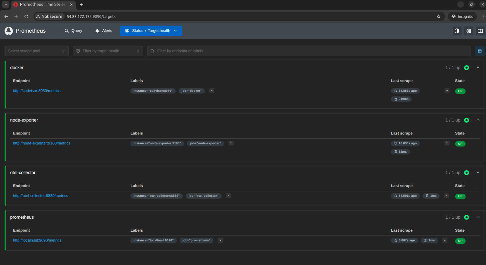
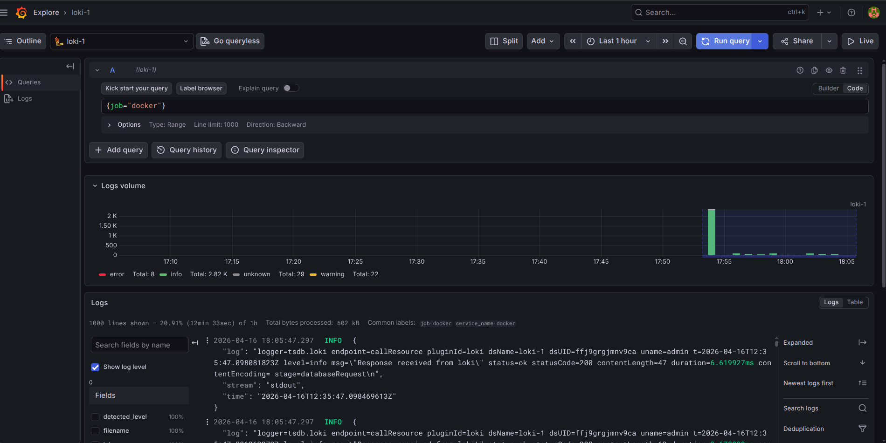
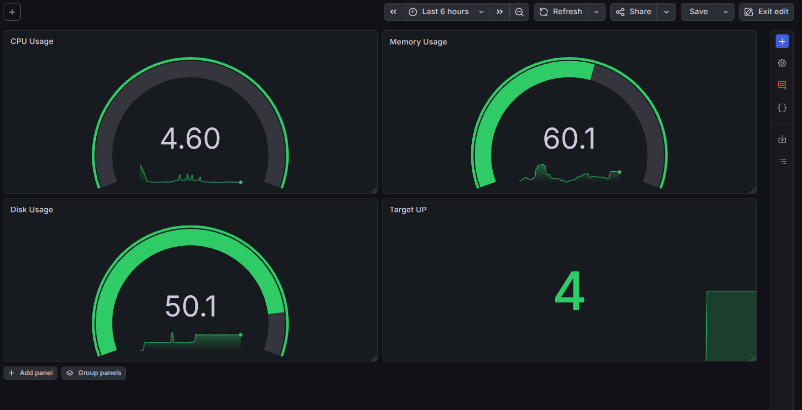

# Observability Stack for DevOps (Metrics, Logs, Traces)

## Overview

This project implements a complete **observability stack** using industry-standard tools to monitor infrastructure and applications through **metrics, logs, and traces**.

The setup demonstrates how modern DevOps teams gain visibility into system performance, troubleshoot issues, and ensure reliability.

---

## Tech Stack

| Component               | Purpose                        |
| ----------------------- | ------------------------------ |
| Prometheus              | Metrics collection and storage |
| Grafana                 | Visualization and dashboards   |
| Loki                    | Log aggregation                |
| Promtail                | Log collection agent           |
| OpenTelemetry Collector | Distributed tracing pipeline   |
| Node Exporter           | Host-level metrics             |
| cAdvisor                | Container-level metrics        |
| Docker Compose          | Service orchestration          |

---

## Architecture

```
                +----------------------+
                |     Grafana          |
                | Dashboards & Explore |
                +----------+-----------+
                           |
        +------------------+------------------+
        |                                     |
+---------------+                    +------------------+
|  Prometheus   |                    |      Loki        |
| (Metrics)     |                    |   (Logs)         |
+-------+-------+                    +--------+---------+
        |                                     |
        |                                     |
+-------+--------+                   +---------+--------+
| Node Exporter  |                   |     Promtail     |
| cAdvisor       |                   |  (Log Collector) |
+----------------+                   +------------------+

                    +------------------------+
                    | OpenTelemetry Collector|
                    |       (Traces)         |
                    +------------------------+
```

---

## Setup

### Clone Repository

```bash
git clone <your-repo-url>
cd observability-for-devops
```

### Start Services

```bash
docker compose up -d
```

### Verify Running Containers

```bash
docker compose ps
```

---

## Access Services

| Service        | URL                   |
| -------------- | --------------------- |
| Grafana        | http://localhost:3000 |
| Prometheus     | http://localhost:9090 |
| Loki           | http://localhost:3100 |
| OTEL Collector | http://localhost:4318 |

---

## Metrics Validation (Prometheus)

- Verified targets:

```bash
http://localhost:9090/targets
```

- All services should be **UP**
- Metrics collected from:
  - Node Exporter
  - cAdvisor
  - OTEL Collector



---

## Logs Pipeline (Loki + Promtail)

### Promtail Configuration

- Fixed log path to:

```yaml
/var/lib/docker/containers/*/*.log
```

- Added required client:

```yaml
clients:
  - url: http://loki:3100/loki/api/v1/push
```

### Validation

- Generated logs via application
- Queried logs in Grafana:

```logql
{job="docker"} |= "notes"
```



### Key Learning

- Labels vs log content filtering
- Importance of correct log path and mounts

---

## Tracing (OpenTelemetry)

### Trace Injection

Sent custom trace:

```bash
curl -X POST http://localhost:4318/v1/traces ...
```

### Observed Output

- Parent Span: `GET /api/notes`
- Child Span: `SELECT notes FROM database`
- Attributes:
  - http.method
  - http.route
  - db.system
  - db.statement

### Key Learning

- Parent-child span relationships
- End-to-end request visibility

---

## Grafana Dashboards

### Custom Dashboard: Production Overview

#### Row 1: System Health

- CPU Usage
- Memory Usage
- Disk Usage
- Targets UP

#### Row 2: Containers

- Container CPU
- Container Memory
- Container Count

#### Row 3: Logs (Loki)

- Application Logs
- Error Rate
- Log Volume

#### Row 4: Services

- Prometheus Scrape Duration
- OTEL Collector Status



---

### Imported Dashboards

#### Node Exporter Full (ID: 1860)

- Deep system metrics
- CPU, RAM, Disk, Network insights

---

## Dashboard Navigation

- Added drill-down link:
  - **Main Dashboard → Node Exporter Dashboard**

This enables:

- High-level monitoring → deep infrastructure analysis

---

## Key DevOps Learnings

- Difference between **restart vs recreate containers**
- Importance of **correct config mounting**
- Debugging config issues inside containers
- Label-based vs content-based log filtering
- Observability pillars:
  - Metrics
  - Logs
  - Traces

- Real-world debugging workflow

---

## Troubleshooting Highlights

| Issue                             | Fix                                  |
| --------------------------------- | ------------------------------------ |
| Promtail not reading logs         | Fixed log path                       |
| Config not applied                | Corrected mount + recreate container |
| Promtail crash                    | Added `clients` config               |
| Loki query empty                  | Fixed labels and filtering           |
| Prometheus not visible in Grafana | Added datasource                     |
| OTEL traces not detailed          | Enabled debug verbosity              |

---

## Project Outcome

Successfully built a **production-style observability stack** that provides:

- Real-time system monitoring
- Centralized logging
- Distributed tracing
- Actionable dashboards

---

## Future Improvements

- Add alerting (Grafana Alerts / Alertmanager)
- Integrate Tempo or Jaeger for trace visualization
- Add Kubernetes monitoring
- Enhance log parsing with structured labels

---

## Conclusion

This project demonstrates a practical implementation of modern DevOps observability practices, combining multiple tools into a cohesive monitoring solution.

---
