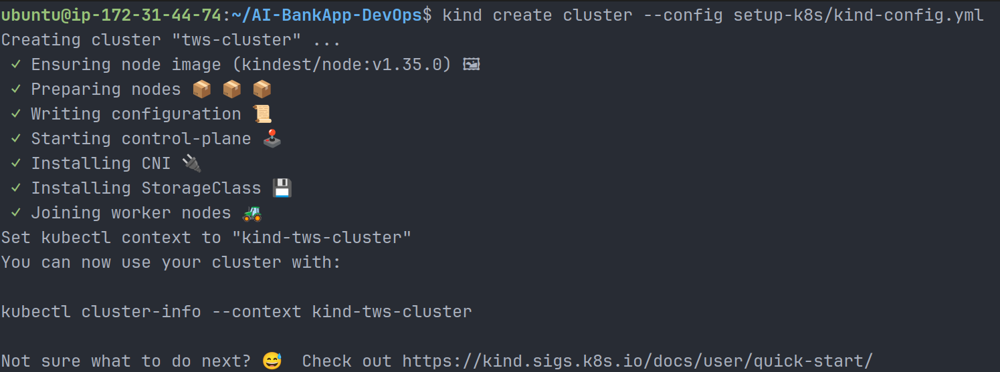
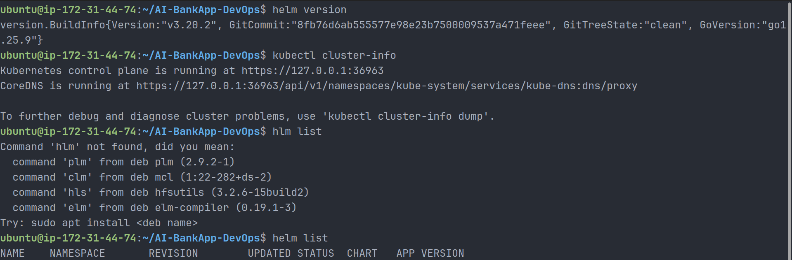
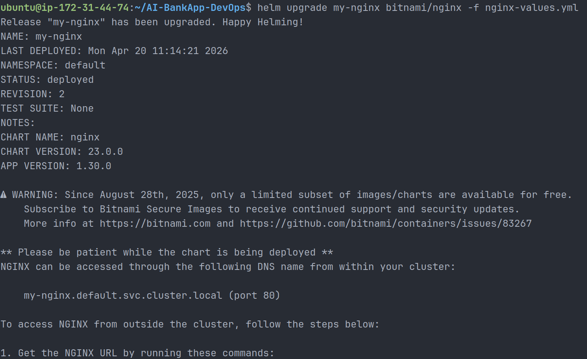
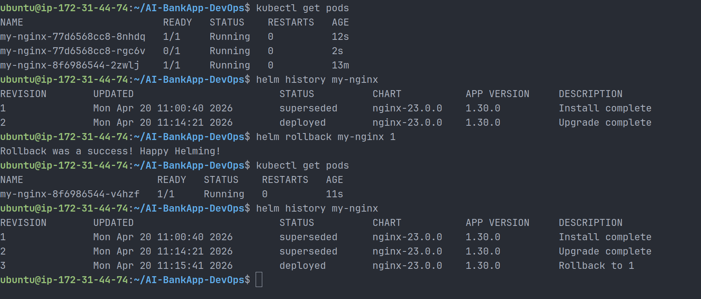

# Day 78 – Introduction to Helm and Chart Basics

## Overview

On Day 78, I learned and implemented Helm, the package manager for Kubernetes. Instead of manually managing multiple Kubernetes YAML manifests, Helm allows packaging, versioning, and deploying applications efficiently using charts.

---

## Objectives Achieved

- Installed Helm and connected it to a Kubernetes cluster (Kind)
- Deployed applications using Helm charts
- Understood Helm core concepts: Chart, Release, Repository, Values
- Performed Helm operations: install, upgrade, rollback, uninstall
- Compared raw Kubernetes manifests vs Helm-based deployments

---

## Helm Concepts (In My Own Words)

### 1. Helm

Helm is a package manager for Kubernetes that simplifies application deployment by bundling Kubernetes resources into reusable units called charts.

### 2. Chart

A chart is a collection of Kubernetes YAML templates that define an application (Deployment, Service, ConfigMap, etc.).

### 3. Release

A release is a running instance of a chart inside a Kubernetes cluster. Each installation of a chart creates a new release.

### 4. Repository

A repository is a place where Helm charts are stored and shared, similar to Docker Hub for container images.

### 5. Values

Values are configuration inputs used to customize a chart for different environments (dev, staging, production).

---

## Why Helm Over Raw YAML

### Problems with Raw YAML

- Multiple files to manage (Deployments, Services, Secrets, PVCs)
- Hardcoded values
- No easy rollback
- Difficult to manage multiple environments

### Benefits of Helm

- Single command deployment
- Template-based configuration
- Version control and rollback
- Reusable across environments
- Built-in dependency management

---

## Environment Setup

### Create Kind Cluster

```bash
git clone -b feat/gitops https://github.com/TrainWithShubham/AI-BankApp-DevOps.git
cd AI-BankApp-DevOps
kind create cluster --config setup-k8s/kind-config.yml
```



_Kind successfully created with the AI-BankApp configuration._

### Install Helm

```bash
curl https://raw.githubusercontent.com/helm/helm/main/scripts/get-helm-3 | bash
```

### Verify Setup

```bash
helm version
kubectl cluster-info
```



_Verifying Helm installation and Kubernetes cluster connectivity._

---

## Helm Deployment – NGINX Example

### Add Repository

```bash
helm repo add bitnami https://charts.bitnami.com/bitnami
helm repo update
```

### Install NGINX

```bash
helm install my-nginx bitnami/nginx
```

### Verify Deployment

```bash
kubectl get pods
kubectl get svc
helm list
```

---

## Accessing the Application

Since Kind does not support LoadBalancer:

```bash
kubectl port-forward --address 0.0.0.0 svc/my-nginx 9090:80
```

Access in browser:

```
http://<EC2-PUBLIC-IP>:9090
```

---

## Using values.yaml (Production Approach)

### Create File

```bash
vi nginx-values.yaml
```

```yaml
replicaCount: 2

service:
  type: NodePort

resources:
  requests:
    cpu: 100m
    memory: 128Mi
  limits:
    cpu: 200m
    memory: 256Mi
```

### Upgrade Deployment

```bash
helm upgrade my-nginx bitnami/nginx -f nginx-values.yaml
```



_Helm upgrade created revision 2 for the NGINX release using the custom values file._

### Verify

```bash
kubectl get pods
helm history my-nginx
```

---

## Helm Rollback

### Rollback Command

```bash
helm rollback my-nginx 1
```

### Verify Rollback

```bash
kubectl get pods
helm history my-nginx
```



_Rollback completed successfully and Helm created a new deployed revision for the restored state._

---

## Observations

- Helm upgrade created a new revision
- Rolling update ensured zero downtime
- Rollback restored previous working state instantly
- Each Helm action creates a new revision for tracking

---

## Helm vs Kubernetes Deployment

| Feature       | Kubernetes (kubectl) | Helm           |
| ------------- | -------------------- | -------------- |
| Deployment    | Manual YAML          | Single command |
| Configuration | Hardcoded            | values.yaml    |
| Rollback      | Manual               | helm rollback  |
| Versioning    | Limited              | Built-in       |
| Reusability   | Low                  | High           |

---

## Key Learnings

- Helm simplifies Kubernetes application management
- values.yaml is essential for real-world deployments
- Helm provides safe upgrade and rollback mechanisms
- Debugging is a critical DevOps skill (image issues, networking, ports)

---

## Challenges Faced

- Bitnami MySQL image restrictions caused deployment failures
- Image compatibility issues with Helm charts
- Networking issues with Kind and NodePort
- Port conflicts during port-forwarding

---

## Solutions Implemented

- Switched to a stable chart (NGINX) for learning Helm
- Used port-forward for accessing services
- Used correct port mappings and security group rules
- Debugged using kubectl describe and logs

---

## Conclusion

Helm significantly improves the way applications are deployed and managed in Kubernetes. It provides a structured, scalable, and production-ready approach compared to raw YAML manifests. Understanding Helm is essential for any DevOps engineer working with Kubernetes.

---

## Next Steps

- Learn Helm chart structure
- Build a custom Helm chart for AI-BankApp
- Implement Helm in CI/CD pipelines

---

#90DaysOfDevOps #DevOps #Kubernetes #Helm
