# Day 79 – Custom Helm Chart for AI-BankApp

## Overview

Today I converted a multi-service Kubernetes application (AI-BankApp) from 12 raw YAML manifests into a reusable, configurable Helm chart. The application consists of:

- Spring Boot BankApp
- MySQL database
- Ollama AI chatbot

With Helm, the entire stack can now be deployed using a single command.

---

## Project Structure

```
helm-chart/
└── bankapp/
    ├── Chart.yaml
    ├── values.yaml
    ├── templates/
    │   ├── bankapp-deployment.yaml
    │   ├── mysql-deployment.yaml
    │   ├── ollama-deployment.yaml
    │   ├── services.yaml
    │   ├── configmap.yaml
    │   ├── secrets.yaml
    │   ├── storage.yaml
    │   ├── hpa.yaml
    │   └── _helpers.tpl
```

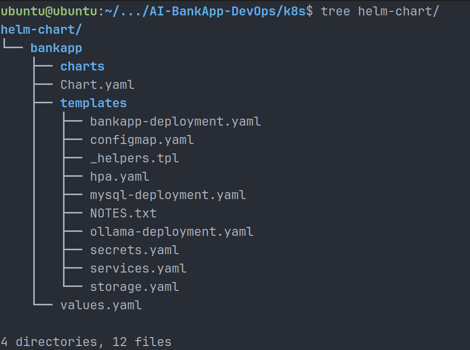

---

## values.yaml (Configuration)

The Helm chart is fully configurable via `values.yaml`.

### BankApp

- Replica count
- Image repository and tag
- Resource limits and requests
- Service configuration
- Autoscaling settings

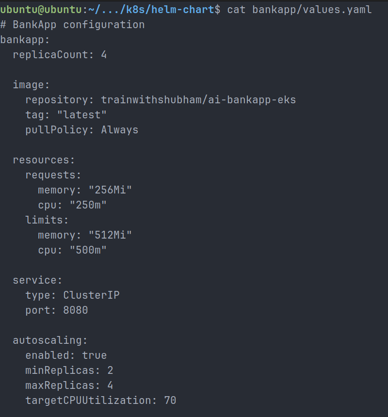

### MySQL

- Enable/disable flag
- Image version
- Resource limits
- Persistent storage (5Gi)

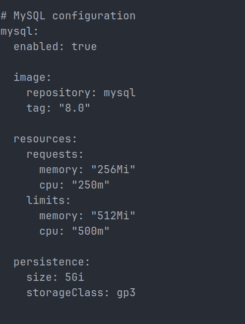

### Ollama

- Enable/disable flag
- Model selection (tinyllama)
- Resource configuration
- Persistent storage (10Gi)

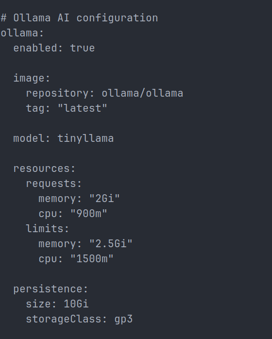

### Shared Config

- Database name
- Ollama service URL

### Secrets

- MySQL credentials managed securely via Helm templates

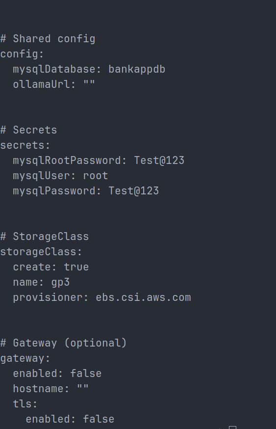

---

## Helm Validation

```
helm lint bankapp/
```

Result:

- Chart validated successfully
- No errors found

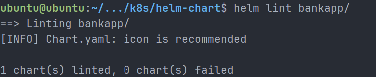

---

## Helm Template Rendering

```
helm template test bankapp/ -n bankapp
```

### Key Outputs

#### Deployment (BankApp)

- Init containers for dependency checks
- ConfigMap and Secret injection
- Health probes

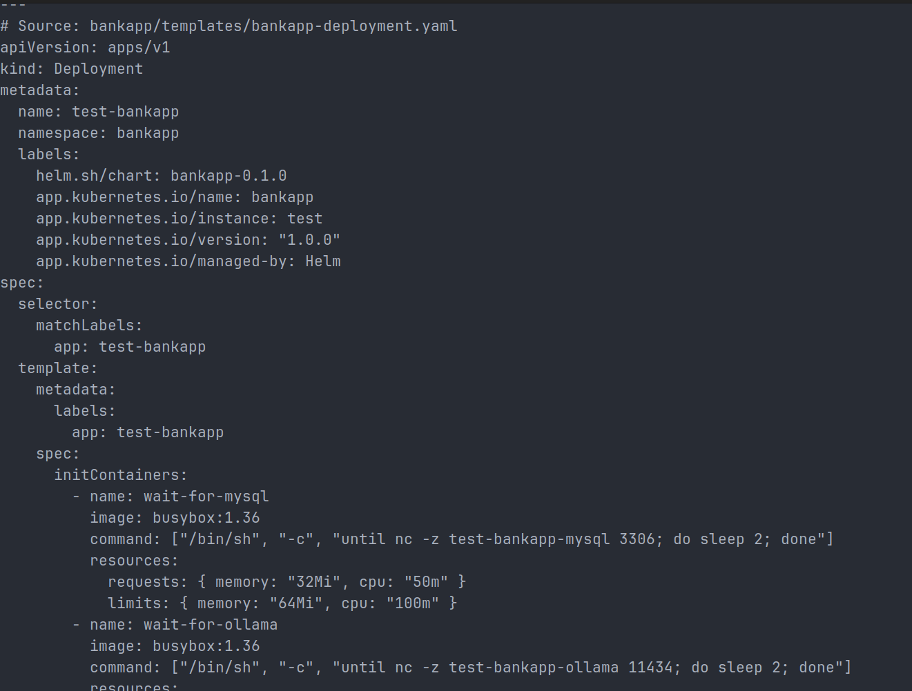

#### Services

- MySQL (ClusterIP)
- Ollama (ClusterIP)
- BankApp (ClusterIP)

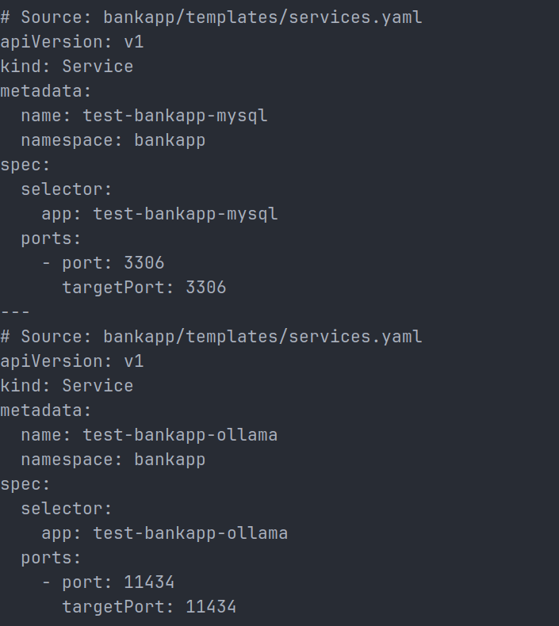

#### HPA

- Min replicas: 2
- Max replicas: 4
- CPU-based scaling (70%)

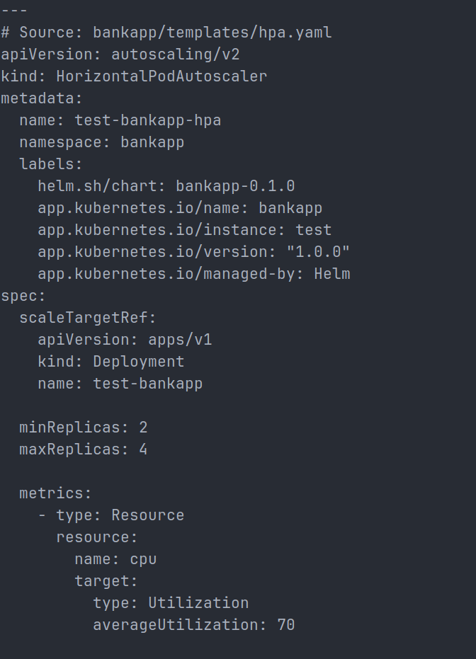

---

## Deployment

```
helm install my-bankapp bankapp/ \
  -n bankapp --create-namespace \
  --set storageClass.create=false \
  --set mysql.persistence.storageClass=standard \
  --set ollama.persistence.storageClass=standard
```

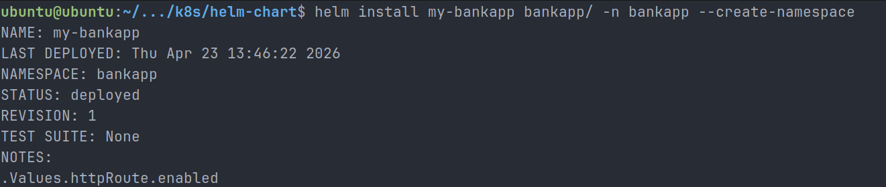

---

## Kubernetes Resources

```
kubectl get all -n bankapp
```

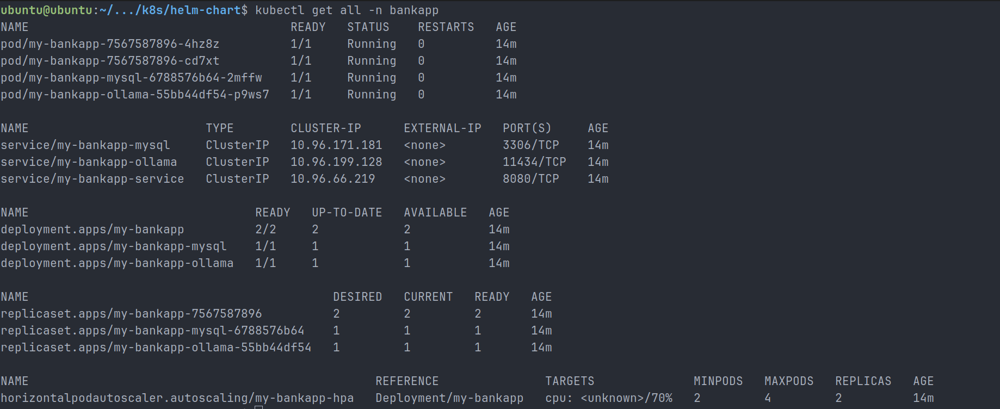

Resources deployed:

- 3 Deployments (BankApp, MySQL, Ollama)
- 3 Services
- ReplicaSets
- Pods (all running)

---

## Persistent Storage

```
kubectl get pvc -n bankapp
```

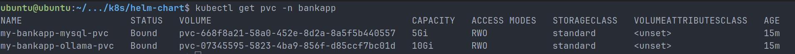

- MySQL PVC: 5Gi
- Ollama PVC: 10Gi

---

## Autoscaling (HPA)

```
kubectl get hpa -n bankapp
```

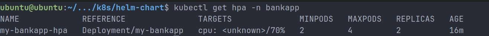

- Min pods: 2
- Max pods: 4
- CPU-based scaling

---

## Application Access

```
kubectl port-forward svc/my-bankapp-service -n bankapp 8080:8080
```

Access:

```
http://localhost:8080
```

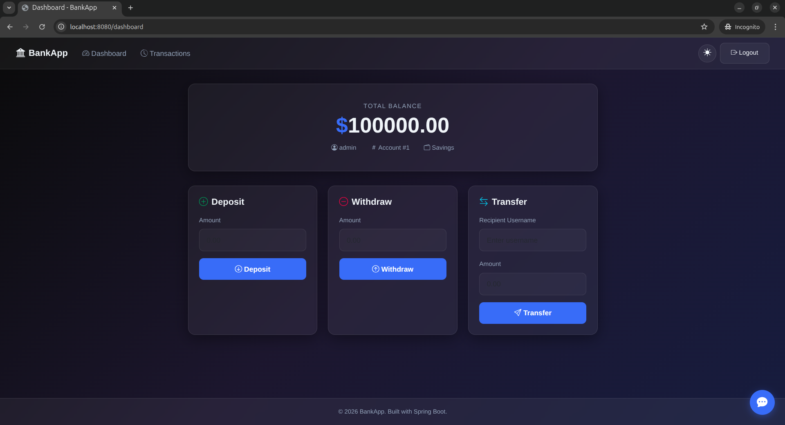

---

## AI Chatbot Integration

- Ollama service deployed via Helm
- Model pulled dynamically using lifecycle hook
- AI assistant integrated into BankApp UI
- Successfully responding to queries

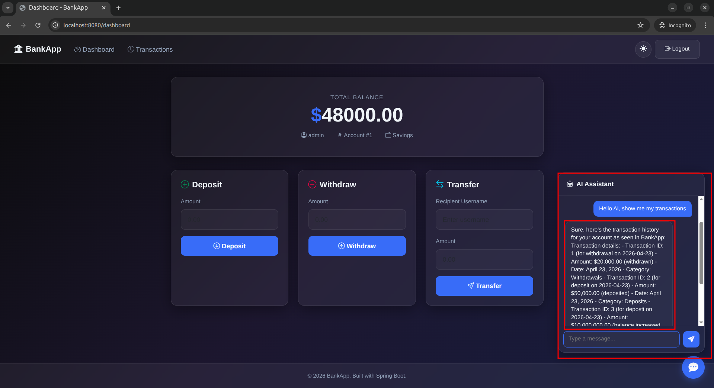

---

## Before vs After (Key Improvement)

| Raw Kubernetes   | Helm Chart          |
| ---------------- | ------------------- |
| 12 YAML files    | 1 Helm chart        |
| Hardcoded values | values.yaml driven  |
| Manual edits     | CLI overrides       |
| No reuse         | Reusable deployment |

---

## Key Learnings

- Helm templating (`{{ .Values }}`)
- Conditional deployments (`enabled` flags)
- Secret management using `b64enc`
- Init containers for dependency handling
- Persistent storage with PVCs
- Autoscaling using HPA
- Packaging applications with Helm

---

## Conclusion

This task demonstrated how to package a real-world Kubernetes application using Helm. The system is now:

- Configurable
- Reusable
- Scalable
- Production-ready

A single Helm command can deploy the complete stack including database and AI components.

---

#90DaysOfDevOps
