# Day 80 – Helm Project: Multi-Environment Deployment & CI/CD

## Overview

On Day 80, I implemented a production-grade Helm workflow for the AI-BankApp. This included creating environment-specific configurations, adding Helm hooks for dependency management, packaging the chart, and simulating a GitOps-based CI/CD pipeline.

### Setup (Local Lab)

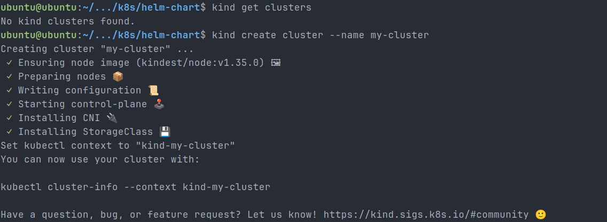

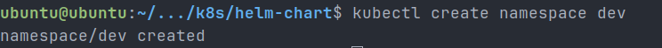

---

## 1. Environment-Specific Values

### Dev vs Staging vs Prod

| Setting         | Dev                  | Staging   | Prod      |
| --------------- | -------------------- | --------- | --------- |
| Replicas        | 1                    | 2-3 (HPA) | 2-4 (HPA) |
| Image Tag       | latest               | v1.2.0    | v1.2.0    |
| MySQL Storage   | 2Gi                  | 5Gi       | 20Gi      |
| MySQL Resources | Low                  | Medium    | High      |
| Ollama          | Disabled (optimized) | Enabled   | Enabled   |
| Gateway         | Disabled             | Disabled  | Enabled   |

### Key Insight

- Same Helm chart, different environments using values files
- No duplication of Kubernetes manifests

#### Screenshots

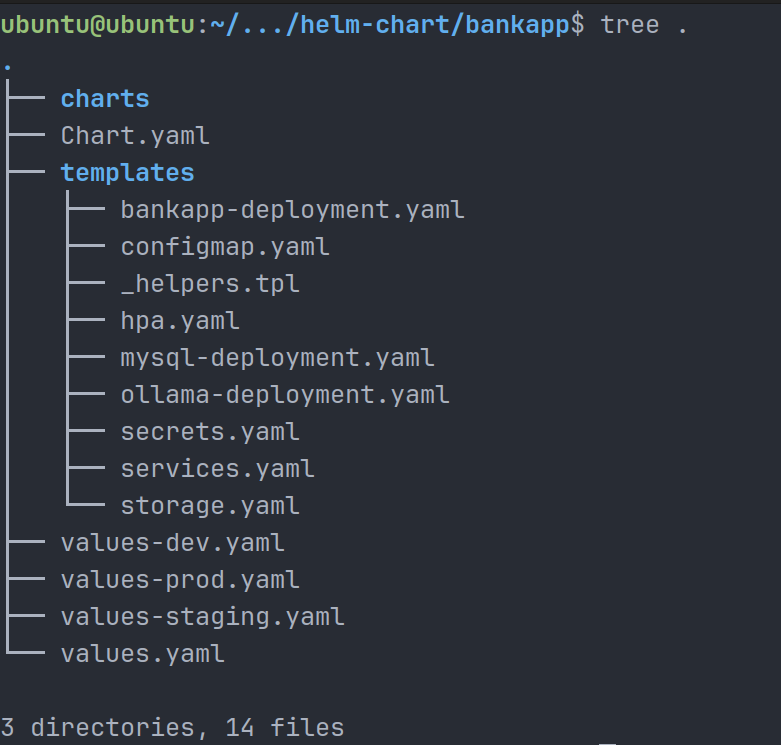

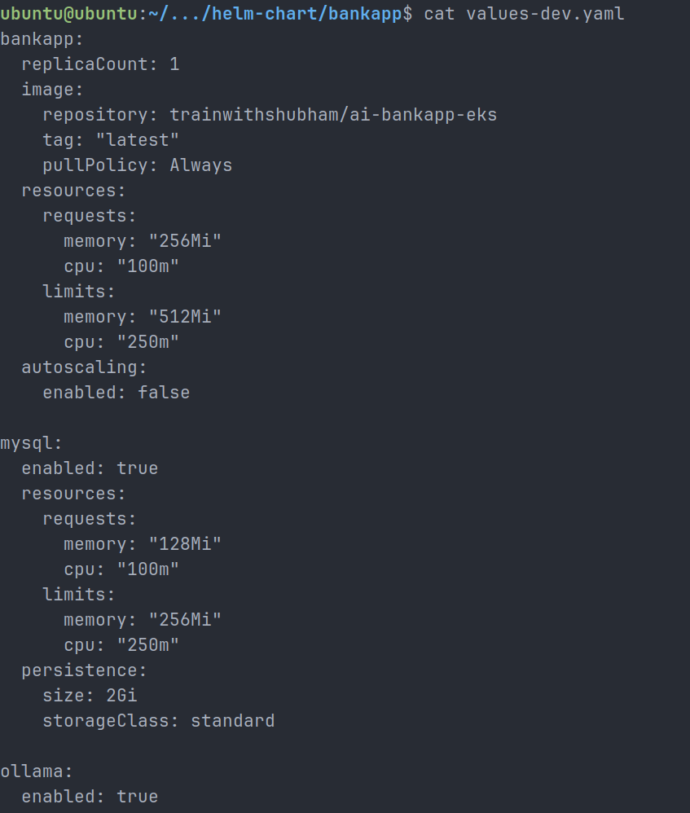

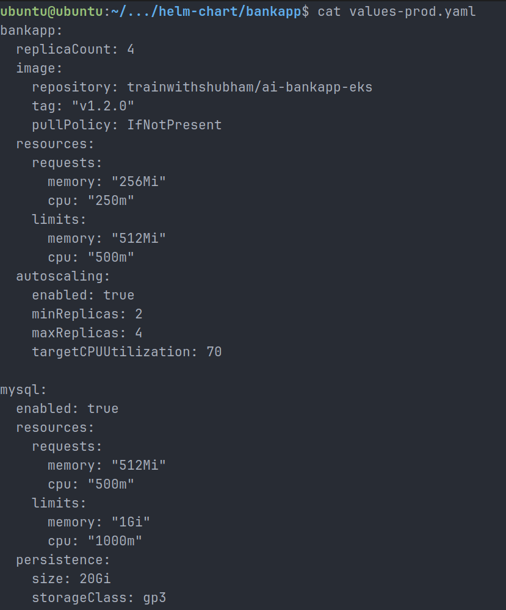

---

## 2. Helm Hooks (Database Readiness)

### Pre-install Hook

A Kubernetes Job was added using Helm hooks to ensure MySQL is ready before deploying the application.

### Hook Configuration

- `pre-install, pre-upgrade` → Runs before deployment
- `hook-delete-policy` → Cleans previous jobs

### Outcome

- Prevents race conditions
- Ensures reliable deployments

#### Screenshots

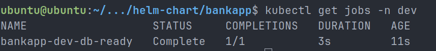

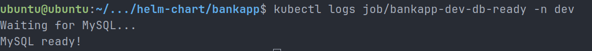

---

## 3. Helm Test

A Helm test was added to verify application health:

- Hits `/actuator/health`
- Validates application availability post-deployment

---

## 4. Packaging & Versioning

### Commands Used

```bash
helm lint .
helm package .
```

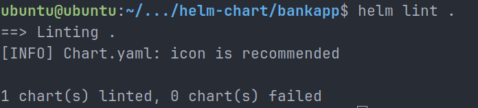

### Output

- bankapp-0.1.0.tgz
- bankapp-0.2.0.tgz

#### Screenshots

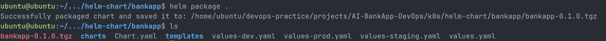

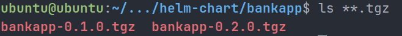

### Versioning Strategy

- `version` → Helm chart changes
- `appVersion` → Application version

---

## 5. CI/CD + GitOps Integration

### Simulated CI Step

```bash
TAG=dev-001
yq -y -i '.bankapp.image.tag = "'$TAG'"' values-dev.yaml
```

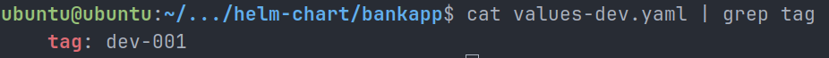

### Git Commit

```bash
git commit -m "ci: update bankapp image tag"
```

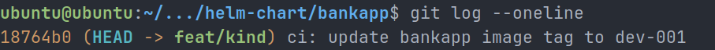

### Deployment

```bash
helm upgrade bankapp-dev . -f values-dev.yaml -n dev
```

#### Screenshots

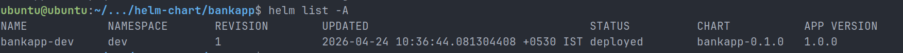

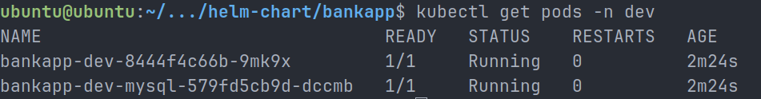

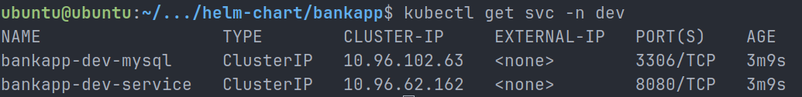

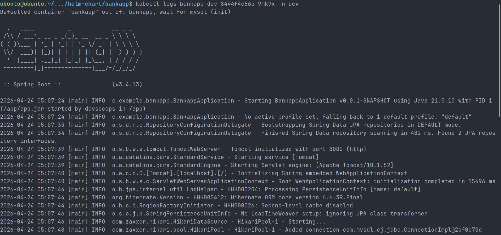

### Flow

```text
Code → CI builds image → update values.yaml → push → Helm deploy
```

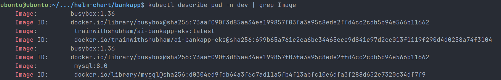

---

## 6. Helm vs Raw Manifests vs Kustomize

| Approach  | Use Case                | Notes                                |
| --------- | ----------------------- | ------------------------------------ |
| Raw YAML  | Simple apps             | Hard to manage multiple environments |
| Helm      | Complex, multi-env apps | Best for reusable deployments        |
| Kustomize | Overlay configs         | No templating, simpler than Helm     |

---

## 7. Production Best Practices

- Use `helm upgrade --install`
- Enable `--atomic` for rollback safety
- Avoid storing secrets in values.yaml
- Use tools like External Secrets / Vault
- Use `helm diff` before upgrades

---

## 8. Key Learnings

- Debugged real-world issues (OOM, ImagePullBackOff, DB access)
- Implemented Helm hooks for dependency management
- Understood GitOps workflow using Helm
- Built reusable, environment-aware deployments

---

## Conclusion

This project demonstrates a production-ready Helm setup with CI/CD integration, environment management, and robust deployment practices. It reflects real DevOps workflows used in modern cloud-native applications.

---

#90DaysOfDevOps #Helm #Kubernetes #DevOps #GitOps
