# Day 81 – AWS EKS Setup with Terraform (AI BankApp Deployment)

## Overview

On Day 81, I successfully provisioned a **production-grade Kubernetes cluster on AWS (EKS)** using Terraform and deployed a real-world microservices application (AI BankApp).

This project demonstrates:

- Infrastructure as Code (Terraform)
- Managed Kubernetes (EKS)
- Stateful workloads (MySQL + AI service)
- Persistent storage (EBS)
- Autoscaling (HPA)
- GitOps readiness (ArgoCD installed)

---

## Architecture

```
AWS VPC (Multi-AZ)
├── Public Subnets → Load Balancer
├── Private Subnets → Worker Nodes
├── NAT Gateway → Internet Access

EKS Cluster
├── Control Plane (Managed by AWS)
└── Node Group (EC2 Instances)

Kubernetes Layer
├── BankApp (Frontend + Backend)
├── MySQL (Database)
├── Ollama (AI Service)
└── EBS Volumes (Persistent Storage)
```

---

## Tools & Technologies

- AWS EKS
- Terraform
- Kubernetes
- Docker
- Helm (ArgoCD)
- AWS EBS CSI Driver

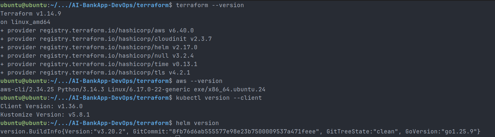

---

## Terraform Breakdown

### VPC Module

- 3 Availability Zones
- Public, Private, Intra subnets
- NAT Gateway enabled

### EKS Module

- Cluster version: 1.35
- Managed node group
- IAM roles (IRSA)
- Add-ons installed

### ArgoCD Module

- Installed via Helm
- Ready for GitOps

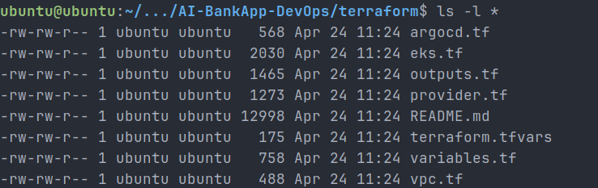

### AWS Authentication

```bash
aws configure
aws sts get-caller-identity
```

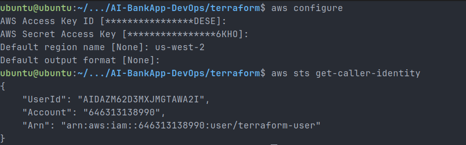

### Terraform Plan

```bash
terraform plan
```

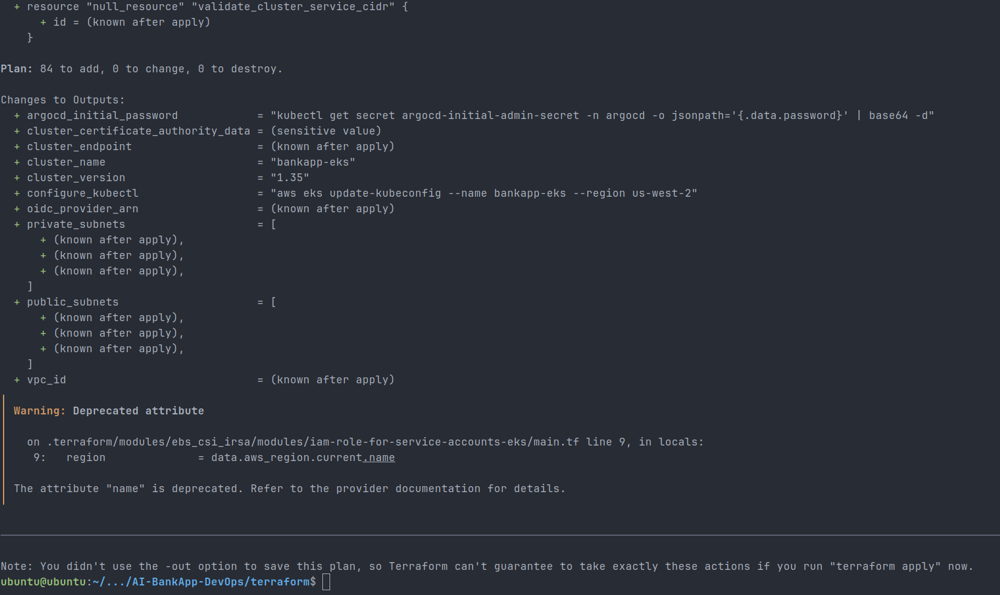

---

## Cluster Verification

### Nodes

```bash
kubectl get nodes -o wide
```

Result:

- 3 nodes in `Ready` state

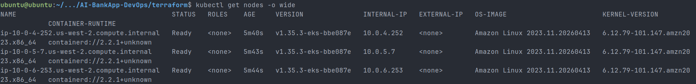

---

### System Pods

```bash
kubectl get pods -n kube-system
```

- CoreDNS, kube-proxy, aws-node, metrics-server running

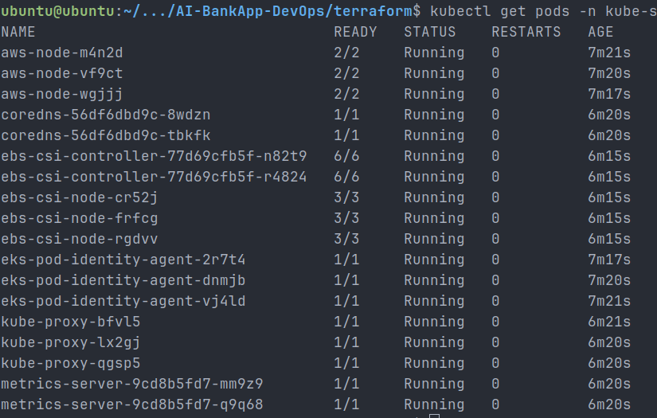

---

### ArgoCD

```bash
kubectl get pods -n argocd
kubectl get svc -n argocd
```

- ArgoCD UI accessible after installation

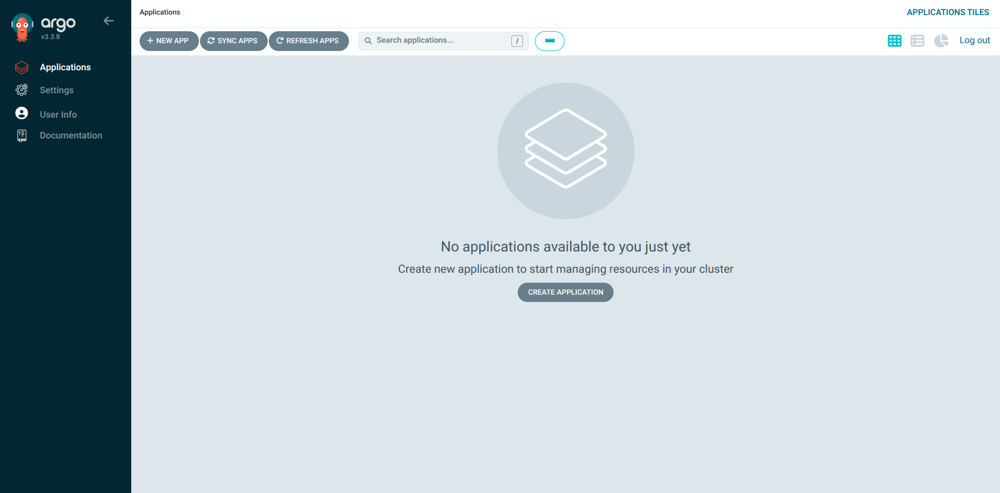

---

## Application Deployment

### Apply manifests

```bash
kubectl apply -f k8s/
```

---

### Pods Status

```bash
kubectl get pods -n bankapp
```

- BankApp → 2 replicas (Running)
- MySQL → Running
- Ollama → Running

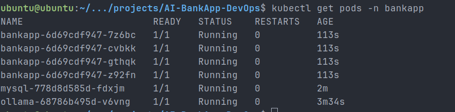

---

## Persistent Storage

```bash
kubectl get pvc -n bankapp
```

- PVC → `Bound`
- StorageClass → `gp3`
- Backed by AWS EBS

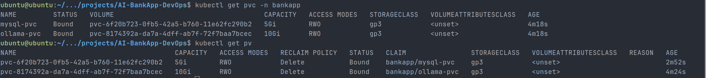

---

## Autoscaling (HPA)

```bash
kubectl get hpa -n bankapp
```

- CPU target: 70%
- Min replicas: 2
- Max replicas: 4

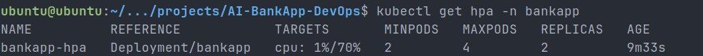

---

## Application Access

```bash
kubectl port-forward svc/bankapp-service -n bankapp 8080:8080
```

Access URL:

```
http://localhost:8080
```

Application UI successfully loaded.

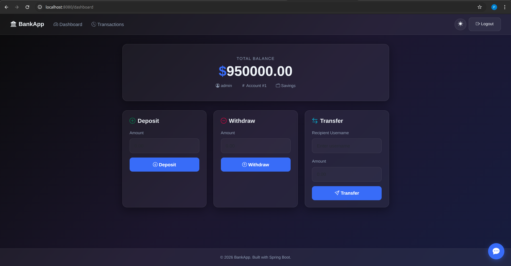

---

## Challenges & Fixes

### 1. Node Group Creation Failed

- Issue: Instance type not allowed
- Fix: Changed to `m7i-flex.large`

### 2. IAM Role Conflicts

- Issue: Role already existed
- Fix: Cleaned IAM dependencies

### 3. Nodes Not Joining

- Issue: No EC2 instances launched
- Fix: Correct instance type

### 4. Namespace Errors

- Issue: Applied all manifests together
- Fix: Applied resources in order

---

## Key Learnings

- EKS separates control plane and worker nodes
- Terraform simplifies infrastructure provisioning
- IRSA is critical for secure AWS integration
- Persistent storage is required for stateful apps
- Resource ordering matters in Kubernetes

---

## Production Note

Port-forward is used only for testing.

In production, we use:

- LoadBalancer Service
- Ingress Controller
- API Gateway

---

## Outcome

Successfully deployed a **scalable, production-ready Kubernetes application on AWS EKS** with:

- Multi-node cluster
- Persistent storage
- Autoscaling
- AI-powered backend

---

## Next Steps

- Expose app via LoadBalancer
- Implement GitOps using ArgoCD
- Add CI/CD pipeline

---

## Tags

#90DaysOfDevOps #AWS #EKS #Terraform #Kubernetes #DevOps #Cloud #GitOps
