# Day 82 – EKS Networking with Gateway API & Persistent Storage

## Task Objective

Implement production-grade Kubernetes networking and persistent storage patterns on Amazon EKS using AI-BankApp.

Goals:

- Install Envoy Gateway
- Configure Kubernetes Gateway API
- Provision AWS Network Load Balancer
- Configure HTTPRoute routing
- Implement session persistence
- Install cert-manager
- Configure Let's Encrypt ClusterIssuer
- Validate Gateway API ACME challenge flow
- Verify AWS EBS persistent storage
- Test pod data persistence
- Analyze HPA and cluster capacity

Environment validation:

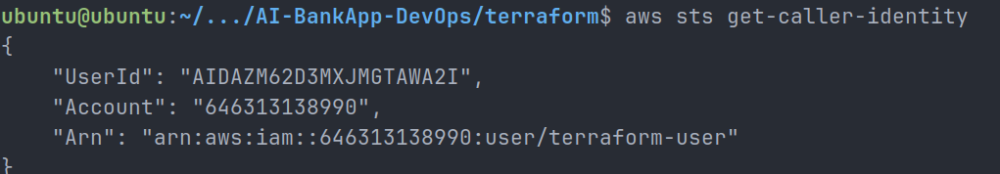

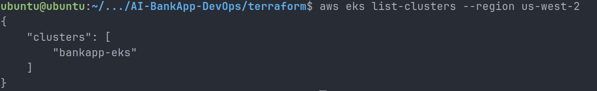

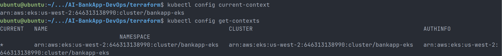

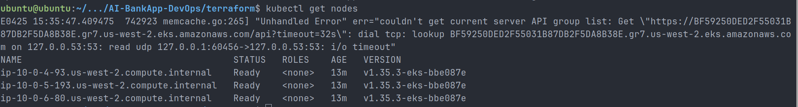

---

## Task 1 – Install Envoy Gateway

Installed Envoy Gateway:

```bash
helm install envoy-gateway oci://docker.io/envoyproxy/gateway-helm \
  --version v1.4.0 \
  -n envoy-gateway-system \
  --create-namespace \
  --wait
```

Verified:

```bash
kubectl get pods -n envoy-gateway-system
```

Result:

- Envoy Gateway controller running successfully.

Screenshots:

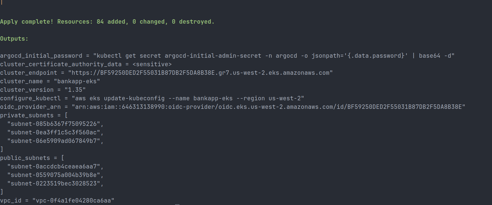

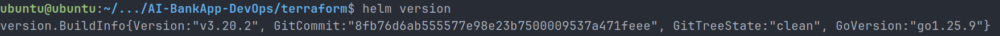

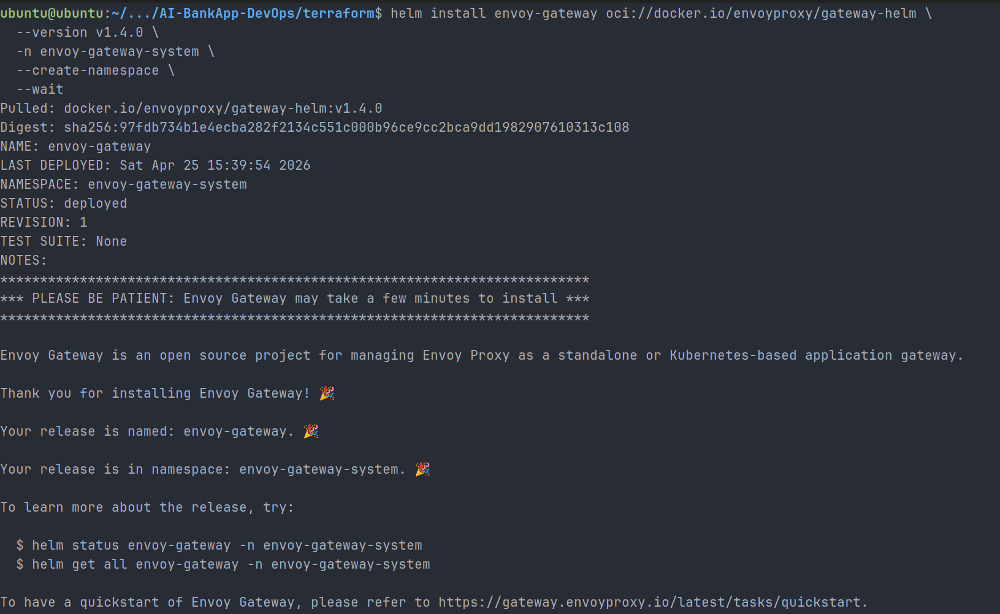

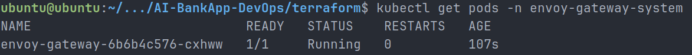

---

## Task 2 – Configure Gateway API

Installed Gateway API CRDs and created GatewayClass:

```yaml
apiVersion: gateway.networking.k8s.io/v1
kind: GatewayClass
metadata:
  name: envoy-gateway
spec:
  controllerName: gateway.envoyproxy.io/gatewayclass-controller
```

Verified:

```bash
kubectl get gatewayclass
```

Status:

```text
ACCEPTED=True
```

Screenshots:

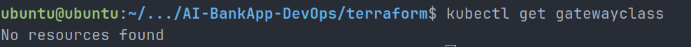

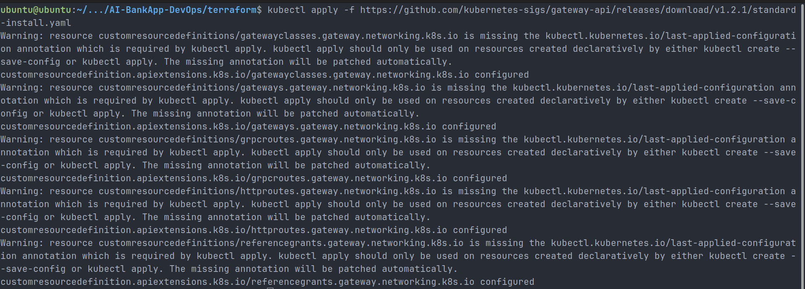

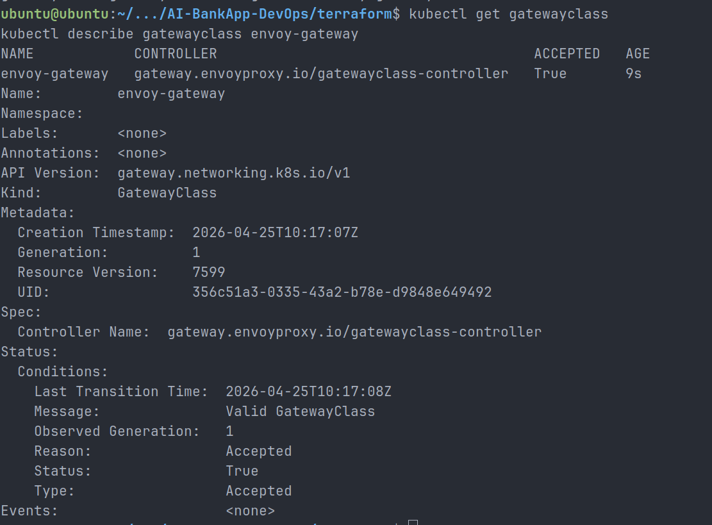

---

## Task 3 – Deploy AI-BankApp

Verified workloads:

```bash
kubectl get pods -n bankapp
kubectl get svc -n bankapp
kubectl get pvc -n bankapp
kubectl get hpa -n bankapp
```

Components running:

- BankApp
- MySQL
- Ollama

Screenshots:

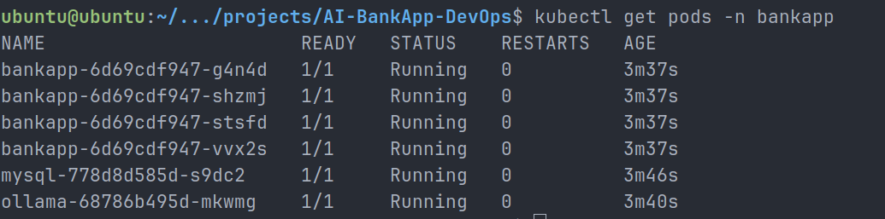

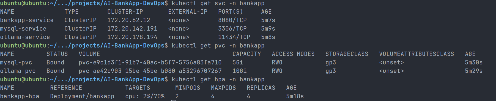

---

## Task 4 – Apply Gateway Configuration

Applied:

```bash
kubectl apply -f k8s/gateway.yml
```

Created:

- Gateway
- HTTPRoute
- BackendTrafficPolicy

Automatically provisioned:

- AWS Network Load Balancer

Verified:

```bash
kubectl get gateway -n bankapp
kubectl get httproute -n bankapp
kubectl get backendtrafficpolicy -n bankapp
```

Screenshots:

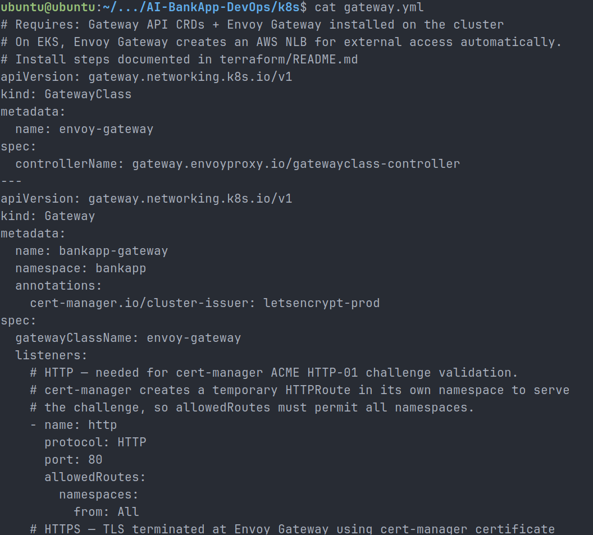

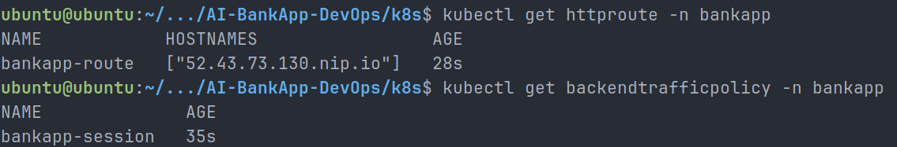

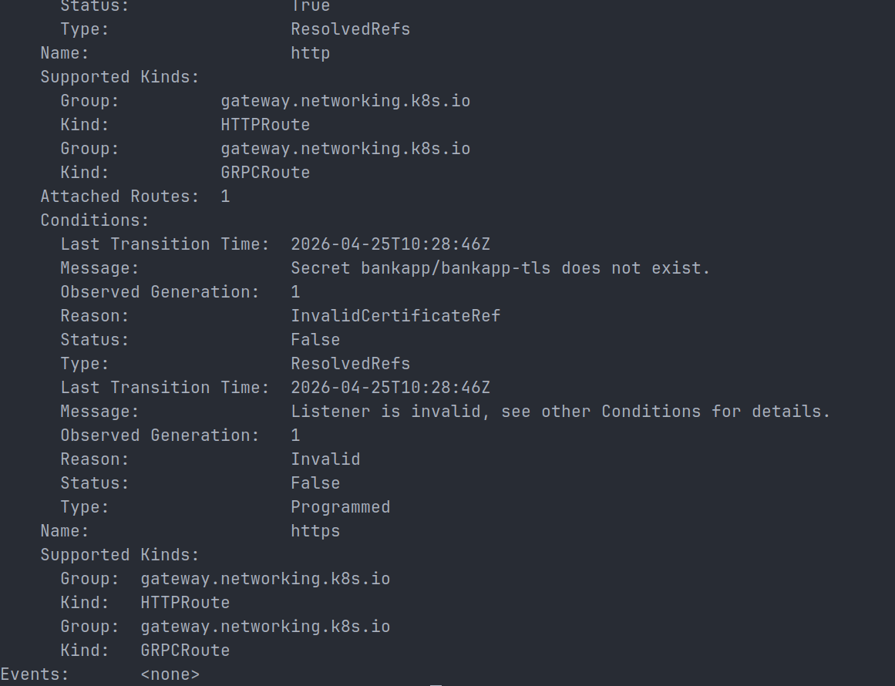

---

## Task 5 – Validate Sticky Sessions

Tested routing:

```bash
curl -I \
-H "Host: 52.43.73.130.nip.io" \
http://<elb-dns>
```

Response:

```text
HTTP/1.1 302 Found
Set-Cookie: BANKAPP_AFFINITY=...
Location: /login
```

Verified:

- Host routing works
- Session persistence works
- Application responds correctly

Screenshot:

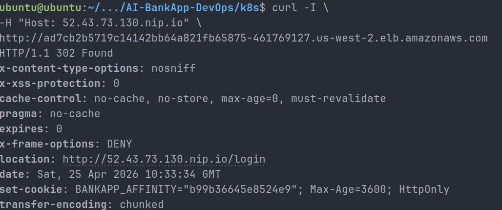

---

## Task 6 – Install cert-manager

Installed:

```bash
helm install cert-manager jetstack/cert-manager \
  -n cert-manager \
  --create-namespace \
  --set crds.enabled=true \
  --wait
```

Enabled Gateway API:

```bash
helm upgrade cert-manager jetstack/cert-manager \
  -n cert-manager \
  --set crds.enabled=true \
  --set config.enableGatewayAPI=true \
  --wait
```

Applied ClusterIssuer:

```bash
kubectl apply -f cert-manager.yml
```

Verified:

```bash
kubectl get clusterissuer
```

Status:

```text
READY=True
```

Screenshots:

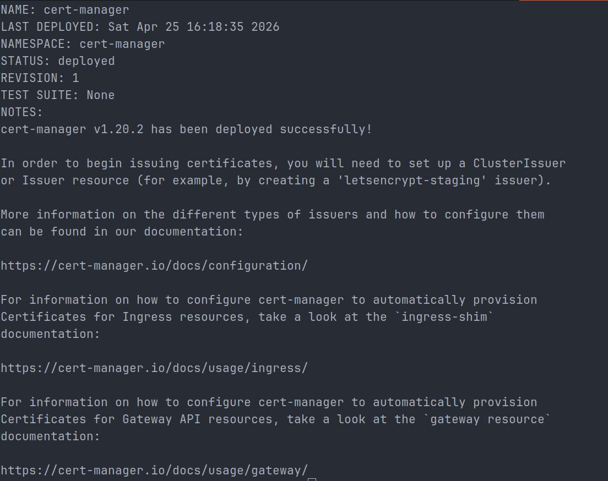

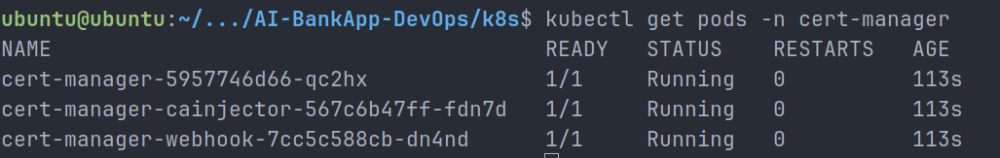

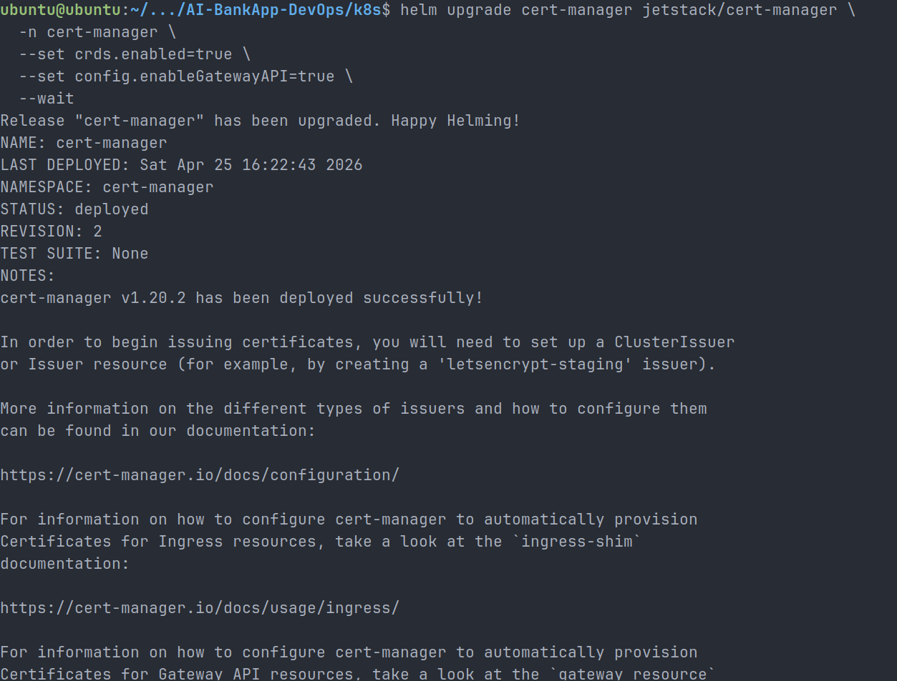

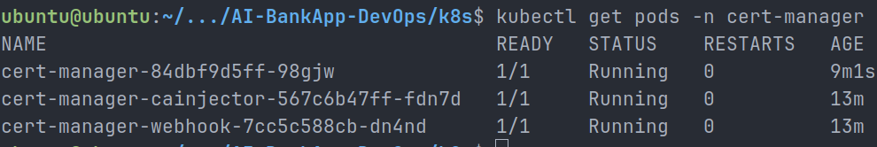

---

## Task 7 – Validate ACME Challenge Flow

Verified temporary challenge route:

```bash
kubectl get httproute -A
```

Observed:

```text
cm-acme-http-solver-xxxxx
```

Meaning:

- cert-manager created temporary HTTPRoute
- Gateway handled ACME challenge routing

Screenshot:

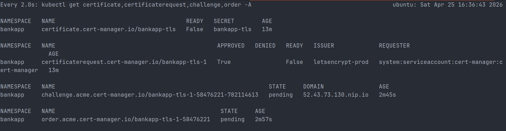

---

## Task 8 – Verify Persistent Storage

Checked storage:

```bash
kubectl get storageclass
kubectl get pvc -n bankapp
kubectl get pv
```

Using:

- gp3 StorageClass
- AWS EBS CSI Driver

Volumes:

- mysql-pvc → 5Gi
- ollama-pvc → 10Gi

Screenshot:

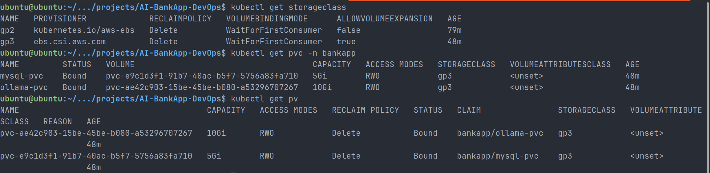

---

## Task 9 – Validate Data Persistence

Deleted MySQL pod:

```bash
kubectl delete pod -n bankapp -l app=mysql
```

New pod recreated successfully.

Database persisted.

Verified:

- Pod lifecycle independent from storage lifecycle.

Screenshots:

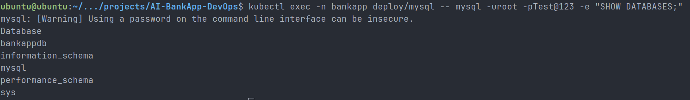

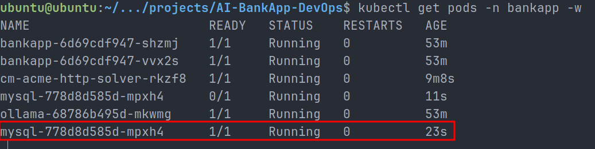

---

## Task 10 – Analyze HPA & Cluster Capacity

Checked:

```bash
kubectl get hpa -n bankapp
kubectl top nodes
kubectl top pods -n bankapp
```

Observations:

- HPA healthy
- Cluster CPU low
- Memory usage healthy
- Scaling headroom available

Screenshot:

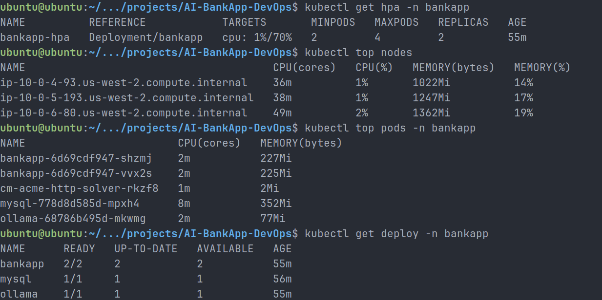

---

## Final Outcome

Successfully implemented:

- Gateway API
- Envoy Gateway
- AWS NLB
- HTTPRoute routing
- Sticky sessions
- cert-manager
- Let's Encrypt integration
- EBS persistence
- HPA capacity analysis
