# Day 83 – EKS Project: Production Deployment of AI-BankApp

## Overview

On Day 83, I deployed a complete production-grade AI-powered banking application on Amazon EKS. This project combined infrastructure provisioning, Kubernetes networking, persistent storage, autoscaling, observability, AI integration, security validation, and full resource teardown.

The deployment included:

- Spring Boot AI-BankApp
- MySQL Stateful Backend
- Ollama AI Service (TinyLlama)
- Gateway API + Envoy Proxy
- Persistent EBS Volumes
- Horizontal Pod Autoscaler
- Prometheus Monitoring
- Grafana Dashboards
- Secure non-root container runtime

---

## Architecture

Internet
→ AWS Network Load Balancer
→ Envoy Gateway
→ HTTPRoute
→ BankApp Service
→ BankApp Pods
→ MySQL + Ollama
→ Prometheus + Grafana Monitoring

---

## Infrastructure Validation

Verified EKS cluster connectivity:

```bash
kubectl get nodes
```

Result:

- 3 worker nodes Ready
- Kubernetes API healthy
- Cluster networking functional

Screenshot:

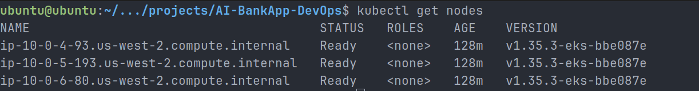

---

## Persistent Storage

Provisioned persistent storage:

| Component | Storage | Type    |
| --------- | ------- | ------- |
| MySQL     | 5Gi     | gp3 EBS |
| Ollama    | 10Gi    | gp3 EBS |

Validation:

```bash
kubectl get pvc -n bankapp
```

Result:

- PVC Bound successfully
- Persistent storage attached

Screenshot:

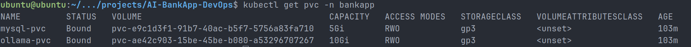

---

## Application Deployment

Deployed:

- MySQL Deployment
- Ollama Deployment
- BankApp Deployment
- ClusterIP Services
- Horizontal Pod Autoscaler

Validation:

```bash
kubectl get all -n bankapp
kubectl get hpa -n bankapp
```

Result:

- BankApp → 2 Pods Running
- MySQL → Running
- Ollama → Running
- HPA active (2–4 replicas)

Screenshots:

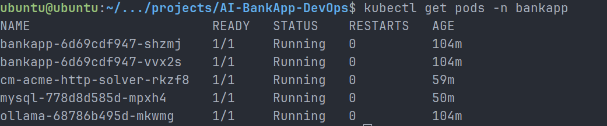

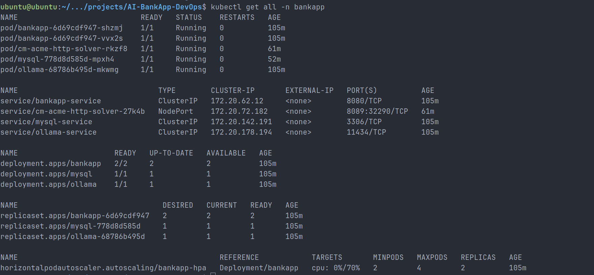

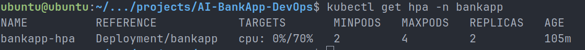

---

## Gateway API Networking

Configured:

- Envoy Gateway
- HTTPRoute
- AWS Network Load Balancer
- Session affinity cookie routing

Validated:

```bash
curl -H "Host: <host>" http://<elb-url>/actuator/health
```

Result:

```json
{ "status": "UP" }
```

Application successfully accessible externally.

Screenshots:

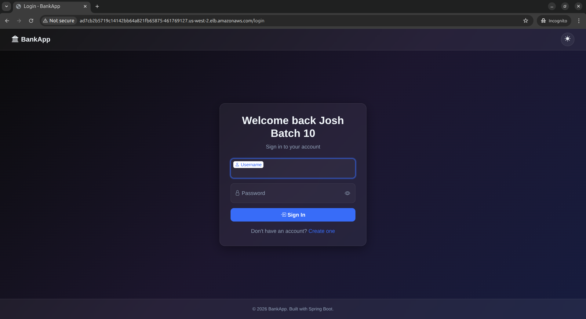

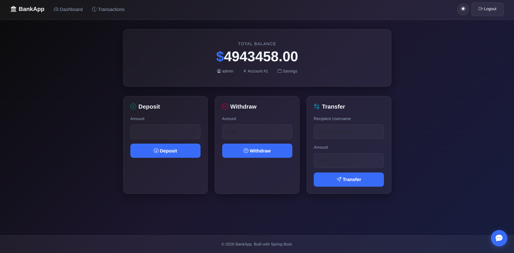

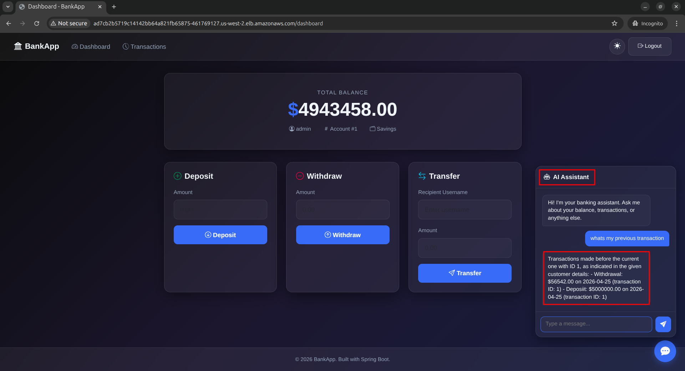

---

## Monitoring Stack

Installed:

- Prometheus
- Grafana
- Alertmanager
- kube-state-metrics
- node-exporter

Created custom ServiceMonitor for BankApp metrics scraping.

Metrics exposed:

- JVM memory
- Application startup time
- Disk usage
- HikariCP connection pool metrics
- HTTP request metrics

Screenshots:

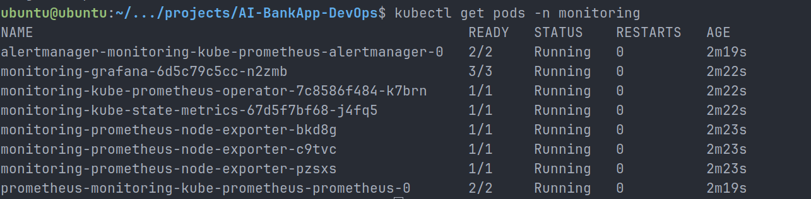

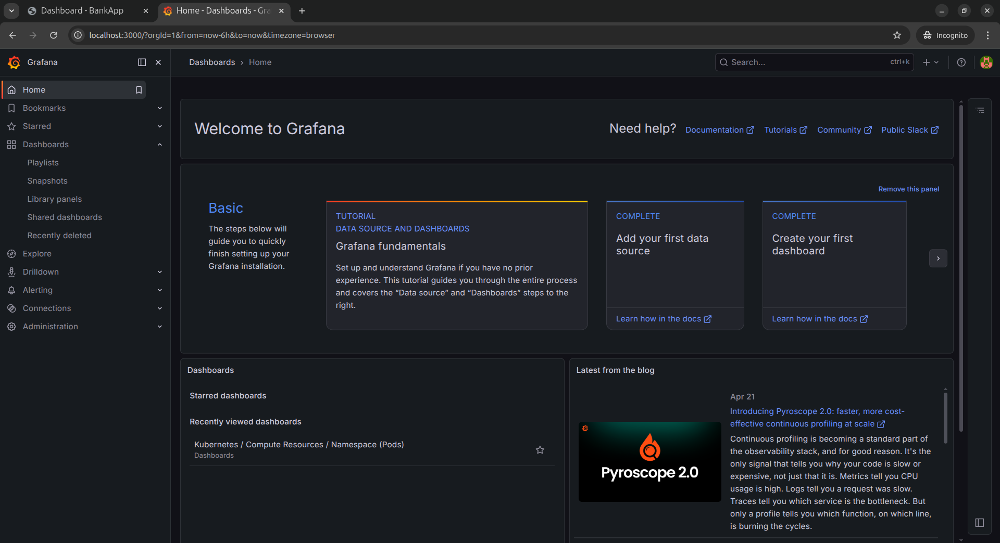

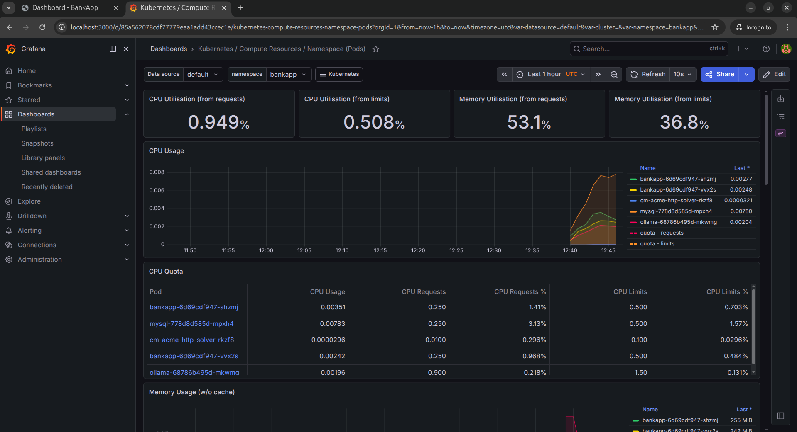

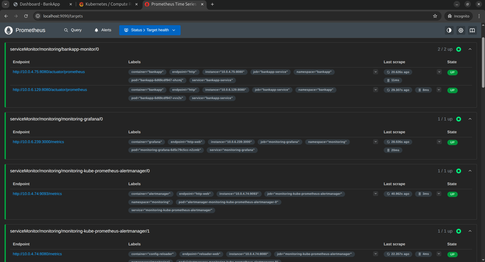

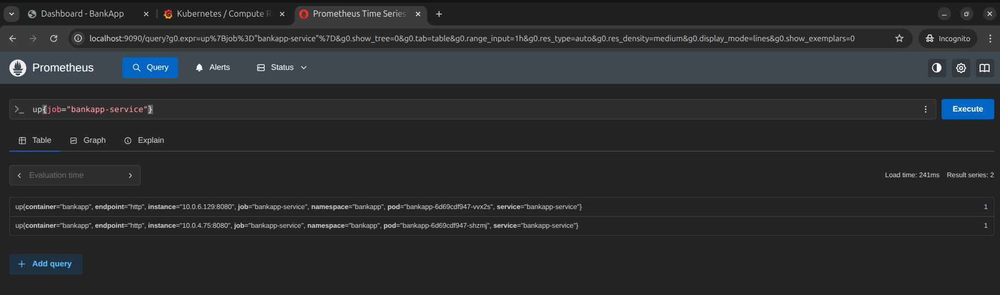

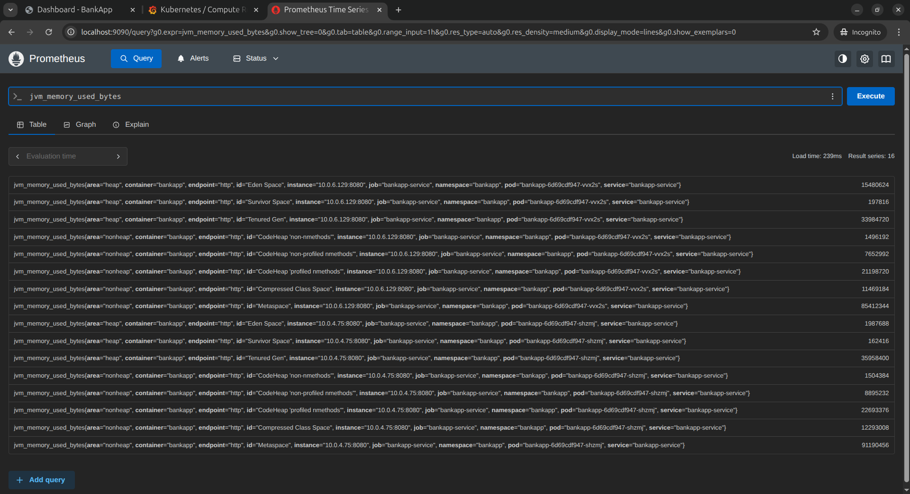

---

## Troubleshooting – Prometheus Scrape Fix

Issue:

Prometheus could not discover BankApp metrics.

Root cause:

- Service missing labels
- Service port unnamed
- ServiceMonitor used numeric port instead of named port

Fix:

Added label:

```yaml
app: bankapp
```

Named service port:

```yaml
name: http
```

Updated ServiceMonitor:

```yaml
port: http
```

Restarted Prometheus.

Result:

- 2/2 BankApp targets UP
- Metrics successfully scraped

Real-world debugging experience gained.

---

## Security Validation

Validated runtime user:

```bash
kubectl exec -n bankapp deploy/bankapp -- whoami
```

Output:

```text
devsecops
```

Application runs as non-root user.

Security best practice validated.

---

## Validation Checklist

Completed:

- Pods healthy
- HPA active
- PVC Bound
- MySQL alive
- Ollama model loaded
- Nodes healthy
- Metrics scraped
- Dashboards operational
- Secure runtime validated

Status:

PASS

---

## Cost Report

Approximate lab cost:

$15–25

Resources consumed:

- EKS control plane
- 3 worker nodes
- NAT Gateway
- Network Load Balancer
- EBS Volumes

---

## Cleanup

Deleted:

- Monitoring stack
- Gateway resources
- BankApp namespace
- Envoy Gateway
- cert-manager
- ArgoCD

Terraform destroy result:

```text
Destroy complete! Resources: 83 destroyed.
```

Final verification:

```json
{
  "clusters": []
}
```

No AWS resources left running.

---

## Key Learnings

- Production EKS deployment workflow
- Kubernetes networking via Gateway API
- Persistent stateful workloads
- Horizontal Pod Autoscaling
- Spring Boot metrics exposure
- Prometheus Operator ServiceMonitor model
- Grafana observability
- Runtime security validation
- Real-world troubleshooting
- Cost-aware teardown

---

## Outcome

Provision → Deploy → Observe → Debug → Secure → Destroy

Complete DevOps lifecycle executed successfully on Amazon EKS.
