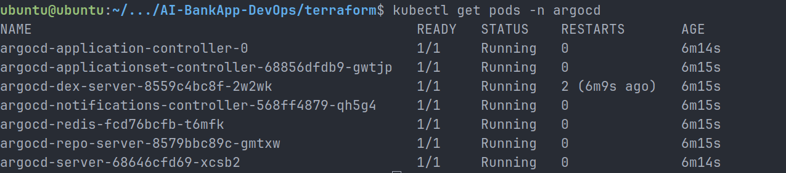
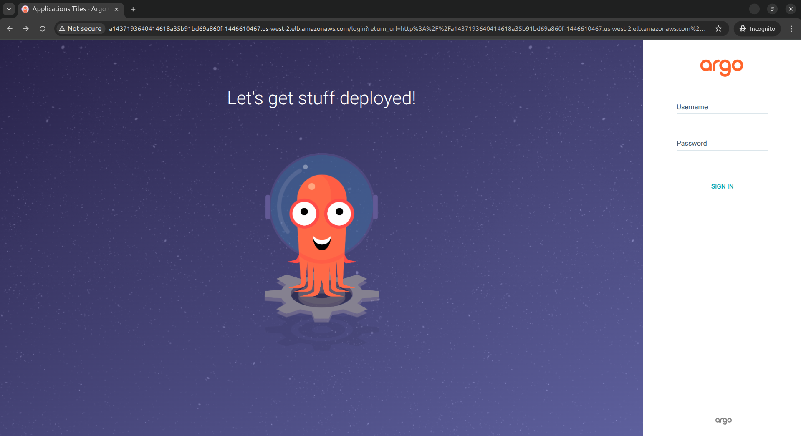
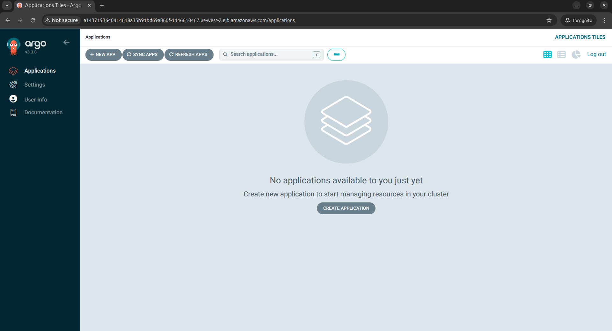
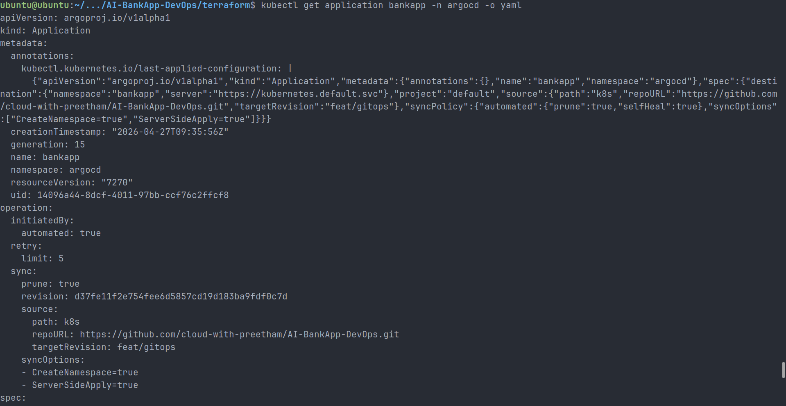
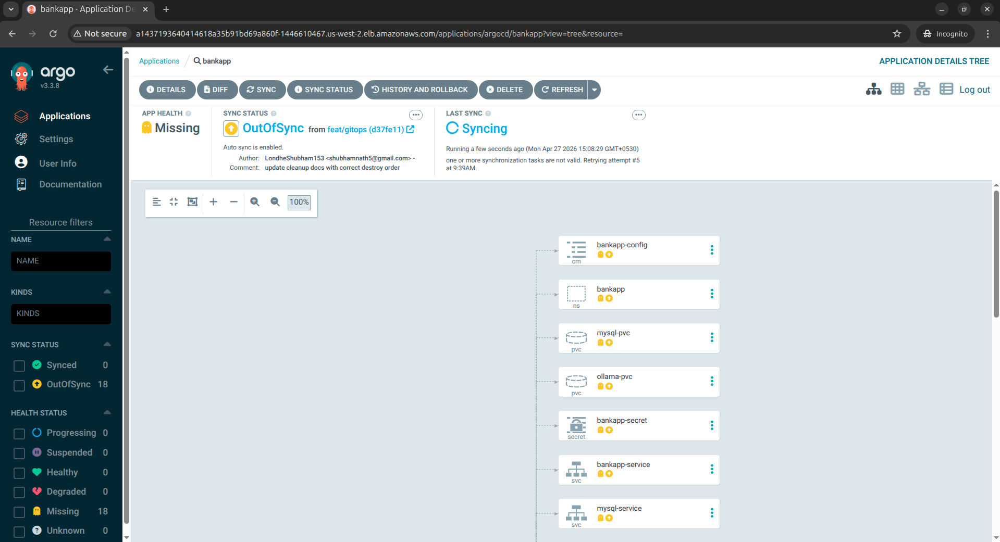
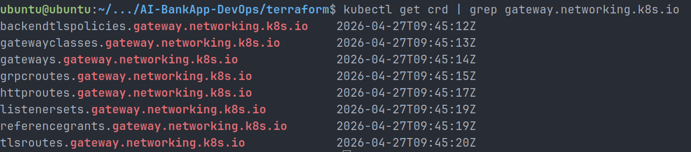
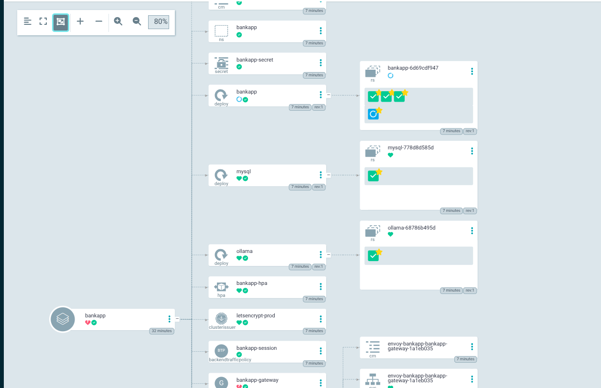
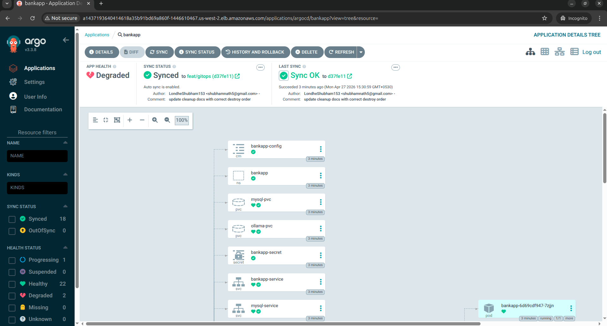
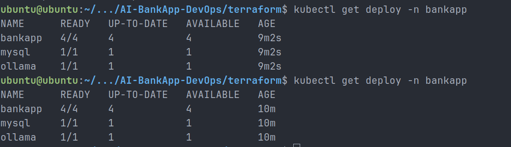

# Day 84 – GitOps with ArgoCD on Amazon EKS

## Overview

On Day 84, I shifted from traditional Kubernetes deployments (`kubectl apply`) to a **GitOps-based deployment model** using :contentReference[oaicite:0]{index=0} on :contentReference[oaicite:1]{index=1}.

The goal was to make **Git the single source of truth** for Kubernetes manifests and allow ArgoCD to continuously reconcile the cluster state with the desired state stored in Git.

This deployment exercise went beyond simply creating an ArgoCD Application. During implementation, I encountered missing Kubernetes platform dependencies (CRDs/controllers), diagnosed synchronization failures, installed required controllers, and successfully completed a GitOps-driven deployment of AI-BankApp.

This was one of the most practical production-style troubleshooting experiences in the 90 Days of DevOps journey.

---

## Objectives

- Understand GitOps principles
- Learn how ArgoCD works
- Deploy AI-BankApp declaratively using GitOps
- Debug ArgoCD sync failures
- Install missing Kubernetes CRDs/controllers
- Validate automated reconciliation
- Test self-healing capabilities

---

## What is GitOps?

GitOps is a deployment methodology where:

- Git becomes the **single source of truth**
- Infrastructure and application state are stored declaratively in Git
- A controller continuously watches Git
- Any difference between Git and cluster state is automatically corrected

With GitOps:

```text
Git Commit → ArgoCD detects change → Sync → Cluster updated
```

No manual:

```bash
kubectl apply -f deployment.yaml
```

No configuration drift.

No uncertainty about who changed what.

Everything becomes version-controlled, auditable, and reproducible.

---

## GitOps Principles

### 1) Declarative

Desired state is written declaratively:

```yaml
kind: Deployment
spec:
  replicas: 4
```

---

### 2) Versioned and Immutable

All changes happen through Git commits:

```bash
git commit -m "Update image tag"
git push
```

---

### 3) Pulled Automatically

ArgoCD continuously watches Git and pulls updates.

CI does **not** directly push into Kubernetes.

---

### 4) Continuously Reconciled

If drift happens:

```bash
kubectl scale deployment bankapp --replicas=1
```

ArgoCD restores desired state automatically.

---

## Traditional CI/CD vs GitOps

| Aspect          | Traditional CI/CD       | GitOps                   |
| --------------- | ----------------------- | ------------------------ |
| Deployment      | Pipeline pushes changes | Controller pulls changes |
| Source of truth | Pipeline scripts        | Git                      |
| Rollback        | Manual                  | Git revert               |
| Drift detection | None                    | Automatic                |
| Audit trail     | Pipeline logs           | Git history              |
| Cluster access  | CI server               | ArgoCD                   |
| Security        | Broad credentials       | Controlled access        |

---

## Environment

- Cloud: AWS
- Kubernetes: :contentReference[oaicite:2]{index=2}
- GitOps Controller: :contentReference[oaicite:3]{index=3}
- Certificate Controller: :contentReference[oaicite:4]{index=4}
- Networking: :contentReference[oaicite:5]{index=5}
- Gateway Controller: :contentReference[oaicite:6]{index=6}
- StorageClass: gp3
- Application: AI-BankApp

---

## Accessing ArgoCD

Verified ArgoCD components:

```bash
kubectl get pods -n argocd
```

Verified:

- argocd-server
- argocd-repo-server
- argocd-application-controller
- argocd-applicationset-controller
- argocd-redis
- argocd-dex-server



Fetched admin password:

```bash
kubectl -n argocd get secret argocd-initial-admin-secret \
-o jsonpath="{.data.password}" | base64 -d && echo
```

Accessed UI using AWS LoadBalancer endpoint.

Successfully logged into ArgoCD dashboard.



The dashboard was initially empty before creating the BankApp Application.



---

## Creating the GitOps Application

Created ArgoCD Application:

```yaml
apiVersion: argoproj.io/v1alpha1
kind: Application
metadata:
  name: bankapp
  namespace: argocd
spec:
  project: default
  source:
    repoURL: https://github.com/cloud-with-preetham/AI-BankApp-DevOps.git
    targetRevision: feat/gitops
    path: k8s
  destination:
    server: https://kubernetes.default.svc
    namespace: bankapp
  syncPolicy:
    automated:
      prune: true
      selfHeal: true
    syncOptions:
      - CreateNamespace=true
      - ServerSideApply=true
```



Features enabled:

- Automated Sync
- Self Healing
- Pruning
- Namespace Creation
- Server Side Apply

---

## Initial Failure – Sync Error

Initial deployment failed.

ArgoCD reported:

```text
one or more synchronization tasks are not valid
```

Root cause:

Missing CRDs:

- ClusterIssuer
- Gateway
- GatewayClass
- HTTPRoute
- BackendTrafficPolicy

This prevented resource reconciliation.



---

## Troubleshooting and Fixes

### Installed cert-manager

```bash
kubectl apply -f https://github.com/cert-manager/cert-manager/releases/latest/download/cert-manager.yaml
```

Result:

- cert-manager Running
- ClusterIssuer CRD available

---

### Installed Gateway API

```bash
kubectl apply -f https://github.com/kubernetes-sigs/gateway-api/releases/latest/download/standard-install.yaml
```

Result:

Installed:

- GatewayClass
- Gateway
- HTTPRoute



---

### Installed Envoy Gateway

Initial Helm install failed due to CRD version conflicts.

Resolved by:

```bash
helm install eg oci://docker.io/envoyproxy/gateway-helm \
  --version v1.5.4 \
  -n envoy-gateway-system \
  --create-namespace \
  --skip-crds
```

Then installed Envoy Gateway CRDs.

Result:

- BackendTrafficPolicy available
- Envoy controller Running

---

## Successful GitOps Deployment

After fixing dependencies:

```bash
kubectl patch application bankapp -n argocd \
--type merge \
-p '{"operation":{"sync":{"prune":true}}}'
```

Deployment created:

- bankapp deployment
- mysql deployment
- ollama deployment
- ConfigMap
- Secret
- PVCs
- Services
- HPA
- Gateway resources



---

## Validation

Verified:

```bash
kubectl get pods -n bankapp
```

Healthy components:

- bankapp replicas Running
- mysql Running
- ollama Running

Verified storage:

```bash
kubectl get pvc -n bankapp
```

PVCs:

- mysql-pvc → Bound
- ollama-pvc → Bound

Verified services:

- bankapp-service
- mysql-service
- ollama-service

ArgoCD showed the application as healthy and synced after the dependencies were installed.



---

## Self-Healing Test

Manually introduced drift:

```bash
kubectl scale deployment bankapp -n bankapp --replicas=1
```

Expected state in Git:

```yaml
replicas: 4
```

ArgoCD automatically reconciled cluster state.

Replicas returned to:

```text
4/4
```



This validated:

**GitOps self-healing works.**

---

## Key Learnings

- GitOps is declarative operations
- ArgoCD continuously reconciles drift
- Platform dependencies matter
- Missing CRDs immediately surface in GitOps workflows
- Controller compatibility/versioning matters
- Kubernetes troubleshooting is often dependency-driven
- Self-healing is powerful for production reliability

---

## Outcome

Successfully deployed AI-BankApp using GitOps.

Achieved:

- Declarative deployment
- Automated sync
- Drift detection
- Self-healing
- Platform dependency troubleshooting
- Production-grade Kubernetes debugging experience

## Conclusion

Day 84 was a major milestone in understanding modern DevOps delivery.

I moved from:

```text
kubectl apply
```

to:

```text
Git push → ArgoCD sync → Kubernetes reconciles automatically
```

This is how modern cloud-native delivery should operate.
