# Day 86 – End-to-End GitOps CI/CD on AWS EKS with ArgoCD

## Overview

On Day 86, I completed a full production-style GitOps deployment pipeline for the AI BankApp project using GitHub Actions, DockerHub, ArgoCD, Kubernetes, cert-manager, Envoy Gateway, and AWS EKS.

This was the most complete DevOps automation milestone in the project—covering CI, container registry, GitOps sync, Kubernetes rollout, TLS automation, and application health validation.

---

## Architecture Implemented

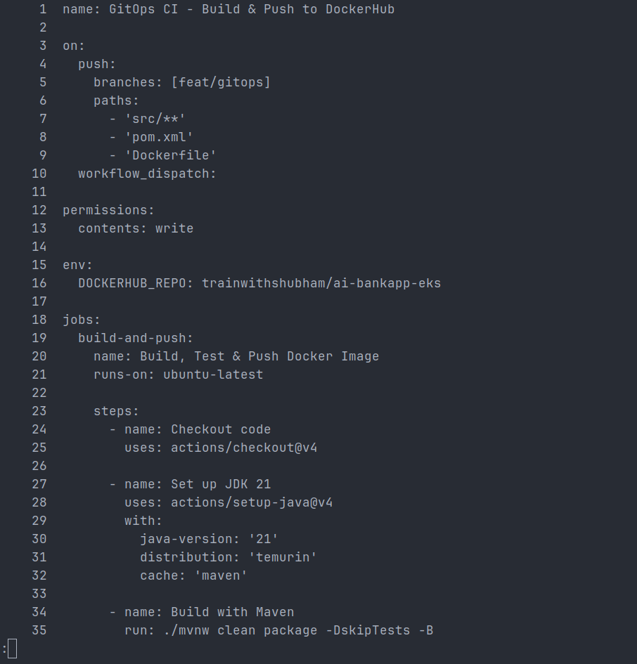

```text
Developer Push
    ↓
GitHub Actions CI Pipeline
(Build → Test → Docker Build → Push)
    ↓
DockerHub Image Registry
(h4kops/ai-bankapp-eks:<commit-sha>)
    ↓
Manifest Auto Update
(k8s/bankapp-deployment.yml)
    ↓
Git Commit by CI Bot
    ↓
ArgoCD Detects Git Change
    ↓
AWS EKS Sync + Rolling Deployment
    ↓
Healthy Kubernetes Application
```

---

## Work Completed

### 1) Fixed EKS Managed Node Group Provisioning

**Issue:**

- Terraform failed to create worker nodes
- Selected EC2 instance type was not eligible

**Root Cause:**

- Invalid Free Tier instance selection (`m7i-flex.large`)

**Fix:**

- Updated Terraform node instance type to supported worker node instance
- Reapplied infrastructure

**Result:**

- 3-node EKS cluster provisioned successfully

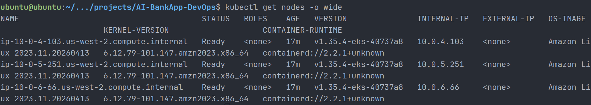

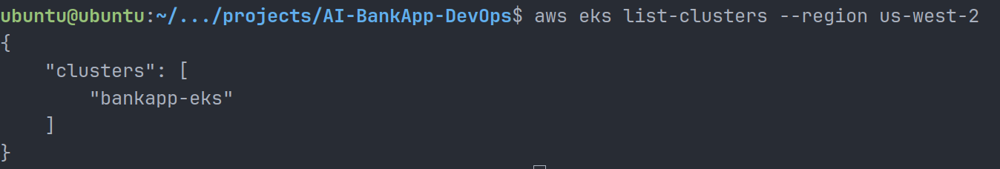

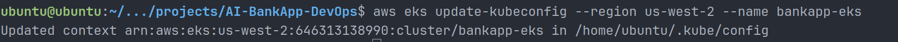

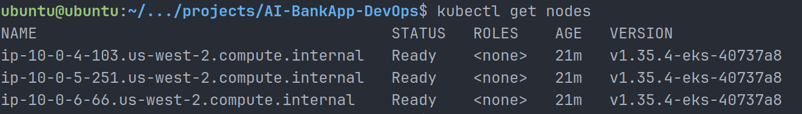

---

### 2) Installed ArgoCD on EKS

Configured ArgoCD inside cluster:

```bash
kubectl create namespace argocd
kubectl apply -n argocd -f install.yaml
```

Validated:

- argocd-server
- argocd-repo-server
- argocd-application-controller
- notifications-controller
- redis
- dex

All pods running healthy.

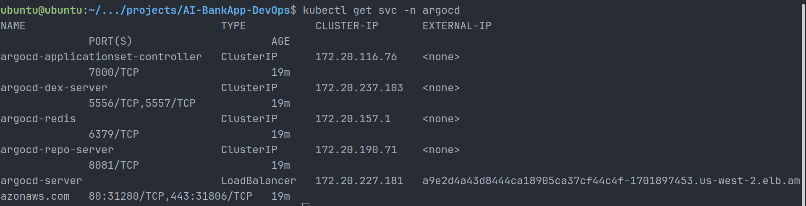

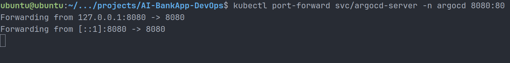

---

### 3) Created GitOps Application

Created ArgoCD Application manifest:

```yaml
source:
  repoURL: https://github.com/cloud-with-preetham/AI-BankApp-DevOps.git
  targetRevision: feat/gitops
  path: k8s
```

Enabled:

```yaml
automated:
  prune: true
  selfHeal: true
```

Result:

- Fully automated reconciliation enabled

---

### 4) Built GitHub Actions CI Pipeline

Created workflow:

`.github/workflows/gitops-ci.yml`

Pipeline stages:

- Checkout code
- Setup Java 21
- Maven build
- Maven test
- Docker login
- Buildx setup
- Docker build
- Push image to DockerHub
- Update Kubernetes manifest automatically
- Commit manifest back to Git

Image tagging:

```text
latest
<short-git-sha>
```

Example:

```text
h4kops/ai-bankapp-eks:d00dc35
```

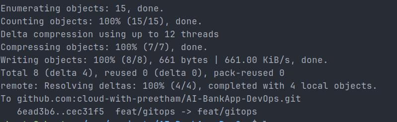

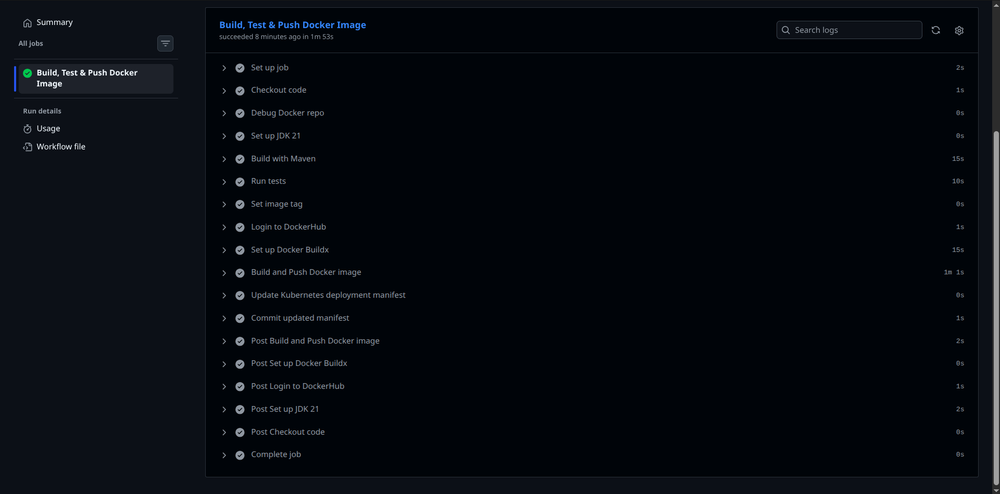

---

### 5) Fixed DockerHub Authentication + Registry Issues

Resolved:

- missing secrets
- invalid repository permissions
- legacy DockerHub references
- stale workflow definitions
- Git rebase conflicts

Final registry:

```text
h4kops/ai-bankapp-eks
```

Pipeline passed successfully.

---

### 6) Enabled Gateway API + Envoy Gateway

Installed Gateway API CRDs.

Installed Envoy Gateway.

Configured:

- GatewayClass
- Gateway
- HTTPRoute
- BackendTrafficPolicy

Result:

- Application ingress routing enabled

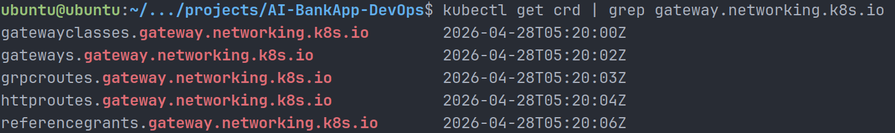

---

### 7) Configured TLS using cert-manager

Installed:

- cert-manager controller
- cainjector
- webhook

Created Certificate:

```yaml
kind: Certificate
secretName: bankapp-tls
```

Used self-signed ClusterIssuer for lab environment.

Result:

```text
bankapp-cert   True   bankapp-tls
```

TLS secret successfully issued.

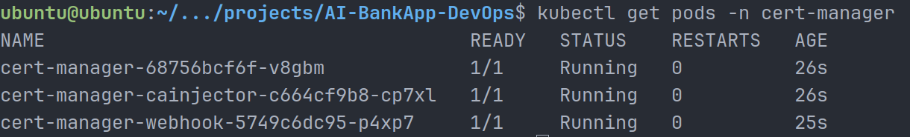

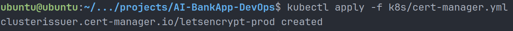

---

### 8) Fixed ArgoCD Repo Source Drift

Issue:

- ArgoCD watched tutorial repository
- CI pushed to personal fork

Fix:

```yaml
repoURL: https://github.com/cloud-with-preetham/AI-BankApp-DevOps.git
```

Result:

- ArgoCD watched correct Git source
- Auto sync restored

---

### 9) Verified End-to-End GitOps Deployment

New image deployed:

```text
h4kops/ai-bankapp-eks:d00dc35
```

ArgoCD final state:

```text
Healthy
Synced
Sync OK
```

All Kubernetes workloads healthy.

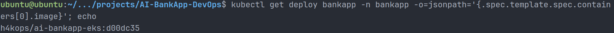

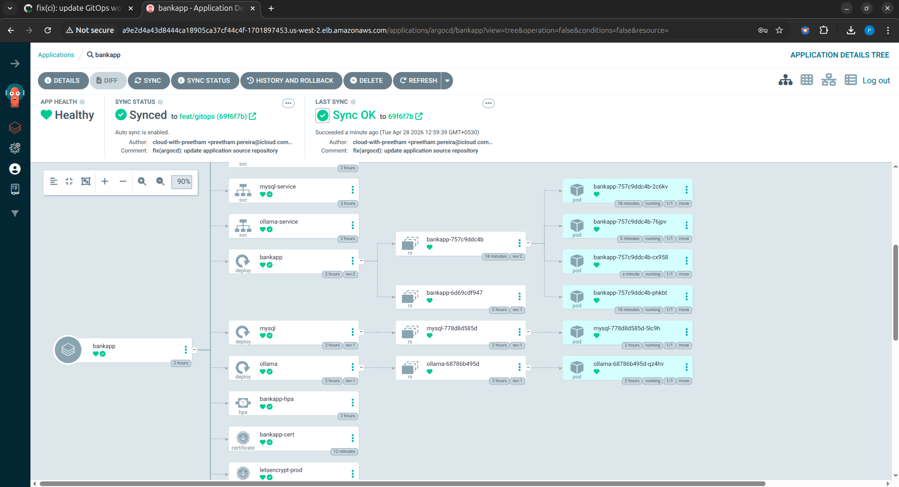

---

## Commands Used Frequently

```bash
kubectl get nodes
kubectl get pods -A
kubectl get svc -A
kubectl get applications -n argocd
kubectl describe application bankapp -n argocd
kubectl get deploy bankapp -n bankapp
aws eks update-kubeconfig --region us-west-2 --name bankapp-eks
```

---

## Key Learnings

- GitOps is Git-driven infrastructure reconciliation
- ArgoCD continuously enforces desired state
- CI and CD ownership should be clearly separated
- Docker registry naming consistency matters
- cert-manager simplifies certificate lifecycle
- Gateway API is modern Kubernetes ingress
- Debugging GitOps requires checking both Git state and live state
- Small repo misconfigurations create major deployment drift

---

## Final Outcome

Successfully built a complete enterprise-style GitOps CI/CD pipeline on AWS EKS.

**Status: Completed Successfully**
